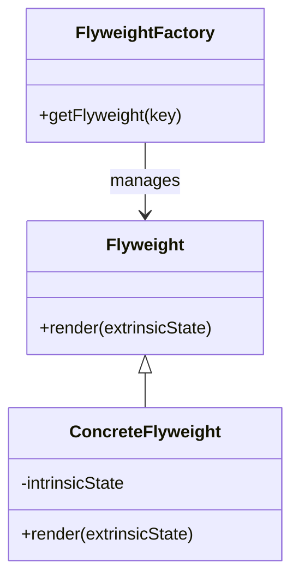
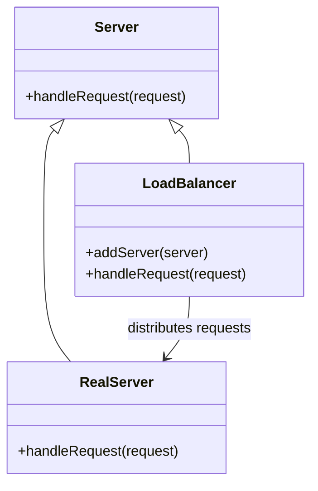

## 23.6 Scaling Applications with Design Patterns

As applications grow in complexity and user base, scaling becomes a critical concern. Design patterns offer proven solutions to common problems, including those related to scaling. In this section, we'll explore how various design patterns can be leveraged to scale PHP applications effectively. We'll cover caching, load balancing, asynchronous processing, and infrastructure support, providing code examples and visual diagrams to illustrate these concepts.

### Introduction to Scaling

Scaling an application involves increasing its capacity to handle more requests, data, or users without compromising performance. There are two primary types of scaling:

- **Vertical Scaling:** Increasing the power of existing servers (e.g., adding more CPU, RAM).
- **Horizontal Scaling:** Adding more servers to distribute the load.

Design patterns can facilitate both types of scaling by optimizing resource usage and improving application architecture.

### Implementing Caching with the Flyweight Pattern

Caching is a fundamental technique for improving application performance and scalability. The Flyweight Pattern is particularly useful for caching because it minimizes memory usage by sharing objects.

#### Intent

The Flyweight Pattern aims to reduce memory consumption by sharing as much data as possible with similar objects. It is ideal for applications that need to handle a large number of similar objects efficiently.

#### Key Participants

- **Flyweight:** The shared object that contains intrinsic state.
- **ConcreteFlyweight:** Implements the Flyweight interface and adds storage for intrinsic state.
- **FlyweightFactory:** Manages the Flyweight objects and ensures that they are shared properly.

#### Applicability

Use the Flyweight Pattern when:

- You have a large number of objects that share common data.
- Memory usage is a concern.
- You need to improve performance by reducing object creation overhead.

#### Sample Code Snippet

```php
<?php

// Flyweight interface
interface Flyweight {
    public function render($extrinsicState);
}

// ConcreteFlyweight class
class ConcreteFlyweight implements Flyweight {
    private $intrinsicState;

    public function __construct($intrinsicState) {
        $this->intrinsicState = $intrinsicState;
    }

    public function render($extrinsicState) {
        echo "Rendering with intrinsic state: {$this->intrinsicState} and extrinsic state: {$extrinsicState}\n";
    }
}

// FlyweightFactory class
class FlyweightFactory {
    private $flyweights = [];

    public function getFlyweight($key) {
        if (!isset($this->flyweights[$key])) {
            $this->flyweights[$key] = new ConcreteFlyweight($key);
        }
        return $this->flyweights[$key];
    }
}

// Client code
$factory = new FlyweightFactory();
$flyweight1 = $factory->getFlyweight('state1');
$flyweight1->render('extrinsic1');

$flyweight2 = $factory->getFlyweight('state1');
$flyweight2->render('extrinsic2');

// Output shows that the same intrinsic state is reused
```

#### Design Considerations

- **Memory Efficiency:** The Flyweight Pattern is effective in reducing memory usage by sharing objects.
- **Complexity:** Managing shared states can add complexity to the codebase.

#### PHP Unique Features

PHP's associative arrays and object-oriented features make it easy to implement the Flyweight Pattern. The dynamic nature of PHP allows for flexible management of shared objects.

#### Differences and Similarities

The Flyweight Pattern is often confused with the Singleton Pattern. While both patterns involve shared instances, the Flyweight Pattern focuses on sharing parts of the state, whereas the Singleton Pattern ensures a single instance of a class.

### Utilizing the Proxy Pattern for Load Balancing

Load balancing is essential for distributing incoming requests across multiple servers. The Proxy Pattern can be used to implement load balancing by acting as an intermediary between clients and servers.

#### Intent

The Proxy Pattern provides a surrogate or placeholder for another object to control access to it. In the context of load balancing, it can distribute requests to different servers.

#### Key Participants

- **Proxy:** Controls access to the real subject and may handle request distribution.
- **RealSubject:** The actual object that performs the work.
- **Client:** Interacts with the Proxy instead of the RealSubject.

#### Applicability

Use the Proxy Pattern for load balancing when:

- You need to distribute requests across multiple servers.
- You want to control access to the real subject.
- You need to add additional functionality (e.g., logging, caching) to the real subject.

#### Sample Code Snippet

```php
<?php

// Subject interface
interface Server {
    public function handleRequest($request);
}

// RealSubject class
class RealServer implements Server {
    private $name;

    public function __construct($name) {
        $this->name = $name;
    }

    public function handleRequest($request) {
        echo "Server {$this->name} handling request: {$request}\n";
    }
}

// Proxy class
class LoadBalancer implements Server {
    private $servers = [];
    private $currentServer = 0;

    public function addServer(Server $server) {
        $this->servers[] = $server;
    }

    public function handleRequest($request) {
        if (empty($this->servers)) {
            throw new Exception("No servers available");
        }
        $server = $this->servers[$this->currentServer];
        $server->handleRequest($request);
        $this->currentServer = ($this->currentServer + 1) % count($this->servers);
    }
}

// Client code
$loadBalancer = new LoadBalancer();
$loadBalancer->addServer(new RealServer('Server1'));
$loadBalancer->addServer(new RealServer('Server2'));

$loadBalancer->handleRequest('Request1');
$loadBalancer->handleRequest('Request2');
$loadBalancer->handleRequest('Request3');

// Output shows requests being distributed across servers
```

#### Design Considerations

- **Scalability:** The Proxy Pattern can improve scalability by distributing load.
- **Overhead:** Introducing a proxy can add latency and complexity.

#### PHP Unique Features

PHP's dynamic typing and object-oriented capabilities make it straightforward to implement the Proxy Pattern. The language's flexibility allows for easy modification of proxy behavior.

#### Differences and Similarities

The Proxy Pattern is similar to the Decorator Pattern, but the Proxy Pattern focuses on controlling access, while the Decorator Pattern adds behavior.

### Applying Asynchronous Patterns for Increased Concurrency

Asynchronous processing allows applications to handle more concurrent requests by performing tasks in the background. This is crucial for scaling applications that need to manage high concurrency.

#### Intent

Asynchronous patterns enable non-blocking operations, allowing applications to perform other tasks while waiting for a process to complete.

#### Key Participants

- **Asynchronous Task:** The task that runs in the background.
- **Event Loop:** Manages the execution of asynchronous tasks.
- **Callback:** A function that is executed once the asynchronous task is complete.

#### Applicability

Use asynchronous patterns when:

- You need to handle high concurrency.
- Blocking operations would degrade performance.
- You want to improve responsiveness.

#### Sample Code Snippet

```php
<?php

// Asynchronous task using promises
use React\Promise\Promise;

function asyncTask($data) {
    return new Promise(function ($resolve, $reject) use ($data) {
        // Simulate asynchronous operation
        sleep(1);
        if ($data) {
            $resolve("Processed data: {$data}");
        } else {
            $reject("Failed to process data");
        }
    });
}

// Client code
asyncTask("SampleData")
    ->then(function ($result) {
        echo $result . "\n";
    })
    ->otherwise(function ($error) {
        echo $error . "\n";
    });

// Output shows asynchronous processing
```

#### Design Considerations

- **Concurrency:** Asynchronous patterns improve concurrency by allowing non-blocking operations.
- **Complexity:** Managing asynchronous code can be more complex than synchronous code.

#### PHP Unique Features

PHP's support for asynchronous programming has improved with libraries like ReactPHP, which provides an event-driven, non-blocking I/O model.

#### Differences and Similarities

Asynchronous patterns are often compared to multithreading. While both improve concurrency, asynchronous patterns use non-blocking I/O, whereas multithreading uses multiple threads.

### Infrastructure Support with Cloud Services

Combining design patterns with cloud services can enhance scalability by providing elasticity and on-demand resources.

#### Intent

Cloud services offer scalable infrastructure that can be combined with design patterns to improve application performance and scalability.

#### Key Participants

- **Cloud Provider:** Offers infrastructure and services.
- **Application:** Utilizes cloud resources to scale.
- **Design Patterns:** Optimize resource usage and architecture.

#### Applicability

Use cloud services for scaling when:

- You need on-demand resources.
- You want to reduce infrastructure management overhead.
- You need to handle variable loads.

#### Sample Code Snippet

```php
<?php

// Example of using AWS SDK for PHP to scale resources
require 'vendor/autoload.php';

use Aws\Ec2\Ec2Client;

$client = new Ec2Client([
    'region' => 'us-west-2',
    'version' => 'latest'
]);

// Launch a new EC2 instance
$result = $client->runInstances([
    'ImageId' => 'ami-0abcdef1234567890',
    'InstanceType' => 't2.micro',
    'MinCount' => 1,
    'MaxCount' => 1,
]);

echo "Launched instance with ID: " . $result['Instances'][0]['InstanceId'] . "\n";

// Output shows instance launch
```

#### Design Considerations

- **Elasticity:** Cloud services provide elasticity, allowing applications to scale up or down as needed.
- **Cost:** Using cloud services can incur costs based on usage.

#### PHP Unique Features

PHP's compatibility with various cloud SDKs (e.g., AWS, Azure, Google Cloud) allows for seamless integration with cloud services.

#### Differences and Similarities

Cloud services are often compared to traditional hosting. While both provide infrastructure, cloud services offer more flexibility and scalability.

### Monitoring Performance and Adjusting Patterns

Monitoring application performance is crucial for identifying bottlenecks and adjusting design patterns to improve scalability.

#### Intent

Performance monitoring involves tracking application metrics to identify areas for improvement.

#### Key Participants

- **Monitoring Tools:** Collect and analyze performance data.
- **Application:** Provides metrics for monitoring.
- **Design Patterns:** Adjusted based on performance insights.

#### Applicability

Use performance monitoring when:

- You need to identify bottlenecks.
- You want to optimize resource usage.
- You need to ensure application reliability.

#### Sample Code Snippet

```php
<?php

// Example of using New Relic for performance monitoring
if (extension_loaded('newrelic')) {
    newrelic_set_appname("My PHP Application");
    newrelic_start_transaction("My PHP Application");

    // Code to monitor
    sleep(1);

    newrelic_end_transaction();
}

// Output shows transaction monitoring
```

#### Design Considerations

- **Insight:** Monitoring provides insights into application performance.
- **Overhead:** Monitoring can add overhead to the application.

#### PHP Unique Features

PHP's compatibility with various monitoring tools (e.g., New Relic, Datadog) allows for comprehensive performance tracking.

#### Differences and Similarities

Monitoring is often compared to logging. While both track application data, monitoring focuses on performance metrics, whereas logging records events.

### Visualizing Scaling with Design Patterns

To better understand how design patterns facilitate scaling, let's visualize some of these concepts using Mermaid.js diagrams.

#### Flyweight Pattern Diagram



#### Proxy Pattern Diagram



### Conclusion

Scaling applications with design patterns involves leveraging proven solutions to optimize resource usage and improve architecture. By implementing caching, load balancing, asynchronous processing, and utilizing cloud services, you can enhance the scalability of your PHP applications. Remember, this is just the beginning. As you progress, you'll build more complex and scalable applications. Keep experimenting, stay curious, and enjoy the journey!

## Quiz: Scaling Applications with Design Patterns



### Which design pattern is ideal for caching to reduce memory usage?

- [x] Flyweight Pattern
- [ ] Proxy Pattern
- [ ] Singleton Pattern
- [ ] Decorator Pattern

> **Explanation:** The Flyweight Pattern is designed to minimize memory usage by sharing objects, making it ideal for caching.

### What is the primary purpose of the Proxy Pattern in load balancing?

- [x] To distribute requests across multiple servers
- [ ] To add behavior to objects
- [ ] To ensure a single instance of a class
- [ ] To manage object creation

> **Explanation:** The Proxy Pattern acts as an intermediary to distribute requests across multiple servers, facilitating load balancing.

### Which PHP library is commonly used for asynchronous programming?

- [x] ReactPHP
- [ ] Laravel
- [ ] Symfony
- [ ] PHPUnit

> **Explanation:** ReactPHP is a popular library for asynchronous programming in PHP, providing an event-driven, non-blocking I/O model.

### What is the main advantage of using cloud services for scaling?

- [x] Elasticity and on-demand resources
- [ ] Reduced memory usage
- [ ] Improved code readability
- [ ] Enhanced security

> **Explanation:** Cloud services offer elasticity and on-demand resources, allowing applications to scale up or down as needed.

### Which tool is used for performance monitoring in PHP?

- [x] New Relic
- [ ] Composer
- [ ] PHPUnit
- [ ] Laravel

> **Explanation:** New Relic is a tool used for performance monitoring in PHP, providing insights into application metrics.

### What is the primary benefit of asynchronous patterns?

- [x] Improved concurrency by allowing non-blocking operations
- [ ] Reduced memory usage
- [ ] Simplified code structure
- [ ] Enhanced security

> **Explanation:** Asynchronous patterns improve concurrency by allowing non-blocking operations, enabling applications to handle more concurrent requests.

### Which design pattern is often confused with the Flyweight Pattern?

- [x] Singleton Pattern
- [ ] Proxy Pattern
- [ ] Decorator Pattern
- [ ] Factory Pattern

> **Explanation:** The Flyweight Pattern is often confused with the Singleton Pattern, but they have different purposes.

### What is the main focus of performance monitoring?

- [x] Tracking application metrics to identify bottlenecks
- [ ] Recording events for debugging
- [ ] Ensuring a single instance of a class
- [ ] Distributing requests across servers

> **Explanation:** Performance monitoring focuses on tracking application metrics to identify bottlenecks and optimize resource usage.

### Which PHP feature enhances compatibility with cloud services?

- [x] Compatibility with various cloud SDKs
- [ ] Dynamic typing
- [ ] Object-oriented capabilities
- [ ] Associative arrays

> **Explanation:** PHP's compatibility with various cloud SDKs allows for seamless integration with cloud services.

### True or False: The Proxy Pattern is used to add behavior to objects.

- [ ] True
- [x] False

> **Explanation:** The Proxy Pattern is used to control access to objects, not to add behavior. The Decorator Pattern is used for adding behavior.


