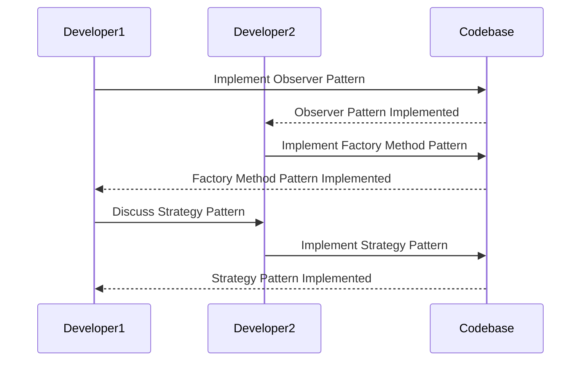

## 23.7 Design Patterns in Team Collaboration

In the realm of software development, particularly in PHP, design patterns play a pivotal role in enhancing team collaboration. They provide a structured approach to solving common design problems, which is crucial when multiple developers are working on the same project. In this section, we will explore how design patterns contribute to team collaboration by establishing a shared language, ensuring a consistent codebase, and facilitating education and onboarding.

### Shared Language

**Design patterns provide a common terminology among developers**, which is essential for effective communication within a team. When developers use design patterns, they can describe complex solutions succinctly and clearly. This shared language reduces misunderstandings and ensures that everyone is on the same page.

#### Example: Observer Pattern

Consider the Observer pattern, which is used to define a one-to-many dependency between objects. When the state of one object changes, all its dependents are notified and updated automatically. By referring to this pattern by name, developers can quickly convey the architecture of a system without delving into intricate details.

```php
<?php

// Subject interface
interface Subject {
    public function attach(Observer $observer);
    public function detach(Observer $observer);
    public function notify();
}

// Concrete subject
class NewsPublisher implements Subject {
    private $observers = [];
    private $latestNews;

    public function attach(Observer $observer) {
        $this->observers[] = $observer;
    }

    public function detach(Observer $observer) {
        $this->observers = array_filter($this->observers, function($obs) use ($observer) {
            return $obs !== $observer;
        });
    }

    public function notify() {
        foreach ($this->observers as $observer) {
            $observer->update($this->latestNews);
        }
    }

    public function setLatestNews($news) {
        $this->latestNews = $news;
        $this->notify();
    }
}

// Observer interface
interface Observer {
    public function update($news);
}

// Concrete observer
class NewsReader implements Observer {
    private $name;

    public function __construct($name) {
        $this->name = $name;
    }

    public function update($news) {
        echo "{$this->name} received news update: {$news}\n";
    }
}

// Usage
$publisher = new NewsPublisher();
$reader1 = new NewsReader("Alice");
$reader2 = new NewsReader("Bob");

$publisher->attach($reader1);
$publisher->attach($reader2);

$publisher->setLatestNews("PHP 8.1 Released!");

?>
```

In this example, the Observer pattern is used to manage news updates. By using the term "Observer pattern," team members can quickly understand the relationship between the `NewsPublisher` and `NewsReader` classes.

### Consistent Codebase

**Design patterns facilitate understanding and maintaining code written by different team members.** When a team adopts design patterns, the codebase becomes more predictable and easier to navigate. This consistency is crucial for large projects where multiple developers contribute code.

#### Example: Factory Method Pattern

The Factory Method pattern provides an interface for creating objects, allowing subclasses to alter the type of objects that will be created. This pattern promotes consistency by centralizing object creation logic.

```php
<?php

// Product interface
interface Product {
    public function getType();
}

// Concrete product
class Car implements Product {
    public function getType() {
        return "Car";
    }
}

// Creator abstract class
abstract class Creator {
    abstract public function factoryMethod(): Product;

    public function someOperation() {
        $product = $this->factoryMethod();
        return "Creator: The same creator's code has just worked with " . $product->getType();
    }
}

// Concrete creator
class CarCreator extends Creator {
    public function factoryMethod(): Product {
        return new Car();
    }
}

// Usage
function clientCode(Creator $creator) {
    echo $creator->someOperation();
}

clientCode(new CarCreator());

?>
```

In this example, the Factory Method pattern ensures that object creation is handled consistently across the codebase. This consistency makes it easier for team members to understand and extend the code.

### Education and Onboarding

**Design patterns help new team members quickly grasp architectural decisions.** When a team uses design patterns, new developers can leverage existing documentation and examples to understand the system's architecture. This accelerates the onboarding process and reduces the learning curve.

#### Example: Strategy Pattern

The Strategy pattern defines a family of algorithms, encapsulates each one, and makes them interchangeable. This pattern allows the algorithm to vary independently from clients that use it.

```php
<?php

// Strategy interface
interface PaymentStrategy {
    public function pay($amount);
}

// Concrete strategy
class CreditCardPayment implements PaymentStrategy {
    public function pay($amount) {
        echo "Paid {$amount} using Credit Card.\n";
    }
}

// Concrete strategy
class PayPalPayment implements PaymentStrategy {
    public function pay($amount) {
        echo "Paid {$amount} using PayPal.\n";
    }
}

// Context
class ShoppingCart {
    private $paymentStrategy;

    public function setPaymentStrategy(PaymentStrategy $strategy) {
        $this->paymentStrategy = $strategy;
    }

    public function checkout($amount) {
        $this->paymentStrategy->pay($amount);
    }
}

// Usage
$cart = new ShoppingCart();
$cart->setPaymentStrategy(new CreditCardPayment());
$cart->checkout(100);

$cart->setPaymentStrategy(new PayPalPayment());
$cart->checkout(200);

?>
```

In this example, the Strategy pattern is used to manage payment methods. New team members can easily understand how different payment strategies are implemented and used within the system.

### Visualizing Design Patterns in Team Collaboration

To further illustrate how design patterns enhance team collaboration, let's visualize the interaction between different patterns and team members using a sequence diagram.



This diagram shows how developers collaborate by implementing different design patterns in the codebase. Each pattern contributes to a shared understanding and consistent architecture.

### PHP Unique Features

PHP offers unique features that enhance the implementation of design patterns, such as:

- **Traits:** PHP traits allow developers to reuse methods across different classes, promoting code reuse and reducing duplication.
- **Anonymous Classes:** Introduced in PHP 7, anonymous classes provide a way to create simple, one-off objects without defining a full class.
- **Type Declarations:** PHP's type declarations ensure that functions receive and return the expected types, enhancing code reliability.

### Differences and Similarities

It's important to note that some design patterns may be confused with one another. For example, the Factory Method and Abstract Factory patterns both deal with object creation, but they differ in their approach. The Factory Method pattern uses inheritance to delegate object creation, while the Abstract Factory pattern uses composition to create families of related objects.

### Design Considerations

When using design patterns in team collaboration, consider the following:

- **When to Use:** Design patterns should be used when they provide clear benefits, such as improved code readability, maintainability, and scalability.
- **Pitfalls:** Avoid overusing design patterns, as this can lead to unnecessary complexity. Ensure that the chosen pattern aligns with the project's requirements.

### Try It Yourself

To deepen your understanding, try modifying the code examples provided. For instance, add a new payment strategy to the Strategy pattern example or implement a new observer in the Observer pattern example. Experimenting with these patterns will help solidify your knowledge and improve your ability to apply them in real-world scenarios.

### Knowledge Check

- **Question:** What is the primary benefit of using design patterns in team collaboration?
  - **Answer:** Design patterns provide a shared language and consistent codebase, facilitating communication and understanding among team members.

- **Exercise:** Implement a new design pattern in a small PHP project and document how it improves team collaboration.

### Embrace the Journey

Remember, mastering design patterns is a journey. As you continue to explore and apply these patterns, you'll enhance your ability to collaborate effectively with your team. Keep experimenting, stay curious, and enjoy the journey!

## Quiz: Design Patterns in Team Collaboration



### What is a primary benefit of using design patterns in team collaboration?

- [x] They provide a shared language among developers.
- [ ] They increase the complexity of the codebase.
- [ ] They eliminate the need for documentation.
- [ ] They reduce the need for testing.

> **Explanation:** Design patterns provide a shared language, making it easier for developers to communicate and understand each other's code.

### How do design patterns contribute to a consistent codebase?

- [x] By centralizing common solutions to recurring problems.
- [ ] By encouraging the use of global variables.
- [ ] By allowing each developer to implement their own solutions.
- [ ] By reducing the need for code reviews.

> **Explanation:** Design patterns centralize solutions, ensuring that similar problems are solved consistently across the codebase.

### Which design pattern is used to define a one-to-many dependency between objects?

- [x] Observer Pattern
- [ ] Factory Method Pattern
- [ ] Strategy Pattern
- [ ] Singleton Pattern

> **Explanation:** The Observer pattern defines a one-to-many dependency, allowing multiple objects to be notified of changes in another object.

### What is the role of the Factory Method pattern?

- [x] To provide an interface for creating objects.
- [ ] To manage object state changes.
- [ ] To encapsulate algorithms.
- [ ] To ensure only one instance of a class is created.

> **Explanation:** The Factory Method pattern provides an interface for creating objects, allowing subclasses to specify the type of objects to create.

### How can design patterns facilitate education and onboarding?

- [x] By providing clear examples and documentation.
- [ ] By eliminating the need for training.
- [ ] By allowing new developers to write code without guidance.
- [ ] By reducing the need for code comments.

> **Explanation:** Design patterns provide clear examples and documentation, helping new developers understand the system's architecture.

### What PHP feature allows for method reuse across different classes?

- [x] Traits
- [ ] Interfaces
- [ ] Abstract Classes
- [ ] Anonymous Classes

> **Explanation:** PHP traits allow developers to reuse methods across different classes, promoting code reuse.

### Which PHP feature introduced in PHP 7 allows for creating simple, one-off objects?

- [x] Anonymous Classes
- [ ] Traits
- [ ] Interfaces
- [ ] Abstract Classes

> **Explanation:** Anonymous classes, introduced in PHP 7, provide a way to create simple, one-off objects without defining a full class.

### What should be considered when deciding to use a design pattern?

- [x] Whether it provides clear benefits such as improved readability and maintainability.
- [ ] Whether it increases the complexity of the code.
- [ ] Whether it eliminates the need for testing.
- [ ] Whether it allows for the use of global variables.

> **Explanation:** Design patterns should be used when they provide clear benefits, such as improved code readability and maintainability.

### What is a potential pitfall of overusing design patterns?

- [x] It can lead to unnecessary complexity.
- [ ] It can simplify the codebase too much.
- [ ] It can eliminate the need for documentation.
- [ ] It can reduce the need for testing.

> **Explanation:** Overusing design patterns can lead to unnecessary complexity, making the code harder to understand and maintain.

### True or False: The Factory Method and Abstract Factory patterns are identical.

- [ ] True
- [x] False

> **Explanation:** The Factory Method and Abstract Factory patterns are not identical; they differ in their approach to object creation.


