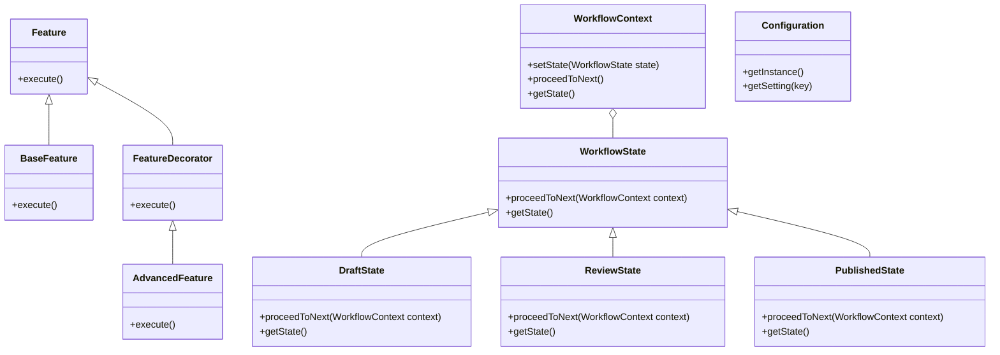

## 23.8 Case Study: Designing a SaaS Application

In this case study, we will explore the design and implementation of a Software as a Service (SaaS) application using PHP. The focus will be on employing multiple design patterns to achieve a robust, scalable, and maintainable architecture. We will address the requirements of a multi-tenant architecture, feature toggles, and customizable workflows by leveraging the Decorator, State, and Singleton patterns.

### Understanding the Requirements

Before diving into the design patterns, let's outline the key requirements for our SaaS application:

1. **Multi-Tenant Architecture:** The application must support multiple tenants, each with isolated data and customizable features.
2. **Feature Toggles:** Tenants should have the ability to enable or disable specific features based on their subscription or preferences.
3. **Customizable Workflows:** The application should allow tenants to define and manage their own workflows, adapting to their unique business processes.

### Patterns Employed

To meet these requirements, we will employ the following design patterns:

- **Decorator Pattern:** This pattern will be used to enable or disable features per tenant dynamically.
- **State Pattern:** This pattern will manage workflow states, allowing tenants to customize and transition between different states.
- **Singleton Pattern:** This pattern will manage shared resources across tenants, ensuring efficient resource utilization.

### Advantages of Using Design Patterns

By applying these design patterns, we achieve several advantages:

- **Flexible Feature Management:** The Decorator pattern allows us to add or remove features without altering the core application logic.
- **Efficient Resource Utilization:** The Singleton pattern ensures that shared resources are managed efficiently, reducing overhead.
- **Easy Scalability:** The use of design patterns facilitates scalability, allowing the application to grow with the number of tenants and features.

### Implementing the SaaS Application

Let's delve into the implementation details, starting with the multi-tenant architecture and then exploring each design pattern in depth.

#### Multi-Tenant Architecture

A multi-tenant architecture allows multiple customers (tenants) to share the same application instance while keeping their data isolated. This architecture is crucial for SaaS applications as it reduces infrastructure costs and simplifies maintenance.

**Key Considerations:**

- **Data Isolation:** Ensure that each tenant's data is isolated and secure.
- **Customizability:** Allow tenants to customize their experience without affecting others.
- **Scalability:** Design the architecture to handle an increasing number of tenants efficiently.

**Implementation Strategy:**

1. **Database Design:** Use a single database with tenant-specific tables or a separate database per tenant. The choice depends on the scale and complexity of the application.
2. **Tenant Identification:** Implement a mechanism to identify the tenant for each request, such as subdomains or unique tenant IDs.
3. **Configuration Management:** Store tenant-specific configurations, such as enabled features and workflow settings.

#### Decorator Pattern for Feature Toggles

The Decorator pattern is ideal for implementing feature toggles, allowing us to add or remove features dynamically without modifying the core application logic.

**Intent:** Attach additional responsibilities to an object dynamically. Decorators provide a flexible alternative to subclassing for extending functionality.

**Key Participants:**

- **Component:** Defines the interface for objects that can have responsibilities added to them.
- **ConcreteComponent:** The object to which additional responsibilities can be attached.
- **Decorator:** Maintains a reference to a Component object and defines an interface that conforms to Component's interface.
- **ConcreteDecorator:** Adds responsibilities to the component.

**Applicability:**

- Use the Decorator pattern when you need to add responsibilities to individual objects dynamically and transparently, without affecting other objects.
- Ideal for implementing feature toggles in a multi-tenant SaaS application.

**Sample Code Snippet:**

```php
<?php

interface Feature {
    public function execute();
}

class BaseFeature implements Feature {
    public function execute() {
        echo "Executing base feature.\n";
    }
}

class FeatureDecorator implements Feature {
    protected $feature;

    public function __construct(Feature $feature) {
        $this->feature = $feature;
    }

    public function execute() {
        $this->feature->execute();
    }
}

class AdvancedFeature extends FeatureDecorator {
    public function execute() {
        parent::execute();
        echo "Executing advanced feature.\n";
    }
}

// Usage
$baseFeature = new BaseFeature();
$advancedFeature = new AdvancedFeature($baseFeature);

$tenantFeatures = [$baseFeature, $advancedFeature];

foreach ($tenantFeatures as $feature) {
    $feature->execute();
}
```

**Design Considerations:**

- **Flexibility:** The Decorator pattern provides flexibility in adding features without modifying existing code.
- **Complexity:** Be mindful of the complexity that can arise from multiple layers of decorators.

**PHP Unique Features:**

- PHP's dynamic nature and support for interfaces make it well-suited for implementing the Decorator pattern.

#### State Pattern for Customizable Workflows

The State pattern is used to manage the state of an object, allowing it to change its behavior when its state changes. This pattern is ideal for implementing customizable workflows in a SaaS application.

**Intent:** Allow an object to alter its behavior when its internal state changes. The object will appear to change its class.

**Key Participants:**

- **Context:** Maintains an instance of a ConcreteState subclass that defines the current state.
- **State:** Defines an interface for encapsulating the behavior associated with a particular state.
- **ConcreteState:** Implements the behavior associated with a state of the Context.

**Applicability:**

- Use the State pattern when an object's behavior depends on its state and it must change its behavior at runtime depending on that state.
- Ideal for implementing customizable workflows where tenants can define and transition between different states.

**Sample Code Snippet:**

```php
<?php

interface WorkflowState {
    public function proceedToNext(WorkflowContext $context);
    public function getState();
}

class DraftState implements WorkflowState {
    public function proceedToNext(WorkflowContext $context) {
        echo "Moving from Draft to Review.\n";
        $context->setState(new ReviewState());
    }

    public function getState() {
        return "Draft";
    }
}

class ReviewState implements WorkflowState {
    public function proceedToNext(WorkflowContext $context) {
        echo "Moving from Review to Published.\n";
        $context->setState(new PublishedState());
    }

    public function getState() {
        return "Review";
    }
}

class PublishedState implements WorkflowState {
    public function proceedToNext(WorkflowContext $context) {
        echo "Already in Published state.\n";
    }

    public function getState() {
        return "Published";
    }
}

class WorkflowContext {
    private $state;

    public function __construct(WorkflowState $state) {
        $this->setState($state);
    }

    public function setState(WorkflowState $state) {
        $this->state = $state;
    }

    public function proceedToNext() {
        $this->state->proceedToNext($this);
    }

    public function getState() {
        return $this->state->getState();
    }
}

// Usage
$workflow = new WorkflowContext(new DraftState());
echo "Current State: " . $workflow->getState() . "\n";
$workflow->proceedToNext();
echo "Current State: " . $workflow->getState() . "\n";
$workflow->proceedToNext();
echo "Current State: " . $workflow->getState() . "\n";
```

**Design Considerations:**

- **Maintainability:** The State pattern improves maintainability by localizing state-specific behavior and partitioning behavior for different states.
- **Complexity:** Be cautious of the increased complexity due to multiple state classes.

**PHP Unique Features:**

- PHP's support for interfaces and dynamic method calls facilitates the implementation of the State pattern.

#### Singleton Pattern for Shared Resources

The Singleton pattern ensures that a class has only one instance and provides a global point of access to it. This pattern is useful for managing shared resources across tenants in a SaaS application.

**Intent:** Ensure a class has only one instance and provide a global point of access to it.

**Key Participants:**

- **Singleton:** Defines an Instance operation that lets clients access its unique instance. The Singleton class may be responsible for creating its own unique instance.

**Applicability:**

- Use the Singleton pattern when there must be exactly one instance of a class, and it must be accessible to clients from a well-known access point.
- Ideal for managing shared resources such as configuration settings or database connections in a multi-tenant SaaS application.

**Sample Code Snippet:**

```php
<?php

class Configuration {
    private static $instance = null;
    private $settings = [];

    private function __construct() {
        // Load configuration settings
        $this->settings = [
            'database_host' => 'localhost',
            'database_name' => 'saas_app',
            'cache_enabled' => true,
        ];
    }

    public static function getInstance() {
        if (self::$instance === null) {
            self::$instance = new Configuration();
        }
        return self::$instance;
    }

    public function getSetting($key) {
        return $this->settings[$key] ?? null;
    }
}

// Usage
$config = Configuration::getInstance();
echo "Database Host: " . $config->getSetting('database_host') . "\n";
```

**Design Considerations:**

- **Global Access:** The Singleton pattern provides a global point of access to the instance.
- **Thread Safety:** Consider thread safety if the application is multi-threaded.

**PHP Unique Features:**

- PHP's static methods and properties make it straightforward to implement the Singleton pattern.

### Visualizing the Architecture

To better understand how these patterns work together, let's visualize the architecture of our SaaS application using a class diagram.



**Diagram Description:**

- The **Decorator Pattern** is represented by the `Feature`, `BaseFeature`, `FeatureDecorator`, and `AdvancedFeature` classes, illustrating how features can be dynamically added.
- The **State Pattern** is depicted with the `WorkflowState`, `DraftState`, `ReviewState`, `PublishedState`, and `WorkflowContext` classes, showing the transition between workflow states.
- The **Singleton Pattern** is shown with the `Configuration` class, highlighting the global access to shared settings.

### Try It Yourself

Now that we've explored the design and implementation of a SaaS application using PHP, it's time to experiment with the code. Here are some suggestions:

- **Modify the Decorator Pattern:** Add a new feature decorator and see how it affects the tenant's feature set.
- **Experiment with the State Pattern:** Create additional workflow states and transitions to customize the workflow further.
- **Enhance the Singleton Pattern:** Add more configuration settings and test how they are accessed across different parts of the application.

### Knowledge Check

To reinforce your understanding, consider the following questions:

1. How does the Decorator pattern facilitate feature toggles in a multi-tenant SaaS application?
2. What are the benefits of using the State pattern for managing customizable workflows?
3. Why is the Singleton pattern suitable for managing shared resources in a SaaS application?

### Embrace the Journey

Remember, this is just the beginning of your journey in designing and implementing SaaS applications with PHP. As you progress, you'll encounter more complex scenarios and design challenges. Keep experimenting, stay curious, and enjoy the journey!

## Quiz: Case Study: Designing a SaaS Application



### How does the Decorator pattern facilitate feature toggles in a multi-tenant SaaS application?

- [x] By dynamically adding or removing features without altering core logic
- [ ] By creating a separate class for each feature
- [ ] By using inheritance to extend features
- [ ] By hardcoding feature flags in the application

> **Explanation:** The Decorator pattern allows features to be added or removed dynamically, providing flexibility without changing the core application logic.


### What is the primary advantage of using the State pattern for workflows?

- [x] It allows dynamic behavior changes based on state
- [ ] It simplifies the code by using fewer classes
- [ ] It eliminates the need for state management
- [ ] It uses inheritance to manage states

> **Explanation:** The State pattern enables objects to change their behavior dynamically based on their state, making it ideal for customizable workflows.


### Why is the Singleton pattern suitable for managing shared resources?

- [x] It ensures a single instance and global access
- [ ] It creates multiple instances for each tenant
- [ ] It uses inheritance to manage resources
- [ ] It requires manual resource management

> **Explanation:** The Singleton pattern ensures that only one instance of a class exists, providing a global point of access to shared resources.


### Which pattern is best for implementing feature toggles?

- [x] Decorator Pattern
- [ ] State Pattern
- [ ] Singleton Pattern
- [ ] Factory Pattern

> **Explanation:** The Decorator pattern is ideal for implementing feature toggles as it allows features to be added or removed dynamically.


### What is a key benefit of using design patterns in a SaaS application?

- [x] Improved scalability and maintainability
- [ ] Reduced code complexity
- [ ] Elimination of all bugs
- [ ] Faster development time

> **Explanation:** Design patterns improve scalability and maintainability by providing structured solutions to common design challenges.


### How does the State pattern improve maintainability?

- [x] By localizing state-specific behavior
- [ ] By reducing the number of classes
- [ ] By eliminating the need for state transitions
- [ ] By using global variables

> **Explanation:** The State pattern localizes state-specific behavior, making the code easier to maintain and extend.


### What is a potential drawback of the Decorator pattern?

- [x] Increased complexity with multiple layers
- [ ] Lack of flexibility in feature management
- [ ] Difficulty in adding new features
- [ ] Inability to remove features

> **Explanation:** The Decorator pattern can lead to increased complexity due to multiple layers of decorators.


### How does the Singleton pattern ensure a single instance?

- [x] By using a static method to manage the instance
- [ ] By creating a new instance for each request
- [ ] By using inheritance to manage instances
- [ ] By manually managing instance creation

> **Explanation:** The Singleton pattern uses a static method to ensure that only one instance of a class is created and accessed globally.


### What is a key consideration when using the Singleton pattern?

- [x] Thread safety in multi-threaded applications
- [ ] Reducing the number of instances
- [ ] Increasing the number of instances
- [ ] Using inheritance for instance management

> **Explanation:** Thread safety is a key consideration when using the Singleton pattern in multi-threaded applications to prevent race conditions.


### True or False: The State pattern is only useful for managing workflows.

- [x] False
- [ ] True

> **Explanation:** The State pattern is versatile and can be used for various scenarios where an object's behavior depends on its state, not just workflows.



By understanding and applying these design patterns, you can build a robust and scalable SaaS application in PHP. Keep exploring and refining your skills to create even more powerful software solutions.
