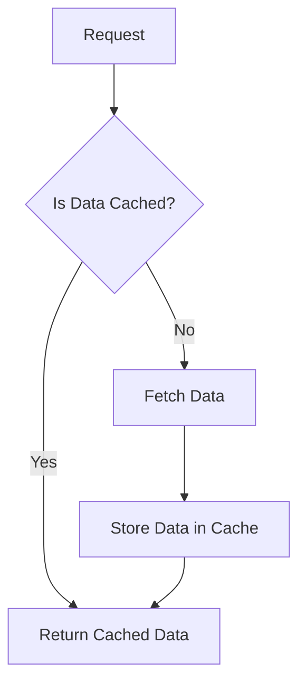

## 24.1 Caching Strategies (Opcode Cache, Data Cache)

In the world of web development, performance is key. As PHP developers, we constantly strive to optimize our applications to ensure they run efficiently and provide a seamless user experience. One of the most effective ways to achieve this is through caching. In this section, we will explore two primary caching strategies in PHP: Opcode Cache and Data Cache. We'll delve into how these strategies work, their benefits, and how to implement them in your PHP applications.

### Introduction to Caching

Caching is a technique used to store copies of files or data in a temporary storage location, known as a cache, so that future requests for that data can be served faster. By reducing the need to repeatedly fetch or compute the same data, caching can significantly improve the performance of PHP applications.

### Opcode Cache

#### What is Opcode Cache?

Opcode caching is a mechanism that stores the compiled bytecode of PHP scripts in memory, eliminating the need for PHP to parse and compile scripts on each request. This can lead to substantial performance improvements, especially in applications with a high volume of requests.

#### How Opcode Cache Works

When a PHP script is executed, it goes through several stages:

1. **Parsing**: The PHP script is parsed into tokens.
2. **Compilation**: The tokens are compiled into opcode, which is a low-level set of instructions.
3. **Execution**: The opcode is executed by the PHP runtime.

With opcode caching, the compiled opcode is stored in memory, so the parsing and compilation stages are skipped on subsequent requests. This reduces CPU usage and speeds up script execution.

#### Implementing OPcache

OPcache is a popular opcode caching extension for PHP, enabled by default in PHP 7 and above. It is highly recommended for improving PHP performance.

**Installation and Configuration**

To use OPcache, ensure it is enabled in your `php.ini` file:

```ini
; Enable OPcache
opcache.enable=1

; Set the memory size for OPcache
opcache.memory_consumption=128

; Validate timestamps every 2 seconds
opcache.validate_timestamps=1
opcache.revalidate_freq=2
```

**Monitoring OPcache**

You can monitor OPcache using various tools to ensure it is functioning optimally. One such tool is the OPcache GUI, which provides a web-based interface to view OPcache statistics.

**Link:** [OPcache Documentation](https://www.php.net/manual/en/book.opcache.php)

#### Benefits of Opcode Caching

- **Reduced CPU Load**: By eliminating the need to parse and compile scripts on each request, opcode caching reduces CPU usage.
- **Faster Execution**: Scripts execute faster as they are already compiled into opcode.
- **Improved Scalability**: Applications can handle more requests with the same resources.

### Data Caching

#### What is Data Caching?

Data caching involves storing frequently accessed data in a cache to reduce the need for expensive operations, such as database queries or API calls. By caching data, we can serve it quickly and reduce the load on our backend systems.

#### Types of Data Caching

1. **In-Memory Caching**: Stores data in memory for fast access. Common tools include Memcached and Redis.
2. **File-Based Caching**: Stores cached data in files on disk. Useful for larger datasets that don't fit in memory.
3. **Application-Level Caching**: Utilizes caching mechanisms provided by frameworks or libraries.

#### Implementing In-Memory Caching with Memcached

**Memcached** is a high-performance, distributed memory object caching system. It is ideal for caching database query results, session data, and other frequently accessed data.

**Installation and Configuration**

To use Memcached in PHP, you need to install the Memcached extension:

```bash
sudo apt-get install php-memcached
```

**Connecting to Memcached**

Here's a simple example of using Memcached in PHP:

```php
<?php
// Create a new Memcached instance
$memcached = new Memcached();

// Add a server
$memcached->addServer('localhost', 11211);

// Set a value in the cache
$memcached->set('key', 'value', 3600); // Cache for 1 hour

// Get a value from the cache
$value = $memcached->get('key');

if ($value) {
    echo "Cached value: " . $value;
} else {
    echo "Value not found in cache.";
}
?>
```

**Link:** [Memcached](https://memcached.org/)

#### Implementing In-Memory Caching with Redis

**Redis** is an in-memory data structure store, often used as a database, cache, and message broker. It supports various data structures, making it versatile for caching needs.

**Installation and Configuration**

To use Redis in PHP, install the Redis extension:

```bash
sudo apt-get install php-redis
```

**Connecting to Redis**

Here's a simple example of using Redis in PHP:

```php
<?php
// Create a new Redis instance
$redis = new Redis();

// Connect to Redis server
$redis->connect('127.0.0.1', 6379);

// Set a value in the cache
$redis->set('key', 'value', 3600); // Cache for 1 hour

// Get a value from the cache
$value = $redis->get('key');

if ($value) {
    echo "Cached value: " . $value;
} else {
    echo "Value not found in cache.";
}
?>
```

**Link:** [Redis](https://redis.io/)

#### Application-Level Caching

Many PHP frameworks provide built-in caching mechanisms that simplify the process of caching data at the application level. For example, Laravel offers a robust caching system that supports various backends, including file, database, Memcached, and Redis.

**Using Laravel Cache**

Here's an example of using the Laravel Cache system:

```php
// Store data in the cache
Cache::put('key', 'value', 3600); // Cache for 1 hour

// Retrieve data from the cache
$value = Cache::get('key');

if ($value) {
    echo "Cached value: " . $value;
} else {
    echo "Value not found in cache.";
}
```

**Link:** [Laravel Cache](https://laravel.com/docs/cache)

### Visualizing Caching Strategies

To better understand how caching strategies work, let's visualize the process using a flowchart.



**Description:** This flowchart illustrates the decision-making process in a caching strategy. When a request is made, the system checks if the data is cached. If yes, it returns the cached data. If no, it fetches the data, stores it in the cache, and then returns it.

### Best Practices for Caching

- **Cache Invalidation**: Ensure that cached data is invalidated or updated when the underlying data changes.
- **Cache Granularity**: Cache data at the appropriate level of granularity to balance performance and memory usage.
- **Monitor Cache Performance**: Use monitoring tools to track cache hit rates and performance metrics.
- **Security Considerations**: Ensure that sensitive data is not cached or is cached securely.

### Try It Yourself

Experiment with the caching examples provided above. Try modifying the cache expiration times, or use different keys and values. Observe how caching affects the performance of your PHP applications.

### Knowledge Check

- What are the benefits of using opcode caching in PHP?
- How does data caching improve application performance?
- What are some common tools used for in-memory caching in PHP?
- How can you monitor the performance of OPcache?

### Embrace the Journey

Caching is a powerful tool in the PHP developer's arsenal. By implementing effective caching strategies, we can significantly enhance the performance and scalability of our applications. Remember, this is just the beginning. As you continue to explore and experiment with caching, you'll discover new ways to optimize your PHP applications. Keep experimenting, stay curious, and enjoy the journey!

## Quiz: Caching Strategies (Opcode Cache, Data Cache)



### What is the primary benefit of opcode caching in PHP?

- [x] Reduces CPU load by eliminating the need to parse and compile scripts on each request
- [ ] Increases memory usage by storing more data
- [ ] Enhances security by encrypting scripts
- [ ] Improves database query performance

> **Explanation:** Opcode caching reduces CPU load by storing compiled bytecode, eliminating the need to parse and compile scripts on each request.

### Which PHP extension is commonly used for opcode caching?

- [x] OPcache
- [ ] Memcached
- [ ] Redis
- [ ] APC

> **Explanation:** OPcache is the extension used for opcode caching in PHP.

### What is the main purpose of data caching?

- [x] To store frequently accessed data and reduce the need for expensive operations
- [ ] To increase the size of the database
- [ ] To encrypt sensitive data
- [ ] To improve the readability of code

> **Explanation:** Data caching stores frequently accessed data to reduce the need for expensive operations like database queries.

### Which of the following is an in-memory caching tool?

- [x] Memcached
- [ ] MySQL
- [ ] Apache
- [ ] Nginx

> **Explanation:** Memcached is an in-memory caching tool used to store data for fast access.

### What is a common use case for Redis in PHP applications?

- [x] Caching session data
- [ ] Compiling PHP scripts
- [ ] Serving static files
- [ ] Managing user authentication

> **Explanation:** Redis is often used for caching session data in PHP applications.

### How can you monitor the performance of OPcache?

- [x] Using OPcache GUI
- [ ] By checking the PHP error log
- [ ] By analyzing database queries
- [ ] By reviewing server access logs

> **Explanation:** OPcache GUI is a tool that provides a web-based interface to monitor OPcache performance.

### Which Laravel feature is used for application-level caching?

- [x] Cache system
- [ ] Eloquent ORM
- [ ] Blade templating
- [ ] Artisan CLI

> **Explanation:** Laravel's Cache system is used for application-level caching.

### What is a key consideration when implementing caching?

- [x] Cache invalidation
- [ ] Increasing database size
- [ ] Encrypting all cached data
- [ ] Using only file-based caching

> **Explanation:** Cache invalidation is crucial to ensure that cached data is updated when the underlying data changes.

### Which of the following is NOT a benefit of caching?

- [ ] Faster data retrieval
- [x] Increased database load
- [ ] Reduced CPU usage
- [ ] Improved application scalability

> **Explanation:** Caching reduces database load, not increases it.

### True or False: Caching can help improve the scalability of PHP applications.

- [x] True
- [ ] False

> **Explanation:** Caching improves scalability by reducing the load on backend systems and allowing applications to handle more requests with the same resources.




