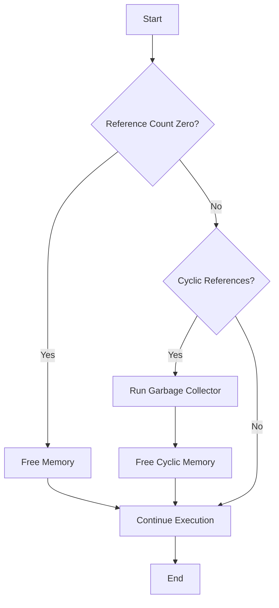

## 24.10 Memory Management and Garbage Collection

In the realm of PHP development, understanding memory management and garbage collection is crucial for optimizing application performance. Efficient memory usage not only enhances the speed of your applications but also reduces the risk of memory leaks and crashes. In this section, we will delve into the intricacies of PHP's memory management, explore garbage collection mechanisms, and provide practical strategies for optimizing memory usage.

### Understanding Garbage Collection

Garbage collection (GC) is an automatic memory management feature that reclaims memory occupied by objects that are no longer in use. In PHP, the garbage collector is responsible for identifying and freeing up memory that is no longer referenced by any part of the program.

#### How Garbage Collection Works in PHP

PHP employs a reference counting mechanism to manage memory. Each variable or object in PHP has a reference count, which tracks the number of references pointing to it. When the reference count drops to zero, the memory occupied by the variable or object is eligible for garbage collection.

However, reference counting alone cannot handle cyclic references—situations where two or more objects reference each other, creating a cycle. To address this, PHP's garbage collector periodically scans for cyclic references and reclaims the memory they occupy.

#### Key Concepts in PHP Garbage Collection

- **Reference Counting:** Each object or variable has a reference count. When the count reaches zero, the memory is freed.
- **Cyclic References:** Objects that reference each other form a cycle, which cannot be resolved by reference counting alone.
- **Garbage Collection Cycles:** PHP periodically runs garbage collection cycles to detect and clean up cyclic references.

### Optimizing Memory Usage

Efficient memory management is essential for building high-performance PHP applications. Here are some strategies to optimize memory usage:

#### Release References to Large Objects

When dealing with large objects or data structures, it's important to release references to them as soon as they are no longer needed. This allows the garbage collector to reclaim the memory they occupy.

```php
<?php
// Example of releasing references to large objects
$largeArray = range(1, 1000000);

// Process the array...

// Release the reference
unset($largeArray);
?>
```

#### Use Memory-Efficient Data Structures

Choosing the right data structures can significantly impact memory usage. For example, using arrays instead of objects for simple data collections can reduce memory overhead.

```php
<?php
// Memory-efficient data structure: Array
$data = ['name' => 'John', 'age' => 30];

// Less memory-efficient: Object
class Person {
    public $name;
    public $age;
}

$person = new Person();
$person->name = 'John';
$person->age = 30;
?>
```

#### Avoid Unnecessary Copies

PHP's copy-on-write mechanism means that variables are only copied when they are modified. Avoid unnecessary modifications to prevent additional memory usage.

```php
<?php
// Avoid unnecessary copies
function processData(array $data) {
    // Process data without modifying the original array
    foreach ($data as $value) {
        // Do something with $value
    }
}

$originalData = [1, 2, 3, 4, 5];
processData($originalData);
?>
```

### Configuration

PHP's garbage collection behavior can be fine-tuned through configuration settings. Understanding and adjusting these settings can help optimize memory management for your specific application needs.

#### Adjusting `gc_maxlifetime` and `gc_probability`

- **`gc_maxlifetime`:** This setting determines the maximum lifetime of session data in seconds. Adjusting this value can help manage memory usage for session data.
- **`gc_probability`:** This setting controls the probability of running the garbage collector on each request. A higher value increases the likelihood of garbage collection, which can be useful for applications with high memory usage.

```ini
; Example PHP configuration for garbage collection
session.gc_maxlifetime = 1440
session.gc_probability = 1
session.gc_divisor = 100
```

### Visualizing PHP's Garbage Collection Process

To better understand PHP's garbage collection process, let's visualize it using a flowchart. This diagram illustrates the steps involved in identifying and reclaiming memory occupied by unused objects.



### Practical Tips for Memory Management

Here are some practical tips to help you manage memory effectively in your PHP applications:

- **Profile Memory Usage:** Use tools like Xdebug or Blackfire to profile memory usage and identify bottlenecks.
- **Limit Global Variables:** Minimize the use of global variables, as they persist throughout the script's execution and can consume significant memory.
- **Optimize Database Queries:** Efficient database queries can reduce memory usage by fetching only the necessary data.
- **Use Generators:** Generators can be used to handle large datasets without loading them entirely into memory.

### Code Example: Memory Management in Action

Let's look at a code example that demonstrates effective memory management techniques in PHP.

```php
<?php
// Function to process a large dataset using a generator
function processLargeDataset($dataset) {
    foreach ($dataset as $item) {
        yield $item;
    }
}

// Simulate a large dataset
$largeDataset = range(1, 1000000);

// Process the dataset using a generator
foreach (processLargeDataset($largeDataset) as $data) {
    // Process each data item
    // ...
}

// Release the reference to the large dataset
unset($largeDataset);
?>
```

### Try It Yourself

Experiment with the code example above by modifying the dataset size or processing logic. Observe how memory usage changes with different configurations and data structures.

### References and Further Reading

- [PHP Manual: Garbage Collection](https://www.php.net/manual/en/features.gc.php)
- [PHP Memory Management](https://www.php.net/manual/en/internals2.memory.php)
- [Xdebug: Profiling PHP Applications](https://xdebug.org/docs/profiler)

### Knowledge Check

- What is the role of reference counting in PHP's garbage collection?
- How can cyclic references impact memory management?
- What are some strategies for optimizing memory usage in PHP applications?

### Embrace the Journey

Remember, mastering memory management and garbage collection in PHP is a journey. As you continue to develop your skills, you'll discover new techniques and strategies to optimize your applications. Keep experimenting, stay curious, and enjoy the process of learning and improving your PHP development skills.

## Quiz: Memory Management and Garbage Collection



### What is the primary role of garbage collection in PHP?

- [x] To reclaim memory occupied by unused objects
- [ ] To manage database connections
- [ ] To optimize CPU usage
- [ ] To handle user authentication

> **Explanation:** Garbage collection in PHP is responsible for reclaiming memory occupied by objects that are no longer in use.

### How does PHP handle cyclic references?

- [x] By periodically running garbage collection cycles
- [ ] By increasing reference counts
- [ ] By using manual memory management
- [ ] By ignoring them

> **Explanation:** PHP's garbage collector periodically runs cycles to detect and clean up cyclic references.

### What is the effect of setting `gc_probability` to a higher value?

- [x] Increases the likelihood of running the garbage collector
- [ ] Decreases memory usage
- [ ] Increases CPU usage
- [ ] Reduces application performance

> **Explanation:** A higher `gc_probability` increases the likelihood of the garbage collector running on each request.

### Which data structure is more memory-efficient for simple collections?

- [x] Arrays
- [ ] Objects
- [ ] Classes
- [ ] Functions

> **Explanation:** Arrays are generally more memory-efficient than objects for simple data collections.

### What is the purpose of the `gc_maxlifetime` setting?

- [x] To determine the maximum lifetime of session data
- [ ] To control the frequency of garbage collection cycles
- [ ] To manage database connections
- [ ] To optimize CPU usage

> **Explanation:** The `gc_maxlifetime` setting determines the maximum lifetime of session data in seconds.

### What is a practical way to profile memory usage in PHP?

- [x] Using tools like Xdebug or Blackfire
- [ ] Manually counting memory usage
- [ ] Using print statements
- [ ] Disabling garbage collection

> **Explanation:** Tools like Xdebug or Blackfire can be used to profile memory usage and identify bottlenecks.

### How can generators help in memory management?

- [x] By handling large datasets without loading them entirely into memory
- [ ] By increasing memory usage
- [ ] By reducing CPU usage
- [ ] By optimizing database queries

> **Explanation:** Generators allow you to handle large datasets without loading them entirely into memory, thus optimizing memory usage.

### What is the impact of unnecessary copies in PHP?

- [x] Increased memory usage
- [ ] Reduced CPU usage
- [ ] Improved application performance
- [ ] Enhanced security

> **Explanation:** Unnecessary copies can lead to increased memory usage due to PHP's copy-on-write mechanism.

### How can you release a reference to a large object in PHP?

- [x] Using the `unset()` function
- [ ] By increasing its reference count
- [ ] By using manual memory management
- [ ] By ignoring it

> **Explanation:** The `unset()` function can be used to release a reference to a large object, allowing the garbage collector to reclaim its memory.

### True or False: PHP's garbage collector can handle all types of memory leaks automatically.

- [ ] True
- [x] False

> **Explanation:** While PHP's garbage collector can handle cyclic references, it may not automatically handle all types of memory leaks, especially those caused by improper resource management.


