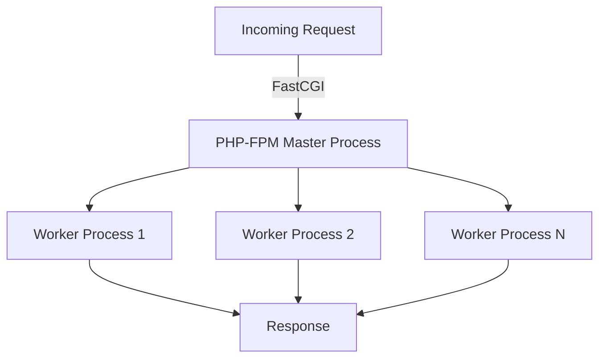
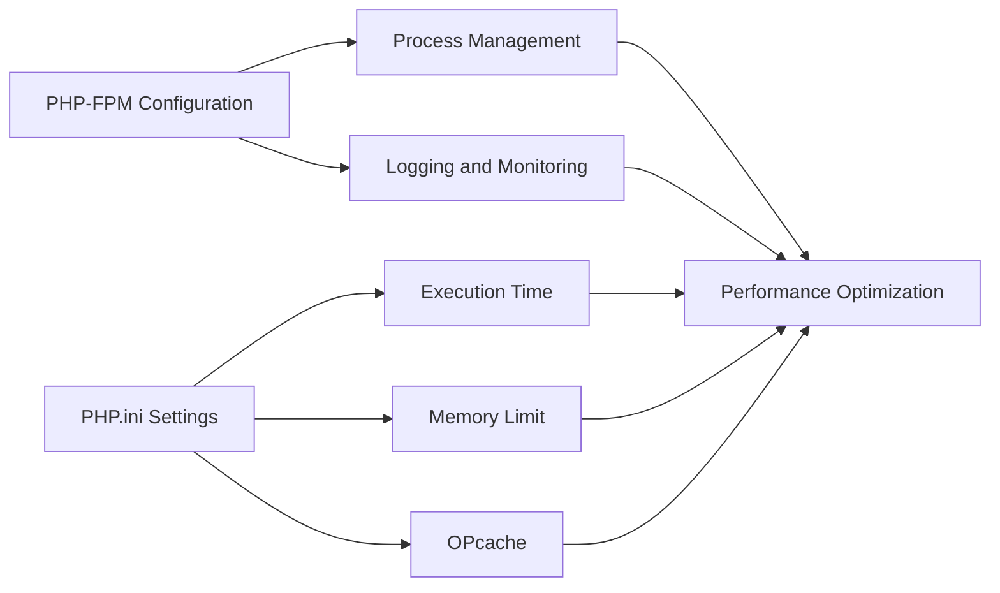

## 24.11 Using PHP-FPM and Tuning PHP Settings

In the realm of PHP performance optimization, PHP-FPM (FastCGI Process Manager) stands out as a powerful tool for managing PHP processes efficiently. Coupled with fine-tuning PHP settings, PHP-FPM can significantly enhance the performance and scalability of your web applications. In this section, we will delve into the intricacies of PHP-FPM, explore how to configure and optimize it, and provide guidance on tuning PHP settings for optimal performance.

### Understanding PHP-FPM

PHP-FPM is an alternative PHP FastCGI implementation with additional features useful for high-load websites. It is designed to handle PHP processes more efficiently than traditional CGI-based methods, making it a preferred choice for modern web applications.

#### Key Features of PHP-FPM

- **Process Management:** PHP-FPM manages a pool of worker processes, allowing for efficient handling of multiple requests simultaneously.
- **Adaptive Process Spawning:** It can dynamically adjust the number of worker processes based on the current load.
- **Advanced Process Management:** PHP-FPM supports features like graceful stop/start, on-demand spawning, and more.
- **Enhanced Security:** It allows for running different pools with different user/group IDs, chrooting, and more.

#### How PHP-FPM Works

PHP-FPM operates by maintaining a pool of worker processes that handle incoming PHP requests. When a request is received, PHP-FPM assigns it to an available worker process. This model allows for efficient resource utilization and improved performance, especially under high load.



**Diagram Explanation:** The diagram illustrates how PHP-FPM handles incoming requests by distributing them among a pool of worker processes, each capable of executing PHP scripts and returning responses.

### Configuring PHP-FPM

To harness the full potential of PHP-FPM, it is crucial to configure it correctly. The main configuration file for PHP-FPM is `php-fpm.conf`, and additional pool-specific configurations are typically found in the `www.conf` file or similar.

#### Basic Configuration

1. **Install PHP-FPM:** Ensure PHP-FPM is installed on your server. You can typically install it using package managers like `apt` or `yum`.

2. **Edit the Configuration Files:** Locate the `php-fpm.conf` and pool configuration files (e.g., `www.conf`).

3. **Define Pool Settings:** Each pool can be configured with specific settings. Key parameters include:

   - **`pm` (Process Manager):** Determines how the process manager controls the number of child processes. Common values are `static`, `dynamic`, and `ondemand`.
   - **`pm.max_children`:** Maximum number of child processes.
   - **`pm.start_servers`:** Number of child processes created on startup (dynamic mode).
   - **`pm.min_spare_servers` and `pm.max_spare_servers`:** Minimum and maximum number of idle child processes (dynamic mode).

```ini
; Example pool configuration
[www]
user = www-data
group = www-data
listen = /run/php/php7.4-fpm.sock
pm = dynamic
pm.max_children = 50
pm.start_servers = 5
pm.min_spare_servers = 5
pm.max_spare_servers = 35
```

**Code Explanation:** This example configuration sets up a pool named `www` with dynamic process management. It specifies user and group permissions, the socket for communication, and various process management parameters.

### Tuning PHP-FPM for Performance

To optimize PHP-FPM for performance, consider the following strategies:

#### Adjusting Process Management Settings

- **Static vs. Dynamic vs. On-Demand:** Choose the appropriate process management mode based on your application's needs. `Static` is suitable for predictable loads, `dynamic` for fluctuating loads, and `ondemand` for low-traffic scenarios.

- **Max Children:** Set `pm.max_children` based on available server resources and expected traffic. Too few can lead to request queuing, while too many can exhaust server resources.

- **Spare Servers:** Configure `pm.min_spare_servers` and `pm.max_spare_servers` to ensure there are always enough idle processes to handle incoming requests without delay.

#### Monitoring and Logging

- **Enable Logging:** Use `access.log` and `slowlog` to monitor request handling and identify slow scripts.

- **Process Status:** Enable the `pm.status_path` to access real-time process status information.

```ini
; Enable status page
pm.status_path = /status
```

**Code Explanation:** This configuration enables a status page at `/status`, providing insights into PHP-FPM's current state and performance metrics.

### Optimizing PHP Settings

In addition to PHP-FPM configuration, tuning PHP settings in the `php.ini` file is crucial for performance optimization.

#### Key PHP Settings to Consider

- **`max_execution_time`:** Limits the maximum time a script is allowed to run. Set this to a reasonable value to prevent long-running scripts from consuming resources.

- **`memory_limit`:** Defines the maximum amount of memory a script can allocate. Adjust this based on your application's memory requirements.

- **`opcache.enable`:** Enable OPcache to improve performance by caching precompiled script bytecode.

- **`error_reporting`:** Set appropriate error reporting levels to avoid unnecessary logging overhead.

```ini
; Example php.ini settings
max_execution_time = 30
memory_limit = 128M
opcache.enable = 1
error_reporting = E_ALL & ~E_DEPRECATED & ~E_STRICT
```

**Code Explanation:** This configuration sets a maximum execution time of 30 seconds, a memory limit of 128 MB, enables OPcache, and configures error reporting to exclude deprecated and strict notices.

### Visualizing PHP-FPM and PHP Settings

To better understand the relationship between PHP-FPM and PHP settings, consider the following diagram:



**Diagram Explanation:** This flowchart illustrates how PHP-FPM configuration and PHP settings work together to optimize performance. Each component contributes to the overall efficiency of the PHP environment.

### Practical Tips for PHP-FPM and PHP Settings

- **Regularly Monitor Performance:** Use tools like New Relic, Datadog, or custom scripts to monitor PHP-FPM and PHP performance metrics.

- **Test Configuration Changes:** Before deploying changes to production, test them in a staging environment to ensure they have the desired effect.

- **Keep Software Updated:** Regularly update PHP, PHP-FPM, and related software to benefit from performance improvements and security patches.

- **Balance Resources:** Ensure your server has enough CPU, memory, and I/O resources to handle the configured PHP-FPM settings.

### Try It Yourself

To gain hands-on experience with PHP-FPM and PHP settings, try the following exercises:

1. **Modify PHP-FPM Settings:** Experiment with different `pm` modes and `max_children` values to see how they affect performance under load.

2. **Tune PHP.ini:** Adjust `max_execution_time` and `memory_limit` settings and observe their impact on script execution.

3. **Enable OPcache:** Turn on OPcache and measure the performance improvement in script execution times.

### Further Reading and Resources

- [PHP-FPM Documentation](https://www.php.net/manual/en/install.fpm.php)
- [PHP Performance Tuning Guide](https://www.php.net/manual/en/faq.performance.php)
- [OPcache Configuration](https://www.php.net/manual/en/opcache.configuration.php)

### Knowledge Check

Before moving on, consider the following questions to reinforce your understanding:

- What is the primary role of PHP-FPM in a web server environment?
- How does the `pm` setting in PHP-FPM affect process management?
- Why is it important to tune `max_execution_time` and `memory_limit` in `php.ini`?

### Summary

In this section, we explored the powerful capabilities of PHP-FPM and how to configure it for optimal performance. We also delved into tuning PHP settings to enhance script execution efficiency. By mastering these techniques, you can significantly improve the performance and scalability of your PHP applications.

Remember, this is just the beginning. As you progress, you'll build more complex and interactive web applications. Keep experimenting, stay curious, and enjoy the journey!

## Quiz: Using PHP-FPM and Tuning PHP Settings



### What is the primary role of PHP-FPM in a web server environment?

- [x] To efficiently manage PHP processes
- [ ] To serve static files
- [ ] To handle database connections
- [ ] To manage server security

> **Explanation:** PHP-FPM is designed to efficiently manage PHP processes, improving performance and scalability.

### Which PHP-FPM setting determines the number of child processes?

- [ ] pm.status_path
- [x] pm.max_children
- [ ] pm.min_spare_servers
- [ ] pm.max_spare_servers

> **Explanation:** The `pm.max_children` setting determines the maximum number of child processes PHP-FPM can create.

### What is the purpose of the `memory_limit` setting in `php.ini`?

- [ ] To limit the number of PHP scripts
- [x] To define the maximum memory a script can use
- [ ] To set the maximum execution time
- [ ] To enable OPcache

> **Explanation:** The `memory_limit` setting defines the maximum amount of memory a PHP script can allocate.

### How does enabling OPcache improve PHP performance?

- [x] By caching precompiled script bytecode
- [ ] By increasing memory usage
- [ ] By reducing server load
- [ ] By disabling error reporting

> **Explanation:** OPcache improves performance by caching precompiled script bytecode, reducing the need for repeated compilation.

### Which PHP-FPM mode is suitable for low-traffic scenarios?

- [ ] Static
- [ ] Dynamic
- [x] On-demand
- [ ] Hybrid

> **Explanation:** The `ondemand` mode is suitable for low-traffic scenarios as it spawns processes only when needed.

### What is the `pm.status_path` used for in PHP-FPM?

- [ ] To configure process management
- [x] To access real-time process status
- [ ] To set memory limits
- [ ] To enable OPcache

> **Explanation:** The `pm.status_path` setting provides a URL to access real-time status information about PHP-FPM processes.

### Why is it important to test configuration changes in a staging environment?

- [x] To ensure changes have the desired effect
- [ ] To reduce server load
- [ ] To improve security
- [ ] To enable OPcache

> **Explanation:** Testing configuration changes in a staging environment ensures they have the desired effect without affecting production.

### What does the `max_execution_time` setting control in `php.ini`?

- [ ] The number of PHP scripts
- [ ] The maximum memory usage
- [x] The maximum time a script can run
- [ ] The number of child processes

> **Explanation:** The `max_execution_time` setting controls the maximum time a PHP script is allowed to run.

### How can you monitor PHP-FPM performance metrics?

- [ ] By enabling OPcache
- [ ] By reducing memory limits
- [x] By using tools like New Relic or Datadog
- [ ] By disabling error reporting

> **Explanation:** Tools like New Relic or Datadog can be used to monitor PHP-FPM performance metrics.

### True or False: PHP-FPM can only be used with Apache web servers.

- [ ] True
- [x] False

> **Explanation:** PHP-FPM can be used with various web servers, including Nginx and Apache.


