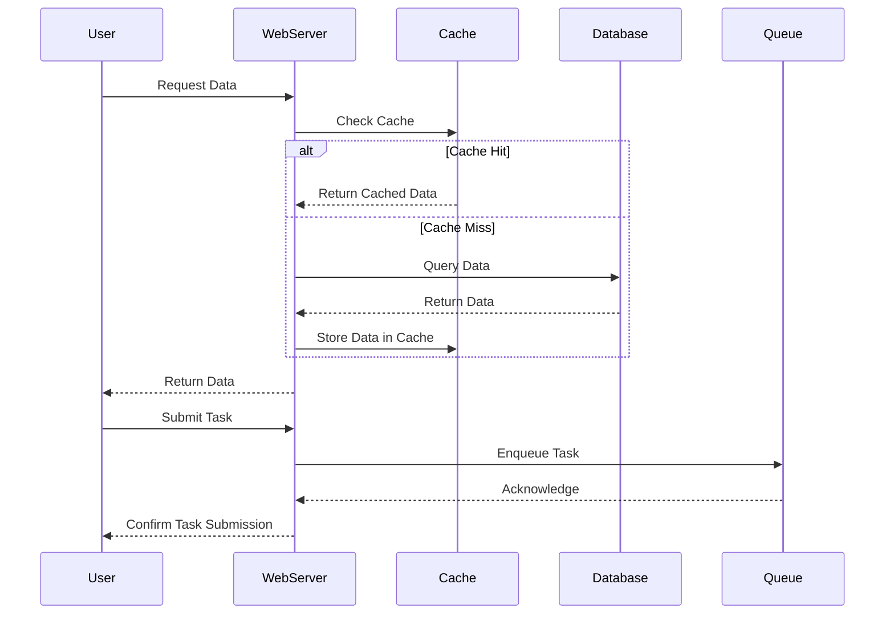

## 24.12 Handling High Concurrency

In today's fast-paced digital world, applications are expected to handle a large number of simultaneous users efficiently. High concurrency is a critical aspect of modern web applications, and PHP developers must be equipped with the right strategies and patterns to manage it effectively. In this section, we will explore the challenges of high concurrency, delve into various solutions, and provide practical examples to help you optimize your PHP applications for concurrent access.

### Understanding Concurrency Challenges

Concurrency in web applications refers to the ability to handle multiple requests or operations simultaneously. This can lead to several challenges, including:

- **Resource Locks:** When multiple processes attempt to access a shared resource, locks are necessary to prevent conflicts. However, improper lock management can lead to deadlocks or reduced performance.
- **Race Conditions:** These occur when the outcome of a process depends on the sequence or timing of uncontrollable events, leading to unpredictable behavior.
- **Data Consistency:** Ensuring that data remains consistent across concurrent operations is crucial, especially in database transactions.

### Solutions for High Concurrency

To address these challenges, we can employ several strategies and design patterns:

#### 1. Caching for Read-Heavy Workloads

Caching is a powerful technique to reduce the load on your database and improve response times for read-heavy applications. By storing frequently accessed data in memory, you can serve requests faster and reduce the need for repeated database queries.

**Example: Implementing Caching with Redis**

```php
<?php
// Connect to Redis
$redis = new Redis();
$redis->connect('127.0.0.1', 6379);

// Check if data is cached
$cacheKey = 'user_profile_123';
if ($redis->exists($cacheKey)) {
    // Fetch data from cache
    $userProfile = json_decode($redis->get($cacheKey), true);
} else {
    // Fetch data from database
    $userProfile = getUserProfileFromDatabase(123);
    // Store data in cache for 10 minutes
    $redis->setex($cacheKey, 600, json_encode($userProfile));
}

// Function to simulate database fetch
function getUserProfileFromDatabase($userId) {
    // Simulate database fetch
    return [
        'id' => $userId,
        'name' => 'John Doe',
        'email' => 'john.doe@example.com'
    ];
}
?>
```

**Key Points:**
- Use caching for data that doesn't change frequently.
- Set appropriate expiration times to ensure data freshness.

#### 2. Message Queues for Write Operations

Message queues decouple the processing of tasks from the main application flow, allowing you to handle write operations asynchronously. This is particularly useful for tasks that are not time-sensitive, such as sending emails or processing images.

**Example: Using RabbitMQ for Asynchronous Task Processing**

```php
<?php
require_once __DIR__ . '/vendor/autoload.php';

use PhpAmqpLib\Connection\AMQPStreamConnection;
use PhpAmqpLib\Message\AMQPMessage;

// Establish connection to RabbitMQ
$connection = new AMQPStreamConnection('localhost', 5672, 'guest', 'guest');
$channel = $connection->channel();

// Declare a queue
$channel->queue_declare('task_queue', false, true, false, false);

// Create a message
$data = json_encode(['task' => 'send_email', 'email' => 'user@example.com']);
$msg = new AMQPMessage($data, ['delivery_mode' => AMQPMessage::DELIVERY_MODE_PERSISTENT]);

// Publish the message to the queue
$channel->basic_publish($msg, '', 'task_queue');

echo " [x] Sent 'Task'\n";

// Close the channel and connection
$channel->close();
$connection->close();
?>
```

**Key Points:**
- Use message queues to offload tasks that can be processed later.
- Ensure messages are persistent to avoid data loss in case of failures.

#### 3. Session Handling

Managing sessions in a concurrent environment requires careful handling to prevent data corruption. PHP's default session handling can lead to issues when multiple requests try to access the same session data simultaneously.

**Example: Implementing Session Locking**

```php
<?php
session_start();

// Acquire a lock
if (flock($fp = fopen(session_save_path() . '/sess_' . session_id(), 'r+'), LOCK_EX)) {
    // Perform session operations
    $_SESSION['counter'] = ($_SESSION['counter'] ?? 0) + 1;

    // Release the lock
    flock($fp, LOCK_UN);
    fclose($fp);
}

echo "Session counter: " . $_SESSION['counter'];
?>
```

**Key Points:**
- Use file locks or database-backed sessions to manage concurrent access.
- Consider using session handlers that support locking, such as Redis or Memcached.

### Advanced Concurrency Techniques

Beyond the basic strategies, there are advanced techniques and patterns that can further enhance concurrency handling in PHP applications.

#### 1. Non-Blocking I/O

Non-blocking I/O allows your application to perform other tasks while waiting for I/O operations to complete. This is particularly useful for applications that need to handle a large number of simultaneous connections, such as chat applications or real-time analytics.

**Example: Using ReactPHP for Non-Blocking I/O**

```php
<?php
require 'vendor/autoload.php';

use React\EventLoop\Factory;
use React\Socket\Server;
use React\Socket\ConnectionInterface;

$loop = Factory::create();
$socket = new Server('127.0.0.1:8080', $loop);

$socket->on('connection', function (ConnectionInterface $connection) {
    $connection->write("Hello! Welcome to the server.\n");
    $connection->on('data', function ($data) use ($connection) {
        $connection->write("You said: " . $data);
    });
});

echo "Server running at http://127.0.0.1:8080\n";
$loop->run();
?>
```

**Key Points:**
- Use libraries like ReactPHP to handle non-blocking I/O.
- Ideal for applications requiring high concurrency with minimal latency.

#### 2. Parallel Processing

Parallel processing allows you to execute multiple tasks simultaneously, leveraging multi-core processors to improve performance. This can be achieved using extensions like `pthreads` or libraries like `Amp`.

**Example: Using Amp for Parallel Processing**

```php
<?php
require 'vendor/autoload.php';

use Amp\Parallel\Worker;
use Amp\Promise;
use function Amp\Promise\wait;

// Define a function to run in parallel
function computeTask($input) {
    return $input * 2;
}

// Create an array of promises
$promises = [];
for ($i = 0; $i < 10; $i++) {
    $promises[] = Worker\enqueueCallable('computeTask', $i);
}

// Wait for all promises to resolve
$results = wait(Promise\all($promises));

echo "Results: " . implode(', ', $results) . "\n";
?>
```

**Key Points:**
- Use parallel processing for CPU-intensive tasks.
- Ensure thread safety when accessing shared resources.

### Visualizing Concurrency Management

To better understand how these techniques work together, let's visualize the flow of a concurrent PHP application using a sequence diagram.



**Diagram Explanation:**
- The user requests data, which is first checked in the cache.
- If the data is not cached, it is fetched from the database and then cached.
- For task submissions, the task is enqueued for asynchronous processing.

### Knowledge Check

Before we wrap up, let's reinforce what we've learned with a few questions:

1. What are the main challenges of handling high concurrency in PHP applications?
2. How does caching help in managing read-heavy workloads?
3. Why are message queues beneficial for write operations?
4. What is the role of session locking in concurrent environments?
5. How can non-blocking I/O improve application performance?

### Try It Yourself

Experiment with the provided code examples by modifying them to suit your application's needs. For instance, try changing the cache expiration time or adding more tasks to the message queue. Observe how these changes impact performance and concurrency handling.

### Conclusion

Handling high concurrency in PHP applications requires a combination of strategies and design patterns. By leveraging caching, message queues, session handling, non-blocking I/O, and parallel processing, you can build robust applications capable of serving a large number of users simultaneously. Remember, this is just the beginning. As you progress, you'll discover more advanced techniques and optimizations. Keep experimenting, stay curious, and enjoy the journey!

## Quiz: Handling High Concurrency



### What is a common challenge when handling high concurrency in PHP applications?

- [x] Managing resource locks
- [ ] Increasing code complexity
- [ ] Reducing code readability
- [ ] Improving user interface design

> **Explanation:** Managing resource locks is a common challenge in high concurrency scenarios to prevent conflicts and ensure data consistency.

### How does caching help in managing read-heavy workloads?

- [x] By reducing the need for repeated database queries
- [ ] By increasing the number of database connections
- [ ] By slowing down the application
- [ ] By increasing the server load

> **Explanation:** Caching reduces the need for repeated database queries by storing frequently accessed data in memory, thus improving response times.

### Why are message queues beneficial for write operations?

- [x] They allow asynchronous processing of tasks
- [ ] They increase the complexity of the application
- [ ] They reduce the number of tasks that can be processed
- [ ] They slow down the application

> **Explanation:** Message queues decouple task processing from the main application flow, allowing write operations to be handled asynchronously.

### What is the role of session locking in concurrent environments?

- [x] To prevent data corruption
- [ ] To increase session timeout
- [ ] To reduce server load
- [ ] To improve user interface design

> **Explanation:** Session locking prevents data corruption by ensuring that only one request can modify session data at a time.

### How can non-blocking I/O improve application performance?

- [x] By allowing other tasks to be performed while waiting for I/O operations
- [ ] By increasing the number of I/O operations
- [ ] By reducing the number of concurrent users
- [ ] By slowing down the application

> **Explanation:** Non-blocking I/O allows the application to perform other tasks while waiting for I/O operations to complete, improving performance.

### Which library can be used for non-blocking I/O in PHP?

- [x] ReactPHP
- [ ] Laravel
- [ ] Symfony
- [ ] CodeIgniter

> **Explanation:** ReactPHP is a library that provides non-blocking I/O capabilities in PHP.

### What is a benefit of using parallel processing in PHP?

- [x] Improved performance for CPU-intensive tasks
- [ ] Reduced code readability
- [ ] Increased server load
- [ ] Slower application response times

> **Explanation:** Parallel processing improves performance for CPU-intensive tasks by leveraging multi-core processors.

### Which PHP extension can be used for parallel processing?

- [x] pthreads
- [ ] PDO
- [ ] cURL
- [ ] GD

> **Explanation:** The pthreads extension allows for parallel processing in PHP by enabling multi-threading.

### What is a key consideration when using parallel processing?

- [x] Ensuring thread safety when accessing shared resources
- [ ] Increasing the number of threads indefinitely
- [ ] Reducing the number of CPU cores
- [ ] Slowing down the application

> **Explanation:** Ensuring thread safety is crucial when using parallel processing to prevent data corruption and ensure consistent results.

### True or False: Caching is only useful for write-heavy workloads.

- [ ] True
- [x] False

> **Explanation:** Caching is particularly useful for read-heavy workloads as it reduces the need for repeated database queries and improves response times.


