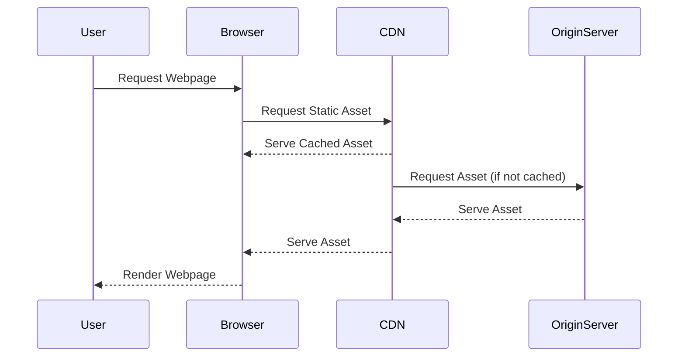

## 24.2 Utilizing CDNs and Asset Optimization

In the realm of web development, performance is paramount. As PHP developers, we strive to deliver applications that are not only functional but also fast and responsive. One of the key strategies to achieve this is through the use of Content Delivery Networks (CDNs) and asset optimization techniques. In this section, we will delve into how CDNs can be leveraged to distribute static assets globally, reducing latency and improving user experience. We will also explore various asset optimization techniques that can significantly enhance the performance of your PHP applications.

### Understanding Content Delivery Networks (CDNs)

A Content Delivery Network (CDN) is a network of geographically distributed servers that work together to deliver content to users more efficiently. By caching static assets such as images, CSS, and JavaScript files on servers closer to the user's location, CDNs reduce the distance data must travel, thereby decreasing latency and improving load times.

#### Key Benefits of Using CDNs

1. **Reduced Latency**: By serving content from a server closer to the user, CDNs minimize the time it takes for data to travel across the internet.
2. **Improved Load Times**: Faster delivery of static assets leads to quicker page load times, enhancing the user experience.
3. **Scalability**: CDNs can handle large volumes of traffic, making them ideal for applications with fluctuating or high demand.
4. **Reliability**: With multiple servers, CDNs provide redundancy, ensuring content is always available even if one server fails.
5. **Security**: Many CDNs offer additional security features such as DDoS protection and secure token authentication.

#### Popular CDN Providers

- **Cloudflare**: Known for its robust security features and global network.
- **Akamai**: Offers extensive reach and advanced performance optimization tools.
- **Amazon CloudFront**: Integrated with AWS, providing seamless scalability and reliability.

### Implementing CDNs in PHP Applications

To integrate a CDN into your PHP application, follow these steps:

1. **Select a CDN Provider**: Choose a provider that best suits your needs based on factors such as cost, geographic coverage, and additional features.
2. **Configure DNS Settings**: Update your DNS settings to point to the CDN's servers. This typically involves creating a CNAME record.
3. **Modify Asset URLs**: Update your application to use the CDN's URLs for static assets. This can often be done by configuring your asset management system or using a PHP script to dynamically generate URLs.
4. **Test and Monitor**: After implementation, test your application to ensure assets are being served correctly and monitor performance improvements.

### Asset Optimization Techniques

While CDNs play a crucial role in distributing content efficiently, optimizing the assets themselves is equally important. Here are some techniques to consider:

#### Minifying CSS and JavaScript

Minification involves removing unnecessary characters from code, such as whitespace, comments, and newline characters, without affecting functionality. This reduces file size and improves load times.

**Example of Minifying JavaScript:**

Before Minification:
```javascript
function greet(name) {
    console.log("Hello, " + name + "!");
}
```

After Minification:
```javascript
function greet(n){console.log("Hello, "+n+"!");}
```

#### Image Optimization

Images often account for a significant portion of a webpage's load time. Optimizing images involves reducing their file size without compromising quality. Tools like **ImageMagick** and **TinyPNG** can be used for this purpose.

**Example of Image Optimization:**

- **JPEG**: Use progressive JPEGs for faster loading.
- **PNG**: Compress PNGs using tools like OptiPNG or PNGQuant.
- **WebP**: Consider using WebP format for better compression.

#### Implementing HTTP/2 and Asset Bundling

HTTP/2 introduces several enhancements over HTTP/1.1, including multiplexing, header compression, and server push, which can significantly improve performance.

**Asset Bundling** involves combining multiple CSS or JavaScript files into a single file, reducing the number of HTTP requests required to load a page.

**Example of Asset Bundling:**

Before Bundling:
- `style1.css`
- `style2.css`
- `script1.js`
- `script2.js`

After Bundling:
- `styles.bundle.css`
- `scripts.bundle.js`

### Code Example: Integrating a CDN in PHP

Let's walk through a simple example of integrating a CDN into a PHP application. We'll use Cloudflare as our CDN provider.

```php
<?php
// Define the base URL for the CDN
define('CDN_URL', 'https://cdn.example.com/');

// Function to generate the full URL for an asset
function asset_url($path) {
    return CDN_URL . ltrim($path, '/');
}

// Usage example
$cssFile = asset_url('css/style.css');
$jsFile = asset_url('js/app.js');

echo '<link rel="stylesheet" href="' . $cssFile . '">';
echo '<script src="' . $jsFile . '"></script>';
?>
```

In this example, we define a constant `CDN_URL` that holds the base URL for our CDN. The `asset_url` function takes a path to an asset and returns the full URL, which is then used in the HTML to load the CSS and JavaScript files.

### Visualizing CDN Workflow

To better understand how CDNs work, let's visualize the process using a sequence diagram.



**Description**: This diagram illustrates the interaction between the user, browser, CDN, and origin server. The browser requests a static asset from the CDN. If the asset is cached, the CDN serves it directly. If not, the CDN fetches it from the origin server, caches it, and then serves it to the browser.

### Knowledge Check

Before we move on, let's test your understanding of CDNs and asset optimization with a few questions:

1. What is the primary purpose of a CDN?
2. Name two benefits of using a CDN.
3. How does minification improve performance?
4. What is the advantage of using HTTP/2 over HTTP/1.1?

### Try It Yourself

To solidify your understanding, try modifying the code example to use a different CDN provider. Experiment with different asset optimization tools and observe the impact on performance.

### Conclusion

Utilizing CDNs and optimizing assets are crucial steps in enhancing the performance of PHP applications. By distributing content efficiently and reducing file sizes, we can significantly improve user experience and application responsiveness. Remember, this is just the beginning. As you continue to explore and implement these techniques, you'll discover even more ways to optimize your applications for speed and efficiency.

## Quiz: Utilizing CDNs and Asset Optimization



### What is the primary purpose of a CDN?

- [x] To reduce latency by serving content from servers closer to the user
- [ ] To increase the size of static assets
- [ ] To replace the need for a web server
- [ ] To store user data

> **Explanation:** CDNs aim to reduce latency by caching and serving content from geographically distributed servers closer to the user.

### Which of the following is a benefit of using a CDN?

- [x] Improved load times
- [ ] Increased server load
- [ ] Higher latency
- [ ] Reduced security

> **Explanation:** CDNs improve load times by reducing the distance data must travel, thus enhancing user experience.

### What does minification involve?

- [x] Removing unnecessary characters from code
- [ ] Increasing the file size of assets
- [ ] Adding comments to code
- [ ] Splitting files into smaller parts

> **Explanation:** Minification removes unnecessary characters such as whitespace and comments to reduce file size.

### Which image format is known for better compression?

- [x] WebP
- [ ] BMP
- [ ] TIFF
- [ ] GIF

> **Explanation:** WebP offers better compression compared to traditional formats like JPEG and PNG.

### What is the advantage of using HTTP/2?

- [x] Multiplexing and header compression
- [ ] Increased number of HTTP requests
- [ ] Slower page load times
- [ ] Reduced security

> **Explanation:** HTTP/2 introduces multiplexing and header compression, which improve performance over HTTP/1.1.

### What is asset bundling?

- [x] Combining multiple files into a single file
- [ ] Splitting a file into multiple parts
- [ ] Increasing the number of HTTP requests
- [ ] Adding comments to code

> **Explanation:** Asset bundling combines multiple CSS or JavaScript files into a single file, reducing HTTP requests.

### Which tool can be used for image optimization?

- [x] TinyPNG
- [ ] Notepad
- [ ] Excel
- [ ] Word

> **Explanation:** TinyPNG is a tool used to compress and optimize images without losing quality.

### What is a CNAME record used for in CDN configuration?

- [x] To point a domain to the CDN's servers
- [ ] To store user data
- [ ] To increase latency
- [ ] To replace the need for a web server

> **Explanation:** A CNAME record is used to map a domain to the CDN's servers, facilitating content delivery.

### Which CDN provider is known for its security features?

- [x] Cloudflare
- [ ] Akamai
- [ ] Amazon CloudFront
- [ ] Microsoft Azure

> **Explanation:** Cloudflare is renowned for its robust security features, including DDoS protection.

### True or False: CDNs can handle large volumes of traffic.

- [x] True
- [ ] False

> **Explanation:** CDNs are designed to handle large volumes of traffic, making them ideal for high-demand applications.



Remember, optimizing your PHP applications is an ongoing process. Keep experimenting, stay curious, and enjoy the journey!
