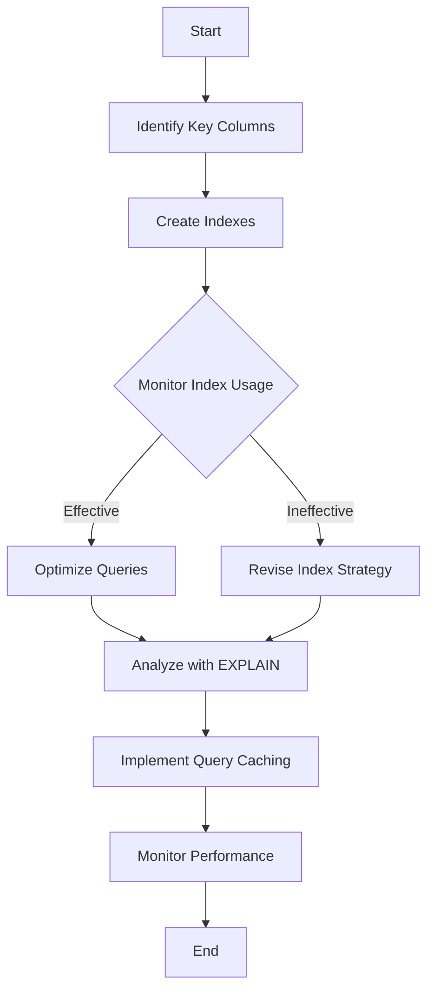

## 24.3 Database Indexing and Query Optimization

In the realm of PHP development, efficient database interaction is crucial for building high-performance applications. Database indexing and query optimization are key techniques that can significantly enhance the speed and responsiveness of your applications. In this section, we will delve into the intricacies of database indexing, explore query optimization strategies, and discuss best practices for maintaining a well-structured and efficient database.

### Understanding Database Indexing

**Database Indexing** is a data structure technique that improves the speed of data retrieval operations on a database table at the cost of additional writes and storage space. Indexes are used to quickly locate data without having to search every row in a database table every time a database table is accessed.

#### Effective Indexing Strategies

1. **Identify Key Columns**: Focus on columns that are frequently used in WHERE clauses, JOIN conditions, and ORDER BY clauses. These columns are prime candidates for indexing.

2. **Use Composite Indexes**: When queries involve multiple columns, consider using composite indexes. These indexes cover multiple columns and can significantly speed up complex queries.

3. **Avoid Over-Indexing**: While indexes improve read performance, they can degrade write performance. Avoid creating unnecessary indexes that are rarely used.

4. **Monitor Index Usage**: Regularly analyze index usage to ensure that indexes are being utilized effectively. Remove unused indexes to optimize performance.

5. **Consider Index Types**: Different databases offer various index types, such as B-tree, hash, and full-text indexes. Choose the appropriate type based on your query patterns.

### Query Optimization Techniques

Query optimization is the process of enhancing the performance of a query by improving its execution plan. Here are some techniques to optimize your queries:

#### Analyzing Queries with `EXPLAIN`

The `EXPLAIN` statement provides insight into how a query will be executed by the database. It helps identify potential bottlenecks and inefficiencies.

```sql
EXPLAIN SELECT * FROM orders WHERE customer_id = 123;
```

- **Key Points**: Look for full table scans, which indicate that indexes are not being used. Aim for index scans or seeks instead.

#### Avoiding N+1 Query Problems

The N+1 query problem occurs when an application executes one query to retrieve a list of items and then executes additional queries for each item. This can be mitigated by using eager loading techniques.

**Example in PHP with Eloquent ORM:**

```php
// N+1 Problem
$orders = Order::all();
foreach ($orders as $order) {
    echo $order->customer->name;
}

// Eager Loading Solution
$orders = Order::with('customer')->get();
foreach ($orders as $order) {
    echo $order->customer->name;
}
```

#### Optimizing Joins and Subqueries

- **Use Joins Wisely**: Ensure that join conditions are indexed to improve performance. Consider using INNER JOINs over OUTER JOINs when possible.

- **Subquery Optimization**: Replace subqueries with joins when feasible, as joins are generally more efficient.

#### Query Caching

Implement query caching to store the results of expensive queries and reuse them when the same query is executed again.

### Database Normalization

**Database Normalization** is the process of organizing the fields and tables of a database to minimize redundancy and dependency. It involves dividing large tables into smaller ones and defining relationships between them.

#### Normalization Levels

1. **First Normal Form (1NF)**: Eliminate duplicate columns and ensure that each column contains atomic values.

2. **Second Normal Form (2NF)**: Ensure that all non-key attributes are fully functional dependent on the primary key.

3. **Third Normal Form (3NF)**: Remove transitive dependencies, ensuring that non-key attributes are not dependent on other non-key attributes.

#### Benefits of Normalization

- **Data Integrity**: Reduces data redundancy and ensures consistency.
- **Efficient Updates**: Simplifies data modification by reducing the need for multiple updates.
- **Improved Query Performance**: Smaller tables and well-defined relationships enhance query performance.

### Monitoring Database Performance

Regular monitoring of database performance is essential to identify and address potential issues before they impact application performance.

#### Tools for Monitoring

- **MySQL Performance Schema**: Provides insights into server performance and query execution.
- **pgAdmin for PostgreSQL**: Offers a comprehensive interface for monitoring and managing PostgreSQL databases.
- **New Relic**: A powerful tool for monitoring database performance and application metrics.

#### Key Metrics to Monitor

- **Query Execution Time**: Identify slow queries and optimize them.
- **Index Usage**: Ensure that indexes are being used effectively.
- **Lock Contention**: Monitor for locking issues that can degrade performance.

### Visualizing Database Indexing and Query Optimization

To better understand the concepts of indexing and query optimization, let's visualize the process using a flowchart.



**Diagram Explanation**: This flowchart illustrates the process of database indexing and query optimization. It begins with identifying key columns for indexing, creating indexes, and monitoring their usage. Based on the effectiveness of the indexes, queries are optimized, analyzed with `EXPLAIN`, and query caching is implemented. The process concludes with continuous performance monitoring.

### Try It Yourself

Experiment with the concepts discussed in this section by applying them to your own database queries. Here are some suggestions:

- **Modify Indexes**: Add or remove indexes on your database tables and observe the impact on query performance.
- **Analyze Queries**: Use the `EXPLAIN` statement to analyze your queries and identify potential optimizations.
- **Implement Eager Loading**: Refactor your code to use eager loading and compare the performance with the original implementation.

### References and Further Reading

- [MySQL Indexing Best Practices](https://dev.mysql.com/doc/refman/8.0/en/mysql-indexes.html)
- [PostgreSQL Query Optimization](https://www.postgresql.org/docs/current/performance-tips.html)
- [SQL Performance Explained](https://use-the-index-luke.com/)

### Knowledge Check

1. What is the primary purpose of database indexing?
2. How can the `EXPLAIN` statement help in query optimization?
3. What is the N+1 query problem, and how can it be mitigated?
4. Describe the benefits of database normalization.
5. What are some tools used for monitoring database performance?

### Embrace the Journey

Remember, mastering database indexing and query optimization is a continuous journey. As you gain experience, you'll develop a deeper understanding of how to fine-tune your database interactions for optimal performance. Keep experimenting, stay curious, and enjoy the journey!

## Quiz: Database Indexing and Query Optimization



### What is the primary purpose of database indexing?

- [x] To improve the speed of data retrieval operations
- [ ] To increase the storage space used by the database
- [ ] To enhance the security of the database
- [ ] To simplify database schema design

> **Explanation:** Database indexing is primarily used to improve the speed of data retrieval operations by allowing the database to quickly locate data without scanning every row.

### How can the `EXPLAIN` statement help in query optimization?

- [x] By providing insight into how a query will be executed
- [ ] By automatically optimizing the query
- [ ] By creating indexes for the query
- [ ] By rewriting the query for better performance

> **Explanation:** The `EXPLAIN` statement provides insight into the execution plan of a query, helping identify potential bottlenecks and inefficiencies.

### What is the N+1 query problem?

- [x] A problem where an application executes one query to retrieve a list and additional queries for each item
- [ ] A problem where queries are executed in parallel
- [ ] A problem where queries are executed in a batch
- [ ] A problem where queries are executed without indexes

> **Explanation:** The N+1 query problem occurs when an application executes one query to retrieve a list of items and then executes additional queries for each item, leading to inefficiencies.

### What is the benefit of using eager loading?

- [x] It reduces the number of queries executed
- [ ] It increases the number of queries executed
- [ ] It simplifies the database schema
- [ ] It enhances data security

> **Explanation:** Eager loading reduces the number of queries executed by retrieving related data in a single query, mitigating the N+1 query problem.

### What is the first normal form (1NF) in database normalization?

- [x] Eliminate duplicate columns and ensure atomic values
- [ ] Ensure all non-key attributes are fully functional dependent on the primary key
- [ ] Remove transitive dependencies
- [ ] Create composite keys for all tables

> **Explanation:** The first normal form (1NF) involves eliminating duplicate columns and ensuring that each column contains atomic values.

### What is a composite index?

- [x] An index that covers multiple columns
- [ ] An index that covers a single column
- [ ] An index that is automatically created by the database
- [ ] An index that is used for full-text search

> **Explanation:** A composite index is an index that covers multiple columns, which can significantly speed up complex queries involving those columns.

### Why should you avoid over-indexing?

- [x] It can degrade write performance
- [ ] It can improve read performance
- [ ] It can enhance data security
- [ ] It can simplify query design

> **Explanation:** Over-indexing can degrade write performance because each index must be updated whenever data is inserted, updated, or deleted.

### What is the purpose of query caching?

- [x] To store the results of expensive queries for reuse
- [ ] To automatically optimize queries
- [ ] To create indexes for queries
- [ ] To rewrite queries for better performance

> **Explanation:** Query caching stores the results of expensive queries so that they can be reused when the same query is executed again, improving performance.

### What is the role of monitoring in database optimization?

- [x] To identify and address potential performance issues
- [ ] To automatically optimize queries
- [ ] To create indexes for queries
- [ ] To rewrite queries for better performance

> **Explanation:** Monitoring helps identify and address potential performance issues before they impact application performance, ensuring optimal database operation.

### True or False: Database normalization always improves query performance.

- [ ] True
- [x] False

> **Explanation:** While normalization reduces redundancy and improves data integrity, it can sometimes lead to more complex queries that may not always improve performance.


