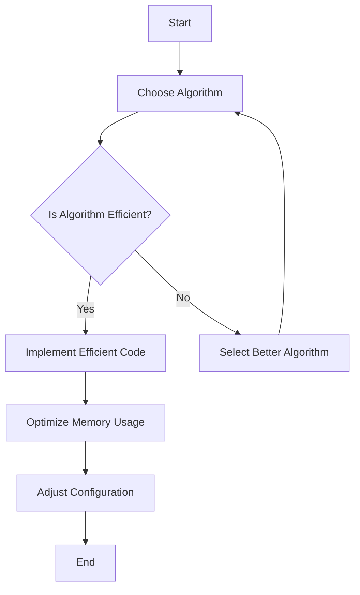

## 24.4 Minimizing Resource Usage

In the realm of PHP development, minimizing resource usage is a critical aspect of optimizing performance. Efficient resource management ensures that applications run smoothly, handle more users, and operate cost-effectively. In this section, we will delve into various strategies for minimizing resource usage, focusing on efficient code practices, memory management, and configuration tuning.

### Efficient Code Practices

Efficient code is the cornerstone of resource optimization. By writing code that is both effective and efficient, we can significantly reduce the computational load and improve the overall performance of our applications.

#### Use Appropriate Algorithms and Data Structures

Choosing the right algorithms and data structures is crucial for optimizing performance. Let's explore some key considerations:

- **Algorithm Complexity**: Always aim for algorithms with lower time complexity. For example, using a binary search (O(log n)) instead of a linear search (O(n)) can drastically reduce execution time for large datasets.

- **Data Structures**: Select data structures that best fit the problem at hand. For instance, using a hash table for quick lookups instead of a list can improve performance.

```php
<?php
// Example: Using a hash table for quick lookups
$hashTable = [
    'apple' => 'fruit',
    'carrot' => 'vegetable',
    'chicken' => 'meat'
];

// Quick lookup
echo $hashTable['apple']; // Outputs: fruit
?>
```

#### Avoid Unnecessary Computations and Loops

Reducing redundant computations and optimizing loops can significantly enhance performance:

- **Cache Results**: Store results of expensive computations if they are needed multiple times.

- **Loop Optimization**: Minimize the number of iterations in loops and avoid nested loops when possible.

```php
<?php
// Example: Caching results to avoid redundant computations
function factorial($n) {
    static $cache = [];
    if (isset($cache[$n])) {
        return $cache[$n];
    }
    $result = ($n <= 1) ? 1 : $n * factorial($n - 1);
    $cache[$n] = $result;
    return $result;
}

echo factorial(5); // Outputs: 120
?>
```

### Memory Management

Efficient memory management is vital for minimizing resource usage, especially in applications that handle large datasets or run on limited resources.

#### Free Up Memory by Unsetting Variables

Releasing memory by unsetting variables that are no longer needed can prevent memory bloat:

```php
<?php
// Example: Unsetting variables to free up memory
$data = range(1, 1000000); // Large dataset
// Process data...
unset($data); // Free up memory
?>
```

#### Use Streaming and Generators for Handling Large Data Sets

Streaming and generators allow you to process large datasets without loading them entirely into memory:

- **Streaming**: Read data in chunks, process it, and discard it to save memory.

- **Generators**: Use generators to yield data one piece at a time, reducing memory usage.

```php
<?php
// Example: Using a generator to handle large datasets
function readLargeFile($filePath) {
    $handle = fopen($filePath, 'r');
    while (!feof($handle)) {
        yield fgets($handle);
    }
    fclose($handle);
}

foreach (readLargeFile('largefile.txt') as $line) {
    echo $line;
}
?>
```

### Configuration Tuning

Tuning PHP configuration settings can lead to significant performance improvements. Here are some key settings to consider:

#### Adjust `php.ini` Settings for Optimal Performance

- **Memory Limit**: Set an appropriate memory limit to prevent excessive memory usage.

- **Opcode Caching**: Enable opcode caching to improve script execution speed.

- **Error Reporting**: Disable error reporting in production to reduce overhead.

```ini
; Example: php.ini settings for performance optimization
memory_limit = 128M
opcache.enable = 1
display_errors = Off
```

### Visualizing Resource Usage Optimization

To better understand the flow of resource usage optimization, let's visualize the process using a flowchart:



**Figure 1**: Flowchart of Resource Usage Optimization Process

### References and Links

- [PHP Manual: Performance Considerations](https://www.php.net/manual/en/intro.performance.php)
- [MDN Web Docs: Algorithms and Data Structures](https://developer.mozilla.org/en-US/docs/Web/JavaScript/Guide/Algorithms_and_data_structures)
- [W3Schools: PHP Performance Tips](https://www.w3schools.com/php/php_performance.asp)

### Knowledge Check

- What are some efficient code practices for minimizing resource usage?
- How can memory management be improved in PHP applications?
- What configuration settings in `php.ini` can be adjusted for better performance?

### Embrace the Journey

Remember, optimizing resource usage is an ongoing process. As you continue to develop and refine your PHP applications, keep exploring new techniques and strategies for performance optimization. Stay curious, experiment with different approaches, and enjoy the journey of creating efficient and high-performing applications!

## Quiz: Minimizing Resource Usage



### Which of the following is a key consideration when choosing algorithms for performance optimization?

- [x] Time complexity
- [ ] Code readability
- [ ] Code length
- [ ] Number of comments

> **Explanation:** Time complexity is crucial for performance optimization as it determines how the execution time increases with input size.

### What is the benefit of using generators in PHP?

- [x] Reduced memory usage
- [ ] Faster execution time
- [ ] Improved code readability
- [ ] Increased code complexity

> **Explanation:** Generators yield data one piece at a time, reducing memory usage by not loading the entire dataset into memory.

### Which `php.ini` setting can improve script execution speed?

- [x] Enabling opcode caching
- [ ] Increasing memory limit
- [ ] Disabling error reporting
- [ ] Enabling display errors

> **Explanation:** Enabling opcode caching improves script execution speed by caching compiled bytecode.

### What is a common practice to free up memory in PHP?

- [x] Unsetting variables
- [ ] Increasing memory limit
- [ ] Using global variables
- [ ] Disabling garbage collection

> **Explanation:** Unsetting variables that are no longer needed frees up memory and prevents memory bloat.

### How can loop optimization improve performance?

- [x] By minimizing the number of iterations
- [ ] By increasing the number of iterations
- [x] By avoiding nested loops
- [ ] By using global variables

> **Explanation:** Minimizing iterations and avoiding nested loops reduce computational load and improve performance.

### What is the purpose of caching results in PHP?

- [x] To avoid redundant computations
- [ ] To increase code complexity
- [ ] To improve code readability
- [ ] To reduce code length

> **Explanation:** Caching results avoids redundant computations, saving time and resources.

### Which of the following is a benefit of using streaming for large datasets?

- [x] Reduced memory usage
- [ ] Faster execution time
- [x] Improved code readability
- [ ] Increased code complexity

> **Explanation:** Streaming processes data in chunks, reducing memory usage by not loading the entire dataset into memory.

### What is the impact of disabling error reporting in production?

- [x] Reduced overhead
- [ ] Increased error visibility
- [ ] Improved debugging
- [ ] Enhanced code readability

> **Explanation:** Disabling error reporting in production reduces overhead and improves performance.

### Which data structure is suitable for quick lookups?

- [x] Hash table
- [ ] Linked list
- [ ] Stack
- [ ] Queue

> **Explanation:** A hash table provides quick lookups due to its efficient key-value mapping.

### True or False: Using a binary search instead of a linear search can reduce execution time for large datasets.

- [x] True
- [ ] False

> **Explanation:** A binary search has a lower time complexity (O(log n)) compared to a linear search (O(n)), reducing execution time for large datasets.


