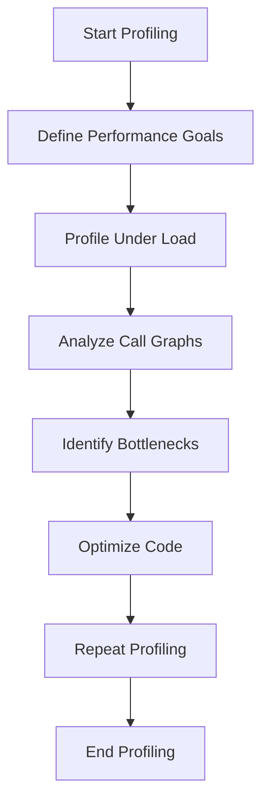

## 24.5 Profiling and Identifying Bottlenecks

In the realm of PHP development, performance optimization is a critical aspect that can significantly impact the user experience and efficiency of your applications. Profiling and identifying bottlenecks is a systematic approach to uncovering areas in your code that may be causing slowdowns. In this section, we will explore various tools and techniques to help you profile your PHP applications effectively and identify bottlenecks that need attention.

### Understanding Profiling

Profiling is the process of measuring the performance of your application by analyzing its execution. It involves collecting data on various aspects such as function call frequency, execution time, memory usage, and more. Profiling helps you gain insights into how your application behaves under different conditions, allowing you to pinpoint areas that require optimization.

### Profiling Tools

Several tools are available for profiling PHP applications. Here, we will focus on two popular ones: Xdebug and Blackfire.

#### Xdebug

Xdebug is a powerful PHP extension that provides debugging and profiling capabilities. It generates profiling data that can be analyzed using tools like KCacheGrind or Webgrind.

- **Installation:** Xdebug can be installed via PECL or by downloading the appropriate binary for your PHP version.
- **Configuration:** Enable Xdebug profiling by adding the following lines to your `php.ini` file:

  ```ini
  zend_extension=xdebug.so
  xdebug.profiler_enable=1
  xdebug.profiler_output_dir=/path/to/profiler_output
  ```

- **Usage:** Once configured, Xdebug will generate cachegrind files in the specified output directory. These files can be visualized using KCacheGrind or Webgrind to analyze call graphs and execution times.

- **Link:** [Xdebug](https://xdebug.org/)

#### Blackfire

Blackfire is a performance management solution that provides detailed insights into your application's performance. It offers both a free and a premium version with advanced features.

- **Installation:** Blackfire requires installing a probe on your server and a client on your local machine. Follow the installation instructions on the Blackfire website.

- **Usage:** Blackfire allows you to profile your application in real-time, providing a web-based interface to analyze performance metrics and identify bottlenecks.

- **Link:** [Blackfire.io](https://blackfire.io/)

### The Profiling Process

Profiling is an iterative process that involves several steps:

1. **Define Performance Goals:** Before you start profiling, establish clear performance goals. This could be reducing page load time, improving response time, or decreasing memory usage.

2. **Profile Under Load:** To get accurate profiling data, simulate real-world usage by profiling your application under load. Use tools like Apache JMeter or Siege to generate traffic.

3. **Analyze Call Graphs:** Use the profiling data to analyze call graphs and identify functions or methods that consume the most resources.

4. **Identify Bottlenecks:** Focus on the most time-consuming parts of the code. Look for functions with high execution times or those called frequently.

5. **Optimize:** Once bottlenecks are identified, refactor or optimize the code to improve performance. This may involve algorithm optimization, database query optimization, or caching.

6. **Repeat:** Profiling is an ongoing process. After making optimizations, profile your application again to ensure improvements and identify new bottlenecks.

### Optimization Focus

When optimizing your PHP application, prioritize the following areas:

- **Database Queries:** Optimize SQL queries by adding indexes, reducing joins, and using efficient query structures.

- **Caching:** Implement caching strategies to reduce redundant computations and database queries.

- **Code Efficiency:** Refactor inefficient code, reduce nested loops, and eliminate unnecessary computations.

- **Resource Management:** Manage memory usage by freeing up resources when they are no longer needed.

### Code Example: Profiling with Xdebug

Let's walk through a simple example of profiling a PHP script using Xdebug.

```php
<?php
// Sample PHP script to demonstrate profiling with Xdebug

function fibonacci($n) {
    if ($n <= 1) {
        return $n;
    }
    return fibonacci($n - 1) + fibonacci($n - 2);
}

$start = microtime(true);
$result = fibonacci(30);
$end = microtime(true);

echo "Fibonacci(30) = $result\n";
echo "Execution time: " . ($end - $start) . " seconds\n";
```

- **Explanation:** This script calculates the 30th Fibonacci number using a recursive function. Profiling this script with Xdebug will help us identify that the recursive calls are a bottleneck due to their exponential growth.

- **Optimization Tip:** Consider using an iterative approach or memoization to optimize the Fibonacci calculation.

### Visualizing Profiling Data

Visualizing profiling data can help you understand the flow of your application and identify bottlenecks more easily. Below is a simple flowchart representing the profiling process.



- **Description:** This flowchart illustrates the iterative process of profiling, starting from defining performance goals to repeating the profiling after optimizations.

### Knowledge Check

- **Question:** What is the primary purpose of profiling in PHP applications?
  - **Answer:** To measure performance and identify areas for optimization.

- **Question:** Which tool provides a web-based interface for profiling PHP applications?
  - **Answer:** Blackfire.

### Try It Yourself

Experiment with the provided code example by modifying the Fibonacci function to use an iterative approach. Profile the script again and compare the execution times.

### References and Links

- [Xdebug Documentation](https://xdebug.org/docs)
- [Blackfire Documentation](https://blackfire.io/docs)
- [PHP Performance Tips](https://www.php.net/manual/en/faq.performance.php)

### Embrace the Journey

Remember, profiling and identifying bottlenecks is just the beginning of performance optimization. As you continue to refine your skills, you'll discover new techniques and tools to enhance your PHP applications. Keep experimenting, stay curious, and enjoy the journey!

## Quiz: Profiling and Identifying Bottlenecks



### What is the primary purpose of profiling in PHP applications?

- [x] To measure performance and identify areas for optimization
- [ ] To increase the complexity of the code
- [ ] To add more features to the application
- [ ] To reduce the size of the codebase

> **Explanation:** Profiling is used to measure performance and identify bottlenecks that need optimization.

### Which tool provides a web-based interface for profiling PHP applications?

- [x] Blackfire
- [ ] Xdebug
- [ ] PHPStorm
- [ ] NetBeans

> **Explanation:** Blackfire offers a web-based interface for analyzing performance metrics.

### What is the first step in the profiling process?

- [x] Define Performance Goals
- [ ] Optimize Code
- [ ] Profile Under Load
- [ ] Analyze Call Graphs

> **Explanation:** Defining performance goals is crucial to understanding what you aim to achieve with profiling.

### Which of the following is a common bottleneck in PHP applications?

- [x] Database Queries
- [ ] HTML Markup
- [ ] CSS Styles
- [ ] JavaScript Animations

> **Explanation:** Database queries often consume significant resources and can be a bottleneck.

### How can you visualize Xdebug profiling data?

- [x] Using KCacheGrind or Webgrind
- [ ] Using Excel
- [ ] Using Notepad
- [ ] Using Photoshop

> **Explanation:** KCacheGrind and Webgrind are tools for visualizing Xdebug profiling data.

### What should you do after identifying bottlenecks?

- [x] Optimize Code
- [ ] Ignore them
- [ ] Add more features
- [ ] Increase server resources

> **Explanation:** After identifying bottlenecks, the next step is to optimize the code to improve performance.

### Which PHP function is used to measure execution time in the provided code example?

- [x] microtime()
- [ ] time()
- [ ] date()
- [ ] strtotime()

> **Explanation:** The `microtime()` function is used to measure execution time in the example.

### What is a common optimization technique for recursive functions?

- [x] Memoization
- [ ] Adding more loops
- [ ] Increasing recursion depth
- [ ] Using global variables

> **Explanation:** Memoization is a technique used to optimize recursive functions by storing previously computed results.

### What is the purpose of caching in PHP applications?

- [x] To reduce redundant computations and database queries
- [ ] To increase the size of the application
- [ ] To make the code more complex
- [ ] To slow down the application

> **Explanation:** Caching helps reduce redundant computations and database queries, improving performance.

### True or False: Profiling should be done only once during the development process.

- [ ] True
- [x] False

> **Explanation:** Profiling is an ongoing process and should be repeated after optimizations to ensure improvements.


