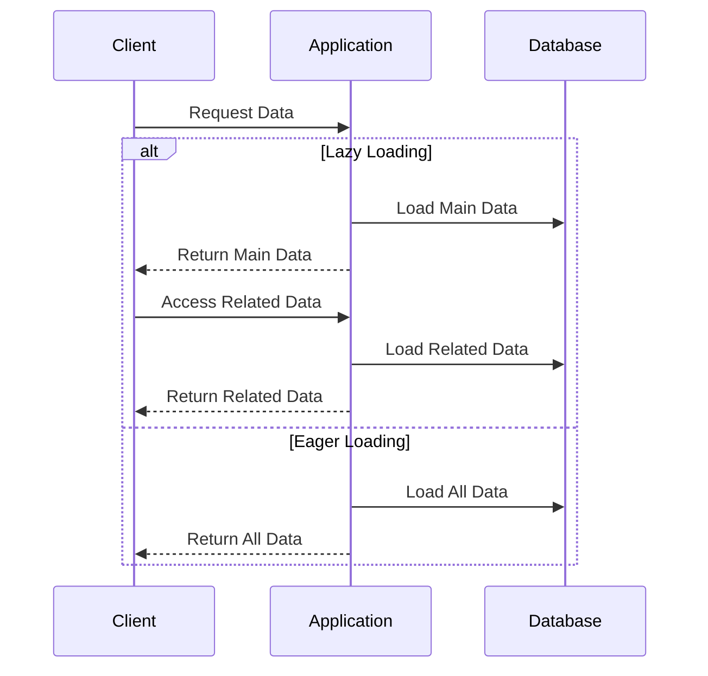

## 24.6 Lazy Loading and Eager Loading

In the realm of software development, particularly when dealing with databases and large datasets, the concepts of Lazy Loading and Eager Loading play a crucial role in optimizing performance. These patterns help manage how and when data is loaded into memory, impacting both the speed and efficiency of applications. In this section, we will delve into these two patterns, exploring their definitions, implementations, and best practices in PHP.

### Lazy Loading

**Lazy Loading** is a design pattern that defers the initialization of an object until it is actually needed. This can significantly reduce the initial loading time and memory usage of an application, as resources are only allocated when required.

#### Key Concepts of Lazy Loading

- **Deferred Initialization**: Objects or data are not loaded until they are explicitly accessed.
- **Memory Efficiency**: By loading only the necessary data, memory usage is minimized.
- **Improved Performance**: Initial load times are reduced, as unnecessary data is not loaded upfront.

#### Implementing Lazy Loading in PHP

Lazy Loading can be implemented in various ways in PHP, depending on the context and requirements. Here are some common approaches:

1. **Virtual Proxy**: A placeholder object is used to represent the real object. The real object is only loaded when a method is called on the proxy.

```php
class Image {
    private $filename;
    private $data;

    public function __construct($filename) {
        $this->filename = $filename;
    }

    public function display() {
        if ($this->data === null) {
            $this->data = file_get_contents($this->filename);
        }
        echo $this->data;
    }
}

// Usage
$image = new Image('path/to/image.jpg');
// The image data is not loaded until display() is called
$image->display();
```

2. **Value Holder**: A wrapper that holds the real object and initializes it on demand.

```php
class ValueHolder {
    private $realObject;
    private $initializer;

    public function __construct(callable $initializer) {
        $this->initializer = $initializer;
    }

    public function getRealObject() {
        if ($this->realObject === null) {
            $this->realObject = ($this->initializer)();
        }
        return $this->realObject;
    }
}

// Usage
$holder = new ValueHolder(function() {
    return new ExpensiveObject();
});
$realObject = $holder->getRealObject();
```

3. **Lazy Collection**: A collection that loads its elements on demand.

```php
class LazyCollection implements Iterator {
    private $items;
    private $loaded = false;

    public function __construct($items) {
        $this->items = $items;
    }

    private function load() {
        if (!$this->loaded) {
            // Simulate loading from a database
            $this->items = array_map(function($item) {
                return "Loaded: $item";
            }, $this->items);
            $this->loaded = true;
        }
    }

    public function current() {
        $this->load();
        return current($this->items);
    }

    public function next() {
        next($this->items);
    }

    public function key() {
        return key($this->items);
    }

    public function valid() {
        return key($this->items) !== null;
    }

    public function rewind() {
        reset($this->items);
    }
}

// Usage
$collection = new LazyCollection(['item1', 'item2', 'item3']);
foreach ($collection as $item) {
    echo $item . PHP_EOL;
}
```

#### Advantages of Lazy Loading

- **Reduced Memory Usage**: Only necessary data is loaded, saving memory.
- **Faster Initial Load**: Applications start faster as they load only essential data.
- **Scalability**: Applications can handle larger datasets more efficiently.

#### Disadvantages of Lazy Loading

- **Complexity**: Implementing lazy loading can add complexity to the codebase.
- **Delayed Errors**: Errors may occur later in the execution when data is accessed.
- **Performance Overhead**: Accessing data may be slower due to the additional logic required to load it.

### Eager Loading

**Eager Loading** is the opposite of Lazy Loading. It involves loading all the necessary data upfront, which can prevent multiple database calls and improve performance in certain scenarios.

#### Key Concepts of Eager Loading

- **Immediate Initialization**: All required data is loaded at once.
- **Avoidance of N+1 Problem**: By loading related data in a single query, multiple database calls are avoided.
- **Predictable Performance**: Since all data is loaded upfront, performance is more predictable.

#### Implementing Eager Loading in PHP

Eager Loading is often used in conjunction with Object-Relational Mapping (ORM) tools, such as Doctrine, to load related entities in a single query.

1. **Using Doctrine ORM**: Doctrine provides fetching strategies to control how related entities are loaded.

```php
use Doctrine\ORM\Tools\Setup;
use Doctrine\ORM\EntityManager;

// Configure Doctrine
$config = Setup::createAnnotationMetadataConfiguration([__DIR__."/src"], true);
$entityManager = EntityManager::create($conn, $config);

// Eager Loading Example
$query = $entityManager->createQuery('SELECT u, p FROM User u JOIN u.profile p');
$users = $query->getResult();
```

2. **Manual Eager Loading**: Manually load related data by crafting SQL queries that join tables.

```php
// Eager loading with a manual SQL query
$sql = "SELECT users.*, profiles.* FROM users JOIN profiles ON users.id = profiles.user_id";
$result = $db->query($sql);
while ($row = $result->fetch_assoc()) {
    // Process the result
}
```

#### Advantages of Eager Loading

- **Reduced Database Calls**: Related data is loaded in a single query, reducing the number of database calls.
- **Simplified Code**: Code can be simpler as all data is available upfront.
- **Improved Performance**: In scenarios where all data is needed, eager loading can improve performance.

#### Disadvantages of Eager Loading

- **Increased Memory Usage**: Loading all data upfront can consume more memory.
- **Slower Initial Load**: Applications may take longer to start as all data is loaded at once.
- **Over-fetching**: Unnecessary data may be loaded, leading to inefficiencies.

### Implementation in ORM

Object-Relational Mapping (ORM) tools like Doctrine provide built-in support for both Lazy Loading and Eager Loading. These tools allow developers to specify fetching strategies that control how related entities are loaded.

#### Doctrine ORM Fetching Strategies

Doctrine offers several fetching strategies to manage how data is loaded:

- **LAZY**: Related entities are loaded on demand.
- **EAGER**: Related entities are loaded immediately.
- **EXTRA_LAZY**: A variant of lazy loading that optimizes collection operations.

For more information, refer to the [Doctrine ORM Fetching Strategies](https://www.doctrine-project.org/projects/doctrine-orm/en/latest/reference/working-with-associations.html#fetching-strategies).

### Choosing Between Lazy Loading and Eager Loading

The choice between Lazy Loading and Eager Loading depends on the specific requirements and constraints of your application. Consider the following factors:

- **Data Access Patterns**: If related data is frequently accessed, eager loading may be more efficient.
- **Memory Constraints**: If memory usage is a concern, lazy loading can help reduce the footprint.
- **Performance Requirements**: Analyze the trade-offs between initial load time and runtime performance.

### Visualizing Lazy Loading and Eager Loading

To better understand the differences between Lazy Loading and Eager Loading, let's visualize these concepts using a sequence diagram.



### Try It Yourself

Experiment with the code examples provided in this section. Try modifying the Lazy Loading implementation to see how it affects performance. Similarly, adjust the Eager Loading queries to include or exclude certain data and observe the impact on memory usage and load times.

### Knowledge Check

- What are the main differences between Lazy Loading and Eager Loading?
- How can Lazy Loading improve application performance?
- What are the potential drawbacks of using Eager Loading?
- How does Doctrine ORM support Lazy and Eager Loading?

### Conclusion

Lazy Loading and Eager Loading are powerful patterns for managing data loading in PHP applications. By understanding and applying these patterns, you can optimize performance, reduce memory usage, and improve the overall efficiency of your applications. Remember, the choice between these patterns should be guided by your application's specific needs and constraints.

## Quiz: Lazy Loading and Eager Loading



### What is Lazy Loading?

- [x] A design pattern that defers object initialization until needed.
- [ ] A pattern that loads all data upfront.
- [ ] A method to increase memory usage.
- [ ] A technique to speed up database queries.

> **Explanation:** Lazy Loading defers the initialization of an object until it is actually needed, reducing initial loading time and memory usage.

### What is Eager Loading?

- [x] A pattern that loads all required data upfront.
- [ ] A method to delay data loading.
- [ ] A technique to reduce memory usage.
- [ ] A design pattern that defers object initialization.

> **Explanation:** Eager Loading involves loading all the necessary data upfront, which can prevent multiple database calls and improve performance.

### Which ORM feature helps control loading strategies?

- [x] Doctrine's fetch strategies.
- [ ] PHP's built-in functions.
- [ ] JavaScript libraries.
- [ ] HTML attributes.

> **Explanation:** Doctrine ORM provides fetching strategies to control how related entities are loaded, supporting both Lazy and Eager Loading.

### What is a potential disadvantage of Lazy Loading?

- [x] Delayed errors may occur when data is accessed.
- [ ] Increased memory usage.
- [ ] Slower initial load times.
- [ ] Over-fetching of data.

> **Explanation:** Lazy Loading can lead to delayed errors, as data is only loaded when accessed, which may reveal issues later in execution.

### What is a potential disadvantage of Eager Loading?

- [x] Increased memory usage.
- [ ] Delayed errors.
- [ ] Faster initial load times.
- [ ] Under-fetching of data.

> **Explanation:** Eager Loading can consume more memory as all data is loaded upfront, which may not be necessary for all applications.

### How does Lazy Loading affect memory usage?

- [x] It reduces memory usage by loading only necessary data.
- [ ] It increases memory usage by loading all data.
- [ ] It has no impact on memory usage.
- [ ] It doubles memory usage.

> **Explanation:** Lazy Loading reduces memory usage by deferring the loading of data until it is needed, thus only loading necessary data.

### How does Eager Loading affect database calls?

- [x] It reduces the number of database calls by loading related data in a single query.
- [ ] It increases the number of database calls.
- [ ] It has no impact on database calls.
- [ ] It doubles the number of database calls.

> **Explanation:** Eager Loading reduces the number of database calls by loading related data in a single query, avoiding the N+1 problem.

### Which pattern is more suitable for applications with frequent data access?

- [x] Eager Loading.
- [ ] Lazy Loading.
- [ ] Both are equally suitable.
- [ ] Neither is suitable.

> **Explanation:** Eager Loading is more suitable for applications where related data is frequently accessed, as it loads all necessary data upfront.

### What is the N+1 problem?

- [x] A performance issue where multiple database calls are made for related data.
- [ ] A memory usage problem.
- [ ] A concurrency issue.
- [ ] A security vulnerability.

> **Explanation:** The N+1 problem is a performance issue where multiple database calls are made for related data, which Eager Loading can help prevent.

### True or False: Lazy Loading always improves application performance.

- [ ] True
- [x] False

> **Explanation:** Lazy Loading does not always improve performance; it depends on the application's specific data access patterns and requirements.



Remember, this is just the beginning. As you progress, you'll build more complex and interactive applications. Keep experimenting, stay curious, and enjoy the journey!
