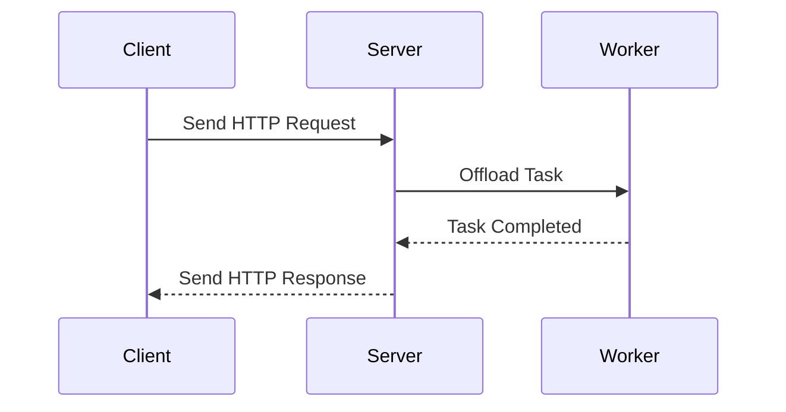

## 24.7 Asynchronous Processing for Performance

In the realm of web development, performance is a critical factor that can significantly influence user experience and satisfaction. Asynchronous processing is a powerful technique that can help improve the performance and responsiveness of PHP applications. By offloading long-running tasks to background jobs and utilizing asynchronous libraries, developers can ensure that their applications remain responsive and efficient.

### Background Jobs

Background jobs are tasks that are executed outside the main application flow. These tasks are typically long-running or resource-intensive and can be offloaded to job queues to prevent them from blocking the main application thread. Common examples of background jobs include sending emails, generating reports, processing images, and performing data analysis.

#### Implementing Background Jobs in PHP

To implement background jobs in PHP, you can use job queue systems like RabbitMQ, Beanstalkd, or Redis. These systems allow you to enqueue tasks and process them asynchronously using worker processes.

Here's a simple example of how you might implement a background job using Redis and a PHP library like `php-resque`:

```php
<?php

require 'vendor/autoload.php';

use Resque;

// Enqueue a job
Resque::enqueue('default', 'SendEmailJob', ['email' => 'user@example.com']);

class SendEmailJob
{
    public function perform()
    {
        // Simulate sending an email
        echo "Sending email to " . $this->args['email'] . "\n";
        // Actual email sending logic here
    }
}
```

In this example, we enqueue a job to send an email. The `SendEmailJob` class contains the logic for sending the email, which will be executed by a worker process.

#### Benefits of Background Jobs

- **Improved Responsiveness:** By offloading long-running tasks to background jobs, the main application can remain responsive to user interactions.
- **Scalability:** Background jobs can be processed by multiple worker processes, allowing the system to scale horizontally.
- **Resource Utilization:** Background jobs can be scheduled to run during off-peak hours, optimizing resource utilization.

### Asynchronous Libraries

Asynchronous libraries in PHP enable non-blocking, event-driven programming, allowing applications to handle multiple tasks concurrently without waiting for each task to complete before starting the next one.

#### ReactPHP

ReactPHP is a popular library for building non-blocking, event-driven applications in PHP. It provides an event loop and a set of components for handling asynchronous I/O operations.

- **Event Loop:** The core of ReactPHP is its event loop, which continuously checks for events and executes callbacks when events occur.
- **Components:** ReactPHP includes components for handling streams, sockets, HTTP requests, and more.

Here's a simple example of a ReactPHP application that creates an HTTP server:

```php
<?php

require 'vendor/autoload.php';

use React\Http\Server;
use React\Http\Message\Response;
use React\EventLoop\Factory;

$loop = Factory::create();

$server = new Server(function ($request) {
    return new Response(200, ['Content-Type' => 'text/plain'], "Hello, World!\n");
});

$socket = new React\Socket\Server('127.0.0.1:8080', $loop);
$server->listen($socket);

echo "Server running at http://127.0.0.1:8080\n";

$loop->run();
```

In this example, we create a simple HTTP server that responds with "Hello, World!" to every request. The server runs on an event loop, allowing it to handle multiple requests concurrently.

#### Swoole

Swoole is a high-performance network framework for PHP that provides built-in support for asynchronous I/O operations. It is designed to enhance the performance of PHP applications by providing features like coroutines, asynchronous I/O, and a built-in HTTP server.

- **Coroutines:** Swoole supports coroutines, which allow you to write asynchronous code in a synchronous style.
- **Asynchronous I/O:** Swoole provides asynchronous APIs for handling I/O operations, enabling non-blocking network communication.

Here's an example of a simple HTTP server using Swoole:

```php
<?php

$server = new Swoole\Http\Server("127.0.0.1", 9501);

$server->on("request", function ($request, $response) {
    $response->header("Content-Type", "text/plain");
    $response->end("Hello, Swoole!\n");
});

$server->start();
```

In this example, we create an HTTP server using Swoole that responds with "Hello, Swoole!" to every request. The server is capable of handling thousands of concurrent connections efficiently.

### Benefits of Asynchronous Processing

- **Improved Responsiveness:** Asynchronous processing allows applications to handle multiple tasks concurrently, improving responsiveness and user experience.
- **Better Resource Utilization:** By utilizing non-blocking I/O operations, asynchronous processing can make better use of system resources.
- **Scalability:** Asynchronous applications can handle a large number of concurrent connections, making them suitable for high-traffic environments.

### Visualizing Asynchronous Processing

To better understand how asynchronous processing works, let's visualize the flow of an asynchronous HTTP server using a sequence diagram.



In this diagram, the client sends an HTTP request to the server. The server offloads the task to a worker process, allowing it to handle other requests concurrently. Once the task is completed, the worker notifies the server, which then sends the response back to the client.

### Try It Yourself

To get hands-on experience with asynchronous processing in PHP, try modifying the code examples provided above. Experiment with different configurations and observe how they affect the performance and responsiveness of your application.

- **Modify the ReactPHP server** to handle different types of requests and responses.
- **Experiment with Swoole's coroutine support** to see how it simplifies asynchronous code.
- **Implement a background job system** using a different job queue library, such as Beanstalkd or RabbitMQ.

### Knowledge Check

- **What are the benefits of using background jobs in PHP applications?**
- **How does ReactPHP enable asynchronous processing in PHP?**
- **What features does Swoole provide to enhance PHP application performance?**

### Summary

Asynchronous processing is a powerful technique for improving the performance and responsiveness of PHP applications. By offloading long-running tasks to background jobs and utilizing asynchronous libraries like ReactPHP and Swoole, developers can build applications that are more efficient and scalable. Remember, this is just the beginning. As you progress, you'll discover more advanced techniques and tools for optimizing PHP applications. Keep experimenting, stay curious, and enjoy the journey!

## Quiz: Asynchronous Processing for Performance



### What is the primary benefit of using background jobs in PHP applications?

- [x] Improved responsiveness
- [ ] Increased complexity
- [ ] Reduced scalability
- [ ] Higher resource consumption

> **Explanation:** Background jobs improve responsiveness by offloading long-running tasks from the main application thread.

### Which PHP library is known for enabling non-blocking, event-driven programming?

- [x] ReactPHP
- [ ] Laravel
- [ ] Symfony
- [ ] CodeIgniter

> **Explanation:** ReactPHP is a library that provides non-blocking, event-driven programming capabilities in PHP.

### What feature does Swoole provide to simplify asynchronous code?

- [x] Coroutines
- [ ] Middleware
- [ ] Templating
- [ ] ORM

> **Explanation:** Swoole supports coroutines, which allow developers to write asynchronous code in a synchronous style.

### How does asynchronous processing improve resource utilization?

- [x] By utilizing non-blocking I/O operations
- [ ] By increasing server load
- [ ] By reducing the number of connections
- [ ] By using more memory

> **Explanation:** Asynchronous processing uses non-blocking I/O operations to make better use of system resources.

### What is the role of the event loop in ReactPHP?

- [x] To continuously check for events and execute callbacks
- [ ] To manage database connections
- [ ] To render HTML templates
- [ ] To handle user authentication

> **Explanation:** The event loop in ReactPHP continuously checks for events and executes callbacks when events occur.

### Which of the following is a common use case for background jobs?

- [x] Sending emails
- [ ] Rendering HTML
- [ ] User authentication
- [ ] CSS styling

> **Explanation:** Sending emails is a common use case for background jobs, as it can be a long-running task.

### What type of server does Swoole provide?

- [x] Built-in HTTP server
- [ ] FTP server
- [ ] SMTP server
- [ ] DNS server

> **Explanation:** Swoole provides a built-in HTTP server for handling web requests.

### How can asynchronous processing enhance scalability?

- [x] By handling a large number of concurrent connections
- [ ] By reducing server capacity
- [ ] By limiting the number of users
- [ ] By increasing response time

> **Explanation:** Asynchronous processing can handle a large number of concurrent connections, enhancing scalability.

### What is a key advantage of using job queue systems like RabbitMQ?

- [x] They allow tasks to be processed asynchronously
- [ ] They increase application complexity
- [ ] They reduce application performance
- [ ] They limit the number of tasks

> **Explanation:** Job queue systems like RabbitMQ allow tasks to be processed asynchronously, improving application performance.

### True or False: Asynchronous processing can only be used for network operations.

- [ ] True
- [x] False

> **Explanation:** Asynchronous processing can be used for various tasks, not just network operations, including file I/O and database queries.


