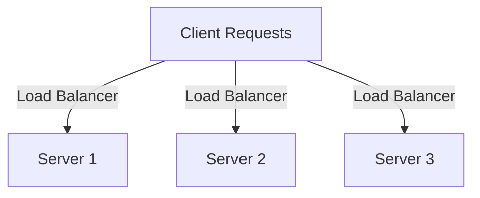
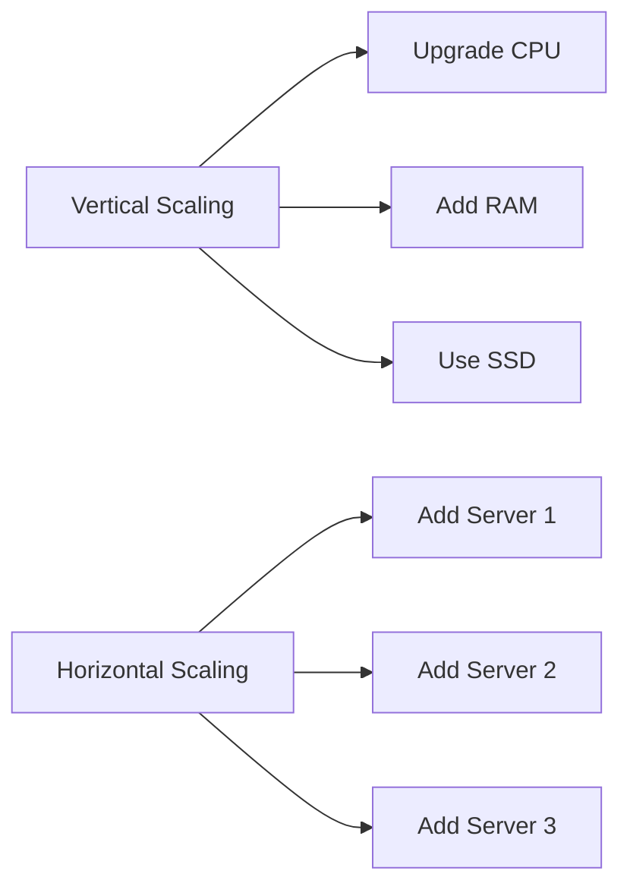

## 24.8 Scaling PHP Applications Horizontally and Vertically

As PHP applications grow in complexity and user base, ensuring they can handle increased load and maintain performance becomes crucial. Scaling is the process of adjusting resources to meet demand. In this section, we will explore two primary scaling strategies: vertical and horizontal scaling. We'll also delve into related concepts such as load balancing, stateless applications, and session management.

### Understanding Scaling

Before diving into the specifics of vertical and horizontal scaling, let's clarify what scaling means in the context of web applications. Scaling involves increasing the capacity of your application to handle more requests, users, or data. This can be achieved by either enhancing the capabilities of existing resources (vertical scaling) or adding more resources (horizontal scaling).

### Vertical Scaling

Vertical scaling, also known as "scaling up," involves upgrading the hardware resources of a single server. This can include increasing CPU power, adding more RAM, or using faster storage solutions. Vertical scaling is often the first step in improving application performance due to its simplicity.

#### Advantages of Vertical Scaling

- **Simplicity**: Upgrading a single server is straightforward and requires minimal changes to the application architecture.
- **No Code Changes**: Typically, no modifications to the application code are necessary.
- **Immediate Performance Boost**: Enhanced hardware resources can lead to immediate improvements in application performance.

#### Disadvantages of Vertical Scaling

- **Limited by Hardware**: There's a physical limit to how much you can upgrade a single server.
- **Single Point of Failure**: Relying on one server increases the risk of downtime if that server fails.
- **Cost**: High-performance hardware can be expensive.

#### Implementing Vertical Scaling

To implement vertical scaling, consider the following steps:

1. **Assess Current Resource Usage**: Use monitoring tools to identify bottlenecks in CPU, memory, or disk usage.
2. **Upgrade Hardware**: Based on your assessment, upgrade the necessary components (e.g., CPU, RAM, SSD).
3. **Optimize Software Configuration**: Adjust server configurations to make the best use of new resources (e.g., PHP-FPM settings, database configurations).

### Horizontal Scaling

Horizontal scaling, or "scaling out," involves adding more servers to distribute the load. This approach is more complex but offers greater flexibility and resilience.

#### Advantages of Horizontal Scaling

- **Scalability**: Easily add more servers to handle increased load.
- **Redundancy**: Multiple servers reduce the risk of downtime.
- **Cost-Effective**: Use commodity hardware instead of expensive high-performance servers.

#### Disadvantages of Horizontal Scaling

- **Complexity**: Requires changes to application architecture and infrastructure.
- **Session Management**: Handling user sessions across multiple servers can be challenging.
- **Data Consistency**: Ensuring data consistency across servers requires careful planning.

#### Implementing Horizontal Scaling

To implement horizontal scaling, follow these steps:

1. **Design for Statelessness**: Ensure your application can run on multiple servers without relying on local state.
2. **Use Load Balancers**: Distribute incoming requests across servers using load balancers like Nginx or HAProxy.
3. **Shared Session Storage**: Store sessions in a shared storage solution like Redis or a database.
4. **Database Scaling**: Consider database replication or sharding to handle increased data load.

### Load Balancing

Load balancing is a critical component of horizontal scaling. It involves distributing incoming network traffic across multiple servers to ensure no single server becomes a bottleneck.

#### Types of Load Balancers

- **Hardware Load Balancers**: Dedicated devices that provide high performance and reliability.
- **Software Load Balancers**: Applications like Nginx, HAProxy, or Apache that run on standard hardware.

#### Implementing Load Balancing

1. **Choose a Load Balancer**: Select a load balancer that fits your needs and budget.
2. **Configure Load Balancer**: Set up rules to distribute traffic based on server load, geographic location, or other criteria.
3. **Monitor Performance**: Continuously monitor load balancer performance to ensure even distribution of traffic.



*Diagram: Load Balancer Distributing Traffic Across Multiple Servers*

### Stateless Applications

A stateless application does not store any data locally between requests. This design is essential for horizontal scaling, as it allows requests to be handled by any server in the cluster.

#### Benefits of Stateless Applications

- **Scalability**: Easily add or remove servers without affecting application state.
- **Resilience**: Failures in one server do not affect the overall application.

#### Designing Stateless Applications

1. **Externalize State**: Store session data, user preferences, and other stateful information in external storage like databases or caches.
2. **Use Stateless Protocols**: Design APIs and services to be stateless, using HTTP headers or tokens for authentication and state management.

### Session Management

In a horizontally scaled environment, managing user sessions becomes more complex. Sessions must be accessible to all servers in the cluster.

#### Strategies for Session Management

- **Shared Session Storage**: Use a centralized storage solution like Redis or Memcached to store session data.
- **Database-Backed Sessions**: Store session data in a database accessible to all servers.
- **Token-Based Authentication**: Use tokens (e.g., JWT) to authenticate users without storing session data on the server.

```php
// Example: Storing Sessions in Redis

session_start([
    'save_handler' => 'redis',
    'save_path' => 'tcp://127.0.0.1:6379'
]);

// Store data in session
$_SESSION['user_id'] = $userId;

// Retrieve data from session
echo $_SESSION['user_id'];
```

*Code Example: Configuring PHP Sessions to Use Redis for Storage*

### Try It Yourself

Experiment with the following modifications to the code example:

- Change the Redis server address to a different IP or port.
- Store additional session data and retrieve it in another script.
- Implement token-based authentication and compare it with session-based management.

### Visualizing Scaling Strategies

Below is a diagram illustrating the differences between vertical and horizontal scaling:



*Diagram: Vertical vs. Horizontal Scaling Strategies*

### References and Further Reading

- [PHP Documentation](https://www.php.net/docs.php)
- [Redis Documentation](https://redis.io/documentation)
- [Nginx Load Balancing](https://docs.nginx.com/nginx/admin-guide/load-balancer/http-load-balancer/)
- [HAProxy Documentation](http://www.haproxy.org/#docs)

### Knowledge Check

- What are the main differences between vertical and horizontal scaling?
- How does load balancing contribute to horizontal scaling?
- Why is it important to design applications to be stateless when scaling horizontally?

### Embrace the Journey

Scaling PHP applications is a journey that involves understanding your application's needs and choosing the right strategies to meet them. Remember, this is just the beginning. As you progress, you'll build more robust and scalable applications. Keep experimenting, stay curious, and enjoy the journey!

## Quiz: Scaling PHP Applications Horizontally and Vertically



### What is vertical scaling?

- [x] Upgrading server hardware resources.
- [ ] Distributing load across multiple servers.
- [ ] Using load balancers.
- [ ] Storing sessions in shared storage.

> **Explanation:** Vertical scaling involves upgrading the hardware resources of a single server, such as CPU, RAM, or storage.

### What is horizontal scaling?

- [ ] Upgrading server hardware resources.
- [x] Distributing load across multiple servers.
- [ ] Using load balancers.
- [ ] Storing sessions in shared storage.

> **Explanation:** Horizontal scaling involves adding more servers to distribute the load and handle increased traffic.

### Which of the following is a benefit of stateless applications?

- [x] Scalability
- [ ] Complexity
- [ ] Single point of failure
- [ ] High cost

> **Explanation:** Stateless applications can easily scale as they do not rely on local state, allowing requests to be handled by any server in the cluster.

### What is the role of a load balancer in horizontal scaling?

- [ ] Upgrade server hardware.
- [x] Distribute incoming requests across multiple servers.
- [ ] Store sessions in shared storage.
- [ ] Use tokens for authentication.

> **Explanation:** Load balancers distribute incoming requests across multiple servers to ensure no single server becomes a bottleneck.

### How can sessions be managed in a horizontally scaled environment?

- [x] Using shared session storage
- [ ] Storing sessions locally
- [x] Using token-based authentication
- [ ] Using hardware load balancers

> **Explanation:** In a horizontally scaled environment, sessions can be managed using shared storage solutions like Redis or through token-based authentication.

### What is a disadvantage of vertical scaling?

- [x] Limited by hardware
- [ ] Complexity
- [ ] Scalability
- [ ] Redundancy

> **Explanation:** Vertical scaling is limited by the physical constraints of hardware, making it less scalable than horizontal scaling.

### What is a disadvantage of horizontal scaling?

- [ ] Simplicity
- [x] Complexity
- [ ] Immediate performance boost
- [x] Session management challenges

> **Explanation:** Horizontal scaling introduces complexity in architecture and session management, as it involves multiple servers.

### Which of the following is a type of load balancer?

- [x] Nginx
- [ ] Redis
- [ ] PHP-FPM
- [ ] MySQL

> **Explanation:** Nginx is a software load balancer that can distribute traffic across multiple servers.

### What is the purpose of using Redis in session management?

- [x] To store sessions in a shared storage accessible by all servers.
- [ ] To distribute load across servers.
- [ ] To upgrade server hardware.
- [ ] To use tokens for authentication.

> **Explanation:** Redis is used to store sessions in a shared storage, allowing all servers in a horizontally scaled environment to access session data.

### True or False: Horizontal scaling is limited by the physical constraints of hardware.

- [ ] True
- [x] False

> **Explanation:** Horizontal scaling is not limited by hardware constraints as it involves adding more servers to handle increased load.


