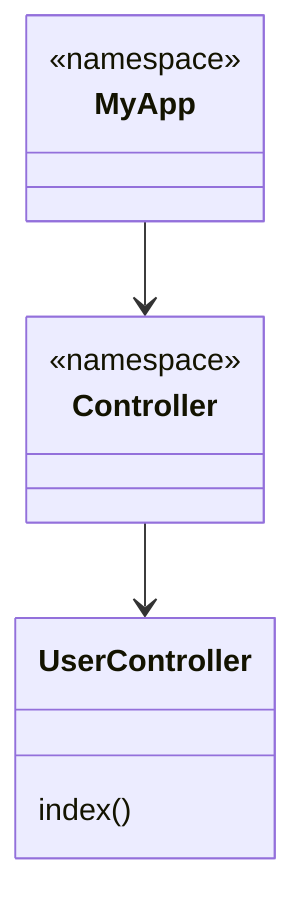

## 24.9 Optimizing Autoloading and Namespaces

In modern PHP development, optimizing autoloading and namespaces is crucial for building efficient, maintainable, and scalable applications. This section will guide you through the best practices for autoloading, the importance of namespaces, and how to leverage Composer for optimal performance.

### Understanding Autoloading in PHP

Autoloading is a mechanism that allows PHP to automatically load classes, interfaces, and traits from files when they are needed, without requiring explicit `include` or `require` statements. This feature simplifies code management and enhances performance by loading only the necessary components.

#### Benefits of Autoloading

- **Reduced Boilerplate Code:** Eliminates the need for manual `include` or `require` statements.
- **Improved Performance:** Loads classes only when needed, reducing memory usage.
- **Enhanced Organization:** Encourages a structured file and directory layout.
- **Ease of Maintenance:** Simplifies updates and refactoring by centralizing class loading logic.

### Composer Autoloading

Composer is a dependency manager for PHP that provides a robust autoloading mechanism. It supports various autoloading strategies, including PSR-4, PSR-0, classmap, and files.

#### PSR-4 Autoloading

PSR-4 is a PHP Standard Recommendation that defines a specification for autoloading classes from file paths. It is the most commonly used autoloading standard in modern PHP applications.

- **Namespace to Directory Mapping:** Maps namespaces to directory paths, allowing for a clean and organized file structure.
- **Class Name to File Name Mapping:** Ensures that the fully qualified class name corresponds to the file path.

**Example:**

```json
{
    "autoload": {
        "psr-4": {
            "App\\": "src/"
        }
    }
}
```

In this example, the namespace `App` is mapped to the `src/` directory. A class `App\Controller\HomeController` would be located at `src/Controller/HomeController.php`.

#### Optimizing Composer Autoloading

To optimize Composer autoloading, you can generate an optimized autoloader using the following command:

```bash
composer dump-autoload -o
```

This command creates a class map of all classes in your project, improving the speed of class resolution.

#### Classmap Autoloading

Classmap autoloading is another strategy provided by Composer. It involves scanning specified directories and generating a map of all classes and their file paths.

**Example:**

```json
{
    "autoload": {
        "classmap": [
            "database/seeds",
            "database/factories"
        ]
    }
}
```

Classmap autoloading is beneficial for directories that do not follow PSR-4 standards or contain classes with unconventional naming.

### PSR-4 Compliance

Adhering to PSR-4 standards ensures efficient autoloading and a consistent codebase. The PSR-4 standard requires:

- **Namespace Declaration:** Each class must declare a namespace that matches its directory structure.
- **File Naming:** The file name must match the class name, including case sensitivity.
- **Directory Structure:** The directory structure must reflect the namespace hierarchy.

**Link:** [PSR-4: Autoloader](https://www.php-fig.org/psr/psr-4/)

### Namespaces in PHP

Namespaces in PHP provide a way to encapsulate items such as classes, interfaces, functions, and constants. They help avoid name collisions and organize code into logical groups.

#### Benefits of Using Namespaces

- **Avoiding Name Collisions:** Prevents conflicts between classes or functions with the same name.
- **Improved Code Organization:** Groups related classes and functions together.
- **Enhanced Readability:** Makes it clear which classes belong to which part of the application.

#### Declaring and Using Namespaces

To declare a namespace, use the `namespace` keyword at the top of your PHP file:

```php
<?php
namespace App\Controller;

class HomeController {
    // Class code here
}
```

To use a class from a namespace, you can either use the fully qualified name or import it with the `use` keyword:

```php
<?php
use App\Controller\HomeController;

$controller = new HomeController();
```

### Best Practices for Autoloading and Namespaces

1. **Follow PSR-4 Standards:** Ensure your project adheres to PSR-4 for consistent and efficient autoloading.
2. **Use Composer for Autoloading:** Leverage Composer's autoloading capabilities to manage dependencies and optimize performance.
3. **Organize Code with Namespaces:** Use namespaces to logically group related classes and avoid name collisions.
4. **Optimize Autoloading:** Regularly run `composer dump-autoload -o` to generate optimized class maps.
5. **Keep Directory Structure Clean:** Maintain a directory structure that reflects your namespace hierarchy for clarity and maintainability.

### Code Examples

Let's explore some code examples to illustrate these concepts.

#### Example 1: PSR-4 Autoloading with Composer

```json
{
    "autoload": {
        "psr-4": {
            "MyApp\\": "src/"
        }
    }
}
```

```php
<?php
// src/Controller/UserController.php
namespace MyApp\Controller;

class UserController {
    public function index() {
        echo "User Controller Index";
    }
}
```

```php
<?php
// index.php
require 'vendor/autoload.php';

use MyApp\Controller\UserController;

$controller = new UserController();
$controller->index();
```

#### Example 2: Classmap Autoloading

```json
{
    "autoload": {
        "classmap": [
            "lib/",
            "models/"
        ]
    }
}
```

```php
<?php
// lib/LegacyClass.php
class LegacyClass {
    public function doSomething() {
        echo "Doing something!";
    }
}
```

```php
<?php
// index.php
require 'vendor/autoload.php';

$legacy = new LegacyClass();
$legacy->doSomething();
```

### Visualizing Autoloading and Namespaces

To better understand the relationship between namespaces and directory structures, let's visualize it using a class diagram.



In this diagram, `MyApp` is the root namespace, `Controller` is a sub-namespace, and `UserController` is a class within the `Controller` namespace.

### Try It Yourself

Experiment with the code examples provided. Try modifying the namespace or directory structure and observe how it affects autoloading. You can also explore different autoloading strategies in Composer to see their impact on performance.

### Knowledge Check

- Explain the benefits of using namespaces in PHP.
- Demonstrate how to declare and use a namespace in a PHP file.
- Provide an example of PSR-4 autoloading configuration in Composer.
- Describe the difference between PSR-4 and classmap autoloading.

### Conclusion

Optimizing autoloading and namespaces is a fundamental aspect of modern PHP development. By adhering to best practices and leveraging Composer's capabilities, you can enhance the performance and maintainability of your applications. Remember, this is just the beginning. As you progress, you'll build more complex and interactive applications. Keep experimenting, stay curious, and enjoy the journey!

## Quiz: Optimizing Autoloading and Namespaces



### What is the primary benefit of using autoloading in PHP?

- [x] Reduces the need for manual `include` or `require` statements
- [ ] Increases the size of the application
- [ ] Decreases code readability
- [ ] Requires more memory usage

> **Explanation:** Autoloading reduces the need for manual `include` or `require` statements by automatically loading classes when they are needed.

### Which Composer command generates an optimized autoloader?

- [x] `composer dump-autoload -o`
- [ ] `composer install`
- [ ] `composer update`
- [ ] `composer optimize`

> **Explanation:** The `composer dump-autoload -o` command generates an optimized autoloader by creating a class map.

### What does PSR-4 specify in PHP?

- [x] A standard for autoloading classes from file paths
- [ ] A method for database interaction
- [ ] A guideline for error handling
- [ ] A technique for caching

> **Explanation:** PSR-4 specifies a standard for autoloading classes from file paths, ensuring a consistent and efficient autoloading process.

### How do namespaces help in PHP development?

- [x] They avoid name collisions and organize code
- [ ] They increase the complexity of the code
- [ ] They reduce the performance of the application
- [ ] They make code harder to read

> **Explanation:** Namespaces help avoid name collisions and organize code into logical groups, improving maintainability and readability.

### Which keyword is used to declare a namespace in PHP?

- [x] `namespace`
- [ ] `use`
- [ ] `class`
- [ ] `include`

> **Explanation:** The `namespace` keyword is used to declare a namespace in PHP.

### What is the purpose of the `use` keyword in PHP?

- [x] To import a class from a namespace
- [ ] To declare a new class
- [ ] To include a file
- [ ] To define a function

> **Explanation:** The `use` keyword is used to import a class from a namespace, allowing for easier reference in the code.

### What is the difference between PSR-4 and classmap autoloading?

- [x] PSR-4 maps namespaces to directories, while classmap generates a map of classes and file paths
- [ ] PSR-4 is faster than classmap autoloading
- [ ] Classmap is more efficient than PSR-4
- [ ] PSR-4 is used for legacy code only

> **Explanation:** PSR-4 maps namespaces to directories, ensuring a structured file layout, while classmap generates a map of classes and file paths for faster resolution.

### Why is it important to follow PSR-4 standards?

- [x] To ensure consistent and efficient autoloading
- [ ] To increase the complexity of the code
- [ ] To reduce application performance
- [ ] To make code harder to maintain

> **Explanation:** Following PSR-4 standards ensures consistent and efficient autoloading, improving code organization and maintainability.

### What is the role of Composer in PHP autoloading?

- [x] It provides a robust autoloading mechanism and manages dependencies
- [ ] It only manages database connections
- [ ] It is used for error handling
- [ ] It is a caching tool

> **Explanation:** Composer provides a robust autoloading mechanism and manages dependencies, simplifying PHP development.

### True or False: Namespaces in PHP can help avoid name collisions.

- [x] True
- [ ] False

> **Explanation:** True. Namespaces help avoid name collisions by encapsulating classes, interfaces, and functions within a defined scope.


