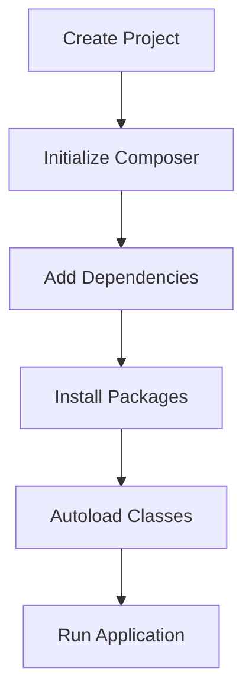

## 25.1 Utilizing Composer Packages and Libraries

In the world of PHP development, managing dependencies and libraries efficiently is crucial for building robust and maintainable applications. Composer, the de facto standard package manager for PHP, plays a pivotal role in this process. In this section, we'll delve into the intricacies of utilizing Composer packages and libraries, exploring best practices, practical examples, and the benefits Composer brings to modern PHP development.

### Introduction to Composer

Composer is a dependency manager for PHP that allows developers to declare the libraries their project depends on and manages (install/update) them for you. It is not a package manager in the same sense as Yum or Apt are. Yes, it deals with "packages" or libraries, but it manages them on a per-project basis, installing them in a directory (e.g., `vendor`) inside your project. By default, it does not install anything globally.

#### Key Features of Composer

- **Dependency Management:** Automatically handles dependencies required by your project.
- **Version Control:** Ensures compatibility by managing library versions.
- **Autoloading:** Simplifies the inclusion of classes with PSR-4 autoloading standards.
- **Packagist Integration:** Access to a vast repository of PHP packages.

### Getting Started with Composer

To start using Composer, you need to install it on your system. Follow these steps to get Composer up and running:

1. **Install Composer:**
   - Visit the [Composer website](https://getcomposer.org/) for installation instructions.
   - Use the following command to install Composer globally on your system:

     ```bash
     php -r "copy('https://getcomposer.org/installer', 'composer-setup.php');"
     php composer-setup.php
     php -r "unlink('composer-setup.php');"
     mv composer.phar /usr/local/bin/composer
     ```

2. **Verify Installation:**
   - Run `composer --version` to ensure Composer is installed correctly.

### Creating a `composer.json` File

The `composer.json` file is the heart of your Composer-managed project. It defines the dependencies your project requires and other metadata.

#### Basic Structure of `composer.json`

```json
{
    "name": "vendor/project",
    "description": "A brief description of your project",
    "require": {
        "php": ">=7.4",
        "monolog/monolog": "^2.0"
    },
    "autoload": {
        "psr-4": {
            "App\\": "src/"
        }
    }
}
```

- **name:** The package name in the format `vendor/project`.
- **description:** A short description of your project.
- **require:** Lists the dependencies and their versions.
- **autoload:** Defines the autoloading rules, typically using PSR-4.

### Managing Dependencies with Composer

Composer simplifies the process of adding, updating, and removing dependencies in your PHP projects.

#### Adding a Dependency

To add a new dependency, use the `composer require` command:

```bash
composer require guzzlehttp/guzzle
```

This command updates the `composer.json` file and installs the package in the `vendor` directory.

#### Updating Dependencies

To update all dependencies to their latest versions, run:

```bash
composer update
```

To update a specific package, specify the package name:

```bash
composer update guzzlehttp/guzzle
```

#### Removing a Dependency

To remove a package, use the `composer remove` command:

```bash
composer remove guzzlehttp/guzzle
```

### Using Packagist

Packagist is the default package repository for Composer. It hosts thousands of PHP packages that you can easily integrate into your projects.

- **Search for Packages:** Visit [Packagist](https://packagist.org/) to search for packages.
- **Package Details:** Each package page provides installation instructions, version history, and usage examples.

### Best Practices for Using Composer

To make the most of Composer, follow these best practices:

1. **Semantic Versioning:** Use semantic versioning to specify dependency versions. For example, `"monolog/monolog": "^2.0"` allows any version in the 2.x series.

2. **Lock File:** Commit the `composer.lock` file to version control to ensure consistent installations across environments.

3. **Autoloading:** Leverage Composer's autoloading capabilities to streamline class loading in your project.

4. **Environment-Specific Dependencies:** Use `require-dev` for development-only dependencies, such as testing frameworks.

5. **Security:** Regularly update dependencies to patch security vulnerabilities.

### Advanced Composer Features

Composer offers advanced features that enhance its functionality and flexibility.

#### Custom Scripts

Composer allows you to define custom scripts in the `composer.json` file, automating tasks like testing or deployment.

```json
"scripts": {
    "test": "phpunit tests"
}
```

Run the script using:

```bash
composer test
```

#### Custom Repositories

In addition to Packagist, you can define custom repositories in your `composer.json` file.

```json
"repositories": [
    {
        "type": "vcs",
        "url": "https://github.com/vendor/repository"
    }
]
```

#### Global Installation

While Composer is primarily project-based, you can install packages globally using the `global` command.

```bash
composer global require phpunit/phpunit
```

### Code Example: Using Composer in a PHP Project

Let's walk through a simple example of using Composer in a PHP project.

#### Step 1: Initialize a New Project

Create a new directory for your project and navigate into it:

```bash
mkdir my-composer-project
cd my-composer-project
```

#### Step 2: Create a `composer.json` File

Run the following command to create a `composer.json` file:

```bash
composer init
```

Follow the prompts to set up your project.

#### Step 3: Add a Dependency

Add a dependency, such as Guzzle, to your project:

```bash
composer require guzzlehttp/guzzle
```

#### Step 4: Create a PHP Script

Create a new PHP file, `index.php`, and use the Guzzle library:

```php
<?php

require 'vendor/autoload.php';

use GuzzleHttp\Client;

$client = new Client();
$response = $client->request('GET', 'https://api.github.com/repos/guzzle/guzzle');

echo $response->getBody();
```

#### Step 5: Run the Script

Execute the script using PHP:

```bash
php index.php
```

### Visualizing Composer Workflow

To better understand how Composer manages dependencies, let's visualize the workflow using a Mermaid.js diagram.



- **Create Project:** Start by creating a new PHP project.
- **Initialize Composer:** Set up Composer with a `composer.json` file.
- **Add Dependencies:** Use `composer require` to add libraries.
- **Install Packages:** Composer installs packages in the `vendor` directory.
- **Autoload Classes:** Use Composer's autoloader to include classes.
- **Run Application:** Execute your PHP application.

### Knowledge Check

Let's reinforce what we've learned with a few questions:

1. What is the primary role of Composer in PHP development?
2. How do you add a new dependency to a project using Composer?
3. Why is it important to commit the `composer.lock` file to version control?
4. What is the purpose of the `autoload` section in `composer.json`?

### Conclusion

Composer is an indispensable tool for PHP developers, streamlining the process of managing dependencies and libraries. By following best practices and leveraging Composer's powerful features, you can enhance your development workflow and build more maintainable applications. Remember, this is just the beginning. As you progress, you'll discover more advanced Composer features and techniques. Keep experimenting, stay curious, and enjoy the journey!

## Quiz: Utilizing Composer Packages and Libraries



### What is the primary purpose of Composer in PHP?

- [x] Managing dependencies
- [ ] Compiling PHP code
- [ ] Debugging PHP applications
- [ ] Optimizing database queries

> **Explanation:** Composer is a dependency manager for PHP, allowing developers to manage libraries and dependencies efficiently.

### How do you add a new dependency to a project using Composer?

- [x] composer require package/name
- [ ] composer install package/name
- [ ] composer add package/name
- [ ] composer update package/name

> **Explanation:** The `composer require` command is used to add new dependencies to a project.

### Why is it important to commit the `composer.lock` file to version control?

- [x] To ensure consistent installations across environments
- [ ] To store the source code of dependencies
- [ ] To document the project's history
- [ ] To improve application performance

> **Explanation:** Committing the `composer.lock` file ensures that all developers and environments use the same versions of dependencies.

### What is the purpose of the `autoload` section in `composer.json`?

- [x] To define class autoloading rules
- [ ] To specify the PHP version required
- [ ] To list development dependencies
- [ ] To configure database connections

> **Explanation:** The `autoload` section defines how classes should be autoloaded, typically using PSR-4 standards.

### Which command updates all dependencies to their latest versions?

- [x] composer update
- [ ] composer upgrade
- [ ] composer refresh
- [ ] composer renew

> **Explanation:** The `composer update` command updates all dependencies to their latest versions according to the constraints in `composer.json`.

### How can you install a package globally using Composer?

- [x] composer global require package/name
- [ ] composer require package/name --global
- [ ] composer install package/name --global
- [ ] composer add package/name --global

> **Explanation:** The `composer global require` command installs a package globally, making it available across all projects.

### What is Packagist?

- [x] The main repository for Composer packages
- [ ] A PHP testing framework
- [ ] A PHP web server
- [ ] A PHP code editor

> **Explanation:** Packagist is the main repository for Composer packages, hosting a wide range of PHP libraries.

### Which section in `composer.json` is used for development-only dependencies?

- [x] require-dev
- [ ] require
- [ ] autoload
- [ ] scripts

> **Explanation:** The `require-dev` section is used to specify dependencies needed only for development, such as testing frameworks.

### What is semantic versioning?

- [x] A versioning scheme that uses major, minor, and patch numbers
- [ ] A method for optimizing PHP code
- [ ] A technique for debugging applications
- [ ] A way to manage database migrations

> **Explanation:** Semantic versioning is a versioning scheme that uses major, minor, and patch numbers to indicate changes in a package.

### True or False: Composer can only be used for PHP projects.

- [x] True
- [ ] False

> **Explanation:** Composer is specifically designed for managing dependencies in PHP projects.


