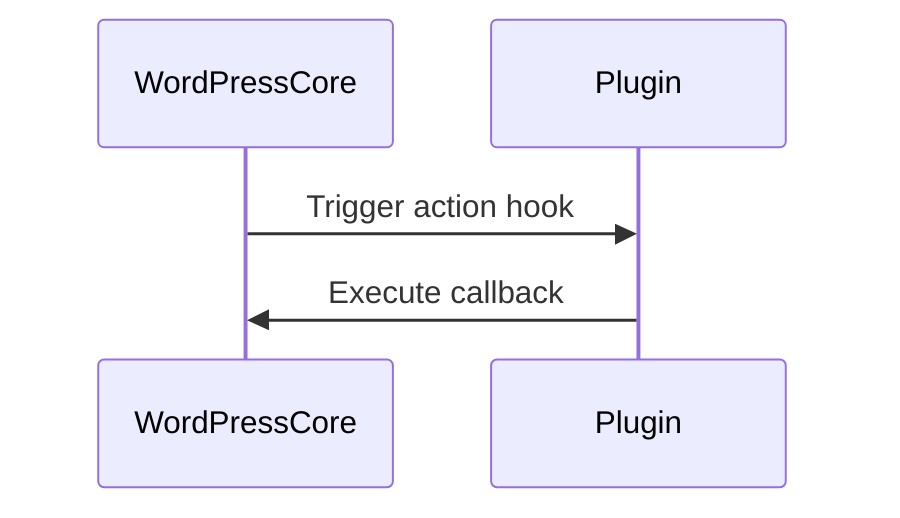
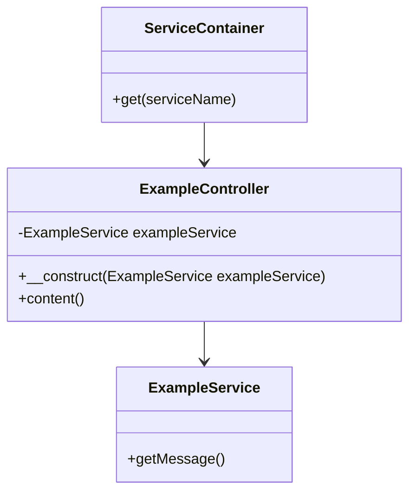

## 25.11 Design Patterns in WordPress and Drupal

In the realm of PHP development, WordPress and Drupal stand out as two of the most popular content management systems (CMS). Both platforms leverage design patterns to provide extensible, maintainable, and robust solutions. This section delves into how these CMS platforms utilize design patterns, offering insights into their architecture and best practices for developers.

### WordPress Design Patterns

WordPress is renowned for its flexibility and ease of use, largely due to its implementation of several design patterns. Let's explore some of the key patterns used in WordPress:

#### Observer Pattern: Hooks (Actions and Filters)

**Intent:** The Observer Pattern defines a one-to-many dependency between objects, allowing multiple observers to listen to and react to events or changes in the subject.

**Implementation in WordPress:** WordPress uses hooks, which are actions and filters, to implement the Observer Pattern. Hooks allow developers to modify or extend WordPress functionality without altering core files.

**Key Participants:**
- **Subject:** The WordPress core, which triggers hooks at specific points.
- **Observers:** Plugins and themes that register callbacks to these hooks.

**Sample Code Snippet:**

```php
// Adding an action hook
add_action('init', 'custom_init_function');

function custom_init_function() {
    // Code to execute during WordPress initialization
    echo 'WordPress has initialized!';
}

// Adding a filter hook
add_filter('the_content', 'modify_content');

function modify_content($content) {
    // Modify the post content
    return $content . ' - Appended by filter!';
}
```

**Design Considerations:** Hooks provide a powerful mechanism for extending WordPress, but overuse can lead to performance issues. It's essential to manage hook priorities and ensure that callbacks are efficient.

**PHP Unique Features:** WordPress's hook system is a testament to PHP's dynamic nature, allowing runtime modifications and extensions.

**Differences and Similarities:** Hooks in WordPress are similar to event listeners in JavaScript, where functions are executed in response to specific events.

#### Decorator Pattern: Plugins

**Intent:** The Decorator Pattern allows behavior to be added to individual objects, either statically or dynamically, without affecting the behavior of other objects from the same class.

**Implementation in WordPress:** Plugins in WordPress act as decorators, enabling developers to add new features or modify existing ones without altering the core codebase.

**Key Participants:**
- **Component:** The WordPress core functionality.
- **Decorator:** Plugins that extend or modify core functionality.

**Sample Code Snippet:**

```php
/*
Plugin Name: Custom Footer Message
Description: Adds a custom message to the footer.
*/

add_action('wp_footer', 'add_custom_footer_message');

function add_custom_footer_message() {
    echo '<p>Thank you for visiting our site!</p>';
}
```

**Design Considerations:** While plugins offer great flexibility, they can also introduce conflicts and performance issues if not managed properly. It's crucial to follow best practices and ensure compatibility with other plugins and themes.

**PHP Unique Features:** PHP's ability to dynamically include and execute code makes it ideal for implementing the Decorator Pattern through plugins.

**Differences and Similarities:** Plugins in WordPress are akin to middleware in other frameworks, where they can intercept and modify requests or responses.

### Drupal Design Patterns

Drupal is known for its robustness and scalability, often used for complex and large-scale applications. It leverages several design patterns to achieve this:

#### Dependency Injection and Services

**Intent:** Dependency Injection (DI) is a design pattern used to implement IoC (Inversion of Control), allowing a class to receive its dependencies from an external source rather than creating them internally.

**Implementation in Drupal:** Drupal 8 and later versions use Symfony components, including the DI container, to manage services and dependencies.

**Key Participants:**
- **Client:** The class that requires dependencies.
- **Service Container:** Manages and provides dependencies.

**Sample Code Snippet:**

```php
namespace Drupal\example_module\Controller;

use Drupal\Core\Controller\ControllerBase;
use Symfony\Component\DependencyInjection\ContainerInterface;
use Drupal\example_module\Service\ExampleService;

class ExampleController extends ControllerBase {
    protected $exampleService;

    public function __construct(ExampleService $exampleService) {
        $this->exampleService = $exampleService;
    }

    public static function create(ContainerInterface $container) {
        return new static(
            $container->get('example_module.example_service')
        );
    }

    public function content() {
        return [
            '#markup' => $this->exampleService->getMessage(),
        ];
    }
}
```

**Design Considerations:** DI promotes loose coupling and enhances testability. However, it requires careful management of service definitions and configurations.

**PHP Unique Features:** PHP's support for namespaces and interfaces facilitates the implementation of DI, allowing for organized and modular code.

**Differences and Similarities:** DI in Drupal is similar to service injection in Java Spring, where dependencies are managed by a container.

#### Repository Pattern for Database Interactions

**Intent:** The Repository Pattern abstracts the data layer, providing a collection-like interface for accessing domain objects.

**Implementation in Drupal:** Drupal uses the Repository Pattern to manage database interactions, often through the Entity API.

**Key Participants:**
- **Repository:** Manages data retrieval and persistence.
- **Entity:** Represents a domain object.

**Sample Code Snippet:**

```php
namespace Drupal\example_module\Repository;

use Drupal\Core\Entity\EntityTypeManagerInterface;
use Drupal\node\Entity\Node;

class NodeRepository {
    protected $entityTypeManager;

    public function __construct(EntityTypeManagerInterface $entityTypeManager) {
        $this->entityTypeManager = $entityTypeManager;
    }

    public function getPublishedNodes() {
        $storage = $this->entityTypeManager->getStorage('node');
        $query = $storage->getQuery()
            ->condition('status', 1)
            ->execute();
        return $storage->loadMultiple($query);
    }
}
```

**Design Considerations:** The Repository Pattern separates business logic from data access, promoting clean architecture. However, it can introduce complexity if not properly managed.

**PHP Unique Features:** PHP's dynamic nature and support for object-oriented programming make it well-suited for implementing repositories.

**Differences and Similarities:** The Repository Pattern in Drupal is similar to data access objects (DAO) in Java, where data operations are encapsulated in a separate layer.

### Best Practices for WordPress and Drupal Development

- **Follow Coding Standards:** Adhere to the coding standards of the CMS to ensure consistency and maintainability. WordPress and Drupal have well-documented coding guidelines.
- **Leverage Built-in Patterns:** Utilize the design patterns provided by the CMS for custom development. This ensures compatibility and leverages the strengths of the platform.
- **Optimize Performance:** Be mindful of performance implications when using design patterns, especially in large-scale applications.
- **Ensure Security:** Follow security best practices to protect against vulnerabilities, such as SQL injection and cross-site scripting (XSS).
- **Test Extensively:** Implement automated testing to ensure the reliability and stability of custom code.

### Visualizing Design Patterns in WordPress and Drupal

To better understand the architecture and flow of design patterns in WordPress and Drupal, let's visualize some key concepts using Mermaid.js diagrams.

#### Observer Pattern in WordPress



**Description:** This sequence diagram illustrates how WordPress core triggers an action hook, and the plugin responds by executing a callback function.

#### Dependency Injection in Drupal



**Description:** This class diagram shows the relationship between the service container, controller, and service in Drupal's DI implementation.

### Conclusion

Design patterns play a crucial role in the architecture and development of WordPress and Drupal. By understanding and leveraging these patterns, developers can create more maintainable, scalable, and robust applications. Whether you're extending WordPress with plugins or building complex applications in Drupal, design patterns provide a solid foundation for effective PHP development.

Remember, this is just the beginning. As you progress, you'll discover more patterns and techniques to enhance your development skills. Keep experimenting, stay curious, and enjoy the journey!

## Quiz: Design Patterns in WordPress and Drupal



### Which design pattern is implemented by WordPress hooks?

- [x] Observer Pattern
- [ ] Singleton Pattern
- [ ] Factory Pattern
- [ ] Strategy Pattern

> **Explanation:** WordPress hooks (actions and filters) implement the Observer Pattern by allowing plugins and themes to listen for and respond to events.

### What is the primary role of plugins in WordPress?

- [x] Decorator Pattern
- [ ] Singleton Pattern
- [ ] Factory Pattern
- [ ] Observer Pattern

> **Explanation:** Plugins in WordPress act as decorators, extending or modifying core functionality without altering the core codebase.

### How does Drupal implement Dependency Injection?

- [x] Using Symfony's service container
- [ ] Through global variables
- [ ] By hardcoding dependencies
- [ ] Using procedural code

> **Explanation:** Drupal uses Symfony's service container to manage and inject dependencies, promoting loose coupling and testability.

### What pattern does Drupal use for database interactions?

- [x] Repository Pattern
- [ ] Singleton Pattern
- [ ] Observer Pattern
- [ ] Strategy Pattern

> **Explanation:** Drupal uses the Repository Pattern to abstract database interactions, providing a collection-like interface for accessing domain objects.

### Which of the following is a best practice for WordPress and Drupal development?

- [x] Follow coding standards
- [x] Optimize performance
- [ ] Ignore security best practices
- [ ] Avoid automated testing

> **Explanation:** Following coding standards, optimizing performance, and ensuring security are best practices for WordPress and Drupal development.

### What is a key benefit of using the Observer Pattern in WordPress?

- [x] Allows dynamic extension of functionality
- [ ] Reduces code complexity
- [ ] Ensures data consistency
- [ ] Improves database performance

> **Explanation:** The Observer Pattern allows dynamic extension of functionality by enabling plugins and themes to respond to events.

### In Drupal, what is the purpose of the service container?

- [x] Manage and provide dependencies
- [ ] Store user sessions
- [ ] Handle HTTP requests
- [ ] Render templates

> **Explanation:** The service container in Drupal manages and provides dependencies to classes, facilitating Dependency Injection.

### Which pattern is similar to WordPress plugins in other frameworks?

- [x] Middleware
- [ ] Singleton
- [ ] Factory
- [ ] Observer

> **Explanation:** Plugins in WordPress are similar to middleware in other frameworks, where they can intercept and modify requests or responses.

### True or False: The Repository Pattern in Drupal is similar to data access objects (DAO) in Java.

- [x] True
- [ ] False

> **Explanation:** The Repository Pattern in Drupal is similar to data access objects (DAO) in Java, where data operations are encapsulated in a separate layer.

### What is a common pitfall when using hooks in WordPress?

- [x] Performance issues due to overuse
- [ ] Lack of flexibility
- [ ] Inability to extend functionality
- [ ] Difficulty in testing

> **Explanation:** Overuse of hooks in WordPress can lead to performance issues, so it's important to manage hook priorities and ensure efficient callbacks.


