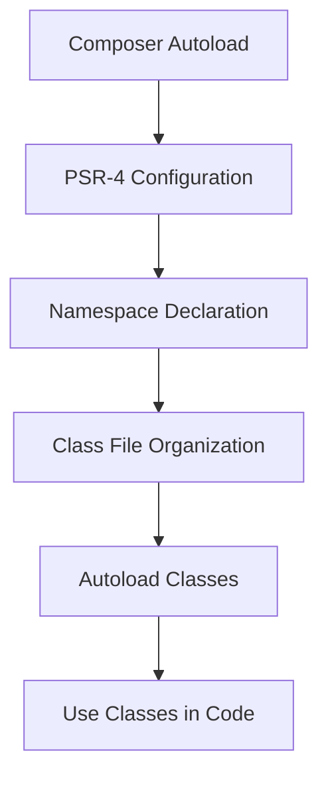

## 25.2 Implementing PSR Standards and Recommendations

In the world of PHP development, maintaining consistency and ensuring interoperability across different projects and libraries is crucial. This is where PHP Standards Recommendations (PSR) come into play. The PHP-FIG (Framework Interoperability Group) has established these standards to provide a common ground for PHP developers, promoting best practices and facilitating seamless integration of third-party components.

### Understanding PHP Standards Recommendations (PSR)

**PHP Standards Recommendations (PSR)** are a set of guidelines and standards designed to improve the quality and interoperability of PHP code. They cover various aspects of PHP development, from coding style to autoloading and HTTP message interfaces. By adhering to these standards, developers can ensure that their code is consistent, maintainable, and compatible with other libraries and frameworks.

#### Key PSRs for Design Patterns

Let's delve into some of the most important PSRs that are particularly relevant to implementing design patterns in PHP:

1. **PSR-1: Basic Coding Standard**
   - **Purpose:** Establishes a basic coding style guide for PHP code.
   - **Key Points:** 
     - Files must use only `<?php` and `<?=` tags.
     - Files must use only UTF-8 without BOM.
     - Class names must be declared in `StudlyCaps`.
     - Constants must be declared in all upper case with underscore separators.
     - Method names must be declared in `camelCase`.

2. **PSR-12: Extended Coding Style Guide**
   - **Purpose:** Provides a comprehensive coding style guide, building upon PSR-1.
   - **Key Points:**
     - Code must use 4 spaces for indenting, not tabs.
     - There must not be a hard limit on line length; the soft limit must be 120 characters.
     - Opening braces for classes and methods must go on the next line, and closing braces must go on the next line after the body.
     - Visibility must be declared on all properties and methods.

3. **PSR-4: Autoloading Standard**
   - **Purpose:** Specifies standards for autoloading classes from file paths.
   - **Key Points:**
     - Defines a standard for file, class, and namespace organization.
     - Ensures that classes can be autoloaded without explicit inclusion.
     - Encourages the use of namespaces to avoid naming conflicts.

4. **PSR-7: HTTP Message Interfaces**
   - **Purpose:** Defines interfaces for HTTP messages, which are crucial for building middleware and web applications.
   - **Key Points:**
     - Provides interfaces for HTTP requests and responses.
     - Facilitates the creation of middleware that can handle HTTP messages in a standardized way.
     - Encourages the use of immutable objects for HTTP messages.

### Applying PSRs in Projects

Implementing PSRs in your PHP projects can significantly enhance code quality and maintainability. Here's how you can apply these standards effectively:

#### Ensuring Consistency and Compatibility

- **Consistency:** By following PSR-1 and PSR-12, you ensure that your code adheres to a consistent style, making it easier for other developers to read and understand.
- **Compatibility:** PSR-4 allows for seamless integration of third-party libraries by standardizing the autoloading process. This means you can easily incorporate external components without worrying about naming conflicts or manual inclusion.

#### Enhancing Interoperability

- **Interoperability:** PSR-7 provides a common interface for handling HTTP messages, enabling different components and libraries to work together seamlessly. This is particularly useful in microservices architectures and when building middleware.

#### Improving Maintainability

- **Maintainability:** By adhering to PSR standards, you create code that is easier to maintain and extend. This is because the code follows a predictable structure and style, reducing the cognitive load on developers.

### Code Examples

Let's explore some code examples to illustrate how these PSRs can be implemented in a PHP project.

#### PSR-4: Autoloading Example

To implement PSR-4 autoloading, you need to define a namespace and organize your files accordingly. Here's a simple example:

```php
// src/Example/HelloWorld.php
namespace Example;

class HelloWorld {
    public function sayHello() {
        return "Hello, World!";
    }
}
```

To autoload this class using Composer, you would add the following to your `composer.json`:

```json
{
    "autoload": {
        "psr-4": {
            "Example\\": "src/"
        }
    }
}
```

After running `composer dump-autoload`, you can use the class without requiring it manually:

```php
require 'vendor/autoload.php';

use Example\HelloWorld;

$hello = new HelloWorld();
echo $hello->sayHello(); // Outputs: Hello, World!
```

#### PSR-7: HTTP Message Example

PSR-7 defines interfaces for HTTP messages. Here's an example of creating a simple HTTP request using a PSR-7 compatible library:

```php
use GuzzleHttp\Psr7\Request;

// Create a new PSR-7 request
$request = new Request('GET', 'https://api.example.com/data');

// Access request properties
echo $request->getMethod(); // Outputs: GET
echo $request->getUri();    // Outputs: https://api.example.com/data
```

### Visualizing PSR Implementation

To better understand how PSR standards fit into a PHP project, let's visualize the process of autoloading using PSR-4.



**Diagram Description:** This flowchart illustrates the process of implementing PSR-4 autoloading in a PHP project. It starts with configuring Composer, declaring namespaces, organizing class files, autoloading classes, and finally using them in the code.

### Resources and Further Reading

For more information on PSR standards and their implementation, consider exploring the following resources:

- **PHP-FIG PSRs:** [PHP-FIG PSRs](https://www.php-fig.org/psr/)
- **Composer Documentation:** [Composer](https://getcomposer.org/doc/)
- **Guzzle HTTP Client:** [Guzzle](http://docs.guzzlephp.org/en/stable/)

### Knowledge Check

Let's test your understanding of PSR standards with a few questions:

1. What is the primary purpose of PSR-4?
2. How does PSR-7 facilitate interoperability in web applications?
3. Why is it important to follow PSR-1 and PSR-12 in your projects?

### Embrace the Journey

Implementing PSR standards is a crucial step towards writing clean, maintainable, and interoperable PHP code. As you continue to explore design patterns and best practices, remember that these standards are here to guide you towards better code quality and collaboration. Keep experimenting, stay curious, and enjoy the journey!

## Quiz: Implementing PSR Standards and Recommendations



### What is the primary purpose of PSR-4?

- [x] To define a standard for autoloading classes from file paths.
- [ ] To provide a coding style guide for PHP.
- [ ] To define interfaces for HTTP messages.
- [ ] To establish a basic coding standard.

> **Explanation:** PSR-4 is specifically designed to standardize the autoloading of classes from file paths, ensuring that classes can be autoloaded without explicit inclusion.

### How does PSR-7 facilitate interoperability in web applications?

- [x] By providing interfaces for HTTP messages.
- [ ] By defining a coding style guide.
- [ ] By standardizing autoloading.
- [ ] By establishing a basic coding standard.

> **Explanation:** PSR-7 provides a common interface for handling HTTP messages, enabling different components and libraries to work together seamlessly.

### Why is it important to follow PSR-1 and PSR-12 in your projects?

- [x] To ensure code consistency and readability.
- [ ] To define interfaces for HTTP messages.
- [ ] To standardize autoloading.
- [ ] To establish a basic coding standard.

> **Explanation:** PSR-1 and PSR-12 provide guidelines for coding style, ensuring that code is consistent and readable, which is crucial for maintainability.

### Which PSR standard is related to HTTP message interfaces?

- [x] PSR-7
- [ ] PSR-1
- [ ] PSR-4
- [ ] PSR-12

> **Explanation:** PSR-7 defines interfaces for HTTP messages, which are crucial for building middleware and web applications.

### What does PSR-12 build upon?

- [x] PSR-1
- [ ] PSR-4
- [ ] PSR-7
- [ ] PSR-8

> **Explanation:** PSR-12 is an extended coding style guide that builds upon the basic coding standards established in PSR-1.

### What is a key benefit of using PSR-4 in your project?

- [x] Seamless integration of third-party libraries.
- [ ] Defining HTTP message interfaces.
- [ ] Establishing a basic coding standard.
- [ ] Providing a coding style guide.

> **Explanation:** PSR-4 allows for seamless integration of third-party libraries by standardizing the autoloading process.

### Which PSR standard is crucial for building middleware?

- [x] PSR-7
- [ ] PSR-1
- [ ] PSR-4
- [ ] PSR-12

> **Explanation:** PSR-7 provides interfaces for HTTP messages, which are crucial for building middleware and web applications.

### What does PSR-1 establish?

- [x] A basic coding standard.
- [ ] Interfaces for HTTP messages.
- [ ] A standard for autoloading.
- [ ] An extended coding style guide.

> **Explanation:** PSR-1 establishes a basic coding standard for PHP code, providing guidelines for file structure and naming conventions.

### True or False: PSR-4 requires manual inclusion of classes.

- [ ] True
- [x] False

> **Explanation:** PSR-4 allows classes to be autoloaded without manual inclusion, thanks to its standardized autoloading process.

### Which PSR standard encourages the use of immutable objects for HTTP messages?

- [x] PSR-7
- [ ] PSR-1
- [ ] PSR-4
- [ ] PSR-12

> **Explanation:** PSR-7 encourages the use of immutable objects for HTTP messages, promoting a functional programming approach.


