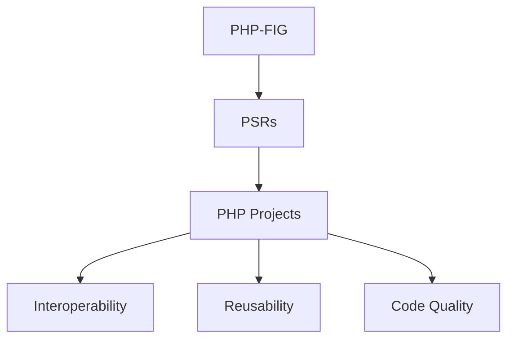

## 25.3 Working with PHP-FIG Guidelines

In the ever-evolving landscape of PHP development, maintaining consistency and interoperability across different frameworks and libraries is crucial. This is where the PHP Framework Interoperability Group (PHP-FIG) comes into play. PHP-FIG is an organization that aims to standardize PHP components and practices through the creation of PHP Standards Recommendations (PSRs). In this section, we will delve into the workings of PHP-FIG, the significance of PSRs, and how they influence PHP development.

### Understanding PHP-FIG

PHP-FIG, short for PHP Framework Interoperability Group, is a collaborative effort among PHP developers and framework authors to create a set of standards that ensure interoperability between PHP components. The group was formed to address the challenges of integrating different PHP libraries and frameworks, which often had conflicting conventions and practices.

#### Key Objectives of PHP-FIG

- **Standardization:** PHP-FIG aims to establish common standards for PHP components, making it easier for developers to integrate different libraries and frameworks.
- **Interoperability:** By following PSRs, developers can create code that is compatible with a wide range of PHP projects, enhancing reusability and reducing duplication of effort.
- **Community Collaboration:** PHP-FIG encourages collaboration among developers, fostering a sense of community and shared responsibility for improving PHP development practices.

### Contributions to PHP-FIG

PHP-FIG is an open organization, and developers are encouraged to participate in discussions and propose new standards. Contributions can take various forms, including:

- **Participating in Discussions:** Developers can join the PHP-FIG mailing list and participate in discussions about existing and proposed standards.
- **Proposing New Standards:** If you have an idea for a new standard, you can propose it to the PHP-FIG community for consideration.
- **Providing Feedback:** Constructive feedback on existing standards is valuable for refining and improving them.

### The Impact of PHP-FIG on Development

The impact of PHP-FIG on PHP development is significant. By adhering to PSRs, developers can create code that is more maintainable, interoperable, and reusable. Let's explore some of the key benefits:

#### Encouraging Interoperability

One of the primary goals of PHP-FIG is to promote interoperability among PHP components. By following PSRs, developers can ensure that their code can work seamlessly with other libraries and frameworks, reducing the need for custom integration code.

#### Enhancing Code Reusability

PSRs provide a set of guidelines for writing reusable code. By adhering to these standards, developers can create libraries and components that can be easily integrated into different projects, saving time and effort.

#### Improving Code Quality

PSRs encourage best practices in PHP development, leading to higher-quality code. By following these guidelines, developers can produce code that is more readable, maintainable, and less prone to errors.

### Key PHP Standards Recommendations (PSRs)

PHP Standards Recommendations (PSRs) are the cornerstone of PHP-FIG's efforts to standardize PHP development. Each PSR addresses a specific aspect of PHP development, providing guidelines and best practices. Let's take a closer look at some of the most important PSRs:

#### PSR-1: Basic Coding Standard

PSR-1 establishes a basic coding standard for PHP code, covering aspects such as file formatting, naming conventions, and class structure. It serves as the foundation for other PSRs and ensures consistency across PHP projects.

#### PSR-2: Coding Style Guide

Building on PSR-1, PSR-2 provides a detailed coding style guide for PHP code. It covers topics such as indentation, line length, and whitespace usage, ensuring that code is consistently formatted and easy to read.

#### PSR-3: Logger Interface

PSR-3 defines a common interface for logging libraries, allowing developers to use different logging implementations interchangeably. This promotes flexibility and interoperability in logging solutions.

#### PSR-4: Autoloading Standard

PSR-4 specifies an autoloading standard for PHP classes, enabling developers to automatically load classes without manually including files. This simplifies dependency management and improves code organization.

#### PSR-7: HTTP Message Interfaces

PSR-7 defines interfaces for HTTP messages, providing a standard way to represent HTTP requests and responses. This is particularly useful for building web applications and APIs, as it ensures consistency in handling HTTP messages.

#### PSR-12: Extended Coding Style Guide

PSR-12 extends PSR-2 by providing additional guidelines for modern PHP development, including support for new language features introduced in PHP 7 and beyond. It ensures that code is up-to-date with the latest PHP standards.

### Implementing PSRs in Your Projects

Implementing PSRs in your PHP projects is a straightforward process. Here are some steps to get started:

1. **Familiarize Yourself with PSRs:** Begin by reading the official PSR documentation to understand the guidelines and best practices for each standard.

2. **Adopt a Coding Standard:** Choose a coding standard, such as PSR-2 or PSR-12, and ensure that your code adheres to it. Use tools like PHP_CodeSniffer to automatically check your code for compliance.

3. **Use PSR-4 Autoloading:** Implement PSR-4 autoloading in your projects to simplify dependency management and improve code organization. Use Composer to manage your project's dependencies and autoloading configuration.

4. **Integrate PSR-3 Logging:** If your project requires logging, use a PSR-3 compliant logging library to ensure interoperability with other components.

5. **Leverage PSR-7 for HTTP Handling:** For web applications and APIs, use PSR-7 compliant libraries to handle HTTP requests and responses consistently.

### Code Example: Implementing PSR-4 Autoloading

Let's take a look at a code example that demonstrates how to implement PSR-4 autoloading in a PHP project using Composer.

```php
// Step 1: Create a Composer configuration file (composer.json)
{
    "autoload": {
        "psr-4": {
            "MyApp\\": "src/"
        }
    }
}

// Step 2: Create a directory structure for your project
// src/
// └── MyApp/
//     └── Example.php

// Step 3: Create a PHP class in the src/MyApp directory
namespace MyApp;

class Example {
    public function sayHello() {
        echo "Hello, PHP-FIG!";
    }
}

// Step 4: Install Composer dependencies and generate the autoload files
// Run the following command in your terminal
// composer install

// Step 5: Use the autoloaded class in your project
require 'vendor/autoload.php';

use MyApp\Example;

$example = new Example();
$example->sayHello(); // Output: Hello, PHP-FIG!
```

In this example, we created a simple PHP project with a `composer.json` file that defines a PSR-4 autoloading configuration. We then created a PHP class in the `src/MyApp` directory and used Composer to generate the autoload files. Finally, we used the autoloaded class in our project.

### Visualizing PHP-FIG's Impact on PHP Development

To better understand the impact of PHP-FIG on PHP development, let's visualize the relationship between PHP-FIG, PSRs, and PHP projects using a Mermaid.js diagram.



**Diagram Description:** This diagram illustrates the relationship between PHP-FIG, PSRs, and PHP projects. PHP-FIG creates PSRs, which are then implemented in PHP projects to achieve interoperability, reusability, and improved code quality.

### Knowledge Check

Before we move on, let's take a moment to reflect on what we've learned. Consider the following questions:

- How does PHP-FIG contribute to the standardization of PHP components?
- What are some of the key benefits of following PSRs in PHP development?
- How can you implement PSR-4 autoloading in your PHP projects?

### Embrace the Journey

Remember, working with PHP-FIG guidelines is just the beginning of your journey towards mastering PHP development. As you continue to explore and implement PSRs in your projects, you'll gain a deeper understanding of PHP standards and best practices. Keep experimenting, stay curious, and enjoy the journey!

### Quiz: Working with PHP-FIG Guidelines



### What is the primary goal of PHP-FIG?

- [x] To standardize PHP components and practices
- [ ] To create new PHP frameworks
- [ ] To replace existing PHP standards
- [ ] To develop proprietary PHP libraries

> **Explanation:** PHP-FIG aims to standardize PHP components and practices to ensure interoperability and reusability.

### Which PSR defines a common interface for logging libraries?

- [ ] PSR-1
- [ ] PSR-2
- [x] PSR-3
- [ ] PSR-4

> **Explanation:** PSR-3 defines a common interface for logging libraries, allowing different logging implementations to be used interchangeably.

### What does PSR-4 specify?

- [ ] A coding style guide
- [x] An autoloading standard
- [ ] HTTP message interfaces
- [ ] A logger interface

> **Explanation:** PSR-4 specifies an autoloading standard for PHP classes, simplifying dependency management and code organization.

### How can developers participate in PHP-FIG?

- [x] By joining discussions and proposing new standards
- [ ] By creating proprietary PHP libraries
- [ ] By developing new PHP frameworks
- [ ] By writing non-standard PHP code

> **Explanation:** Developers can participate in PHP-FIG by joining discussions, proposing new standards, and providing feedback on existing standards.

### Which PSR extends PSR-2 with additional guidelines for modern PHP development?

- [ ] PSR-1
- [ ] PSR-3
- [ ] PSR-4
- [x] PSR-12

> **Explanation:** PSR-12 extends PSR-2 by providing additional guidelines for modern PHP development, including support for new language features.

### What is the benefit of using PSR-7 compliant libraries in web applications?

- [ ] Improved logging capabilities
- [x] Consistent handling of HTTP requests and responses
- [ ] Enhanced file formatting
- [ ] Simplified class structure

> **Explanation:** PSR-7 provides a standard way to represent HTTP requests and responses, ensuring consistency in handling HTTP messages.

### What tool can be used to check PHP code for compliance with PSRs?

- [ ] PHPUnit
- [x] PHP_CodeSniffer
- [ ] Composer
- [ ] PHPUnit

> **Explanation:** PHP_CodeSniffer is a tool that can automatically check PHP code for compliance with PSRs.

### What is the output of the following code example?

```php
require 'vendor/autoload.php';

use MyApp\Example;

$example = new Example();
$example->sayHello();
```

- [x] Hello, PHP-FIG!
- [ ] Hello, World!
- [ ] PHP-FIG!
- [ ] Hello, Example!

> **Explanation:** The code example uses a PSR-4 autoloaded class to output "Hello, PHP-FIG!".

### True or False: PSRs are mandatory for all PHP projects.

- [ ] True
- [x] False

> **Explanation:** PSRs are not mandatory, but they are recommended guidelines for ensuring interoperability and best practices in PHP development.

### Which PSR provides a basic coding standard for PHP code?

- [x] PSR-1
- [ ] PSR-2
- [ ] PSR-3
- [ ] PSR-4

> **Explanation:** PSR-1 establishes a basic coding standard for PHP code, covering file formatting, naming conventions, and class structure.



By understanding and implementing PHP-FIG guidelines, you can enhance the quality and interoperability of your PHP projects. Keep exploring and applying these standards to become a more proficient PHP developer!
