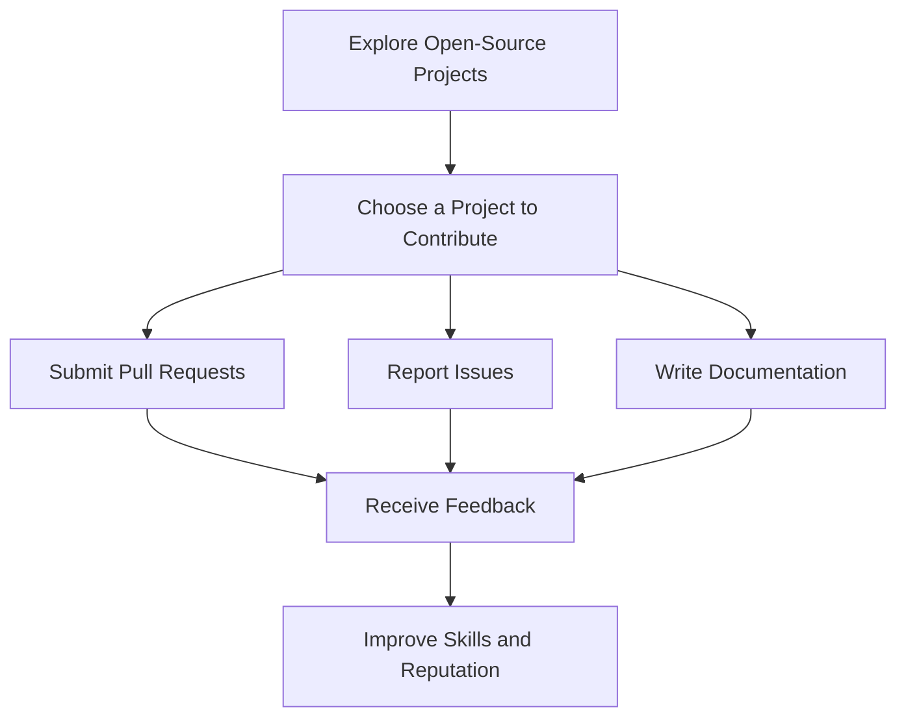

## 25.4 Leveraging Community Resources and Frameworks

In the dynamic world of PHP development, leveraging community resources and frameworks is crucial for building robust, maintainable, and scalable applications. The PHP community is vibrant and offers a plethora of tools, libraries, and frameworks that can significantly enhance your development process. In this section, we will explore how to effectively utilize these resources, focusing on major frameworks, community contributions, and best practices for engaging with the PHP community.

### Community Contributions

The open-source nature of PHP has fostered a rich ecosystem of community contributions. These contributions come in the form of libraries, tools, and frameworks that can help you avoid reinventing the wheel and focus on solving unique problems in your applications.

#### Open-Source Libraries and Tools

Open-source libraries and tools are the backbone of PHP development. They provide pre-built solutions for common problems, allowing developers to save time and effort. Here are some key benefits of using open-source libraries:

- **Time Efficiency:** By using existing libraries, you can focus on the unique aspects of your application rather than building everything from scratch.
- **Community Support:** Open-source projects often have active communities that provide support, documentation, and updates.
- **Quality Assurance:** Many open-source libraries are widely used and tested, ensuring a level of reliability and security.

#### Major Frameworks

Frameworks are essential in PHP development as they provide a structured foundation for building applications. Let's explore some of the major PHP frameworks and their unique features.

##### Laravel

[Laravel](https://laravel.com/) is one of the most popular PHP frameworks, known for its elegant syntax and powerful features. It simplifies common tasks such as routing, authentication, and caching, making it an excellent choice for building modern web applications.

- **Eloquent ORM:** Laravel's Eloquent ORM provides a simple and intuitive way to interact with databases.
- **Blade Templating Engine:** Blade is a lightweight yet powerful templating engine that allows you to create dynamic views.
- **Artisan CLI:** Laravel's command-line interface, Artisan, offers numerous commands to streamline development tasks.

##### Symfony

[Symfony](https://symfony.com/) is a robust PHP framework that emphasizes flexibility and reusability. It is widely used for building complex enterprise-level applications.

- **Components:** Symfony is built on a set of reusable components that can be used independently or together.
- **Twig Templating Engine:** Twig is a fast and secure templating engine that integrates seamlessly with Symfony.
- **Event Dispatcher:** Symfony's event dispatcher allows you to create decoupled applications by managing events and listeners.

##### Zend Framework (Laminas)

The [Laminas Project](https://getlaminas.org/), formerly known as Zend Framework, is a collection of professional PHP packages that can be used to build web applications and services.

- **Modular Architecture:** Laminas offers a modular architecture that allows developers to use only the components they need.
- **MVC Pattern:** Laminas follows the Model-View-Controller pattern, providing a clear separation of concerns.
- **Enterprise-Ready:** Laminas is designed for enterprise applications, offering features like caching, authentication, and internationalization.

### Utilizing Packages

Incorporating community-maintained packages into your projects can greatly enhance functionality and reduce development time. Here are some tips for effectively utilizing packages:

- **Research and Evaluate:** Before integrating a package, research its popularity, community support, and maintenance status.
- **Use Composer:** Composer is the de facto dependency manager for PHP, making it easy to install and manage packages.
- **Stay Updated:** Regularly update your packages to benefit from the latest features and security patches.

#### Example: Using Composer to Install a Package

```bash
composer require guzzlehttp/guzzle
```

This command installs the Guzzle HTTP client, a popular package for making HTTP requests in PHP.

### Learning Resources

Continuous learning is essential in the ever-evolving field of PHP development. The community provides numerous resources to help you stay updated and improve your skills.

#### Blogs and Forums

Blogs and forums are excellent sources of information and community engagement. They provide insights into best practices, new features, and common challenges in PHP development.

- **PHP.net Blog:** The official PHP blog offers updates on new releases and features.
- **Stack Overflow:** A popular forum where developers ask and answer questions related to PHP and other technologies.

#### Documentation and Tutorials

Comprehensive documentation and tutorials are crucial for understanding how to use frameworks and libraries effectively.

- **Laravel Documentation:** [Laravel Docs](https://laravel.com/docs) provide detailed information on all aspects of the framework.
- **Symfony Documentation:** [Symfony Docs](https://symfony.com/doc) offer extensive guides and tutorials for using Symfony components.

### Engagement

Engaging with the PHP community can enhance your development skills and provide opportunities for collaboration and learning.

#### Contribute to Projects

Contributing to open-source projects is a great way to give back to the community and improve your skills. You can contribute by:

- **Submitting Pull Requests:** Fix bugs or add new features to existing projects.
- **Reporting Issues:** Help maintainers by reporting bugs or suggesting improvements.
- **Writing Documentation:** Improve project documentation to help other developers.

#### Share Knowledge

Sharing your knowledge and experiences can benefit the community and establish you as a thought leader in PHP development.

- **Write Blog Posts:** Share your insights and experiences through blog posts or articles.
- **Speak at Conferences:** Present your work and ideas at PHP conferences and meetups.

### Visualizing Community Engagement

To better understand how community engagement works, let's visualize the process using a flowchart.



**Figure 1:** Flowchart illustrating the process of engaging with open-source projects.

### Try It Yourself

Now that we've explored the importance of leveraging community resources and frameworks, try incorporating a new package into your project using Composer. Experiment with different frameworks to find the one that best suits your needs. Remember, the PHP community is vast and supportive, so don't hesitate to reach out for help or contribute your knowledge.

### Knowledge Check

- What are the benefits of using open-source libraries in PHP development?
- How can you contribute to open-source projects?
- What are some major PHP frameworks and their unique features?

### Summary

Leveraging community resources and frameworks is essential for efficient PHP development. By utilizing open-source libraries, engaging with the community, and continuously learning, you can build high-quality applications and contribute to the vibrant PHP ecosystem. Remember, this is just the beginning. As you progress, you'll discover more tools and techniques to enhance your development process. Keep experimenting, stay curious, and enjoy the journey!

## Quiz: Leveraging Community Resources and Frameworks



### What is one of the main benefits of using open-source libraries in PHP development?

- [x] Time Efficiency
- [ ] Increased Complexity
- [ ] Lack of Support
- [ ] Proprietary Restrictions

> **Explanation:** Open-source libraries save time by providing pre-built solutions for common problems.

### Which PHP framework is known for its elegant syntax and powerful features?

- [x] Laravel
- [ ] Symfony
- [ ] Zend Framework
- [ ] CodeIgniter

> **Explanation:** Laravel is known for its elegant syntax and powerful features.

### What tool is commonly used for managing PHP packages?

- [x] Composer
- [ ] NPM
- [ ] Yarn
- [ ] Pip

> **Explanation:** Composer is the de facto dependency manager for PHP.

### How can you contribute to open-source projects?

- [x] Submitting Pull Requests
- [x] Reporting Issues
- [x] Writing Documentation
- [ ] Ignoring Community Guidelines

> **Explanation:** Contributing to open-source projects can be done by submitting pull requests, reporting issues, and writing documentation.

### What is the primary purpose of the Symfony framework?

- [x] Building complex enterprise-level applications
- [ ] Creating simple websites
- [ ] Managing databases
- [ ] Designing graphics

> **Explanation:** Symfony is widely used for building complex enterprise-level applications.

### Which templating engine is associated with Laravel?

- [x] Blade
- [ ] Twig
- [ ] Smarty
- [ ] Mustache

> **Explanation:** Blade is the templating engine associated with Laravel.

### What is the Laminas Project formerly known as?

- [x] Zend Framework
- [ ] CodeIgniter
- [ ] CakePHP
- [ ] Yii

> **Explanation:** The Laminas Project was formerly known as Zend Framework.

### What is a key feature of Symfony's architecture?

- [x] Reusable Components
- [ ] Monolithic Design
- [ ] Proprietary Code
- [ ] Lack of Flexibility

> **Explanation:** Symfony is built on a set of reusable components that can be used independently or together.

### What command is used to install a package using Composer?

- [x] composer require package-name
- [ ] npm install package-name
- [ ] yarn add package-name
- [ ] pip install package-name

> **Explanation:** The command `composer require package-name` is used to install a package using Composer.

### True or False: Engaging with the PHP community can enhance your development skills.

- [x] True
- [ ] False

> **Explanation:** Engaging with the PHP community can enhance your development skills and provide opportunities for collaboration and learning.


