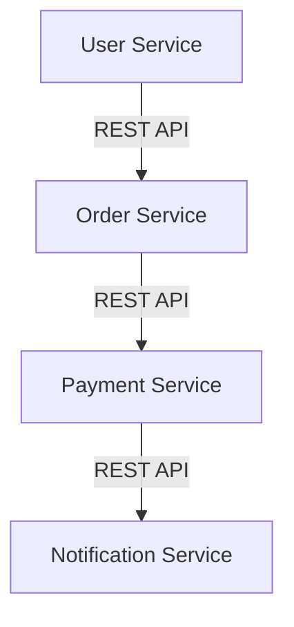
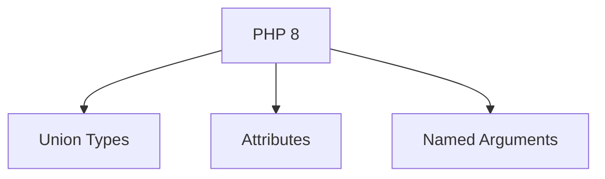
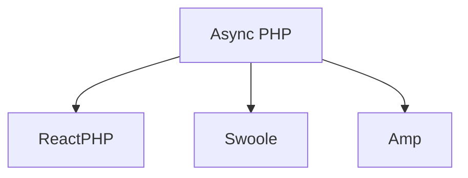

## 25.5 Trends in Modern PHP Development

As the world of web development continues to evolve, PHP remains a cornerstone language, adapting to new paradigms and technologies. In this section, we will explore the latest trends in modern PHP development, focusing on PHP 8 and beyond, asynchronous programming, microservices, DevOps practices, and containerization. These trends are shaping the future of PHP, making it more robust, efficient, and aligned with modern software development practices.

### Embracing PHP 8 and Beyond

PHP 8 introduced several groundbreaking features that have significantly enhanced the language's capabilities. Let's delve into some of these features and understand how they are transforming PHP development.

#### Union Types

Union types allow a variable to accept multiple types, providing greater flexibility and reducing the need for complex type-checking logic.

```php
function processInput(int|string $input): void {
    if (is_int($input)) {
        echo "Processing integer: $input";
    } else {
        echo "Processing string: $input";
    }
}

processInput(42); // Processing integer: 42
processInput("Hello"); // Processing string: Hello
```

#### Attributes

Attributes, also known as annotations in other languages, provide a way to add metadata to classes, methods, and properties. This feature is particularly useful for frameworks and libraries that rely on metadata for configuration.

```php
#[Route('/home')]
class HomeController {
    #[Get]
    public function index() {
        // Controller logic
    }
}
```

#### Named Arguments

Named arguments enhance the readability of function calls by allowing you to specify parameter names, making it easier to understand what each argument represents.

```php
function createUser(string $name, int $age, bool $isAdmin = false) {
    // Function logic
}

createUser(name: "Alice", age: 30, isAdmin: true);
```

### Async PHP

Asynchronous programming is gaining traction in the PHP community, driven by the need for non-blocking, high-performance applications. Libraries like ReactPHP, Swoole, and Amp are at the forefront of this movement.

#### ReactPHP

ReactPHP is a low-level library for event-driven programming in PHP. It provides a non-blocking I/O model, enabling you to build scalable network applications.

```php
use React\EventLoop\Factory;
use React\Socket\Server;

$loop = Factory::create();
$server = new Server('127.0.0.1:8080', $loop);

$server->on('connection', function ($connection) {
    $connection->write("Hello World!\n");
    $connection->end();
});

$loop->run();
```

#### Swoole

Swoole is a coroutine-based asynchronous programming framework that enhances PHP's performance by providing built-in support for asynchronous I/O operations.

```php
Swoole\Coroutine\run(function () {
    $client = new Swoole\Coroutine\Http\Client('www.example.com', 80);
    $client->get('/');
    echo $client->body;
});
```

#### Amp

Amp is another library that simplifies asynchronous programming in PHP. It uses promises and coroutines to manage asynchronous operations.

```php
use Amp\Loop;
use Amp\Socket;

Loop::run(function () {
    $server = Socket\listen("tcp://127.0.0.1:1337");

    while ($socket = yield $server->accept()) {
        yield $socket->write("Hello, World!\n");
        $socket->close();
    }
});
```

### Microservices and APIs

The shift towards microservices and API-driven architectures is transforming how PHP applications are designed and deployed. This approach promotes modularity, scalability, and ease of maintenance.

#### API-Driven Development

APIs are becoming the backbone of modern applications, enabling seamless communication between services. PHP developers are increasingly adopting RESTful and GraphQL APIs to build flexible and scalable applications.

```php
// Example of a simple RESTful API endpoint using PHP
header('Content-Type: application/json');

$data = ['message' => 'Hello, World!'];
echo json_encode($data);
```

#### Microservices Architecture

Microservices architecture breaks down applications into smaller, independent services that can be developed, deployed, and scaled individually. PHP's lightweight nature makes it an excellent choice for building microservices.



### DevOps and CI/CD

Integrating PHP applications into modern DevOps practices is essential for achieving continuous integration and continuous deployment (CI/CD). This integration ensures faster delivery of features and improvements.

#### Continuous Integration

Continuous integration involves automatically testing and building PHP applications whenever changes are made to the codebase. Tools like Jenkins, GitLab CI, and GitHub Actions are commonly used for this purpose.

```yaml
# Example GitHub Actions workflow for PHP
name: CI

on: [push, pull_request]

jobs:
  build:
    runs-on: ubuntu-latest
    steps:
      - uses: actions/checkout@v2
      - name: Set up PHP
        uses: shivammathur/setup-php@v2
        with:
          php-version: '8.0'
      - name: Install dependencies
        run: composer install
      - name: Run tests
        run: vendor/bin/phpunit
```

#### Continuous Deployment

Continuous deployment automates the process of deploying PHP applications to production environments, ensuring that new features and bug fixes are delivered quickly and reliably.

### Containerization

Containerization is revolutionizing how PHP applications are developed and deployed. By using Docker and Kubernetes, developers can create consistent environments that simplify deployment and scaling.

#### Docker

Docker allows you to package PHP applications and their dependencies into containers, ensuring consistency across different environments.

```dockerfile
# Example Dockerfile for a PHP application
FROM php:8.0-apache
COPY . /var/www/html/
RUN docker-php-ext-install mysqli
```

#### Kubernetes

Kubernetes is an orchestration platform that automates the deployment, scaling, and management of containerized applications. It provides powerful tools for managing PHP applications in production.

```yaml
# Example Kubernetes deployment for a PHP application
apiVersion: apps/v1
kind: Deployment
metadata:
  name: php-app
spec:
  replicas: 3
  selector:
    matchLabels:
      app: php-app
  template:
    metadata:
      labels:
        app: php-app
    spec:
      containers:
      - name: php-container
        image: php:8.0-apache
        ports:
        - containerPort: 80
```

### Try It Yourself

Experiment with the code examples provided in this section. Try modifying the parameters, adding new features, or integrating with other libraries to deepen your understanding of modern PHP development trends.

### Visualizing Modern PHP Development

To better understand the relationships and workflows in modern PHP development, let's visualize some of these concepts using Mermaid.js diagrams.

#### PHP 8 Features Overview



#### Asynchronous Programming Libraries



#### Microservices Architecture


### References and Links

For further reading on modern PHP development trends, consider exploring the following resources:

- [PHP 8 Release Notes](https://www.php.net/releases/8.0/en.php)
- [ReactPHP Documentation](https://reactphp.org/)
- [Swoole Documentation](https://www.swoole.co.uk/docs)
- [Amp Documentation](https://amphp.org/)
- [Docker Documentation](https://docs.docker.com/)
- [Kubernetes Documentation](https://kubernetes.io/docs/home/)

### Knowledge Check

- What are the benefits of using union types in PHP 8?
- How do attributes enhance the functionality of PHP applications?
- What are the key differences between synchronous and asynchronous programming in PHP?
- How does containerization improve the deployment process of PHP applications?

### Embrace the Journey

Remember, this is just the beginning. As you explore these modern PHP development trends, you'll gain valuable insights and skills that will enhance your ability to build robust, scalable applications. Keep experimenting, stay curious, and enjoy the journey!

### Quiz: Trends in Modern PHP Development



### What is a key feature introduced in PHP 8 that allows variables to accept multiple types?

- [x] Union Types
- [ ] Generics
- [ ] Type Casting
- [ ] Type Juggling

> **Explanation:** Union types allow a variable to accept multiple types, enhancing flexibility and reducing type-checking complexity.

### Which PHP library is known for providing a non-blocking I/O model?

- [x] ReactPHP
- [ ] Laravel
- [ ] Symfony
- [ ] CodeIgniter

> **Explanation:** ReactPHP is a low-level library for event-driven programming, offering a non-blocking I/O model.

### What is the primary benefit of using named arguments in PHP 8?

- [x] Enhanced readability of function calls
- [ ] Faster execution of functions
- [ ] Reduced memory usage
- [ ] Improved security

> **Explanation:** Named arguments improve the readability of function calls by allowing you to specify parameter names.

### Which of the following is a coroutine-based asynchronous programming framework for PHP?

- [x] Swoole
- [ ] Zend Framework
- [ ] CakePHP
- [ ] Slim

> **Explanation:** Swoole is a coroutine-based framework that enhances PHP's performance with asynchronous I/O operations.

### What is the main advantage of microservices architecture?

- [x] Modularity and scalability
- [ ] Reduced code complexity
- [ ] Faster database queries
- [ ] Simplified user interfaces

> **Explanation:** Microservices architecture promotes modularity and scalability by breaking down applications into smaller, independent services.

### Which tool is commonly used for continuous integration in PHP projects?

- [x] Jenkins
- [ ] XAMPP
- [ ] WAMP
- [ ] MAMP

> **Explanation:** Jenkins is a popular tool for continuous integration, automating testing and building processes.

### What is the purpose of containerization in PHP development?

- [x] Ensuring consistency across environments
- [ ] Increasing code readability
- [ ] Enhancing database performance
- [ ] Simplifying user authentication

> **Explanation:** Containerization packages applications and their dependencies into containers, ensuring consistency across different environments.

### Which orchestration platform is used for managing containerized applications?

- [x] Kubernetes
- [ ] Apache
- [ ] Nginx
- [ ] IIS

> **Explanation:** Kubernetes is an orchestration platform that automates the deployment, scaling, and management of containerized applications.

### What is a common use case for attributes in PHP 8?

- [x] Adding metadata to classes and methods
- [ ] Improving database queries
- [ ] Enhancing user authentication
- [ ] Reducing memory usage

> **Explanation:** Attributes provide a way to add metadata to classes, methods, and properties, useful for frameworks and libraries.

### True or False: Asynchronous programming in PHP is only possible with PHP 8.

- [ ] True
- [x] False

> **Explanation:** Asynchronous programming in PHP is possible with libraries like ReactPHP, Swoole, and Amp, regardless of the PHP version.


