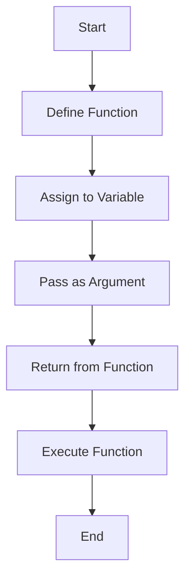

## 25.6 Functional Programming Concepts in PHP

Functional programming (FP) is a programming paradigm that treats computation as the evaluation of mathematical functions and avoids changing state and mutable data. While PHP is traditionally known as an object-oriented language, it has evolved to incorporate functional programming concepts, allowing developers to write cleaner, more maintainable code. In this section, we will explore the key concepts of functional programming in PHP, including first-class functions, higher-order functions, and the use of functional libraries.

### Introduction to Functional Programming in PHP

Functional programming emphasizes the use of functions as first-class citizens, meaning they can be passed as arguments, returned from other functions, and assigned to variables. This paradigm encourages immutability and stateless functions, which can lead to code that is easier to reason about and test.

#### Key Concepts

- **First-Class Functions:** Functions in PHP can be treated like any other variable. They can be passed as arguments, returned from other functions, and assigned to variables.
- **Anonymous Functions:** Also known as closures, these are functions without a name. They can capture variables from their surrounding scope.
- **Higher-Order Functions:** Functions that take other functions as arguments or return them as results.
- **Immutability:** The concept of not modifying data after it has been created. Instead, new data structures are created with the desired changes.
- **Pure Functions:** Functions that have no side effects and return the same output given the same input.

### First-Class Functions in PHP

In PHP, functions are first-class citizens. This means you can assign them to variables, pass them as arguments, and return them from other functions. This flexibility allows for powerful abstractions and code reuse.

#### Example: Assigning Functions to Variables

```php
<?php

// Assigning a function to a variable
$square = function($x) {
    return $x * $x;
};

// Using the function
echo $square(4); // Outputs: 16
?>
```

In this example, we define an anonymous function that calculates the square of a number and assign it to the variable `$square`. We can then call this function using the variable name.

### Anonymous Functions and Closures

Anonymous functions, or closures, are functions without a name. They can capture variables from their surrounding scope, making them useful for callbacks and functional programming.

#### Example: Using Closures

```php
<?php

$factor = 10;

// Define a closure that uses a variable from the outer scope
$multiply = function($x) use ($factor) {
    return $x * $factor;
};

echo $multiply(5); // Outputs: 50
?>
```

In this example, the closure `$multiply` captures the variable `$factor` from its surrounding scope. This allows the closure to use `$factor` even though it is not passed as an argument.

### Higher-Order Functions

Higher-order functions are functions that take other functions as arguments or return them as results. They are a key feature of functional programming, enabling powerful abstractions and code reuse.

#### Example: Using Higher-Order Functions

```php
<?php

// A function that applies a given function to each element of an array
function map(array $arr, callable $func) {
    $result = [];
    foreach ($arr as $item) {
        $result[] = $func($item);
    }
    return $result;
}

// Using the map function with an anonymous function
$numbers = [1, 2, 3, 4, 5];
$squaredNumbers = map($numbers, function($n) {
    return $n * $n;
});

print_r($squaredNumbers); // Outputs: Array ( [0] => 1 [1] => 4 [2] => 9 [3] => 16 [4] => 25 )
?>
```

In this example, the `map` function is a higher-order function that takes an array and a callable function as arguments. It applies the callable function to each element of the array, returning a new array with the results.

### Immutability and Pure Functions

Immutability is a core concept in functional programming. It involves creating new data structures instead of modifying existing ones. Pure functions are functions that do not have side effects and return the same output given the same input.

#### Example: Immutability and Pure Functions

```php
<?php

// A pure function that does not modify the input array
function addOneToEach(array $numbers) {
    $result = [];
    foreach ($numbers as $number) {
        $result[] = $number + 1;
    }
    return $result;
}

$originalNumbers = [1, 2, 3];
$newNumbers = addOneToEach($originalNumbers);

print_r($originalNumbers); // Outputs: Array ( [0] => 1 [1] => 2 [2] => 3 )
print_r($newNumbers); // Outputs: Array ( [0] => 2 [1] => 3 [2] => 4 )
?>
```

In this example, the function `addOneToEach` is a pure function. It does not modify the input array but returns a new array with each element incremented by one.

### Functional Libraries in PHP

PHP has several libraries that facilitate functional programming. One popular library is [Functional PHP](https://github.com/lstrojny/functional-php), which provides a set of functional primitives for PHP.

#### Using Functional PHP

Functional PHP offers a variety of functions for working with arrays, collections, and more. It allows you to write more expressive and concise code.

```php
<?php

require 'vendor/autoload.php';

use function Functional\map;

// Using Functional PHP to map over an array
$numbers = [1, 2, 3, 4, 5];
$squaredNumbers = map($numbers, function($n) {
    return $n * $n;
});

print_r($squaredNumbers); // Outputs: Array ( [0] => 1 [1] => 4 [2] => 9 [3] => 16 [4] => 25 )
?>
```

In this example, we use the `map` function from the Functional PHP library to apply a function to each element of an array. This is similar to the earlier example but uses the library's implementation.

### Benefits of Functional Programming in PHP

Functional programming offers several benefits, including:

- **Easier to Reason About:** Functional code is often easier to understand because it avoids side effects and mutable state.
- **Improved Testability:** Pure functions are easier to test because they do not depend on or modify external state.
- **Enhanced Reusability:** Higher-order functions and first-class functions enable powerful abstractions and code reuse.
- **Concurrency:** Immutability and stateless functions make it easier to write concurrent and parallel code.

### Visualizing Functional Programming Concepts

To better understand the flow of functional programming in PHP, let's visualize the process of using higher-order functions and closures.



This diagram illustrates the flow of using functions as first-class citizens in PHP. We start by defining a function, assigning it to a variable, passing it as an argument, returning it from another function, and finally executing it.

### Try It Yourself

Experiment with the code examples provided in this section. Try modifying the functions to perform different operations, or create your own higher-order functions and closures. This hands-on practice will help solidify your understanding of functional programming concepts in PHP.

### Knowledge Check

- What are first-class functions, and how are they used in PHP?
- How do closures capture variables from their surrounding scope?
- What are higher-order functions, and why are they important in functional programming?
- Explain the concept of immutability and its benefits.
- How can functional libraries like Functional PHP enhance your PHP code?

### Conclusion

Functional programming in PHP provides a powerful set of tools for writing cleaner, more maintainable code. By embracing concepts like first-class functions, higher-order functions, and immutability, you can create applications that are easier to understand and test. Remember, this is just the beginning. As you continue to explore functional programming, you'll discover new ways to improve your PHP development skills. Keep experimenting, stay curious, and enjoy the journey!

## Quiz: Functional Programming Concepts in PHP



### What is a first-class function in PHP?

- [x] A function that can be assigned to a variable, passed as an argument, or returned from another function.
- [ ] A function that is defined at the top level of a PHP script.
- [ ] A function that is always executed first in a script.
- [ ] A function that cannot be modified.

> **Explanation:** First-class functions can be treated like any other variable, allowing for powerful abstractions and code reuse.

### What is a closure in PHP?

- [x] An anonymous function that can capture variables from its surrounding scope.
- [ ] A function that is automatically executed when a script ends.
- [ ] A function that cannot be called directly.
- [ ] A function that is defined inside a class.

> **Explanation:** Closures are anonymous functions that can capture and use variables from their surrounding scope.

### What is a higher-order function?

- [x] A function that takes other functions as arguments or returns them as results.
- [ ] A function that is defined at a higher level in a script.
- [ ] A function that is always executed last in a script.
- [ ] A function that cannot be modified.

> **Explanation:** Higher-order functions enable powerful abstractions by taking functions as arguments or returning them as results.

### What is immutability?

- [x] The concept of not modifying data after it has been created.
- [ ] The ability to change data at any time.
- [ ] The process of making data mutable.
- [ ] The state of a variable that cannot be accessed.

> **Explanation:** Immutability involves creating new data structures instead of modifying existing ones, leading to more predictable code.

### What is a pure function?

- [x] A function that has no side effects and returns the same output given the same input.
- [ ] A function that modifies global variables.
- [ ] A function that can only be called once.
- [ ] A function that is defined inside a class.

> **Explanation:** Pure functions do not depend on or modify external state, making them easier to test and reason about.

### How can functional libraries like Functional PHP enhance your PHP code?

- [x] By providing a set of functional primitives for more expressive and concise code.
- [ ] By replacing all object-oriented code with functional code.
- [ ] By making PHP code run faster.
- [ ] By automatically converting PHP code to another language.

> **Explanation:** Functional libraries offer tools for writing more expressive and concise functional code in PHP.

### What is the benefit of using higher-order functions?

- [x] They enable powerful abstractions and code reuse.
- [ ] They make code run faster.
- [ ] They simplify error handling.
- [ ] They eliminate the need for variables.

> **Explanation:** Higher-order functions allow for powerful abstractions by taking functions as arguments or returning them as results.

### What is the main advantage of using pure functions?

- [x] They are easier to test because they do not depend on or modify external state.
- [ ] They run faster than other functions.
- [ ] They can modify global variables.
- [ ] They can only be used in functional programming languages.

> **Explanation:** Pure functions are easier to test and reason about because they do not have side effects.

### How do closures capture variables from their surrounding scope?

- [x] By using the `use` keyword to include variables from the outer scope.
- [ ] By automatically including all global variables.
- [ ] By defining variables inside the closure.
- [ ] By using the `global` keyword.

> **Explanation:** Closures use the `use` keyword to capture and use variables from their surrounding scope.

### True or False: Functional programming in PHP can lead to code that is easier to reason about and test.

- [x] True
- [ ] False

> **Explanation:** Functional programming emphasizes immutability and pure functions, leading to code that is easier to reason about and test.


