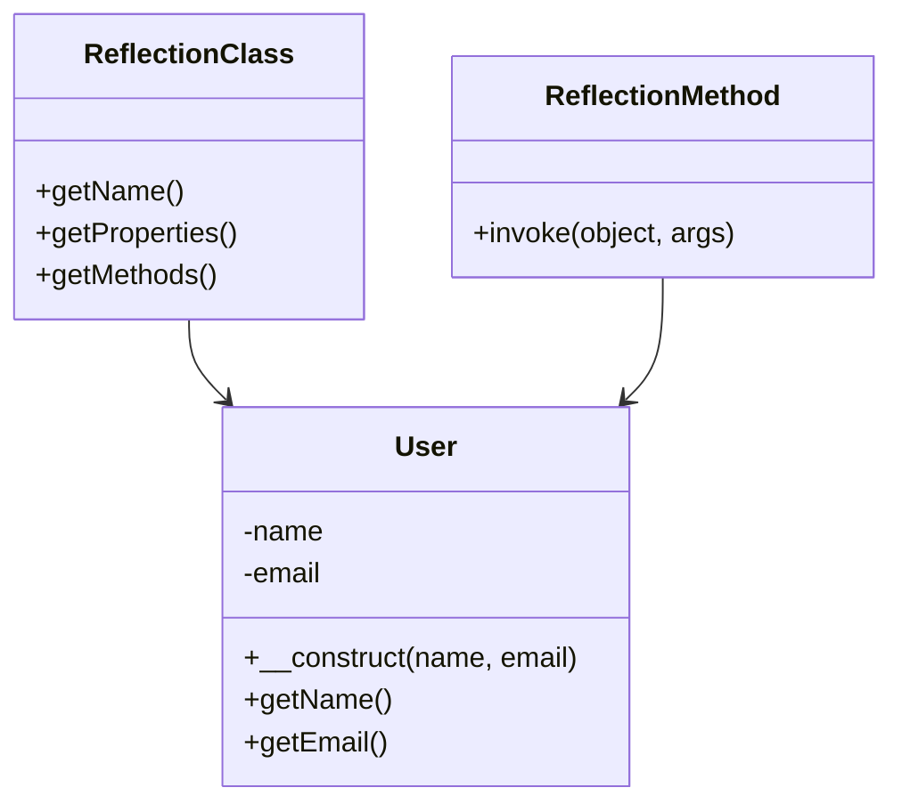

## 25.7 Metaprogramming and Reflection API

Metaprogramming is a programming technique that involves writing code that can manipulate other code. In PHP, metaprogramming is primarily facilitated through the Reflection API, which allows developers to inspect and modify classes, methods, and properties at runtime. This capability is crucial for building dynamic and flexible applications, such as frameworks, dependency injection containers, and annotation processors.

### Understanding Metaprogramming

Metaprogramming enables programs to treat other programs as their data. This means that a program can be designed to read, generate, analyze, or transform other programs, and even modify itself while running. In PHP, metaprogramming is often used to create more abstract and reusable code.

#### Key Concepts of Metaprogramming

- **Code Generation:** Automatically generating code based on certain parameters or configurations.
- **Code Inspection:** Examining the structure and properties of code at runtime.
- **Code Transformation:** Modifying code dynamically to alter its behavior or structure.

### Introduction to the Reflection API

The Reflection API in PHP provides a set of classes and methods that allow you to introspect and interact with the code structure at runtime. This includes examining classes, methods, properties, and even function parameters.

#### Benefits of Using the Reflection API

- **Dynamic Analysis:** Allows you to analyze code structures dynamically, which is useful for debugging and testing.
- **Framework Development:** Essential for building frameworks that require dynamic class loading and method invocation.
- **Dependency Injection:** Facilitates the creation of dependency injection containers by inspecting class dependencies.

#### Core Components of the Reflection API

- **ReflectionClass:** Provides information about a class.
- **ReflectionMethod:** Offers details about a class method.
- **ReflectionProperty:** Gives insights into class properties.
- **ReflectionFunction:** Allows inspection of standalone functions.
- **ReflectionParameter:** Provides information about function or method parameters.

### Practical Use Cases of the Reflection API

#### Building Frameworks

Frameworks often need to load classes dynamically and call methods based on user input or configuration files. The Reflection API allows frameworks to inspect classes and methods to determine how to instantiate objects and invoke methods.

#### Dependency Injection Containers

Dependency injection containers use the Reflection API to inspect class constructors and determine what dependencies are required. This allows the container to automatically resolve and inject dependencies when creating objects.

#### Annotations Processing

Annotations are metadata added to code elements, such as classes or methods, to provide additional information. The Reflection API can be used to read these annotations and perform actions based on them, such as configuring routes in a web application.

### Dynamic Code Execution in PHP

While the Reflection API is powerful, PHP also provides the `eval()` function for executing code dynamically. However, `eval()` should be used with caution due to security risks, as it can execute arbitrary code.

#### Example of Dynamic Code Execution

```php
<?php
$code = 'echo "Hello, World!";';
eval($code); // Outputs: Hello, World!
?>
```

**Note:** Avoid using `eval()` unless absolutely necessary, and never with untrusted input.

### Code Examples: Using the Reflection API

Let's explore some practical examples of using the Reflection API in PHP.

#### Example 1: Inspecting a Class

```php
<?php

class User {
    private $name;
    private $email;

    public function __construct($name, $email) {
        $this->name = $name;
        $this->email = $email;
    }

    public function getName() {
        return $this->name;
    }

    public function getEmail() {
        return $this->email;
    }
}

$reflectionClass = new ReflectionClass('User');

// Get class name
echo "Class Name: " . $reflectionClass->getName() . "\n";

// Get class properties
echo "Properties:\n";
foreach ($reflectionClass->getProperties() as $property) {
    echo $property->getName() . "\n";
}

// Get class methods
echo "Methods:\n";
foreach ($reflectionClass->getMethods() as $method) {
    echo $method->getName() . "\n";
}

?>
```

**Explanation:** This example demonstrates how to use `ReflectionClass` to inspect the `User` class, listing its properties and methods.

#### Example 2: Invoking a Method Dynamically

```php
<?php

class Calculator {
    public function add($a, $b) {
        return $a + $b;
    }

    public function subtract($a, $b) {
        return $a - $b;
    }
}

$calculator = new Calculator();
$reflectionMethod = new ReflectionMethod('Calculator', 'add');

// Invoke method dynamically
$result = $reflectionMethod->invoke($calculator, 5, 3);
echo "Result of addition: " . $result . "\n"; // Outputs: Result of addition: 8

?>
```

**Explanation:** Here, we use `ReflectionMethod` to dynamically invoke the `add` method of the `Calculator` class.

### Visualizing the Reflection API

To better understand how the Reflection API interacts with PHP code, let's visualize the process using a class diagram.



**Diagram Description:** This diagram illustrates the relationship between the `ReflectionClass`, `ReflectionMethod`, and the `User` class. The `ReflectionClass` and `ReflectionMethod` are used to inspect and interact with the `User` class.

### Best Practices for Using the Reflection API

- **Performance Considerations:** Reflection can be slower than direct code execution. Use it judiciously and cache results where possible.
- **Security Concerns:** Be cautious when using reflection with user input, as it can expose sensitive parts of your application.
- **Maintainability:** Overuse of reflection can make code harder to understand and maintain. Use it only when necessary.

### PHP Unique Features and Reflection

PHP's dynamic nature makes it particularly suited for metaprogramming. The Reflection API leverages PHP's ability to handle classes and functions as first-class citizens, allowing for flexible and dynamic code manipulation.

### Differences and Similarities with Other Languages

While many languages offer reflection capabilities, PHP's Reflection API is particularly straightforward and easy to use. However, unlike some statically typed languages, PHP's reflection is more dynamic, which can be both an advantage and a challenge.

### Try It Yourself

Experiment with the Reflection API by modifying the code examples above. Try adding new methods or properties to the `User` or `Calculator` classes and see how the Reflection API can be used to inspect and interact with them.

### Knowledge Check

- What is metaprogramming, and how does it benefit PHP developers?
- How can the Reflection API be used to inspect a class's methods and properties?
- What are some practical use cases for the Reflection API in PHP applications?

### Embrace the Journey

Remember, mastering metaprogramming and the Reflection API is just the beginning. As you continue to explore these concepts, you'll unlock new possibilities for creating dynamic and flexible PHP applications. Keep experimenting, stay curious, and enjoy the journey!

## Quiz: Metaprogramming and Reflection API



### What is the primary purpose of the Reflection API in PHP?

- [x] To inspect and manipulate code at runtime
- [ ] To compile PHP code into machine language
- [ ] To optimize PHP code for performance
- [ ] To convert PHP code into JavaScript

> **Explanation:** The Reflection API is used to inspect and manipulate code at runtime, allowing for dynamic analysis and modification.

### Which of the following is NOT a component of the Reflection API?

- [ ] ReflectionClass
- [ ] ReflectionMethod
- [x] ReflectionVariable
- [ ] ReflectionProperty

> **Explanation:** ReflectionVariable is not a part of the Reflection API. The API includes ReflectionClass, ReflectionMethod, and ReflectionProperty, among others.

### What is a common use case for the Reflection API?

- [x] Building dependency injection containers
- [ ] Compiling PHP code
- [ ] Encrypting data
- [ ] Rendering HTML templates

> **Explanation:** The Reflection API is commonly used in building dependency injection containers by inspecting class constructors and dependencies.

### What is the risk associated with using `eval()` in PHP?

- [x] Security vulnerabilities
- [ ] Improved performance
- [ ] Increased readability
- [ ] Enhanced maintainability

> **Explanation:** Using `eval()` can introduce security vulnerabilities, as it can execute arbitrary code.

### How can the Reflection API help in framework development?

- [x] By dynamically loading classes and invoking methods
- [ ] By compiling framework code into machine language
- [ ] By encrypting framework data
- [ ] By rendering framework templates

> **Explanation:** The Reflection API helps in dynamically loading classes and invoking methods, which is essential for framework development.

### Which method is used to invoke a method dynamically using the Reflection API?

- [x] invoke()
- [ ] call()
- [ ] execute()
- [ ] run()

> **Explanation:** The `invoke()` method is used to dynamically invoke a method using the Reflection API.

### What is a benefit of using the Reflection API for annotations processing?

- [x] It allows reading metadata and performing actions based on it
- [ ] It compiles annotations into machine code
- [ ] It encrypts annotations for security
- [ ] It renders annotations as HTML

> **Explanation:** The Reflection API allows reading annotations metadata and performing actions based on it, such as configuring routes.

### What should be considered when using reflection in terms of performance?

- [x] Reflection can be slower than direct code execution
- [ ] Reflection always improves performance
- [ ] Reflection has no impact on performance
- [ ] Reflection compiles code for faster execution

> **Explanation:** Reflection can be slower than direct code execution, so it should be used judiciously.

### What is a key difference between PHP's Reflection API and reflection in statically typed languages?

- [x] PHP's reflection is more dynamic
- [ ] PHP's reflection is more static
- [ ] PHP's reflection is less flexible
- [ ] PHP's reflection is more complex

> **Explanation:** PHP's reflection is more dynamic, allowing for flexible and dynamic code manipulation.

### True or False: The Reflection API can be used to modify class properties at runtime.

- [x] True
- [ ] False

> **Explanation:** True. The Reflection API can be used to modify class properties at runtime, providing dynamic capabilities.




