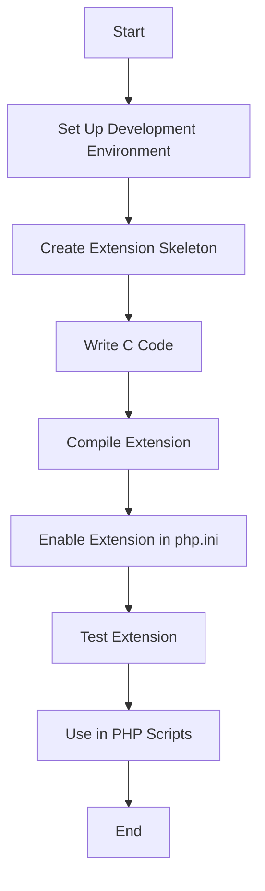

## 25.8 PHP Extensions and Scripting

In the dynamic world of PHP development, the ability to extend and enhance the language's capabilities is crucial for building robust and efficient applications. This section delves into the realm of PHP extensions and scripting, offering insights into how developers can leverage these tools to optimize performance, add new functionalities, and utilize PHP as a powerful scripting language.

### Creating Extensions

PHP extensions are a powerful way to enhance the functionality of the PHP language by writing custom modules in C. These extensions can significantly improve performance for critical applications by executing code at a lower level than PHP scripts.

#### Why Create PHP Extensions?

- **Performance Optimization:** Extensions written in C can execute faster than PHP scripts, making them ideal for performance-critical tasks.
- **Access to System-Level Resources:** Extensions can interact with system-level resources and libraries, providing capabilities that are not available in standard PHP.
- **Custom Functionality:** Developers can introduce new functions, classes, and hooks into the PHP core, tailoring the language to specific application needs.

#### Writing PHP Extensions in C

Creating a PHP extension involves several steps, from setting up the development environment to writing and compiling the C code. Below is a simplified guide to get you started:

1. **Set Up the Development Environment:**
   - Install the necessary tools and libraries, such as PHP source code, a C compiler, and the PHP development package.
   - **Link:** [PHP Extension Development](https://www.php.net/manual/en/internals2.structure.php)

2. **Create the Extension Skeleton:**
   - Use the `ext_skel` script provided by PHP to generate the basic structure of your extension.

   ```bash
   cd /path/to/php-src/ext
   ./ext_skel --extname=my_extension
   ```

3. **Write the C Code:**
   - Implement the desired functionality in C. Below is a simple example of a PHP function written in C that returns the sum of two numbers.

   ```c
   #include "php.h"

   PHP_FUNCTION(my_sum)
   {
       long a, b;

       if (zend_parse_parameters(ZEND_NUM_ARGS(), "ll", &a, &b) == FAILURE) {
           return;
       }

       RETURN_LONG(a + b);
   }

   const zend_function_entry my_extension_functions[] = {
       PHP_FE(my_sum, NULL)
       PHP_FE_END
   };

   PHP_MINIT_FUNCTION(my_extension)
   {
       return SUCCESS;
   }

   zend_module_entry my_extension_module_entry = {
       STANDARD_MODULE_HEADER,
       "my_extension",
       my_extension_functions,
       PHP_MINIT(my_extension),
       NULL,
       NULL,
       NULL,
       NULL,
       NO_VERSION_YET,
       STANDARD_MODULE_PROPERTIES
   };

   ZEND_GET_MODULE(my_extension)
   ```

4. **Compile the Extension:**
   - Use the `phpize` tool to prepare the build environment and compile the extension.

   ```bash
   phpize
   ./configure
   make
   sudo make install
   ```

5. **Enable the Extension:**
   - Add the extension to your `php.ini` file to enable it.

   ```ini
   extension=my_extension.so
   ```

6. **Test the Extension:**
   - Verify that the extension works as expected by calling the new function from a PHP script.

   ```php
   <?php
   echo my_sum(3, 4); // Outputs: 7
   ?>
   ```

### Extending Functionality

PHP's extensibility allows developers to add new functions, classes, or hooks into the PHP core, providing a tailored experience for specific applications.

#### Adding New Functions and Classes

- **Custom Functions:** Developers can create custom functions to encapsulate complex logic and reuse it across applications.
- **Custom Classes:** Object-oriented programming in PHP allows for the creation of custom classes that can be reused and extended.

#### Hooks and Event Listeners

- **Hooks:** PHP allows developers to create hooks that can be used to trigger custom code at specific points in the application lifecycle.
- **Event Listeners:** Implement event-driven programming by creating listeners that respond to specific events within the application.

### CLI Scripting

PHP is not just for web development; it can also be used as a powerful scripting language for command-line applications. This versatility makes PHP an excellent choice for automating tasks, building CLI tools, and managing server-side operations.

#### Using PHP for Command-Line Applications

- **PHP CLI:** The PHP Command Line Interface (CLI) allows developers to run PHP scripts from the command line, making it ideal for scripting and automation tasks.

```bash
php my_script.php
```

- **Command-Line Arguments:** PHP scripts can accept command-line arguments, enabling dynamic input and configuration.

```php
<?php
if ($argc > 1) {
    echo "Hello, " . $argv[1] . "!\n";
} else {
    echo "Hello, World!\n";
}
?>
```

#### Building CLI Tools with Symfony Console Component

The Symfony Console Component is a powerful library for building command-line tools in PHP. It provides a structured way to create interactive and user-friendly CLI applications.

- **Installation:**

```bash
composer require symfony/console
```

- **Creating a Command:**

```php
<?php
// src/Command/GreetCommand.php
namespace App\Command;

use Symfony\Component\Console\Command\Command;
use Symfony\Component\Console\Input\InputInterface;
use Symfony\Component\Console\Output\OutputInterface;

class GreetCommand extends Command
{
    protected static $defaultName = 'app:greet';

    protected function configure()
    {
        $this->setDescription('Greet the user.');
    }

    protected function execute(InputInterface $input, OutputInterface $output)
    {
        $output->writeln('Hello, Symfony Console!');
        return Command::SUCCESS;
    }
}
```

- **Running the Command:**

```bash
php bin/console app:greet
```

- **Link:** [Symfony Console](https://symfony.com/doc/current/components/console.html)

### Visualizing PHP Extensions and Scripting

To better understand the interaction between PHP extensions and scripting, let's visualize the process using a flowchart.



**Diagram Description:** This flowchart illustrates the process of creating a PHP extension, from setting up the development environment to using the extension in PHP scripts.

### Try It Yourself

Experiment with creating your own PHP extension by following the steps outlined above. Modify the example C code to implement different functionalities, such as string manipulation or mathematical operations. Additionally, try building a simple CLI tool using the Symfony Console Component and explore its features.

### References and Links

- [PHP Extension Development](https://www.php.net/manual/en/internals2.structure.php)
- [Symfony Console](https://symfony.com/doc/current/components/console.html)

### Knowledge Check

- What are the benefits of writing PHP extensions in C?
- How can PHP be used as a scripting language for command-line applications?
- What is the Symfony Console Component, and how does it aid in building CLI tools?

### Embrace the Journey

Remember, this is just the beginning. As you progress, you'll discover more ways to extend PHP's capabilities and build powerful applications. Keep experimenting, stay curious, and enjoy the journey!

## Quiz: PHP Extensions and Scripting



### What is the primary benefit of writing PHP extensions in C?

- [x] Performance optimization
- [ ] Easier syntax
- [ ] Better readability
- [ ] Automatic error handling

> **Explanation:** Writing PHP extensions in C allows for performance optimization by executing code at a lower level than PHP scripts.

### Which tool is used to prepare the build environment for compiling a PHP extension?

- [x] phpize
- [ ] composer
- [ ] npm
- [ ] make

> **Explanation:** The `phpize` tool is used to prepare the build environment for compiling a PHP extension.

### What is the purpose of the Symfony Console Component?

- [x] To build command-line tools in PHP
- [ ] To create web applications
- [ ] To manage database connections
- [ ] To handle HTTP requests

> **Explanation:** The Symfony Console Component is used to build command-line tools in PHP, providing a structured way to create interactive CLI applications.

### How can PHP scripts accept command-line arguments?

- [x] Using the $argv array
- [ ] Using $_GET
- [ ] Using $_POST
- [ ] Using $_SESSION

> **Explanation:** PHP scripts can accept command-line arguments using the `$argv` array, which contains the arguments passed to the script.

### Which command is used to run a PHP script from the command line?

- [x] php my_script.php
- [ ] run my_script.php
- [ ] execute my_script.php
- [ ] start my_script.php

> **Explanation:** The `php my_script.php` command is used to run a PHP script from the command line.

### What is the default name of a Symfony Console command?

- [x] app:greet
- [ ] command:run
- [ ] cli:execute
- [ ] console:start

> **Explanation:** In the example provided, the default name of the Symfony Console command is `app:greet`.

### What is the role of the `php.ini` file in enabling PHP extensions?

- [x] It specifies which extensions to load
- [ ] It configures database connections
- [ ] It defines routing rules
- [ ] It manages user sessions

> **Explanation:** The `php.ini` file specifies which PHP extensions to load, enabling them for use in PHP scripts.

### What is the purpose of the `ext_skel` script?

- [x] To generate the basic structure of a PHP extension
- [ ] To compile PHP scripts
- [ ] To manage dependencies
- [ ] To create database schemas

> **Explanation:** The `ext_skel` script is used to generate the basic structure of a PHP extension, providing a starting point for development.

### Which PHP function is used to parse command-line arguments in a custom function?

- [x] zend_parse_parameters
- [ ] parse_str
- [ ] explode
- [ ] implode

> **Explanation:** The `zend_parse_parameters` function is used to parse command-line arguments in a custom PHP function written in C.

### True or False: PHP can only be used for web development.

- [ ] True
- [x] False

> **Explanation:** False. PHP can be used for both web development and command-line scripting, making it a versatile language for various applications.


