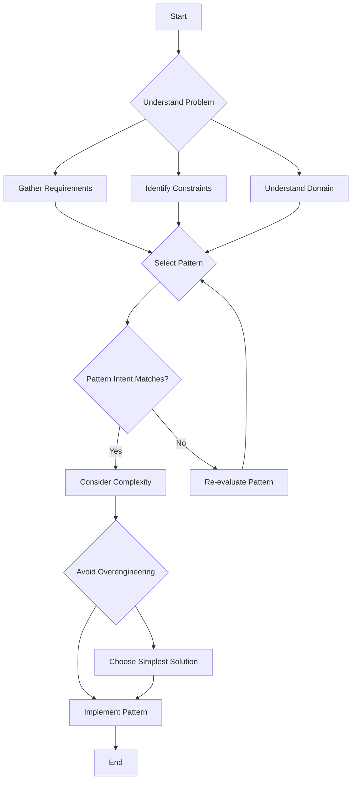

## 26.1 Selecting the Right Pattern for the Problem

In the realm of software development, design patterns serve as tried-and-tested solutions to common problems. However, selecting the right pattern for a given problem is crucial to ensure that the solution is both effective and efficient. In this section, we will explore the process of selecting the right design pattern for PHP development, focusing on assessing the problem, understanding pattern selection criteria, and avoiding overengineering.

### Assessing the Problem

Before diving into pattern selection, it's essential to thoroughly understand the problem you're trying to solve. This involves analyzing specific requirements, constraints, and the overall context of the problem domain.

#### Analyze the Specific Requirements and Constraints

1. **Gather Requirements:** Start by collecting all the functional and non-functional requirements of the project. This includes understanding what the system needs to accomplish and any performance, security, or scalability considerations.

2. **Identify Constraints:** Determine any constraints that might affect your design choices, such as time, budget, technology stack, or team expertise.

3. **Understand the Domain:** Gain a deep understanding of the problem domain. This involves knowing the business logic, user expectations, and any domain-specific challenges.

#### Understand the Context and the Problem Domain Thoroughly

1. **Contextual Analysis:** Consider the environment in which the application will operate. This includes the hardware, network, and any external systems it will interact with.

2. **Problem Domain Exploration:** Dive into the specifics of the problem domain. Identify any patterns or practices that are commonly used in this domain.

3. **Stakeholder Communication:** Engage with stakeholders to ensure that you have a comprehensive understanding of their needs and expectations.

### Pattern Selection Criteria

Once you have a clear understanding of the problem, the next step is to select a design pattern that aligns with the problem's requirements and constraints.

#### Match the Intent of the Pattern with the Problem at Hand

1. **Pattern Intent:** Each design pattern has a specific intent or purpose. Ensure that the pattern you choose aligns with the problem you're trying to solve. For example, if you need to create a family of related objects, consider the Abstract Factory pattern.

2. **Pattern Applicability:** Evaluate whether the pattern is applicable to the problem. Some patterns are more suited to certain types of problems than others.

3. **Pattern Consequences:** Consider the consequences of using the pattern. This includes understanding the trade-offs and potential impacts on the system's architecture.

#### Consider the Complexity and Overhead of Implementing the Pattern

1. **Implementation Complexity:** Assess the complexity of implementing the pattern. Some patterns may introduce significant complexity, which can be a burden if not justified by the problem's requirements.

2. **Performance Overhead:** Consider any performance overhead associated with the pattern. Some patterns may introduce additional processing or memory usage.

3. **Maintainability:** Evaluate how the pattern will affect the maintainability of the codebase. Patterns that are difficult to understand or modify can lead to technical debt.

### Avoiding Overengineering

While design patterns can provide elegant solutions, it's important to avoid overengineering by introducing unnecessary complexity.

#### Choose the Simplest Solution That Effectively Solves the Problem

1. **Simplicity:** Strive for simplicity in your design. Choose the simplest pattern that effectively addresses the problem without adding unnecessary complexity.

2. **YAGNI Principle:** Follow the "You Aren't Gonna Need It" (YAGNI) principle. Avoid implementing features or patterns that are not currently needed.

3. **Iterative Development:** Use an iterative development approach to refine the solution over time. Start with a simple design and evolve it as requirements change.

#### Be Cautious of Introducing Unnecessary Patterns

1. **Pattern Overuse:** Avoid the temptation to use patterns for the sake of using them. Patterns should be applied only when they provide a clear benefit.

2. **Pattern Misuse:** Be aware of the potential for pattern misuse. Ensure that the pattern is being used appropriately and not forced into a situation where it doesn't fit.

3. **Pattern Combinations:** Be cautious when combining multiple patterns. While some patterns complement each other, others can introduce unnecessary complexity.

### Code Examples

Let's explore some code examples to illustrate the process of selecting the right pattern for a problem.

#### Example 1: Singleton Pattern

**Problem:** You need to ensure that a class has only one instance and provide a global point of access to it.

**Solution:** Use the Singleton pattern.

```php
<?php

class DatabaseConnection {
    private static $instance = null;
    private $connection;

    // Private constructor to prevent multiple instances
    private function __construct() {
        $this->connection = new PDO('mysql:host=localhost;dbname=test', 'user', 'password');
    }

    // Static method to get the single instance
    public static function getInstance() {
        if (self::$instance === null) {
            self::$instance = new DatabaseConnection();
        }
        return self::$instance;
    }

    public function getConnection() {
        return $this->connection;
    }
}

// Usage
$dbConnection = DatabaseConnection::getInstance();
$conn = $dbConnection->getConnection();
```

**Explanation:** The Singleton pattern ensures that only one instance of the `DatabaseConnection` class is created. This is useful when you need a single point of access to a resource, such as a database connection.

#### Example 2: Strategy Pattern

**Problem:** You need to define a family of algorithms, encapsulate each one, and make them interchangeable.

**Solution:** Use the Strategy pattern.

```php
<?php

interface PaymentStrategy {
    public function pay($amount);
}

class CreditCardPayment implements PaymentStrategy {
    public function pay($amount) {
        echo "Paying $amount using Credit Card.";
    }
}

class PayPalPayment implements PaymentStrategy {
    public function pay($amount) {
        echo "Paying $amount using PayPal.";
    }
}

class ShoppingCart {
    private $paymentStrategy;

    public function __construct(PaymentStrategy $paymentStrategy) {
        $this->paymentStrategy = $paymentStrategy;
    }

    public function checkout($amount) {
        $this->paymentStrategy->pay($amount);
    }
}

// Usage
$cart = new ShoppingCart(new PayPalPayment());
$cart->checkout(100);
```

**Explanation:** The Strategy pattern allows you to define different payment strategies and switch between them at runtime. This is useful when you need to support multiple algorithms or behaviors.

### Visualizing Pattern Selection

To better understand the process of selecting the right pattern, let's visualize it using a flowchart.



**Description:** This flowchart illustrates the process of selecting the right design pattern. It starts with understanding the problem, selecting a pattern based on intent, considering complexity, and avoiding overengineering.

### References and Links

- [Design Patterns: Elements of Reusable Object-Oriented Software](https://en.wikipedia.org/wiki/Design_Patterns) - A foundational book on design patterns.
- [PHP: The Right Way](https://phptherightway.com/) - A community-driven guide to best practices in PHP.
- [Refactoring Guru: Design Patterns](https://refactoring.guru/design-patterns) - A comprehensive resource on design patterns.

### Knowledge Check

- What are the key steps in assessing a problem before selecting a design pattern?
- How can you ensure that the pattern you choose aligns with the problem's requirements?
- Why is it important to avoid overengineering when selecting a design pattern?

### Embrace the Journey

Remember, selecting the right design pattern is an iterative process. As you gain experience, you'll become more adept at recognizing patterns and applying them effectively. Keep experimenting, stay curious, and enjoy the journey of mastering design patterns in PHP!

### Quiz: Selecting the Right Pattern for the Problem



### What is the first step in selecting the right design pattern for a problem?

- [x] Analyze the specific requirements and constraints.
- [ ] Implement a prototype solution.
- [ ] Choose the most popular design pattern.
- [ ] Consult with other developers.

> **Explanation:** Analyzing the specific requirements and constraints is crucial to understanding the problem and selecting the appropriate design pattern.

### Which principle advises against implementing features that are not currently needed?

- [x] YAGNI (You Aren't Gonna Need It)
- [ ] DRY (Don't Repeat Yourself)
- [ ] SOLID
- [ ] KISS (Keep It Simple, Stupid)

> **Explanation:** The YAGNI principle advises against implementing features that are not currently needed, helping to avoid overengineering.

### What should you consider when evaluating the complexity of implementing a design pattern?

- [x] Implementation complexity, performance overhead, and maintainability.
- [ ] Only the performance overhead.
- [ ] The popularity of the pattern.
- [ ] The number of lines of code.

> **Explanation:** Evaluating the complexity of implementing a design pattern involves considering implementation complexity, performance overhead, and maintainability.

### Why is it important to match the intent of a pattern with the problem at hand?

- [x] To ensure the pattern effectively addresses the problem.
- [ ] To make the code more complex.
- [ ] To use as many patterns as possible.
- [ ] To impress other developers.

> **Explanation:** Matching the intent of a pattern with the problem ensures that the pattern effectively addresses the problem without unnecessary complexity.

### How can you avoid overengineering when selecting a design pattern?

- [x] Choose the simplest solution that effectively solves the problem.
- [ ] Use as many patterns as possible.
- [ ] Focus on future-proofing the design.
- [ ] Implement complex solutions for simple problems.

> **Explanation:** Avoiding overengineering involves choosing the simplest solution that effectively solves the problem, preventing unnecessary complexity.

### What is the role of stakeholder communication in assessing a problem?

- [x] To ensure a comprehensive understanding of needs and expectations.
- [ ] To finalize the design pattern choice.
- [ ] To delegate design decisions.
- [ ] To avoid misunderstandings.

> **Explanation:** Stakeholder communication ensures a comprehensive understanding of needs and expectations, which is crucial for assessing the problem accurately.

### Which pattern is suitable for ensuring a class has only one instance?

- [x] Singleton Pattern
- [ ] Strategy Pattern
- [ ] Observer Pattern
- [ ] Factory Pattern

> **Explanation:** The Singleton pattern is suitable for ensuring a class has only one instance and provides a global point of access to it.

### What is a potential consequence of pattern misuse?

- [x] Introducing unnecessary complexity.
- [ ] Simplifying the codebase.
- [ ] Improving performance.
- [ ] Enhancing maintainability.

> **Explanation:** Pattern misuse can introduce unnecessary complexity, making the codebase harder to understand and maintain.

### What is the benefit of using an iterative development approach?

- [x] It allows for refining the solution over time.
- [ ] It finalizes the design early.
- [ ] It eliminates the need for stakeholder communication.
- [ ] It reduces the need for testing.

> **Explanation:** An iterative development approach allows for refining the solution over time, adapting to changing requirements and improving the design.

### True or False: Combining multiple patterns is always beneficial.

- [ ] True
- [x] False

> **Explanation:** Combining multiple patterns is not always beneficial, as it can introduce unnecessary complexity. It's important to ensure that the combination provides a clear benefit.


