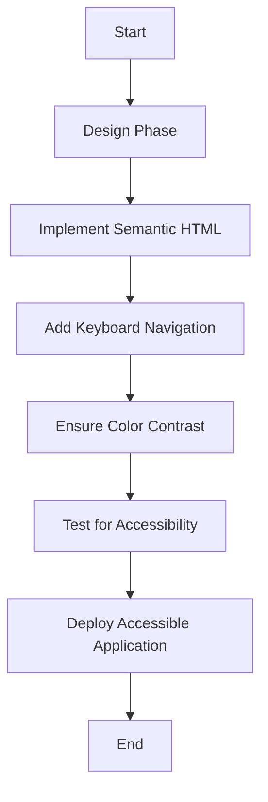

## 26.10 Designing for Accessibility and Inclusivity

In today's digital age, designing for accessibility and inclusivity is not just a best practice but a necessity. As developers, we have the responsibility to ensure that our applications are usable by everyone, regardless of their abilities or disabilities. This section will guide you through the principles and practices of designing accessible and inclusive PHP applications.

### Understanding Accessibility and Inclusivity

**Accessibility** refers to the design of products, devices, services, or environments for people with disabilities. It ensures that everyone, including those with visual, auditory, motor, or cognitive impairments, can use your application effectively.

**Inclusivity**, on the other hand, is about creating a welcoming environment for all users, considering diverse backgrounds, languages, and cultures. It goes beyond accessibility to ensure that everyone feels represented and valued.

### Accessibility Standards

To create accessible applications, it's crucial to comply with established guidelines and standards. The most widely recognized standard is the Web Content Accessibility Guidelines (WCAG), which provides a comprehensive framework for making web content more accessible.

- **Comply with WCAG Guidelines:** The WCAG guidelines are organized around four principles: Perceivable, Operable, Understandable, and Robust (POUR). Each principle contains specific guidelines and success criteria to help developers create accessible content.
  - **Link:** [WCAG Guidelines](https://www.w3.org/WAI/standards-guidelines/wcag/)

### Implementing Accessible Design

Implementing accessible design involves several key practices that ensure your application is usable by everyone.

#### Use Semantic HTML

Semantic HTML is the foundation of accessible web design. It involves using HTML elements according to their intended purpose, which helps assistive technologies understand and navigate your content.

```php
<!DOCTYPE html>
<html lang="en">
<head>
    <meta charset="UTF-8">
    <meta name="viewport" content="width=device-width, initial-scale=1.0">
    <title>Accessible Web Page</title>
</head>
<body>
    <header>
        <h1>Welcome to Our Accessible Website</h1>
    </header>
    <nav>
        <ul>
            <li><a href="#home">Home</a></li>
            <li><a href="#about">About</a></li>
            <li><a href="#contact">Contact</a></li>
        </ul>
    </nav>
    <main>
        <section id="home">
            <h2>Home</h2>
            <p>This is the home section of our website.</p>
        </section>
        <section id="about">
            <h2>About Us</h2>
            <p>Learn more about our mission and values.</p>
        </section>
        <section id="contact">
            <h2>Contact Us</h2>
            <form>
                <label for="name">Name:</label>
                <input type="text" id="name" name="name" required>
                <label for="email">Email:</label>
                <input type="email" id="email" name="email" required>
                <button type="submit">Submit</button>
            </form>
        </section>
    </main>
    <footer>
        <p>&copy; 2024 Accessible Web</p>
    </footer>
</body>
</html>
```

**Explanation:** This example uses semantic HTML elements like `<header>`, `<nav>`, `<main>`, `<section>`, and `<footer>` to structure the content meaningfully. This helps screen readers and other assistive technologies interpret the page correctly.

#### Provide Keyboard Navigation

Many users rely on keyboards or other input devices instead of a mouse. Ensuring that your application is fully navigable via keyboard is a critical aspect of accessibility.

- **Focus Management:** Use the `tabindex` attribute to control the tab order and ensure logical navigation.
- **Skip Links:** Provide skip links to allow users to bypass repetitive content.

```php
<a href="#maincontent" class="skip-link">Skip to main content</a>
```

**Explanation:** The skip link allows users to jump directly to the main content, improving navigation efficiency for keyboard users.

#### Ensure Sufficient Color Contrast

Color contrast is essential for users with visual impairments, including color blindness. Ensure that text and background colors have sufficient contrast to be easily readable.

- **Use Tools:** Utilize tools like the [WebAIM Contrast Checker](https://webaim.org/resources/contrastchecker/) to verify color contrast ratios.

### Testing for Accessibility

Testing your application for accessibility is crucial to identify and fix potential issues. Several tools can help automate this process.

- **Axe Accessibility Tool:** A browser extension that analyzes web pages for accessibility issues.
  - **Link:** [Axe Accessibility Tool](https://www.deque.com/axe/)
- **Lighthouse:** A tool integrated into Chrome DevTools that provides audits for performance, accessibility, and more.

### Benefits of Accessible Design

Designing for accessibility and inclusivity offers numerous benefits:

- **Enhance User Experience:** Accessible design improves the usability of your application for all users, not just those with disabilities.
- **Improve SEO:** Search engines favor accessible websites, which can lead to better rankings and increased visibility.
- **Reach a Broader Audience:** By making your application accessible, you can reach a wider audience, including people with disabilities and those using assistive technologies.

### Visualizing Accessibility in Web Design

To better understand how accessibility fits into web design, let's visualize the process using a flowchart.



**Description:** This flowchart outlines the steps involved in designing an accessible web application, from the initial design phase to deployment.

### Try It Yourself

Experiment with the code examples provided by modifying the HTML structure or styles. Try adding ARIA attributes to enhance accessibility further. For instance, add `aria-label` to buttons or links to provide additional context for screen readers.

### Knowledge Check

- **Question:** What are the four principles of the WCAG guidelines?
- **Exercise:** Use the Axe Accessibility Tool to analyze a web page you have developed. Identify and fix any accessibility issues found.

### Embrace the Journey

Remember, designing for accessibility and inclusivity is an ongoing process. As you continue to develop your skills, you'll find new ways to make your applications more accessible and inclusive. Keep learning, stay curious, and strive to create a web that everyone can enjoy.

## Quiz: Designing for Accessibility and Inclusivity



### What is the primary purpose of semantic HTML?

- [x] To provide meaning and structure to web content
- [ ] To enhance the visual appearance of a webpage
- [ ] To improve server-side processing speed
- [ ] To reduce the size of HTML files

> **Explanation:** Semantic HTML provides meaning and structure to web content, making it easier for assistive technologies to interpret.

### Which tool can be used to test web pages for accessibility issues?

- [x] Axe Accessibility Tool
- [ ] Google Analytics
- [ ] Photoshop
- [ ] MySQL Workbench

> **Explanation:** The Axe Accessibility Tool is specifically designed to analyze web pages for accessibility issues.

### What is the benefit of providing keyboard navigation in web applications?

- [x] It allows users who cannot use a mouse to navigate the application
- [ ] It improves the visual design of the application
- [ ] It reduces the application load time
- [ ] It increases the number of HTTP requests

> **Explanation:** Keyboard navigation is crucial for users who rely on keyboards or other input devices instead of a mouse.

### Why is color contrast important in web design?

- [x] It ensures text is readable for users with visual impairments
- [ ] It enhances the aesthetic appeal of the website
- [ ] It reduces the bandwidth usage of the site
- [ ] It speeds up the loading time of images

> **Explanation:** Sufficient color contrast ensures that text is readable for users with visual impairments, including color blindness.

### What is the role of ARIA attributes in web accessibility?

- [x] They provide additional context for screen readers
- [ ] They reduce the size of HTML files
- [x] They enhance the functionality of JavaScript
- [ ] They improve server-side processing

> **Explanation:** ARIA attributes provide additional context for screen readers, enhancing accessibility for users with disabilities.

### Which principle is NOT part of the WCAG guidelines?

- [ ] Perceivable
- [ ] Operable
- [ ] Understandable
- [x] Scalable

> **Explanation:** The WCAG guidelines are based on the principles of Perceivable, Operable, Understandable, and Robust.

### How can you ensure your web application is accessible to users with color blindness?

- [x] Use tools to verify color contrast ratios
- [ ] Use only grayscale colors
- [x] Avoid using any colors
- [ ] Use bright colors only

> **Explanation:** Using tools to verify color contrast ratios ensures that your application is accessible to users with color blindness.

### What is the benefit of using semantic HTML?

- [x] It improves accessibility for assistive technologies
- [ ] It reduces the server load
- [ ] It increases the download speed of images
- [ ] It enhances the visual design of the webpage

> **Explanation:** Semantic HTML improves accessibility by providing a meaningful structure that assistive technologies can interpret.

### Which of the following is a benefit of designing for accessibility?

- [x] Improved SEO
- [ ] Increased server load
- [ ] Reduced user engagement
- [ ] Decreased application performance

> **Explanation:** Designing for accessibility can improve SEO, as search engines favor accessible websites.

### True or False: Accessibility only benefits users with disabilities.

- [ ] True
- [x] False

> **Explanation:** Accessibility benefits all users by improving the overall usability and experience of the application.


