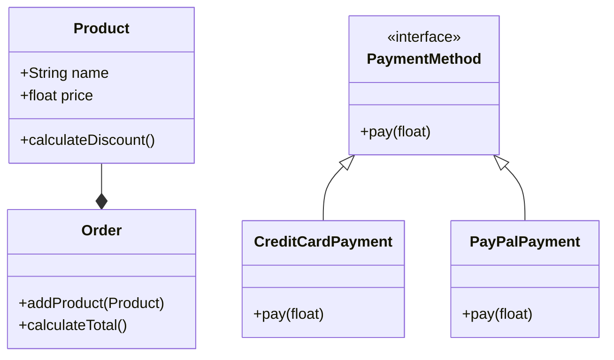

## 26.2 Understanding Design Principles

In the realm of software development, design principles serve as the bedrock for creating robust, maintainable, and scalable applications. For PHP developers, understanding and applying these principles is crucial to crafting high-quality code that stands the test of time. In this section, we will delve into the core design principles that every PHP developer should master, including the SOLID principles, DRY, and KISS. We will explore how these principles can be applied in PHP development, supported by practical examples and visual aids.

### Fundamental Principles

#### SOLID Principles

The SOLID principles are a set of five design principles intended to make software designs more understandable, flexible, and maintainable. Let's explore each principle in detail:

##### 1. Single Responsibility Principle (SRP)

**Definition:** A class should have only one reason to change, meaning it should have only one job or responsibility.

**Explanation:** By adhering to SRP, we ensure that each class in our application is focused on a single task. This makes the class easier to understand, test, and maintain. When a class has multiple responsibilities, changes to one responsibility can affect others, leading to a fragile design.

**Example:**

```php
<?php

class Invoice {
    private $amount;

    public function __construct($amount) {
        $this->amount = $amount;
    }

    public function calculateTotal() {
        // Calculate total amount logic
    }
}

class InvoicePrinter {
    public function print(Invoice $invoice) {
        // Print invoice logic
    }
}

class InvoiceSaver {
    public function save(Invoice $invoice) {
        // Save invoice logic
    }
}
```

**Explanation:** In this example, the `Invoice` class is responsible only for handling invoice data. The `InvoicePrinter` and `InvoiceSaver` classes handle printing and saving, respectively, adhering to the SRP.

##### 2. Open/Closed Principle (OCP)

**Definition:** Software entities (classes, modules, functions, etc.) should be open for extension but closed for modification.

**Explanation:** OCP encourages developers to extend existing code rather than modifying it. This is achieved through abstraction and polymorphism, allowing new functionality to be added with minimal impact on existing code.

**Example:**

```php
<?php

interface PaymentMethod {
    public function pay($amount);
}

class CreditCardPayment implements PaymentMethod {
    public function pay($amount) {
        // Credit card payment logic
    }
}

class PayPalPayment implements PaymentMethod {
    public function pay($amount) {
        // PayPal payment logic
    }
}

class PaymentProcessor {
    public function process(PaymentMethod $paymentMethod, $amount) {
        $paymentMethod->pay($amount);
    }
}
```

**Explanation:** The `PaymentProcessor` class can process any payment method that implements the `PaymentMethod` interface, allowing new payment methods to be added without modifying existing code.

##### 3. Liskov Substitution Principle (LSP)

**Definition:** Objects of a superclass should be replaceable with objects of a subclass without affecting the correctness of the program.

**Explanation:** LSP ensures that a subclass can stand in for its superclass without altering the desirable properties of the program. This principle is crucial for achieving polymorphism in object-oriented design.

**Example:**

```php
<?php

class Bird {
    public function fly() {
        // Flying logic
    }
}

class Sparrow extends Bird {
    // Inherits fly method
}

class Ostrich extends Bird {
    public function fly() {
        throw new Exception("Ostriches can't fly");
    }
}
```

**Explanation:** In this example, `Ostrich` violates LSP because it cannot be substituted for `Bird` without altering the program's behavior. A better design would involve creating a separate class hierarchy for flightless birds.

##### 4. Interface Segregation Principle (ISP)

**Definition:** No client should be forced to depend on methods it does not use.

**Explanation:** ISP encourages the creation of smaller, more specific interfaces rather than large, general-purpose ones. This reduces the impact of changes and promotes a more modular design.

**Example:**

```php
<?php

interface Printer {
    public function print();
}

interface Scanner {
    public function scan();
}

class MultiFunctionPrinter implements Printer, Scanner {
    public function print() {
        // Print logic
    }

    public function scan() {
        // Scan logic
    }
}

class SimplePrinter implements Printer {
    public function print() {
        // Print logic
    }
}
```

**Explanation:** By separating the `Printer` and `Scanner` interfaces, we allow classes to implement only the functionality they need, adhering to ISP.

##### 5. Dependency Inversion Principle (DIP)

**Definition:** Depend on abstractions, not on concretions.

**Explanation:** DIP suggests that high-level modules should not depend on low-level modules. Both should depend on abstractions. This principle promotes loose coupling and enhances code flexibility.

**Example:**

```php
<?php

interface Logger {
    public function log($message);
}

class FileLogger implements Logger {
    public function log($message) {
        // Log to file logic
    }
}

class Application {
    private $logger;

    public function __construct(Logger $logger) {
        $this->logger = $logger;
    }

    public function run() {
        $this->logger->log("Application started");
    }
}
```

**Explanation:** The `Application` class depends on the `Logger` interface rather than a specific implementation, allowing different logging mechanisms to be used interchangeably.

#### DRY (Don't Repeat Yourself)

**Definition:** Eliminate duplicate code by abstracting common functionality.

**Explanation:** The DRY principle emphasizes reducing repetition in code. By abstracting common functionality, we can improve maintainability and reduce the risk of errors.

**Example:**

```php
<?php

function calculateDiscount($amount, $discountRate) {
    return $amount - ($amount * $discountRate);
}

$price1 = calculateDiscount(100, 0.1);
$price2 = calculateDiscount(200, 0.15);
```

**Explanation:** The `calculateDiscount` function encapsulates the discount calculation logic, eliminating the need to repeat this logic throughout the codebase.

#### KISS (Keep It Simple, Stupid)

**Definition:** Strive for simplicity; avoid unnecessary complexity.

**Explanation:** The KISS principle advocates for simplicity in design. Complex solutions are more prone to errors and harder to maintain. By keeping designs simple, we can create more reliable and understandable code.

**Example:**

```php
<?php

function isEven($number) {
    return $number % 2 === 0;
}
```

**Explanation:** This simple function checks if a number is even. A more complex solution would be unnecessary and violate the KISS principle.

### Applying Principles

#### Integrating Principles into Everyday Coding Practices

To effectively apply these principles, developers should:

- **Refactor regularly:** Continuously improve code by applying design principles during refactoring sessions.
- **Review code:** Conduct code reviews to ensure adherence to design principles.
- **Educate team members:** Share knowledge about design principles with team members to foster a culture of quality.

#### Balancing Theoretical Ideals with Practical Implementation

While design principles provide a theoretical foundation, practical implementation requires balancing these ideals with real-world constraints. Developers should:

- **Consider context:** Apply principles based on the specific context and requirements of the project.
- **Avoid over-engineering:** Use principles judiciously to prevent unnecessary complexity.
- **Prioritize maintainability:** Focus on creating code that is easy to understand and maintain.

### Visualizing Design Principles

To further illustrate these principles, let's use a class diagram to visualize the application of the SOLID principles in a hypothetical e-commerce system.



**Description:** This diagram represents a simple e-commerce system where `Product` and `Order` classes adhere to SRP, `PaymentMethod` interface follows OCP, and `CreditCardPayment` and `PayPalPayment` classes demonstrate DIP.

### References and Links

For further reading on design principles, consider exploring the following resources:

- [SOLID Principles on Wikipedia](https://en.wikipedia.org/wiki/SOLID)
- [DRY Principle on Wikipedia](https://en.wikipedia.org/wiki/Don%27t_repeat_yourself)
- [KISS Principle on Wikipedia](https://en.wikipedia.org/wiki/KISS_principle)

### Knowledge Check

To reinforce your understanding of design principles, consider the following questions:

- How can you apply the Single Responsibility Principle in a PHP application?
- What are the benefits of adhering to the Open/Closed Principle?
- How does the Liskov Substitution Principle enhance polymorphism?
- Why is the Interface Segregation Principle important for modular design?
- How does the Dependency Inversion Principle promote loose coupling?

### Embrace the Journey

Remember, mastering design principles is an ongoing journey. As you continue to apply these principles in your PHP development, you'll find your code becoming more robust, maintainable, and scalable. Keep experimenting, stay curious, and enjoy the process of continuous improvement!

## Quiz: Understanding Design Principles



### Which principle states that a class should have only one reason to change?

- [x] Single Responsibility Principle
- [ ] Open/Closed Principle
- [ ] Liskov Substitution Principle
- [ ] Interface Segregation Principle

> **Explanation:** The Single Responsibility Principle emphasizes that a class should have only one responsibility, leading to a single reason for change.


### What does the Open/Closed Principle advocate for?

- [x] Open for extension, closed for modification
- [ ] Open for modification, closed for extension
- [ ] Open for both extension and modification
- [ ] Closed for both extension and modification

> **Explanation:** The Open/Closed Principle suggests that software entities should be open for extension but closed for modification, promoting flexibility and stability.


### Which principle ensures that subtypes can replace their base types without affecting program correctness?

- [x] Liskov Substitution Principle
- [ ] Single Responsibility Principle
- [ ] Dependency Inversion Principle
- [ ] Interface Segregation Principle

> **Explanation:** The Liskov Substitution Principle ensures that objects of a superclass can be replaced with objects of a subclass without altering the program's desirable properties.


### What is the main focus of the Interface Segregation Principle?

- [x] Creating smaller, more specific interfaces
- [ ] Creating larger, general-purpose interfaces
- [ ] Eliminating interfaces altogether
- [ ] Combining multiple interfaces into one

> **Explanation:** The Interface Segregation Principle encourages the creation of smaller, more specific interfaces to reduce the impact of changes and promote modularity.


### How does the Dependency Inversion Principle promote loose coupling?

- [x] By depending on abstractions rather than concretions
- [ ] By depending on concretions rather than abstractions
- [ ] By eliminating dependencies altogether
- [ ] By increasing the number of dependencies

> **Explanation:** The Dependency Inversion Principle promotes loose coupling by suggesting that high-level modules should depend on abstractions, not on low-level modules.


### What does the DRY principle emphasize?

- [x] Eliminating duplicate code
- [ ] Increasing code repetition
- [ ] Writing more code
- [ ] Ignoring code duplication

> **Explanation:** The DRY (Don't Repeat Yourself) principle emphasizes reducing repetition in code by abstracting common functionality.


### What is the main goal of the KISS principle?

- [x] Striving for simplicity
- [ ] Increasing complexity
- [ ] Writing more complex code
- [ ] Ignoring simplicity

> **Explanation:** The KISS (Keep It Simple, Stupid) principle advocates for simplicity in design, avoiding unnecessary complexity.


### Which principle is violated if a subclass cannot replace its superclass without altering program behavior?

- [x] Liskov Substitution Principle
- [ ] Single Responsibility Principle
- [ ] Open/Closed Principle
- [ ] Interface Segregation Principle

> **Explanation:** The Liskov Substitution Principle is violated if a subclass cannot replace its superclass without affecting the program's behavior.


### What is a key benefit of applying design principles in PHP development?

- [x] Improved code maintainability
- [ ] Increased code complexity
- [ ] Reduced code readability
- [ ] Increased number of bugs

> **Explanation:** Applying design principles leads to improved code maintainability, making it easier to understand, test, and extend.


### True or False: The SOLID principles are only applicable to PHP development.

- [ ] True
- [x] False

> **Explanation:** The SOLID principles are applicable to object-oriented programming in general, not just PHP development.


