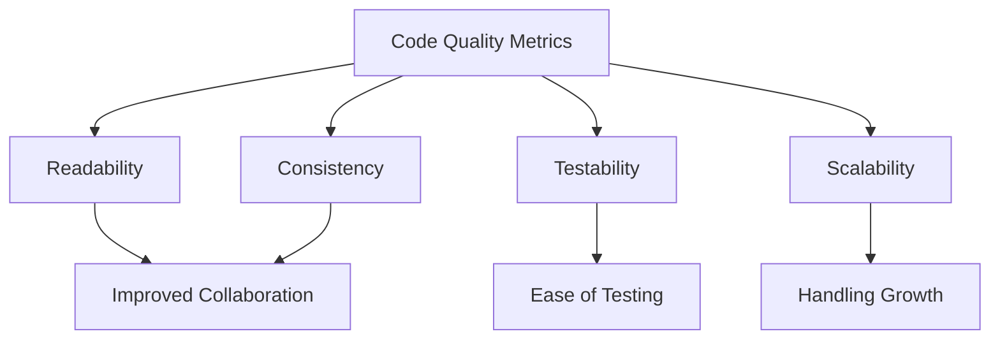

## 26.3 Ensuring Code Quality and Maintainability

In the world of software development, ensuring code quality and maintainability is crucial for building robust, scalable, and efficient applications. This section delves into the key concepts, best practices, and tools that can help PHP developers maintain high standards of code quality and ensure long-term maintainability.

### Understanding Code Quality and Maintainability

**Code Quality** refers to the degree to which code adheres to established standards and best practices, making it easy to read, understand, and modify. High-quality code is typically characterized by:

- **Readability:** Code should be easy to read and understand, even for someone who did not write it.
- **Consistency:** Code should follow consistent patterns and conventions throughout the project.
- **Testability:** Code should be easy to test, with clear inputs and outputs.
- **Scalability:** Code should be designed to handle growth in terms of both functionality and data volume.

**Maintainability** is the ease with which code can be modified to fix defects, improve performance, or adapt to a changing environment. It involves:

- **Modularity:** Code should be organized into distinct modules or components.
- **Reusability:** Code should be written in a way that allows it to be reused in different parts of the application.
- **Documentation:** Code should be well-documented to provide context and explanations for complex logic.

### Best Practices for Code Quality and Maintainability

#### Write Clean and Self-Documenting Code

Clean code is the foundation of quality and maintainability. It should be simple, clear, and concise. Here are some tips for writing clean code:

- **Use meaningful names:** Choose descriptive names for variables, functions, and classes that convey their purpose.
- **Keep functions small:** Each function should perform a single task or responsibility.
- **Avoid deep nesting:** Limit the use of nested loops and conditionals to improve readability.
- **Remove dead code:** Eliminate unused code to reduce clutter and potential confusion.

#### Adhere to Coding Standards

Following coding standards ensures consistency across the codebase, making it easier for teams to collaborate. The PHP community has established several standards, such as PSR-12, which provides guidelines for code style and structure.

- **PSR-12:** This standard extends PSR-1 and PSR-2, providing a comprehensive guide for coding style in PHP. It covers aspects like indentation, line length, and naming conventions.

#### Use Descriptive Naming Conventions

Descriptive naming conventions enhance readability and understanding. Here are some guidelines:

- **Variables:** Use nouns that describe the data they hold (e.g., `$userName`, `$orderList`).
- **Functions:** Use verbs that describe the action they perform (e.g., `calculateTotal()`, `fetchUserData()`).
- **Classes:** Use nouns that represent the entity they model (e.g., `User`, `OrderManager`).

### Tools for Quality Assurance

To maintain high code quality, developers can leverage various tools that automate code analysis and enforce standards.

#### PHP_CodeSniffer

PHP_CodeSniffer is a tool that detects violations of coding standards. It helps ensure that your code adheres to the defined style guide.

- **Installation:** You can install PHP_CodeSniffer via Composer:
  ```bash
  composer require "squizlabs/php_codesniffer=*"
  ```
- **Usage:** Run the tool on your codebase to identify and fix style violations:
  ```bash
  ./vendor/bin/phpcs /path/to/code
  ```

#### PHPMD (PHP Mess Detector)

PHPMD is a tool that scans your code for potential problems, such as unused variables, overly complex functions, and code duplication.

- **Installation:** Install PHPMD using Composer:
  ```bash
  composer require phpmd/phpmd
  ```
- **Usage:** Analyze your code to detect potential issues:
  ```bash
  ./vendor/bin/phpmd /path/to/code text codesize,unusedcode,naming
  ```

#### PHPStan and Psalm

PHPStan and Psalm are static analysis tools that help identify bugs and potential issues in your code without executing it.

- **PHPStan:** Focuses on finding bugs and improving code quality.
  - **Installation:** Use Composer to install PHPStan:
    ```bash
    composer require --dev phpstan/phpstan
    ```
  - **Usage:** Run PHPStan to analyze your code:
    ```bash
    ./vendor/bin/phpstan analyse src
    ```

- **Psalm:** Offers advanced type inference and error detection.
  - **Installation:** Install Psalm via Composer:
    ```bash
    composer require --dev vimeo/psalm
    ```
  - **Usage:** Use Psalm to check your code:
    ```bash
    ./vendor/bin/psalm
    ```

### Code Examples

Let's explore some code examples that demonstrate best practices for code quality and maintainability.

#### Example 1: Clean and Readable Code

```php
<?php

class OrderProcessor
{
    private $orders;

    public function __construct(array $orders)
    {
        $this->orders = $orders;
    }

    public function calculateTotal(): float
    {
        $total = 0.0;
        foreach ($this->orders as $order) {
            $total += $order->getAmount();
        }
        return $total;
    }
}

// Usage
$orderProcessor = new OrderProcessor($orders);
echo "Total Order Amount: " . $orderProcessor->calculateTotal();
```

**Explanation:**
- The `OrderProcessor` class is responsible for processing orders and calculating the total amount.
- The `calculateTotal` method is concise and performs a single responsibility.
- Descriptive naming conventions are used for the class, method, and variables.

#### Example 2: Using PHP_CodeSniffer

```bash
# Install PHP_CodeSniffer
composer require "squizlabs/php_codesniffer=*"

# Run PHP_CodeSniffer on a directory
./vendor/bin/phpcs /path/to/code
```

**Explanation:**
- PHP_CodeSniffer is installed via Composer.
- The tool is run on a specified directory to check for coding standard violations.

### Visualizing Code Quality Metrics

To better understand the importance of code quality metrics, let's visualize the relationship between different metrics and their impact on code maintainability.



**Diagram Explanation:**
- The diagram illustrates how various code quality metrics contribute to overall maintainability.
- Improved readability and consistency lead to better collaboration among team members.
- Testability ensures ease of testing, while scalability allows the application to handle growth effectively.

### Knowledge Check

Let's test your understanding of code quality and maintainability concepts with a few questions:

1. What is the primary goal of writing clean code?
2. How does adhering to coding standards benefit a development team?
3. Name two tools that can help detect potential issues in PHP code.
4. Why is it important to use descriptive naming conventions in code?

### Try It Yourself

Experiment with the code examples provided in this section. Try modifying the `OrderProcessor` class to add a method that calculates the average order amount. Use PHP_CodeSniffer to check your code for style violations and make necessary adjustments.

### References and Links

- [PHP_CodeSniffer](https://github.com/squizlabs/PHP_CodeSniffer)
- [PHPMD](https://phpmd.org/)
- [PHPStan](https://phpstan.org/)
- [Psalm](https://psalm.dev/)
- [PSR-12 Coding Standard](https://www.php-fig.org/psr/psr-12/)

### Embrace the Journey

Remember, ensuring code quality and maintainability is an ongoing process. As you continue to develop your skills, you'll find new ways to improve your code and collaborate more effectively with your team. Keep experimenting, stay curious, and enjoy the journey!

## Quiz: Ensuring Code Quality and Maintainability



### What is the primary goal of writing clean code?

- [x] To make the code easy to read and understand
- [ ] To make the code run faster
- [ ] To reduce the number of lines of code
- [ ] To use advanced programming techniques

> **Explanation:** Clean code is primarily about readability and understanding, making it easier for others (and yourself) to work with.

### How does adhering to coding standards benefit a development team?

- [x] It ensures consistency across the codebase
- [ ] It makes the code run faster
- [ ] It reduces the need for documentation
- [ ] It eliminates the need for testing

> **Explanation:** Coding standards ensure that all team members write code in a consistent style, which improves collaboration and maintainability.

### Name two tools that can help detect potential issues in PHP code.

- [x] PHPStan
- [x] PHPMD
- [ ] PHPUnit
- [ ] Composer

> **Explanation:** PHPStan and PHPMD are tools used for static analysis and detecting potential issues in PHP code.

### Why is it important to use descriptive naming conventions in code?

- [x] To make the code more understandable
- [ ] To reduce the file size
- [ ] To improve execution speed
- [ ] To comply with legal requirements

> **Explanation:** Descriptive naming conventions enhance readability and understanding, making it easier to work with the code.

### What does PHP_CodeSniffer do?

- [x] Checks for coding standard violations
- [ ] Compiles PHP code
- [ ] Runs unit tests
- [ ] Optimizes code for performance

> **Explanation:** PHP_CodeSniffer is a tool that checks PHP code against defined coding standards to ensure consistency.

### What is the benefit of using static analysis tools like PHPStan?

- [x] They help identify bugs without executing the code
- [ ] They improve code execution speed
- [ ] They automatically fix code issues
- [ ] They generate documentation

> **Explanation:** Static analysis tools analyze code for potential issues without running it, helping to identify bugs early.

### Which of the following is a key characteristic of maintainable code?

- [x] Modularity
- [ ] Complexity
- [ ] Length
- [ ] Obfuscation

> **Explanation:** Maintainable code is modular, meaning it is organized into distinct components that can be easily modified.

### What is the purpose of using PHP Mess Detector (PHPMD)?

- [x] To detect potential problems in the code
- [ ] To compile PHP code
- [ ] To run performance tests
- [ ] To manage dependencies

> **Explanation:** PHPMD is used to detect potential problems in PHP code, such as unused variables and overly complex functions.

### How can code readability be improved?

- [x] By using meaningful names and keeping functions small
- [ ] By using complex algorithms
- [ ] By reducing the number of comments
- [ ] By using global variables

> **Explanation:** Code readability is improved by using meaningful names and keeping functions focused on a single task.

### True or False: Consistency in coding style is not important for code quality.

- [ ] True
- [x] False

> **Explanation:** Consistency in coding style is crucial for code quality, as it ensures that all code follows the same conventions, making it easier to read and maintain.


