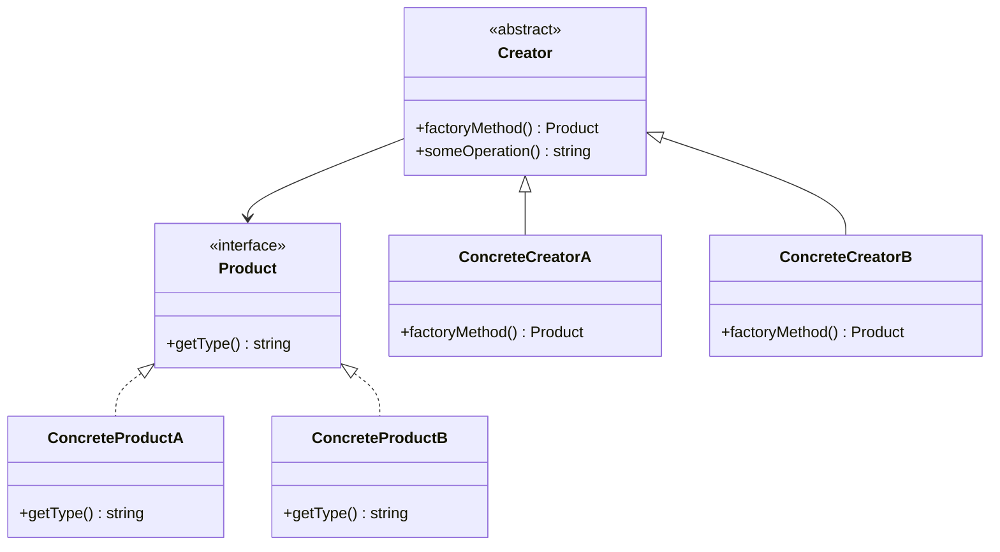

## 26.4 Continuous Learning and Professional Development

In the ever-evolving landscape of software development, continuous learning and professional development are crucial for staying relevant and excelling in your career. As PHP developers, we must keep pace with the latest advancements in the language, design patterns, and best practices. This section provides a comprehensive guide to continuous learning and professional development in PHP, offering strategies and resources to help you grow as a developer.

### Keeping Up-to-Date

#### Follow PHP's Official Updates and RFCs

To stay informed about the latest changes and improvements in PHP, it's essential to follow the official updates and Request for Comments (RFCs). The PHP community actively discusses and proposes new features and enhancements through RFCs, which are publicly available for review and feedback.

- **Visit the PHP Official Website:** Regularly check the [PHP official website](https://www.php.net/) for news and updates.
- **Subscribe to PHP Mailing Lists:** Join mailing lists such as [PHP Internals](https://www.php.net/mailing-lists.php) to receive updates directly in your inbox.
- **Monitor RFCs:** Keep an eye on the [PHP RFC page](https://wiki.php.net/rfc) to understand upcoming changes and participate in discussions.

#### Subscribe to Newsletters and Podcasts

Newsletters and podcasts are excellent resources for staying updated with the latest trends and insights in PHP development. They often feature interviews with industry experts, discussions on new features, and practical tips for developers.

- **PHP Weekly:** Subscribe to [PHP Weekly](http://www.phpweekly.com/) for a curated list of PHP news, articles, and tutorials.
- **PHP Roundtable Podcast:** Listen to the [PHP Roundtable Podcast](https://www.phproundtable.com/) for discussions on PHP-related topics with industry experts.
- **Laravel News:** Even if you're not using Laravel, [Laravel News](https://laravel-news.com/) provides valuable insights into PHP development trends.

### Learning Resources

#### Enroll in Online Courses and Workshops

Online courses and workshops offer structured learning experiences that can help you deepen your understanding of PHP and related technologies. Many platforms provide courses ranging from beginner to advanced levels, covering various aspects of PHP development.

- **Udemy and Coursera:** Explore courses on [Udemy](https://www.udemy.com/) and [Coursera](https://www.coursera.org/) that cover PHP, design patterns, and software architecture.
- **Pluralsight:** Consider a subscription to [Pluralsight](https://www.pluralsight.com/) for access to a wide range of PHP courses and learning paths.
- **Workshops and Bootcamps:** Attend workshops and bootcamps that focus on specific PHP topics or frameworks.

#### Read Books on PHP, Design Patterns, and Software Architecture

Books are invaluable resources for gaining in-depth knowledge and understanding of complex topics. They provide comprehensive coverage of PHP, design patterns, and software architecture principles.

- **"PHP Objects, Patterns, and Practice" by M. Zandstra:** This book offers a deep dive into object-oriented programming and design patterns in PHP.
- **"Design Patterns: Elements of Reusable Object-Oriented Software" by E. Gamma et al.:** A classic book that introduces the concept of design patterns and their application in software development.
- **"Clean Code: A Handbook of Agile Software Craftsmanship" by R. C. Martin:** Learn about writing clean, maintainable, and efficient code.

### Community Engagement

#### Participate in PHP Conferences and Local Meetups

Engaging with the PHP community through conferences and meetups is an excellent way to network, learn from others, and share your knowledge. These events provide opportunities to hear from industry leaders, participate in workshops, and collaborate with fellow developers.

- **PHP Conferences:** Attend conferences such as [PHP[tek]](https://tek.phparch.com/) and [SymfonyCon](https://symfony.com/events/symfonycon) to learn about the latest trends and technologies.
- **Local Meetups:** Join local PHP user groups and meetups to connect with developers in your area. Platforms like [Meetup](https://www.meetup.com/) can help you find events near you.

#### Contribute to Open-Source Projects

Contributing to open-source projects is a rewarding way to improve your skills, gain experience, and give back to the community. It allows you to work on real-world projects, collaborate with other developers, and learn from their expertise.

- **Find Projects on GitHub:** Explore repositories on [GitHub](https://github.com/) to find open-source projects that interest you.
- **Contribute to PHP Projects:** Consider contributing to popular PHP projects like [Laravel](https://github.com/laravel/laravel) or [Symfony](https://github.com/symfony/symfony).
- **Start Your Own Project:** If you have an idea, start your own open-source project and invite others to contribute.

### Certifications

#### Consider Certifications like Zend Certified Engineer

Certifications can validate your skills and knowledge, making you more competitive in the job market. They demonstrate your commitment to professional development and can open up new career opportunities.

- **Zend Certified PHP Engineer:** The [Zend Certified PHP Engineer](https://www.zend.com/training/php-certification-exam) certification is a widely recognized credential that validates your PHP expertise.
- **Symfony Certification:** If you work with Symfony, consider the [Symfony Certification](https://certification.symfony.com/) to demonstrate your proficiency with the framework.
- **AWS Certified Developer:** As cloud technologies become more prevalent, the [AWS Certified Developer](https://aws.amazon.com/certification/certified-developer-associate/) certification can be beneficial for PHP developers working with AWS.

### Code Examples and Exercises

To reinforce your learning, let's explore some practical exercises and code examples that demonstrate key concepts in PHP development.

#### Example: Implementing a Simple Design Pattern

Let's implement a simple Factory Method pattern in PHP. This pattern provides an interface for creating objects, allowing subclasses to alter the type of objects that will be created.

```php
<?php

// Define an interface for the product
interface Product {
    public function getType(): string;
}

// Implement concrete products
class ConcreteProductA implements Product {
    public function getType(): string {
        return "Type A";
    }
}

class ConcreteProductB implements Product {
    public function getType(): string {
        return "Type B";
    }
}

// Define the creator class
abstract class Creator {
    abstract public function factoryMethod(): Product;

    public function someOperation(): string {
        $product = $this->factoryMethod();
        return "Creator: The product type is " . $product->getType();
    }
}

// Implement concrete creators
class ConcreteCreatorA extends Creator {
    public function factoryMethod(): Product {
        return new ConcreteProductA();
    }
}

class ConcreteCreatorB extends Creator {
    public function factoryMethod(): Product {
        return new ConcreteProductB();
    }
}

// Client code
function clientCode(Creator $creator) {
    echo $creator->someOperation() . "\n";
}

clientCode(new ConcreteCreatorA());
clientCode(new ConcreteCreatorB());

?>
```

**Try It Yourself:** Modify the code to add a new product type and a corresponding creator. Experiment with different implementations to understand how the Factory Method pattern works.

### Visualizing the Factory Method Pattern

To better understand the Factory Method pattern, let's visualize its structure using a class diagram.



**Diagram Description:** This diagram illustrates the Factory Method pattern, showing the relationship between the `Creator`, `ConcreteCreator`, `Product`, and `ConcreteProduct` classes.

### Knowledge Check

To test your understanding of the concepts covered in this section, consider the following questions:

1. What are some ways to stay updated with the latest PHP developments?
2. How can contributing to open-source projects benefit your professional development?
3. Why are certifications important for PHP developers?

### Embrace the Journey

Remember, continuous learning and professional development are lifelong journeys. As you progress, you'll encounter new challenges and opportunities to grow. Stay curious, keep experimenting, and enjoy the process of becoming a better PHP developer.

### References and Links

- [PHP Official Website](https://www.php.net/)
- [PHP RFCs](https://wiki.php.net/rfc)
- [PHP Weekly](http://www.phpweekly.com/)
- [PHP Roundtable Podcast](https://www.phproundtable.com/)
- [Udemy PHP Courses](https://www.udemy.com/)
- [Coursera PHP Courses](https://www.coursera.org/)
- [Pluralsight PHP Courses](https://www.pluralsight.com/)
- [GitHub](https://github.com/)
- [Zend Certified PHP Engineer](https://www.zend.com/training/php-certification-exam)

## Quiz: Continuous Learning and Professional Development



### What is one way to stay updated with PHP developments?

- [x] Follow PHP's official updates and RFCs
- [ ] Only rely on books published years ago
- [ ] Ignore new PHP versions
- [ ] Avoid community discussions

> **Explanation:** Following PHP's official updates and RFCs keeps you informed about the latest changes and improvements in the language.

### How can contributing to open-source projects benefit you?

- [x] Improve skills and gain experience
- [ ] Only waste time
- [x] Collaborate with other developers
- [ ] Isolate from the community

> **Explanation:** Contributing to open-source projects helps improve your skills, gain experience, and collaborate with other developers.

### Why are certifications important for PHP developers?

- [x] Validate skills and knowledge
- [ ] Replace practical experience
- [ ] Guarantee a job
- [ ] Are unnecessary

> **Explanation:** Certifications validate your skills and knowledge, making you more competitive in the job market.

### What is a benefit of attending PHP conferences?

- [x] Networking with industry leaders
- [ ] Avoiding new trends
- [ ] Staying isolated
- [ ] Ignoring new technologies

> **Explanation:** Attending PHP conferences allows you to network with industry leaders and learn about the latest trends and technologies.

### Which of the following is a recommended newsletter for PHP developers?

- [x] PHP Weekly
- [ ] PHP Monthly
- [ ] PHP Daily
- [ ] PHP Yearly

> **Explanation:** PHP Weekly is a recommended newsletter that provides a curated list of PHP news, articles, and tutorials.

### What is the Factory Method pattern used for?

- [x] Creating objects with a common interface
- [ ] Destroying objects
- [ ] Managing database connections
- [ ] Handling user input

> **Explanation:** The Factory Method pattern is used to create objects with a common interface, allowing subclasses to alter the type of objects created.

### What is a key feature of the Factory Method pattern?

- [x] Provides an interface for creating objects
- [ ] Eliminates the need for interfaces
- [ ] Forces the use of global variables
- [ ] Requires no subclasses

> **Explanation:** The Factory Method pattern provides an interface for creating objects, allowing subclasses to define the type of objects created.

### What is a benefit of reading books on PHP?

- [x] Gaining in-depth knowledge
- [ ] Avoiding practical experience
- [ ] Only learning outdated information
- [ ] Ignoring new trends

> **Explanation:** Reading books on PHP helps you gain in-depth knowledge and understanding of complex topics.

### What is an advantage of participating in local meetups?

- [x] Connecting with developers in your area
- [ ] Avoiding community engagement
- [ ] Staying isolated
- [ ] Ignoring new technologies

> **Explanation:** Participating in local meetups allows you to connect with developers in your area and engage with the community.

### True or False: Continuous learning is a lifelong journey.

- [x] True
- [ ] False

> **Explanation:** Continuous learning is indeed a lifelong journey, as technology and best practices are constantly evolving.


