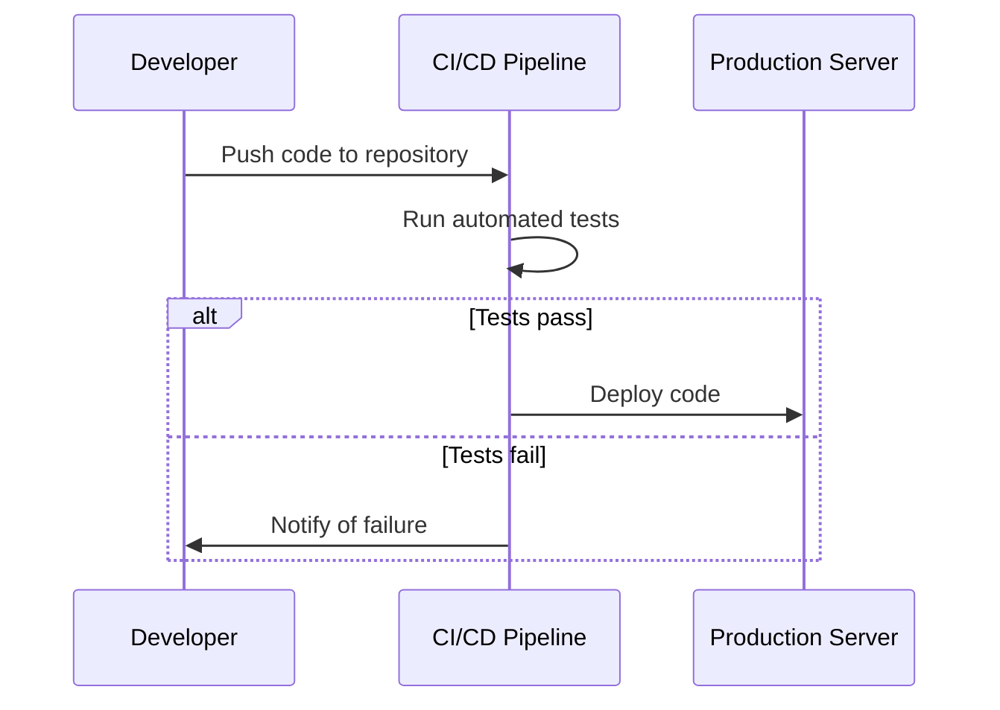

## 26.5 Embracing Modern PHP Practices

In the ever-evolving landscape of web development, PHP continues to be a robust and versatile language. To stay ahead, it is crucial to embrace modern PHP practices that leverage the latest language features, frameworks, and automated processes. This section will guide you through these practices, providing insights and examples to enhance your PHP development skills.

### Modern Features in PHP

PHP has undergone significant transformations with the release of versions 7 and 8, introducing features that improve performance, security, and code readability. Let's explore some of these modern features:

#### Scalar Type Declarations and Strict Typing

PHP 7 introduced scalar type declarations, allowing developers to specify the expected data types for function arguments and return values. This feature enhances code reliability by catching type-related errors early in the development process.

```php
<?php
// Enabling strict typing
declare(strict_types=1);

function add(int $a, int $b): int {
    return $a + $b;
}

echo add(5, 10); // Outputs: 15
// echo add("5", "10"); // Throws a TypeError
?>
```

**Key Takeaway:** Use scalar type declarations to enforce data integrity and prevent runtime errors.

#### Attributes (Annotations) in PHP 8

Attributes provide a structured way to add metadata to classes, methods, and properties. They replace the need for docblock annotations, offering a more robust and type-safe solution.

```php
<?php

#[Attribute]
class Route {
    public function __construct(public string $path) {}
}

class UserController {
    #[Route('/users')]
    public function listUsers() {
        // Implementation
    }
}
?>
```

**Key Takeaway:** Utilize attributes to enhance code readability and maintainability by embedding metadata directly within your code.

#### Union Types and Nullsafe Operator

Union types allow a parameter or return value to accept multiple types, increasing flexibility in function definitions. The nullsafe operator simplifies null checks, reducing boilerplate code.

```php
<?php

function processInput(int|string $input): void {
    if (is_int($input)) {
        echo "Processing integer: $input";
    } else {
        echo "Processing string: $input";
    }
}

class User {
    public ?Address $address = null;
}

$user = new User();
echo $user->address?->getStreet(); // Safely accesses getStreet() if address is not null
?>
```

**Key Takeaway:** Leverage union types and the nullsafe operator to write cleaner and more flexible code.

### Framework Utilization

Modern PHP frameworks like Laravel, Symfony, and CodeIgniter provide powerful tools and libraries that streamline development processes. They encourage best practices and design patterns, making your applications more scalable and maintainable.

#### Leveraging Laravel

Laravel is known for its elegant syntax and comprehensive ecosystem. It simplifies tasks such as routing, authentication, and database management.

```php
// Example of a Laravel route definition
Route::get('/users', [UserController::class, 'index']);
```

**Key Takeaway:** Use Laravel's expressive syntax and extensive libraries to accelerate development and maintain high code quality.

#### Symfony's Component-Based Architecture

Symfony offers reusable components that can be integrated into any PHP project. Its component-based architecture promotes modularity and reusability.

```php
// Using Symfony's HTTP Foundation component
use Symfony\Component\HttpFoundation\Request;

$request = Request::createFromGlobals();
echo $request->getPathInfo();
```

**Key Takeaway:** Integrate Symfony components to enhance your application's functionality without adopting the entire framework.

### Automated Processes

Automation is a cornerstone of modern development practices. Implementing Continuous Integration and Continuous Deployment (CI/CD) pipelines, along with automated testing and deployment tools, ensures consistent and reliable software delivery.

#### Continuous Integration and Continuous Deployment (CI/CD)

CI/CD pipelines automate the process of testing and deploying code changes, reducing the risk of human error and speeding up the release cycle.

```yaml
# Example of a GitHub Actions workflow for PHP
name: CI

on: [push, pull_request]

jobs:
  build:
    runs-on: ubuntu-latest

    steps:
    - uses: actions/checkout@v2
    - name: Set up PHP
      uses: shivammathur/setup-php@v2
      with:
        php-version: '8.0'
    - name: Install dependencies
      run: composer install
    - name: Run tests
      run: vendor/bin/phpunit
```

**Key Takeaway:** Implement CI/CD pipelines to automate testing and deployment, ensuring high-quality code and faster delivery.

#### Automated Testing

Automated testing frameworks like PHPUnit and Behat enable developers to write tests that verify code functionality and prevent regressions.

```php
<?php

use PHPUnit\Framework\TestCase;

class UserTest extends TestCase {
    public function testUserCreation() {
        $user = new User('John Doe');
        $this->assertEquals('John Doe', $user->getName());
    }
}
?>
```

**Key Takeaway:** Write automated tests to ensure code reliability and facilitate refactoring.

### Visualizing Modern PHP Practices

To better understand how these modern practices fit together, let's visualize the workflow of a modern PHP application using a sequence diagram.



**Diagram Description:** This sequence diagram illustrates the workflow of a modern PHP application, highlighting the role of CI/CD pipelines in automating testing and deployment processes.

### References and Links

- [PHP Official Documentation](https://www.php.net/docs.php)
- [Laravel Documentation](https://laravel.com/docs)
- [Symfony Components](https://symfony.com/components)
- [GitHub Actions](https://docs.github.com/en/actions)

### Knowledge Check

- What are the benefits of using scalar type declarations in PHP?
- How do attributes improve code maintainability in PHP 8?
- Describe the role of CI/CD pipelines in modern PHP development.

### Embrace the Journey

Remember, embracing modern PHP practices is an ongoing journey. As you integrate these practices into your workflow, you'll find your development process becoming more efficient and your code more robust. Keep experimenting, stay curious, and enjoy the journey!

### Quiz: Embracing Modern PHP Practices



### What is the primary benefit of using scalar type declarations in PHP?

- [x] They enforce data integrity and prevent runtime errors.
- [ ] They improve code readability.
- [ ] They enhance performance.
- [ ] They simplify syntax.

> **Explanation:** Scalar type declarations enforce data integrity by catching type-related errors early in the development process.

### Which PHP version introduced attributes?

- [ ] PHP 7.0
- [ ] PHP 7.4
- [x] PHP 8.0
- [ ] PHP 8.1

> **Explanation:** Attributes were introduced in PHP 8.0 to provide a structured way to add metadata to code.

### What is the purpose of the nullsafe operator in PHP?

- [ ] To improve performance.
- [x] To simplify null checks.
- [ ] To enhance security.
- [ ] To enforce strict typing.

> **Explanation:** The nullsafe operator simplifies null checks by allowing safe access to properties or methods on potentially null objects.

### Which framework is known for its elegant syntax and comprehensive ecosystem?

- [x] Laravel
- [ ] Symfony
- [ ] CodeIgniter
- [ ] Zend Framework

> **Explanation:** Laravel is renowned for its elegant syntax and comprehensive ecosystem, making it a popular choice among developers.

### What is the role of CI/CD pipelines in modern PHP development?

- [x] Automating testing and deployment
- [ ] Improving code readability
- [x] Ensuring high-quality code
- [ ] Enhancing performance

> **Explanation:** CI/CD pipelines automate testing and deployment processes, ensuring high-quality code and faster delivery.

### Which testing framework is commonly used for automated testing in PHP?

- [x] PHPUnit
- [ ] Jasmine
- [ ] Mocha
- [ ] Jest

> **Explanation:** PHPUnit is a widely used testing framework in PHP for writing automated tests.

### How do union types enhance PHP code flexibility?

- [x] By allowing parameters to accept multiple types
- [ ] By improving performance
- [x] By reducing code complexity
- [ ] By enforcing strict typing

> **Explanation:** Union types allow parameters to accept multiple types, increasing flexibility and reducing code complexity.

### What is the benefit of using Symfony components?

- [x] Enhancing functionality without adopting the entire framework
- [ ] Simplifying syntax
- [ ] Improving performance
- [ ] Enforcing strict typing

> **Explanation:** Symfony components can be integrated into any PHP project to enhance functionality without adopting the entire framework.

### What is the primary advantage of automated testing?

- [x] Ensuring code reliability
- [ ] Improving performance
- [ ] Simplifying syntax
- [ ] Enhancing security

> **Explanation:** Automated testing ensures code reliability by verifying functionality and preventing regressions.

### True or False: Embracing modern PHP practices is a one-time task.

- [ ] True
- [x] False

> **Explanation:** Embracing modern PHP practices is an ongoing journey that requires continuous learning and adaptation.


