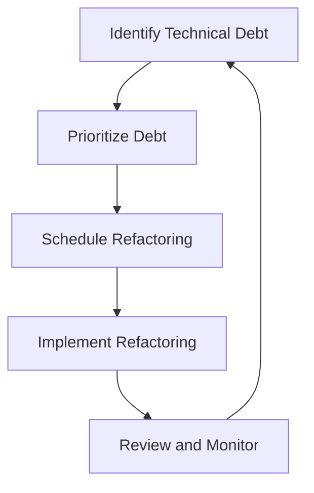
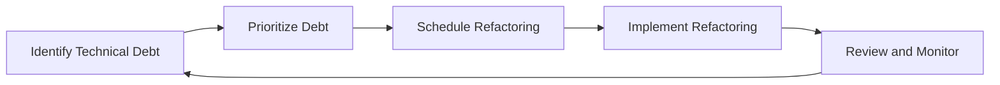

## 26.6 Managing Technical Debt Effectively

Technical debt is a concept that every developer encounters at some point in their career. It refers to the implied cost of additional rework caused by choosing an easy solution now instead of using a better approach that would take longer. In PHP development, managing technical debt effectively is crucial for maintaining code quality, ensuring scalability, and reducing long-term maintenance costs. Let's explore how we can identify, manage, and avoid technical debt in our PHP projects.

### Identifying Technical Debt

Technical debt can manifest in various forms, such as code that is difficult to understand, lacks documentation, or is not scalable. Recognizing these signs early can help in addressing them before they become significant issues.

#### Recognize Areas of Quick Fixes

- **Code Smells**: Look for code smells such as duplicated code, long methods, and large classes. These are often indicators of technical debt.
- **Lack of Documentation**: Code that lacks comments or documentation can be a sign of technical debt, as it makes it harder for others (or even yourself) to understand the code later.
- **Outdated Dependencies**: Using outdated libraries or frameworks can lead to technical debt, as they may not support new features or security updates.
- **Complex Code**: Code that is overly complex or has a high cyclomatic complexity can be difficult to maintain and is a sign of technical debt.

#### Tools for Identifying Technical Debt

- **Static Analysis Tools**: Use tools like PHPStan or Psalm to analyze your code for potential issues.
- **Code Review**: Regular code reviews can help identify areas of technical debt by getting feedback from other developers.
- **Automated Testing**: Implementing unit tests can help identify areas where the code is fragile or prone to breaking.

### Strategies for Managing Technical Debt

Once technical debt has been identified, the next step is to manage it effectively. This involves prioritizing debt, scheduling time for refactoring, and ensuring that the team is aligned on the importance of addressing technical debt.

#### Prioritize Debt Based on Impact and Effort

- **Impact Analysis**: Determine the impact of the technical debt on the project. Does it affect performance, security, or maintainability?
- **Effort Estimation**: Estimate the effort required to address the technical debt. This can help in prioritizing which debts to tackle first.
- **Risk Assessment**: Assess the risk associated with not addressing the technical debt. High-risk areas should be prioritized.

#### Regularly Schedule Time for Refactoring

- **Refactoring Sprints**: Dedicate specific sprints or time periods to focus solely on refactoring and addressing technical debt.
- **Continuous Refactoring**: Encourage a culture of continuous refactoring, where developers are encouraged to improve code quality as part of their regular workflow.
- **Technical Debt Backlog**: Maintain a backlog of technical debt items and regularly review and update it.

#### Use Diagrams to Visualize Technical Debt



*Diagram: A cycle of identifying, prioritizing, scheduling, implementing, and reviewing technical debt.*

### Avoiding Future Debt

Preventing technical debt from accumulating in the first place is the most effective strategy. This involves adopting best practices and fostering a culture of quality within the development team.

#### Adopt a Culture of Code Reviews and Quality Checks

- **Peer Reviews**: Implement peer reviews as part of the development process to catch potential issues early.
- **Quality Gates**: Use quality gates in your CI/CD pipeline to ensure that code meets certain quality standards before it is merged.

#### Invest in Proper Documentation and Testing

- **Comprehensive Documentation**: Ensure that all code is well-documented, including comments and external documentation.
- **Automated Testing**: Implement automated testing to catch issues early and ensure that code changes do not introduce new bugs.

#### Continuous Learning and Improvement

- **Training and Workshops**: Provide regular training and workshops for the development team to keep them updated on best practices and new technologies.
- **Retrospectives**: Conduct regular retrospectives to reflect on what went well and what could be improved in terms of managing technical debt.

### Code Examples

Let's look at some code examples that demonstrate how to manage technical debt effectively in PHP.

#### Example 1: Refactoring a Complex Function

Before refactoring:

```php
function calculateDiscount($price, $discountType) {
    if ($discountType == 'percentage') {
        return $price * 0.1;
    } elseif ($discountType == 'fixed') {
        return $price - 10;
    } else {
        return $price;
    }
}
```

After refactoring:

```php
function calculatePercentageDiscount($price) {
    return $price * 0.1;
}

function calculateFixedDiscount($price) {
    return $price - 10;
}

function calculateDiscount($price, $discountType) {
    switch ($discountType) {
        case 'percentage':
            return calculatePercentageDiscount($price);
        case 'fixed':
            return calculateFixedDiscount($price);
        default:
            return $price;
    }
}
```

*Explanation: The refactored code separates the discount calculation logic into individual functions, making it easier to understand and maintain.*

#### Example 2: Using Dependency Injection to Reduce Coupling

Before refactoring:

```php
class OrderProcessor {
    private $mailer;

    public function __construct() {
        $this->mailer = new Mailer();
    }

    public function processOrder($order) {
        // Process the order
        $this->mailer->sendConfirmation($order);
    }
}
```

After refactoring:

```php
class OrderProcessor {
    private $mailer;

    public function __construct(MailerInterface $mailer) {
        $this->mailer = $mailer;
    }

    public function processOrder($order) {
        // Process the order
        $this->mailer->sendConfirmation($order);
    }
}
```

*Explanation: By using dependency injection, we reduce the coupling between the `OrderProcessor` and the `Mailer` class, making the code more flexible and easier to test.*

### Try It Yourself

Experiment with the code examples provided by making the following modifications:

- **Add a new discount type** to the `calculateDiscount` function and see how the refactored code makes this easier.
- **Implement a new mailer class** that implements the `MailerInterface` and inject it into the `OrderProcessor` to see how dependency injection improves flexibility.

### Visualizing Technical Debt Management



*Diagram: A cycle of identifying, prioritizing, scheduling, implementing, and reviewing technical debt.*

### References and Links

- [PHPStan](https://phpstan.org/): A static analysis tool for PHP.
- [Psalm](https://psalm.dev/): A static analysis tool for finding errors in PHP applications.
- [Refactoring Guru](https://refactoring.guru/): A comprehensive resource on refactoring techniques and best practices.

### Knowledge Check

- **What are some common signs of technical debt in a PHP project?**
- **How can static analysis tools help in identifying technical debt?**
- **What is the importance of prioritizing technical debt based on impact and effort?**
- **How does dependency injection help in managing technical debt?**

### Embrace the Journey

Remember, managing technical debt is an ongoing process. By adopting best practices and fostering a culture of quality, we can ensure that our PHP projects remain maintainable and scalable. Keep experimenting, stay curious, and enjoy the journey of continuous improvement!

### Quiz: Managing Technical Debt Effectively



### What is a common sign of technical debt in a PHP project?

- [x] Duplicated code
- [ ] Well-documented code
- [ ] Efficient algorithms
- [ ] Up-to-date dependencies

> **Explanation:** Duplicated code is a common sign of technical debt as it can lead to maintenance challenges and inconsistencies.

### How can static analysis tools help in managing technical debt?

- [x] By identifying potential code issues
- [ ] By writing code automatically
- [ ] By deploying applications
- [ ] By managing databases

> **Explanation:** Static analysis tools help identify potential code issues, which can indicate areas of technical debt.

### What is the benefit of prioritizing technical debt based on impact and effort?

- [x] It helps in addressing the most critical issues first
- [ ] It eliminates all technical debt immediately
- [ ] It reduces the need for code reviews
- [ ] It automates the refactoring process

> **Explanation:** Prioritizing technical debt based on impact and effort ensures that the most critical issues are addressed first.

### What is a strategy for avoiding future technical debt?

- [x] Implementing code reviews
- [ ] Ignoring code quality
- [ ] Using outdated libraries
- [ ] Avoiding documentation

> **Explanation:** Implementing code reviews helps catch potential issues early, preventing future technical debt.

### How does dependency injection help in managing technical debt?

- [x] By reducing coupling between classes
- [ ] By increasing code complexity
- [ ] By eliminating the need for testing
- [ ] By hardcoding dependencies

> **Explanation:** Dependency injection reduces coupling between classes, making the code more flexible and easier to maintain.

### What is the role of automated testing in managing technical debt?

- [x] It helps catch issues early
- [ ] It replaces the need for manual testing
- [ ] It increases code complexity
- [ ] It eliminates the need for documentation

> **Explanation:** Automated testing helps catch issues early, reducing the likelihood of technical debt accumulating.

### What is a benefit of conducting regular retrospectives?

- [x] Identifying areas for improvement
- [ ] Eliminating all technical debt
- [ ] Avoiding code reviews
- [ ] Increasing code complexity

> **Explanation:** Regular retrospectives help teams identify areas for improvement, including managing technical debt.

### What is a common tool used for static analysis in PHP?

- [x] PHPStan
- [ ] Composer
- [ ] PHPUnit
- [ ] Laravel

> **Explanation:** PHPStan is a popular static analysis tool used to identify potential issues in PHP code.

### What is a key component of a technical debt backlog?

- [x] A list of identified technical debt items
- [ ] A list of completed features
- [ ] A list of team members
- [ ] A list of project deadlines

> **Explanation:** A technical debt backlog contains a list of identified technical debt items that need to be addressed.

### True or False: Technical debt can be completely eliminated from a project.

- [ ] True
- [x] False

> **Explanation:** Technical debt cannot be completely eliminated, but it can be managed and minimized through best practices.


