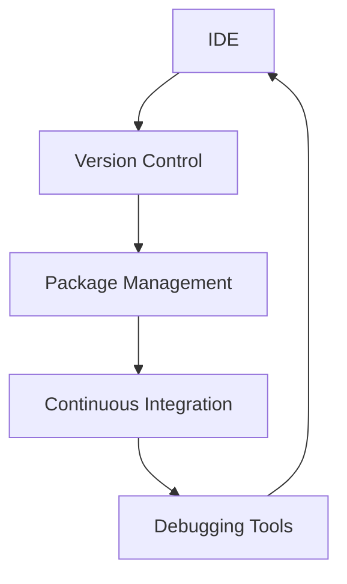

## 26.7 Building a Comprehensive Toolchain

In the realm of PHP development, a comprehensive toolchain is essential for enhancing productivity, ensuring code quality, and streamlining the development process. A well-constructed toolchain not only aids in writing and debugging code but also facilitates collaboration, version control, and continuous integration. In this section, we will delve into the essential components of a PHP development toolchain, providing insights into selecting and utilizing the right tools for your projects.

### Development Tools

#### Integrated Development Environments (IDEs)

An IDE is a cornerstone of any developer's toolchain, providing a suite of tools to write, test, and debug code efficiently. Two of the most popular IDEs for PHP development are PhpStorm and Visual Studio Code.

- **PhpStorm**: Known for its deep understanding of PHP, PhpStorm offers features like code completion, refactoring, and on-the-fly error detection. It integrates seamlessly with version control systems and supports various frameworks, making it a robust choice for PHP developers.
  - **Link**: [PhpStorm](https://www.jetbrains.com/phpstorm/)

- **Visual Studio Code (VS Code)**: A lightweight yet powerful editor, VS Code is highly customizable with a vast library of extensions. It supports PHP development through extensions like PHP Intelephense and offers features such as IntelliSense, debugging, and Git integration.
  - **Link**: [VS Code](https://code.visualstudio.com/)

#### Debugging Tools

Debugging is a critical aspect of development, and having the right tools can significantly ease the process. Xdebug is a widely used PHP extension for debugging and profiling.

- **Xdebug**: This tool provides stack and function traces, memory allocation reports, and more. It integrates with IDEs like PhpStorm and VS Code, allowing developers to set breakpoints, inspect variables, and step through code.
  - **Link**: [Xdebug](https://xdebug.org/)

### Version Control

Version control systems are indispensable for managing code changes and collaborating with team members. Git is the de facto standard for version control in the software development industry.

- **Git**: A distributed version control system that tracks changes in source code during software development. It allows multiple developers to work on a project simultaneously, manage branches, and merge changes efficiently.
  - **Link**: [Git](https://git-scm.com/)

### Package Management

Managing dependencies is crucial in modern PHP development, and Composer is the go-to tool for this purpose.

- **Composer**: A dependency manager for PHP, Composer allows you to declare the libraries your project depends on and manages (install/update) them for you. It ensures that your project has all the necessary packages and their correct versions.
  - **Link**: [Composer](https://getcomposer.org/)

### Continuous Integration Tools

Continuous integration (CI) is a practice that involves automatically testing and building code changes to ensure that the software is always in a deployable state. Several tools can help implement CI in PHP projects.

- **Jenkins**: An open-source automation server that enables developers to build, test, and deploy their software. Jenkins supports numerous plugins to integrate with various tools and services.
  
- **GitHub Actions**: A CI/CD service provided by GitHub that allows you to automate your workflow directly from your GitHub repository. It supports a wide range of actions and integrations.

- **GitLab CI/CD**: Integrated directly into GitLab, this tool provides a seamless experience for continuous integration and delivery. It supports pipelines, which are defined in a `.gitlab-ci.yml` file.

### Building the Toolchain

#### Step 1: Setting Up Your IDE

Begin by selecting an IDE that suits your workflow. Install the necessary extensions or plugins to enhance PHP development capabilities. For instance, if you're using VS Code, consider installing PHP Intelephense for code intelligence and Xdebug for debugging.

#### Step 2: Configuring Version Control

Install Git and set up a repository for your project. Familiarize yourself with Git commands such as `clone`, `commit`, `push`, and `pull`. Use branching strategies like Git Flow to manage feature development and releases.

#### Step 3: Managing Dependencies with Composer

Initialize Composer in your project by running `composer init`. Define your project's dependencies in the `composer.json` file and use `composer install` to download them. Regularly update dependencies with `composer update` to keep them current.

#### Step 4: Implementing Continuous Integration

Choose a CI tool that integrates well with your version control system. For GitHub repositories, GitHub Actions is a convenient choice. Define workflows in `.github/workflows` to automate testing and deployment processes.

#### Step 5: Debugging and Profiling

Configure Xdebug with your IDE to enable step debugging. Use Xdebug's profiling capabilities to analyze performance bottlenecks and optimize your code.

### Code Example: Setting Up a Basic CI Pipeline with GitHub Actions

```yaml
# .github/workflows/ci.yml
name: CI

on:
  push:
    branches: [ main ]
  pull_request:
    branches: [ main ]

jobs:
  build:
    runs-on: ubuntu-latest

    steps:
    - name: Checkout code
      uses: actions/checkout@v2

    - name: Set up PHP
      uses: shivammathur/setup-php@v2
      with:
        php-version: '8.0'

    - name: Install dependencies
      run: composer install

    - name: Run tests
      run: vendor/bin/phpunit
```

### Visualizing the Toolchain



**Diagram Description:** This flowchart illustrates the interconnected components of a comprehensive PHP development toolchain, highlighting the cyclical nature of development, version control, dependency management, continuous integration, and debugging.

### Knowledge Check

- **What are the benefits of using an IDE like PhpStorm or VS Code for PHP development?**
- **How does Git facilitate collaboration among developers?**
- **Why is Composer essential for managing dependencies in PHP projects?**
- **What role does continuous integration play in maintaining code quality?**

### Embrace the Journey

Building a comprehensive toolchain is a journey that evolves with your development needs. As you gain experience, you'll discover new tools and practices that enhance your workflow. Remember, the goal is to create a seamless development environment that empowers you to write high-quality code efficiently. Keep experimenting, stay curious, and enjoy the journey!

## Quiz: Building a Comprehensive Toolchain



### What is the primary purpose of an IDE in PHP development?

- [x] To provide a suite of tools for writing, testing, and debugging code efficiently.
- [ ] To manage version control and code repositories.
- [ ] To automate deployment processes.
- [ ] To handle package management and dependencies.

> **Explanation:** An IDE offers features like code completion, refactoring, and debugging, which are essential for efficient development.

### Which tool is widely used for debugging PHP code?

- [ ] Git
- [x] Xdebug
- [ ] Composer
- [ ] Jenkins

> **Explanation:** Xdebug is a PHP extension that provides debugging and profiling capabilities.

### What is the role of Git in a development toolchain?

- [x] To track changes in source code and facilitate collaboration.
- [ ] To manage dependencies and package installations.
- [ ] To automate testing and deployment.
- [ ] To provide a development environment.

> **Explanation:** Git is a version control system that helps manage code changes and collaboration among developers.

### How does Composer benefit PHP projects?

- [x] It manages project dependencies and ensures correct versions are used.
- [ ] It provides debugging capabilities.
- [ ] It automates deployment processes.
- [ ] It tracks changes in source code.

> **Explanation:** Composer is a dependency manager that handles library installations and updates.

### Which of the following is a continuous integration tool?

- [x] Jenkins
- [ ] PhpStorm
- [ ] Xdebug
- [ ] Composer

> **Explanation:** Jenkins is an automation server used for continuous integration and deployment.

### What is the purpose of a CI pipeline?

- [x] To automate testing and ensure code is always in a deployable state.
- [ ] To provide a development environment.
- [ ] To manage dependencies.
- [ ] To track changes in source code.

> **Explanation:** A CI pipeline automates the process of testing and building code changes.

### Which tool is used for dependency management in PHP?

- [ ] Git
- [ ] Jenkins
- [x] Composer
- [ ] Xdebug

> **Explanation:** Composer is the tool used for managing dependencies in PHP projects.

### What is the benefit of using GitHub Actions for CI?

- [x] It allows automation of workflows directly from a GitHub repository.
- [ ] It provides a development environment.
- [ ] It manages dependencies.
- [ ] It offers debugging capabilities.

> **Explanation:** GitHub Actions integrates with GitHub repositories to automate workflows like testing and deployment.

### How does Xdebug integrate with IDEs?

- [x] It allows setting breakpoints, inspecting variables, and stepping through code.
- [ ] It manages dependencies.
- [ ] It automates deployment processes.
- [ ] It tracks changes in source code.

> **Explanation:** Xdebug provides debugging features that integrate with IDEs for a seamless debugging experience.

### True or False: A comprehensive toolchain is static and does not evolve with development needs.

- [ ] True
- [x] False

> **Explanation:** A comprehensive toolchain evolves with development needs, incorporating new tools and practices as required.


