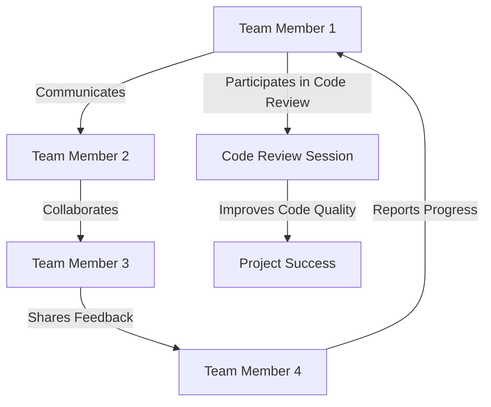

## 26.8 Collaboration and Communication in Teams

In the world of PHP development, collaboration and communication are pivotal to the success of any project. Whether you're working in a small team or a large organization, the ability to effectively communicate and collaborate can significantly impact the quality and efficiency of your work. In this section, we will delve into best practices for fostering collaboration and communication within PHP development teams, explore the tools that can facilitate these processes, and provide practical examples and exercises to enhance your team's dynamics.

### Effective Communication

Effective communication is the cornerstone of successful collaboration. It ensures that all team members are on the same page, reduces misunderstandings, and fosters a positive working environment. Here are some strategies to enhance communication within your team:

- **Foster Open and Transparent Communication Channels:** Encourage team members to share their thoughts, ideas, and concerns openly. This can be achieved by creating a culture of trust and respect, where everyone feels valued and heard.

- **Regular Meetings and Stand-Ups:** Schedule regular meetings, such as daily stand-ups, to discuss progress, roadblocks, and upcoming tasks. This keeps everyone informed and aligned with the project's goals.

- **Active Listening:** Encourage active listening among team members. This involves paying full attention to the speaker, understanding their message, and responding thoughtfully.

- **Clear and Concise Communication:** Ensure that all communication is clear and concise. Avoid jargon and technical terms that may not be understood by everyone in the team.

- **Feedback Loops:** Establish feedback loops to continuously improve communication. Encourage team members to provide constructive feedback on communication practices and make necessary adjustments.

### Collaboration Tools

In today's digital age, there are numerous tools available to facilitate collaboration and communication within teams. These tools can help streamline processes, improve efficiency, and enhance team dynamics. Here are some popular tools used in PHP development teams:

- **Communication Platforms:** Use platforms like Slack or Microsoft Teams for team communication. These tools offer features such as instant messaging, video calls, and file sharing, making it easy for team members to stay connected.

- **Project Management Tools:** Tools like Jira and Trello are essential for managing tasks, tracking progress, and ensuring that projects stay on schedule. They provide a visual representation of the project's status and help teams prioritize tasks effectively.

- **Version Control Systems:** Git is a widely used version control system that allows teams to collaborate on code seamlessly. It enables multiple developers to work on the same codebase simultaneously, track changes, and manage conflicts.

- **Code Collaboration Platforms:** Platforms like GitHub and GitLab facilitate code collaboration through features like pull requests, code reviews, and issue tracking. These platforms enable teams to discuss code changes, provide feedback, and ensure code quality.

### Code Collaboration

Code collaboration is a critical aspect of PHP development. It involves working together to write, review, and improve code. Here are some best practices for effective code collaboration:

- **Conduct Regular Code Reviews:** Code reviews are an essential part of the development process. They help identify bugs, improve code quality, and ensure that the code adheres to the project's standards. Encourage team members to provide constructive feedback and engage in discussions during code reviews.

- **Use Pull Requests to Facilitate Discussions:** Pull requests are a great way to facilitate discussions around code changes. They allow team members to review and comment on proposed changes before they are merged into the main codebase. This ensures that all changes are thoroughly vetted and approved by the team.

- **Establish Coding Standards:** Define and enforce coding standards to ensure consistency across the codebase. This makes it easier for team members to read and understand each other's code, reducing the likelihood of errors and misunderstandings.

- **Pair Programming:** Pair programming involves two developers working together on the same code. This practice encourages collaboration, knowledge sharing, and improves code quality. It also helps team members learn from each other and develop new skills.

### Try It Yourself: Enhancing Team Collaboration

To put these concepts into practice, try the following exercises with your team:

1. **Conduct a Code Review Session:** Organize a code review session where team members review each other's code and provide feedback. Focus on constructive criticism and encourage open discussions.

2. **Implement a Daily Stand-Up Meeting:** If your team doesn't already have a daily stand-up meeting, implement one. Use this time to discuss progress, roadblocks, and upcoming tasks.

3. **Experiment with Pair Programming:** Pair up team members and have them work together on a coding task. Encourage them to share their thought processes and collaborate on solving problems.

4. **Set Up a Communication Platform:** If your team isn't using a communication platform, set one up. Encourage team members to use it for both work-related and casual conversations to build camaraderie.

### Visualizing Team Collaboration

To better understand the flow of communication and collaboration within a team, let's visualize it using a Mermaid.js diagram:

**Diagram Description:** This diagram illustrates the flow of communication and collaboration within a team. Team members communicate with each other, collaborate on tasks, share feedback, and report progress. Code review sessions play a crucial role in improving code quality, leading to project success.

### Knowledge Check

To reinforce your understanding of collaboration and communication in teams, consider the following questions:

1. What are some strategies for fostering open and transparent communication within a team?
2. How can project management tools like Jira and Trello enhance team collaboration?
3. Why are code reviews important in the development process?
4. How does pair programming contribute to team collaboration and knowledge sharing?
5. What role do communication platforms play in facilitating team communication?

### Embrace the Journey

Remember, collaboration and communication are ongoing processes that require continuous effort and improvement. As you implement these practices within your team, you'll likely encounter challenges and opportunities for growth. Embrace these experiences, learn from them, and continue to refine your approach. By fostering a culture of collaboration and open communication, you'll create a more productive, efficient, and enjoyable working environment for your team.

### Quiz: Collaboration and Communication in Teams



### What is a key benefit of fostering open and transparent communication channels in a team?

- [x] Reduces misunderstandings and fosters a positive working environment
- [ ] Increases the number of meetings required
- [ ] Ensures that only senior team members are heard
- [ ] Limits the sharing of ideas among team members

> **Explanation:** Open and transparent communication channels reduce misunderstandings and foster a positive working environment by ensuring that all team members feel valued and heard.

### Which tool is commonly used for version control in PHP development teams?

- [x] Git
- [ ] Slack
- [ ] Trello
- [ ] Microsoft Teams

> **Explanation:** Git is a widely used version control system that allows teams to collaborate on code seamlessly, enabling multiple developers to work on the same codebase simultaneously.

### What is the purpose of a daily stand-up meeting?

- [x] To discuss progress, roadblocks, and upcoming tasks
- [ ] To conduct code reviews
- [ ] To socialize with team members
- [ ] To finalize project deliverables

> **Explanation:** Daily stand-up meetings are used to discuss progress, roadblocks, and upcoming tasks, keeping everyone informed and aligned with the project's goals.

### How does pair programming benefit team collaboration?

- [x] Encourages collaboration, knowledge sharing, and improves code quality
- [ ] Reduces the need for code reviews
- [ ] Limits the number of developers working on a task
- [ ] Increases the time taken to complete tasks

> **Explanation:** Pair programming encourages collaboration, knowledge sharing, and improves code quality by having two developers work together on the same code.

### What is the role of pull requests in code collaboration?

- [x] To facilitate discussions around code changes
- [ ] To finalize project deliverables
- [ ] To assign tasks to team members
- [ ] To track project progress

> **Explanation:** Pull requests facilitate discussions around code changes by allowing team members to review and comment on proposed changes before they are merged into the main codebase.

### Which of the following is a benefit of using project management tools like Jira and Trello?

- [x] They help manage tasks, track progress, and ensure projects stay on schedule
- [ ] They replace the need for communication platforms
- [ ] They eliminate the need for code reviews
- [ ] They are only useful for large teams

> **Explanation:** Project management tools like Jira and Trello help manage tasks, track progress, and ensure projects stay on schedule by providing a visual representation of the project's status.

### What is the primary purpose of code reviews?

- [x] To identify bugs, improve code quality, and ensure adherence to standards
- [ ] To socialize with team members
- [ ] To finalize project deliverables
- [ ] To assign tasks to team members

> **Explanation:** Code reviews are conducted to identify bugs, improve code quality, and ensure that the code adheres to the project's standards.

### How can communication platforms like Slack enhance team collaboration?

- [x] By offering features such as instant messaging, video calls, and file sharing
- [ ] By replacing the need for project management tools
- [ ] By eliminating the need for daily stand-up meetings
- [ ] By limiting communication to only work-related topics

> **Explanation:** Communication platforms like Slack enhance team collaboration by offering features such as instant messaging, video calls, and file sharing, making it easy for team members to stay connected.

### What is a key component of effective communication within a team?

- [x] Active listening
- [ ] Frequent interruptions
- [ ] Using technical jargon
- [ ] Avoiding feedback

> **Explanation:** Active listening is a key component of effective communication within a team, as it involves paying full attention to the speaker, understanding their message, and responding thoughtfully.

### True or False: Establishing coding standards is unnecessary for effective code collaboration.

- [ ] True
- [x] False

> **Explanation:** False. Establishing coding standards is essential for effective code collaboration, as it ensures consistency across the codebase and makes it easier for team members to read and understand each other's code.



By implementing these best practices and utilizing the right tools, your PHP development team can achieve greater collaboration and communication, leading to more successful project outcomes. Keep experimenting, stay curious, and enjoy the journey of continuous improvement!
