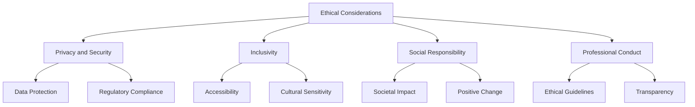

## 26.9 Ethical Considerations in Software Design

In the rapidly evolving world of software development, ethical considerations have become paramount. As developers, we hold the power to shape the digital landscape, and with that power comes the responsibility to ensure our creations are ethical, inclusive, and beneficial to society. This section delves into the ethical considerations in software design, focusing on privacy, inclusivity, social responsibility, and professional conduct.

### Privacy and Security

**Protecting User Data**

In an era where data is often referred to as the new oil, protecting user data is not just a legal obligation but a moral one. As PHP developers, we must ensure that our applications handle data securely and comply with regulations such as the General Data Protection Regulation (GDPR).

- **Data Encryption:** Always encrypt sensitive data both at rest and in transit. Use PHP's `openssl_encrypt` function for encrypting data before storing it in a database.

```php
<?php
// Encrypting data using OpenSSL
$data = "Sensitive Information";
$key = "encryptionkey";
$iv = openssl_random_pseudo_bytes(openssl_cipher_iv_length('aes-256-cbc'));

$encryptedData = openssl_encrypt($data, 'aes-256-cbc', $key, 0, $iv);
echo "Encrypted Data: " . $encryptedData;
?>
```

- **Access Control:** Implement robust access control mechanisms to ensure that only authorized users can access sensitive data. Use PHP sessions and role-based access control (RBAC) to manage user permissions.

- **Data Minimization:** Collect only the data necessary for the application's functionality. Avoid storing excessive personal information that could be misused.

**Compliance with Regulations**

- **GDPR Compliance:** Ensure your PHP applications comply with GDPR by implementing features such as data access requests, data deletion, and explicit consent for data collection.

- **Privacy Policies:** Clearly communicate your data handling practices through comprehensive privacy policies. Make these policies easily accessible to users.

### Inclusivity

**Designing for Accessibility**

Inclusivity in software design means creating applications that are accessible to all users, regardless of their abilities or disabilities. This involves adhering to accessibility standards such as the Web Content Accessibility Guidelines (WCAG).

- **Semantic HTML:** Use semantic HTML elements to improve accessibility. For example, use `<button>` instead of `<div>` for clickable elements.

- **ARIA Attributes:** Implement ARIA (Accessible Rich Internet Applications) attributes to enhance the accessibility of dynamic content.

```html
<button aria-label="Close" onclick="closeModal()">X</button>
```

- **Keyboard Navigation:** Ensure that all interactive elements are accessible via keyboard navigation. Test your application using only the keyboard to identify any accessibility issues.

**Cultural Sensitivity**

- **Localization and Internationalization:** Design your PHP applications to support multiple languages and cultural contexts. Use PHP's `gettext` for translation and localization.

- **Cultural Considerations:** Be mindful of cultural differences in design elements, such as color schemes, symbols, and imagery.

### Social Responsibility

**Impact on Society**

Software has the power to influence society in profound ways. As developers, we must be mindful of the societal impact of our creations.

- **Ethical AI and Algorithms:** Ensure that algorithms and AI systems are fair and unbiased. Regularly audit and test your algorithms for bias and discrimination.

- **Environmental Considerations:** Optimize your PHP applications for energy efficiency. Consider the environmental impact of server usage and data storage.

**Promoting Positive Change**

- **Open Source Contributions:** Contribute to open-source projects that promote social good. Share your knowledge and expertise with the community.

- **Community Engagement:** Engage with the communities your software serves. Gather feedback and involve users in the design process to ensure your software meets their needs.

### Professional Conduct

**Adhering to Ethical Guidelines**

Professional conduct in software development involves adhering to ethical guidelines and standards set by professional organizations such as the Association for Computing Machinery (ACM) and the Institute of Electrical and Electronics Engineers (IEEE).

- **Code of Ethics:** Familiarize yourself with and adhere to a code of ethics, such as the ACM Code of Ethics and Professional Conduct.

- **Continuous Learning:** Stay informed about the latest ethical considerations and best practices in software development. Engage in continuous learning and professional development.

**Transparency and Honesty**

- **Honest Communication:** Communicate honestly with stakeholders about the capabilities and limitations of your software. Avoid making false claims or promises.

- **Transparency in Development:** Be transparent about the development process, including any challenges or setbacks. Foster a culture of openness and collaboration within your team.

### Visualizing Ethical Considerations

To better understand the relationship between different ethical considerations in software design, let's visualize these concepts using a flowchart.



This diagram illustrates how the core ethical considerations in software design are interconnected and contribute to the overall ethical framework.

### Knowledge Check

- **Question:** What are some key practices for ensuring data privacy in PHP applications?
- **Exercise:** Implement a simple PHP script that encrypts and decrypts user data using OpenSSL.

### Embrace the Journey

Remember, ethical software design is an ongoing journey. As developers, we have the opportunity to create software that not only meets functional requirements but also aligns with ethical principles. Keep exploring, learning, and striving to make a positive impact through your work.

### References and Links

- [GDPR Compliance](https://gdpr.eu/)
- [Web Content Accessibility Guidelines (WCAG)](https://www.w3.org/WAI/standards-guidelines/wcag/)
- [ACM Code of Ethics](https://www.acm.org/code-of-ethics)

## Quiz: Ethical Considerations in Software Design



### What is a key practice for ensuring data privacy in PHP applications?

- [x] Encrypting sensitive data
- [ ] Using global variables
- [ ] Avoiding version control
- [ ] Suppressing errors

> **Explanation:** Encrypting sensitive data is crucial for protecting user privacy and ensuring data security.

### How can developers ensure inclusivity in software design?

- [x] By adhering to accessibility standards
- [ ] By using only one language
- [ ] By ignoring cultural differences
- [ ] By focusing solely on aesthetics

> **Explanation:** Adhering to accessibility standards ensures that software is inclusive and accessible to all users.

### What is an example of social responsibility in software development?

- [x] Contributing to open-source projects
- [ ] Ignoring user feedback
- [ ] Prioritizing profit over ethics
- [ ] Using biased algorithms

> **Explanation:** Contributing to open-source projects that promote social good is an example of social responsibility.

### What should developers do to adhere to professional conduct?

- [x] Follow a code of ethics
- [ ] Make false claims
- [ ] Suppress errors
- [ ] Ignore stakeholder communication

> **Explanation:** Following a code of ethics is essential for maintaining professional conduct in software development.

### How can developers ensure transparency in the development process?

- [x] By communicating openly with stakeholders
- [ ] By hiding challenges
- [ ] By making false promises
- [ ] By avoiding collaboration

> **Explanation:** Open communication with stakeholders fosters transparency in the development process.

### What is a key consideration for cultural sensitivity in software design?

- [x] Supporting multiple languages
- [ ] Using only one color scheme
- [ ] Ignoring cultural differences
- [ ] Prioritizing aesthetics over functionality

> **Explanation:** Supporting multiple languages and being mindful of cultural differences are key considerations for cultural sensitivity.

### How can developers promote positive change through software?

- [x] By engaging with communities
- [ ] By ignoring user feedback
- [ ] By prioritizing profit
- [ ] By using biased algorithms

> **Explanation:** Engaging with communities and gathering feedback helps developers create software that promotes positive change.

### What is a key aspect of data protection in PHP applications?

- [x] Implementing access control
- [ ] Using global variables
- [ ] Suppressing errors
- [ ] Avoiding encryption

> **Explanation:** Implementing access control ensures that only authorized users can access sensitive data.

### How can developers ensure compliance with regulations like GDPR?

- [x] By implementing data access requests
- [ ] By ignoring privacy policies
- [ ] By suppressing errors
- [ ] By avoiding encryption

> **Explanation:** Implementing data access requests and complying with privacy policies are essential for GDPR compliance.

### True or False: Ethical software design is a one-time task.

- [ ] True
- [x] False

> **Explanation:** Ethical software design is an ongoing journey that requires continuous learning and adaptation.



By embracing ethical considerations in software design, we can create applications that are not only functional but also responsible, inclusive, and beneficial to society. Keep these principles in mind as you continue your journey in PHP development.
