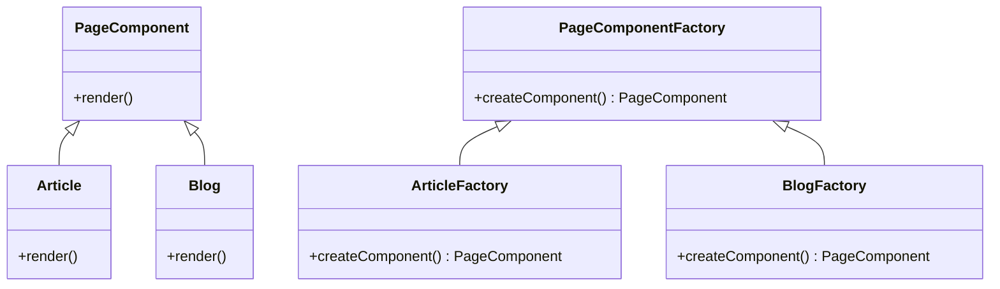

## 27.1 Building a Content Management System (CMS)

In this section, we will embark on a journey to build a robust and scalable Content Management System (CMS) using PHP. We'll leverage classic and modern design patterns to create a system that is not only functional but also maintainable and extensible. Our objective is to develop a CMS that can handle complex content structures, support plugins and themes, and adapt to future requirements with ease.

### Objective

- **Develop a flexible and scalable CMS.**

### Patterns Utilized

- **Factory Method:** Create different page components.
- **Observer Pattern:** Notify modules of content changes.
- **Composite Pattern:** Manage nested content structures.

### Implementation Highlights

- Modular architecture for plugins and themes.
- Use of MVC pattern for separation of concerns.

### Challenges Addressed

- Ensuring extensibility for future features.
- Managing content relationships and hierarchies.

---

### Introduction to CMS Development

A Content Management System (CMS) is a software application that enables users to create, manage, and modify content on a website without needing specialized technical knowledge. Popular CMS platforms include WordPress, Joomla, and Drupal. In this guide, we'll focus on building a CMS from scratch using PHP, emphasizing the use of design patterns to achieve a clean and efficient architecture.

### Key Concepts and Design Patterns

Before diving into the implementation, let's explore the key design patterns we'll use and how they contribute to building a CMS.

#### Factory Method Pattern

**Intent:** The Factory Method pattern provides an interface for creating objects in a superclass but allows subclasses to alter the type of objects that will be created. This pattern is particularly useful in a CMS for creating different types of page components, such as articles, blogs, and static pages.

**Key Participants:**

- **Creator:** Declares the factory method, which returns an object of type `Product`.
- **ConcreteCreator:** Overrides the factory method to return an instance of a `ConcreteProduct`.
- **Product:** Defines the interface of objects the factory method creates.
- **ConcreteProduct:** Implements the `Product` interface.

**Applicability:** Use the Factory Method pattern when you need to create objects that share a common interface but have different implementations.

**Sample Code Snippet:**

```php
interface PageComponent {
    public function render();
}

class Article implements PageComponent {
    public function render() {
        return "<article>This is an article.</article>";
    }
}

class Blog implements PageComponent {
    public function render() {
        return "<div>This is a blog post.</div>";
    }
}

abstract class PageComponentFactory {
    abstract public function createComponent(): PageComponent;
}

class ArticleFactory extends PageComponentFactory {
    public function createComponent(): PageComponent {
        return new Article();
    }
}

class BlogFactory extends PageComponentFactory {
    public function createComponent(): PageComponent {
        return new Blog();
    }
}

// Usage
$articleFactory = new ArticleFactory();
$article = $articleFactory->createComponent();
echo $article->render();

$blogFactory = new BlogFactory();
$blog = $blogFactory->createComponent();
echo $blog->render();
```

**Design Considerations:** The Factory Method pattern is ideal for scenarios where a class cannot anticipate the class of objects it must create. It promotes loose coupling by eliminating the need to bind application-specific classes into the code.

#### Observer Pattern

**Intent:** The Observer pattern defines a one-to-many dependency between objects so that when one object changes state, all its dependents are notified and updated automatically. This pattern is useful in a CMS for notifying modules of content changes, such as when a new article is published or an existing page is updated.

**Key Participants:**

- **Subject:** Maintains a list of observers and provides an interface for attaching and detaching observer objects.
- **Observer:** Defines an updating interface for objects that should be notified of changes in a subject.
- **ConcreteSubject:** Stores state of interest to ConcreteObserver objects and sends a notification to its observers when its state changes.
- **ConcreteObserver:** Implements the Observer interface to keep its state consistent with the subject's.

**Applicability:** Use the Observer pattern when a change to one object requires changing others, and you don't know how many objects need to be changed.

**Sample Code Snippet:**

```php
interface Observer {
    public function update(string $content);
}

class EmailNotifier implements Observer {
    public function update(string $content) {
        echo "Email notification sent with content: $content\n";
    }
}

class Logger implements Observer {
    public function update(string $content) {
        echo "Log entry created for content: $content\n";
    }
}

class ContentPublisher {
    private $observers = [];

    public function attach(Observer $observer) {
        $this->observers[] = $observer;
    }

    public function detach(Observer $observer) {
        $this->observers = array_filter($this->observers, function($obs) use ($observer) {
            return $obs !== $observer;
        });
    }

    public function notify(string $content) {
        foreach ($this->observers as $observer) {
            $observer->update($content);
        }
    }

    public function publish(string $content) {
        echo "Publishing content: $content\n";
        $this->notify($content);
    }
}

// Usage
$publisher = new ContentPublisher();
$emailNotifier = new EmailNotifier();
$logger = new Logger();

$publisher->attach($emailNotifier);
$publisher->attach($logger);

$publisher->publish("New article on design patterns.");
```

**Design Considerations:** The Observer pattern is beneficial when an abstraction has two aspects, one dependent on the other. Encapsulating these aspects in separate objects allows you to vary and reuse them independently.

#### Composite Pattern

**Intent:** The Composite pattern allows you to compose objects into tree structures to represent part-whole hierarchies. This pattern lets clients treat individual objects and compositions of objects uniformly. In a CMS, this pattern is useful for managing nested content structures, such as a page containing multiple sections, each with its own content.

**Key Participants:**

- **Component:** Declares the interface for objects in the composition and implements default behavior for the interface common to all classes.
- **Leaf:** Represents leaf objects in the composition. A leaf has no children.
- **Composite:** Defines behavior for components having children and stores child components.

**Applicability:** Use the Composite pattern when you want to represent part-whole hierarchies of objects and you want clients to be able to ignore the difference between compositions of objects and individual objects.

**Sample Code Snippet:**

```php
interface Content {
    public function render();
}

class Text implements Content {
    private $text;

    public function __construct($text) {
        $this->text = $text;
    }

    public function render() {
        return $this->text;
    }
}

class Image implements Content {
    private $url;

    public function __construct($url) {
        $this->url = $url;
    }

    public function render() {
        return "url}' />";
    }
}

class Section implements Content {
    private $contents = [];

    public function add(Content $content) {
        $this->contents[] = $content;
    }

    public function render() {
        $output = "<section>";
        foreach ($this->contents as $content) {
            $output .= $content->render();
        }
        $output .= "</section>";
        return $output;
    }
}

// Usage
$section = new Section();
$section->add(new Text("Welcome to our website."));
$section->add(new Image("logo.png"));

echo $section->render();
```

**Design Considerations:** The Composite pattern is ideal for representing hierarchies of objects. It simplifies client code by allowing clients to treat individual objects and compositions uniformly.

### Implementation Highlights

#### Modular Architecture

A modular architecture is crucial for a CMS to support plugins and themes. This architecture allows developers to extend the CMS's functionality without modifying its core codebase. By using interfaces and abstract classes, we can define contracts for plugins and themes, ensuring they adhere to the expected behavior.

#### MVC Pattern

The Model-View-Controller (MVC) pattern is a fundamental design pattern for separating concerns in an application. In a CMS, the MVC pattern helps organize code into three interconnected components:

- **Model:** Manages data and business logic.
- **View:** Handles the presentation layer.
- **Controller:** Processes user input and interacts with the model.

This separation allows for more manageable and testable code, as each component can be developed and maintained independently.

### Challenges Addressed

#### Ensuring Extensibility

Extensibility is a critical requirement for any CMS, as it needs to adapt to future needs and integrate new features seamlessly. By using design patterns like Factory Method and Observer, we can create a flexible system that allows for easy addition of new components and modules.

#### Managing Content Relationships and Hierarchies

Content in a CMS often has complex relationships and hierarchies. The Composite pattern is instrumental in managing these structures, allowing us to treat individual content items and groups of items uniformly. This approach simplifies the management of nested content and ensures consistency across the system.

### Try It Yourself

Now that we've explored the key concepts and design patterns for building a CMS, it's time to experiment with the code examples provided. Try modifying the code to create new types of page components, add additional observers, or build more complex content hierarchies. This hands-on experience will deepen your understanding of the patterns and their applications.

### Visualizing the CMS Architecture

To better understand the architecture of our CMS, let's visualize the relationships between the components using a class diagram.



**Diagram Description:** This class diagram illustrates the Factory Method pattern used in our CMS. The `PageComponent` interface defines the `render` method, which is implemented by `Article` and `Blog` classes. The `PageComponentFactory` abstract class declares the `createComponent` method, which is implemented by `ArticleFactory` and `BlogFactory` classes to create instances of `Article` and `Blog`, respectively.

### References and Links

For further reading on design patterns and CMS development, consider exploring the following resources:

- [Design Patterns: Elements of Reusable Object-Oriented Software](https://www.amazon.com/Design-Patterns-Elements-Reusable-Object-Oriented/dp/0201633612) by Erich Gamma, Richard Helm, Ralph Johnson, and John Vlissides.
- [PHP: The Right Way](https://phptherightway.com/) - A comprehensive guide to PHP best practices.
- [MDN Web Docs](https://developer.mozilla.org/en-US/docs/Web) - A valuable resource for web development documentation.

### Knowledge Check

- What are the key benefits of using the Factory Method pattern in a CMS?
- How does the Observer pattern facilitate content updates in a CMS?
- Why is the Composite pattern suitable for managing nested content structures?

### Embrace the Journey

Remember, building a CMS is a complex task that requires careful planning and execution. By leveraging design patterns, we can create a system that is not only functional but also maintainable and extensible. Keep experimenting, stay curious, and enjoy the journey of building your own CMS!

---

## Quiz: Building a Content Management System (CMS)



### What is the primary benefit of using the Factory Method pattern in a CMS?

- [x] It allows for the creation of different page components without modifying existing code.
- [ ] It simplifies the user interface design.
- [ ] It enhances database performance.
- [ ] It reduces the need for server resources.

> **Explanation:** The Factory Method pattern provides a way to create objects without specifying the exact class of object that will be created, allowing for flexibility and extensibility in creating different page components.

### How does the Observer pattern benefit a CMS?

- [x] It allows modules to be notified of content changes automatically.
- [ ] It improves the visual design of the CMS.
- [ ] It reduces the number of database queries.
- [ ] It simplifies the installation process.

> **Explanation:** The Observer pattern establishes a one-to-many dependency between objects, so when one object changes state, all its dependents are notified and updated automatically, which is useful for content updates in a CMS.

### Which pattern is ideal for managing nested content structures in a CMS?

- [x] Composite Pattern
- [ ] Singleton Pattern
- [ ] Strategy Pattern
- [ ] Decorator Pattern

> **Explanation:** The Composite pattern allows you to compose objects into tree structures to represent part-whole hierarchies, making it ideal for managing nested content structures.

### What is the role of the Model in the MVC pattern?

- [x] It manages data and business logic.
- [ ] It handles user input.
- [ ] It renders the user interface.
- [ ] It manages user sessions.

> **Explanation:** In the MVC pattern, the Model is responsible for managing data and business logic, while the View handles presentation and the Controller processes user input.

### Which design pattern is used to create different types of page components in a CMS?

- [x] Factory Method
- [ ] Observer
- [ ] Composite
- [ ] Singleton

> **Explanation:** The Factory Method pattern is used to create different types of page components, allowing for flexibility and extensibility in the CMS architecture.

### What is a key advantage of using a modular architecture in a CMS?

- [x] It allows for easy addition of plugins and themes.
- [ ] It reduces the need for user authentication.
- [ ] It simplifies the database schema.
- [ ] It enhances the visual design.

> **Explanation:** A modular architecture allows developers to extend the CMS's functionality through plugins and themes without modifying the core codebase, enhancing flexibility and maintainability.

### How does the Composite pattern treat individual objects and compositions?

- [x] It treats them uniformly.
- [ ] It treats them differently.
- [ ] It ignores individual objects.
- [ ] It only focuses on compositions.

> **Explanation:** The Composite pattern allows clients to treat individual objects and compositions of objects uniformly, simplifying client code and management of nested structures.

### What is the purpose of the Controller in the MVC pattern?

- [x] It processes user input and interacts with the model.
- [ ] It manages data and business logic.
- [ ] It renders the user interface.
- [ ] It handles database connections.

> **Explanation:** In the MVC pattern, the Controller processes user input and interacts with the Model to update the View, acting as an intermediary between the Model and the View.

### Which pattern is used to notify modules of content changes in a CMS?

- [x] Observer Pattern
- [ ] Factory Method
- [ ] Composite Pattern
- [ ] Strategy Pattern

> **Explanation:** The Observer pattern is used to notify modules of content changes, allowing for automatic updates and synchronization across the CMS.

### True or False: The Factory Method pattern is used to manage nested content structures in a CMS.

- [ ] True
- [x] False

> **Explanation:** False. The Composite pattern, not the Factory Method pattern, is used to manage nested content structures in a CMS by allowing objects to be composed into tree structures.



---
