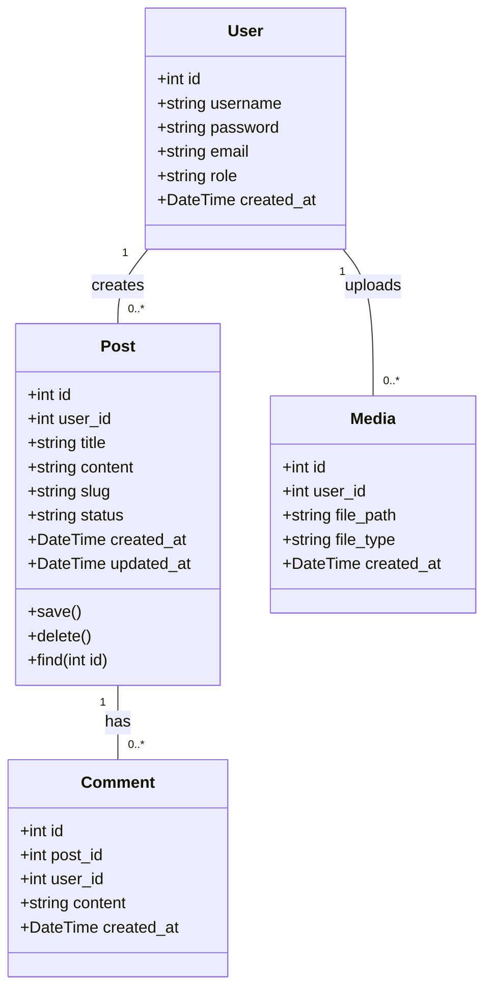

## 27.10 Implementing a Blogging Platform

In this section, we will explore how to implement a comprehensive blogging platform using PHP design patterns. Our objective is to create a user-friendly platform for publishing and managing blog posts, utilizing the Active Record and Template Method patterns to streamline data interactions and content rendering. We will also address challenges such as media uploads, content distribution, and customization options, while ensuring SEO optimization and responsive design.

### Objective

The primary goal of this project is to build a robust blogging platform that allows users to easily publish, edit, and manage blog posts. Key features include:

- User authentication and authorization
- SEO optimization for better search engine visibility
- Responsive design for seamless access across devices
- Media upload and management
- Customization options for themes and layouts

### Patterns Utilized

#### Active Record Pattern

The Active Record pattern is a design pattern that simplifies data interactions by wrapping a database table or view into a class. Each instance of the class represents a single row in the table, and the class provides methods for CRUD (Create, Read, Update, Delete) operations.

**Key Benefits:**

- Simplifies database interactions by encapsulating SQL queries within the class.
- Provides a clear mapping between database tables and application objects.
- Reduces boilerplate code by handling common database operations.

#### Template Method Pattern

The Template Method pattern defines the skeleton of an algorithm in a method, deferring some steps to subclasses. This pattern allows subclasses to redefine certain steps of an algorithm without changing its structure.

**Key Benefits:**

- Promotes code reuse by defining common steps in a base class.
- Enhances flexibility by allowing subclasses to implement specific steps.
- Simplifies maintenance by centralizing the algorithm structure.

### Implementation Highlights

#### SEO Optimization Features

To enhance the platform's visibility on search engines, we will implement the following SEO features:

- **Meta Tags:** Automatically generate meta tags for each post, including title, description, and keywords.
- **Sitemaps:** Create XML sitemaps to help search engines index the site efficiently.
- **Permalinks:** Use clean and descriptive URLs for blog posts to improve readability and SEO.

#### Responsive Design

Ensuring a responsive design is crucial for providing a seamless user experience across different devices. We will use CSS frameworks like Bootstrap to create a mobile-friendly layout that adapts to various screen sizes.

### Challenges Addressed

#### Handling Media Uploads and Content Distribution

Managing media uploads and content distribution can be challenging, especially when dealing with large files. We will implement a robust media management system that allows users to upload, organize, and distribute media files efficiently.

**Key Features:**

- **File Uploads:** Support for uploading images, videos, and documents.
- **Media Library:** A centralized library for managing uploaded files.
- **Content Delivery Network (CDN):** Use a CDN to distribute media files globally, reducing load times and improving performance.

#### Providing Customization Options for Users

To cater to diverse user preferences, we will offer customization options for themes and layouts. Users will be able to choose from a variety of themes and customize the appearance of their blog.

**Key Features:**

- **Theme Selection:** A selection of pre-designed themes for users to choose from.
- **Customizable Layouts:** Allow users to customize the layout of their blog, including header, footer, and sidebar configurations.
- **Widget Support:** Enable users to add and arrange widgets on their blog.

### Detailed Implementation

#### Setting Up the Environment

Before diving into the implementation, let's set up the development environment. We will use PHP 8, a MySQL database, and a web server like Apache or Nginx. Ensure you have Composer installed for dependency management.

```bash
# Install Composer globally
curl -sS https://getcomposer.org/installer | php
mv composer.phar /usr/local/bin/composer
```

#### Database Design

Designing the database schema is a crucial step in building a blogging platform. We will create tables for users, posts, comments, and media.

```sql
CREATE TABLE users (
    id INT AUTO_INCREMENT PRIMARY KEY,
    username VARCHAR(50) NOT NULL,
    password VARCHAR(255) NOT NULL,
    email VARCHAR(100) NOT NULL,
    role ENUM('admin', 'editor', 'author') DEFAULT 'author',
    created_at TIMESTAMP DEFAULT CURRENT_TIMESTAMP
);

CREATE TABLE posts (
    id INT AUTO_INCREMENT PRIMARY KEY,
    user_id INT NOT NULL,
    title VARCHAR(255) NOT NULL,
    content TEXT NOT NULL,
    slug VARCHAR(255) UNIQUE NOT NULL,
    status ENUM('draft', 'published') DEFAULT 'draft',
    created_at TIMESTAMP DEFAULT CURRENT_TIMESTAMP,
    updated_at TIMESTAMP DEFAULT CURRENT_TIMESTAMP ON UPDATE CURRENT_TIMESTAMP,
    FOREIGN KEY (user_id) REFERENCES users(id)
);

CREATE TABLE comments (
    id INT AUTO_INCREMENT PRIMARY KEY,
    post_id INT NOT NULL,
    user_id INT NOT NULL,
    content TEXT NOT NULL,
    created_at TIMESTAMP DEFAULT CURRENT_TIMESTAMP,
    FOREIGN KEY (post_id) REFERENCES posts(id),
    FOREIGN KEY (user_id) REFERENCES users(id)
);

CREATE TABLE media (
    id INT AUTO_INCREMENT PRIMARY KEY,
    user_id INT NOT NULL,
    file_path VARCHAR(255) NOT NULL,
    file_type VARCHAR(50) NOT NULL,
    created_at TIMESTAMP DEFAULT CURRENT_TIMESTAMP,
    FOREIGN KEY (user_id) REFERENCES users(id)
);
```

#### Implementing the Active Record Pattern

Let's implement the Active Record pattern for the `Post` class. This class will encapsulate database interactions for the `posts` table.

```php
class Post
{
    private $db;
    public $id;
    public $user_id;
    public $title;
    public $content;
    public $slug;
    public $status;
    public $created_at;
    public $updated_at;

    public function __construct($db)
    {
        $this->db = $db;
    }

    public function save()
    {
        if ($this->id) {
            // Update existing post
            $stmt = $this->db->prepare("UPDATE posts SET title = ?, content = ?, slug = ?, status = ? WHERE id = ?");
            $stmt->execute([$this->title, $this->content, $this->slug, $this->status, $this->id]);
        } else {
            // Insert new post
            $stmt = $this->db->prepare("INSERT INTO posts (user_id, title, content, slug, status) VALUES (?, ?, ?, ?, ?)");
            $stmt->execute([$this->user_id, $this->title, $this->content, $this->slug, $this->status]);
            $this->id = $this->db->lastInsertId();
        }
    }

    public function delete()
    {
        if ($this->id) {
            $stmt = $this->db->prepare("DELETE FROM posts WHERE id = ?");
            $stmt->execute([$this->id]);
        }
    }

    public static function find($db, $id)
    {
        $stmt = $db->prepare("SELECT * FROM posts WHERE id = ?");
        $stmt->execute([$id]);
        $data = $stmt->fetch();
        if ($data) {
            $post = new self($db);
            $post->id = $data['id'];
            $post->user_id = $data['user_id'];
            $post->title = $data['title'];
            $post->content = $data['content'];
            $post->slug = $data['slug'];
            $post->status = $data['status'];
            $post->created_at = $data['created_at'];
            $post->updated_at = $data['updated_at'];
            return $post;
        }
        return null;
    }
}
```

#### Implementing the Template Method Pattern

We will use the Template Method pattern to define the steps for rendering a blog post. The base class will provide the structure, while subclasses can customize specific steps.

```php
abstract class PostRenderer
{
    public function render()
    {
        $this->renderHeader();
        $this->renderContent();
        $this->renderFooter();
    }

    protected abstract function renderHeader();
    protected abstract function renderContent();
    protected abstract function renderFooter();
}

class HtmlPostRenderer extends PostRenderer
{
    protected function renderHeader()
    {
        echo "<h1>{$this->post->title}</h1>";
    }

    protected function renderContent()
    {
        echo "<div>{$this->post->content}</div>";
    }

    protected function renderFooter()
    {
        echo "<footer>Published on {$this->post->created_at}</footer>";
    }
}
```

### Try It Yourself

Now that we've covered the basics, try experimenting with the code examples. Here are a few suggestions:

- **Modify the Active Record class** to include additional fields, such as tags or categories.
- **Create a new renderer class** that outputs posts in a different format, such as JSON or XML.
- **Implement additional features** like post scheduling or user comments.

### Visualizing the Architecture

To better understand the architecture of our blogging platform, let's visualize the relationships between the components using a class diagram.



### References and Links

For further reading and deeper dives into the topics covered in this section, consider the following resources:

- [PHP: The Right Way](https://phptherightway.com/)
- [MDN Web Docs: HTML](https://developer.mozilla.org/en-US/docs/Web/HTML)
- [Bootstrap Documentation](https://getbootstrap.com/docs/5.0/getting-started/introduction/)
- [SEO Basics: Beginner's Guide to SEO](https://moz.com/beginners-guide-to-seo)

### Knowledge Check

To reinforce your understanding, consider the following questions:

- How does the Active Record pattern simplify database interactions?
- What are the benefits of using the Template Method pattern for rendering content?
- How can you enhance the SEO of a blogging platform?
- What are some challenges associated with media uploads and content distribution?

### Embrace the Journey

Remember, this is just the beginning. As you progress, you'll build more complex and interactive blogging platforms. Keep experimenting, stay curious, and enjoy the journey!

## Quiz: Implementing a Blogging Platform



### What is the primary benefit of using the Active Record pattern in a blogging platform?

- [x] Simplifies database interactions by encapsulating SQL queries within a class.
- [ ] Enhances the user interface design.
- [ ] Provides a way to manage user sessions.
- [ ] Improves the security of the application.

> **Explanation:** The Active Record pattern simplifies database interactions by encapsulating SQL queries within a class, making it easier to perform CRUD operations.

### Which design pattern is used to define the steps for rendering a blog post?

- [x] Template Method Pattern
- [ ] Singleton Pattern
- [ ] Factory Method Pattern
- [ ] Observer Pattern

> **Explanation:** The Template Method pattern is used to define the steps for rendering a blog post, allowing subclasses to customize specific steps.

### What is a key feature of SEO optimization in a blogging platform?

- [x] Automatically generating meta tags for each post.
- [ ] Using complex database queries.
- [ ] Implementing a caching mechanism.
- [ ] Providing user authentication.

> **Explanation:** Automatically generating meta tags for each post is a key feature of SEO optimization, helping improve search engine visibility.

### How can responsive design be achieved in a blogging platform?

- [x] Using CSS frameworks like Bootstrap.
- [ ] Implementing complex server-side logic.
- [ ] Using only JavaScript for styling.
- [ ] Ignoring mobile users.

> **Explanation:** Responsive design can be achieved by using CSS frameworks like Bootstrap, which provide a mobile-friendly layout that adapts to various screen sizes.

### What is a challenge addressed by the blogging platform implementation?

- [x] Handling media uploads and content distribution.
- [ ] Creating complex database schemas.
- [ ] Implementing a new programming language.
- [ ] Designing a new operating system.

> **Explanation:** Handling media uploads and content distribution is a challenge addressed by the blogging platform implementation, ensuring efficient management of large files.

### Which PHP feature is crucial for managing dependencies in a blogging platform?

- [x] Composer
- [ ] PHPMyAdmin
- [ ] Apache
- [ ] Nginx

> **Explanation:** Composer is crucial for managing dependencies in a PHP application, allowing for easy installation and management of libraries and packages.

### What is the role of the `PostRenderer` class in the blogging platform?

- [x] Defines the structure for rendering a blog post.
- [ ] Manages user authentication.
- [ ] Handles database migrations.
- [ ] Provides caching functionality.

> **Explanation:** The `PostRenderer` class defines the structure for rendering a blog post, using the Template Method pattern to allow customization of specific steps.

### How does the blogging platform ensure SEO-friendly URLs?

- [x] By using clean and descriptive permalinks.
- [ ] By implementing complex algorithms.
- [ ] By using random strings for URLs.
- [ ] By ignoring URL structure.

> **Explanation:** The blogging platform ensures SEO-friendly URLs by using clean and descriptive permalinks, which improve readability and search engine optimization.

### What is the purpose of the `save()` method in the `Post` class?

- [x] To insert or update a post in the database.
- [ ] To delete a post from the database.
- [ ] To render a post on the frontend.
- [ ] To authenticate a user.

> **Explanation:** The `save()` method in the `Post` class is used to insert or update a post in the database, encapsulating the logic for these operations.

### True or False: The Template Method pattern allows subclasses to redefine certain steps of an algorithm without changing its structure.

- [x] True
- [ ] False

> **Explanation:** True. The Template Method pattern allows subclasses to redefine certain steps of an algorithm without changing its overall structure, promoting flexibility and code reuse.


