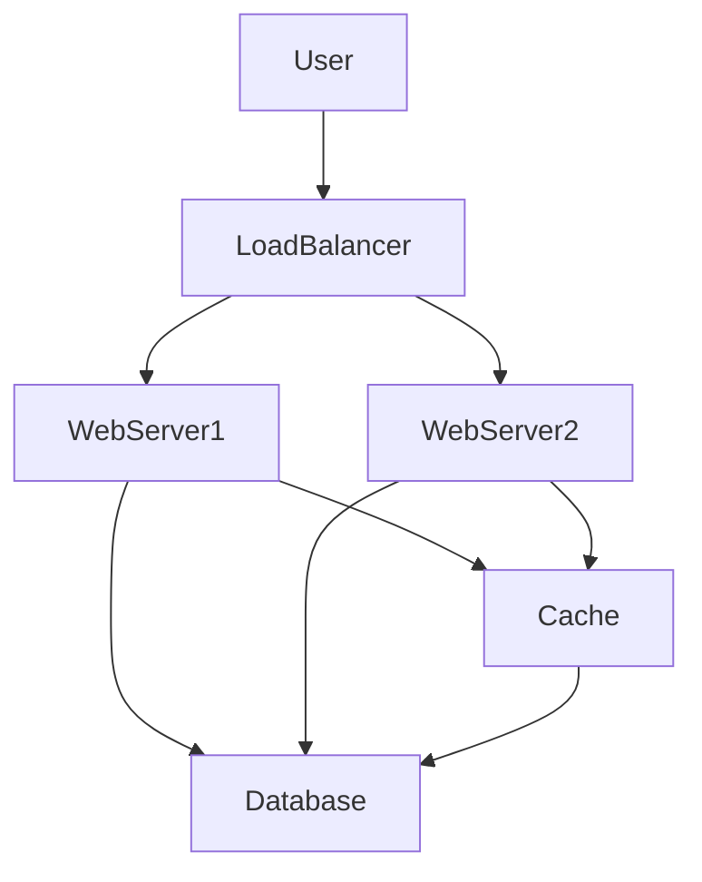

## 27.2 Developing a Social Networking Site

Creating a social networking site is an ambitious yet rewarding project that involves various design patterns and architectural considerations. In this section, we will explore how to develop a social networking platform using PHP, focusing on key design patterns such as Strategy, Iterator, and Singleton. We will also address challenges like scalability, real-time updates, and data privacy.

### Objective

Our primary objective is to create a platform where users can connect, share content, and interact in real-time. This involves implementing features such as user authentication, content feeds, and real-time notifications.

### Patterns Utilized

#### Strategy Pattern

The Strategy Pattern is essential for handling various authentication methods, such as OAuth, JWT, and traditional username/password combinations. This pattern allows us to define a family of algorithms, encapsulate each one, and make them interchangeable.

#### Iterator Pattern

The Iterator Pattern is used to efficiently navigate user feeds. It provides a way to access elements of an aggregate object sequentially without exposing its underlying representation.

#### Singleton Pattern

The Singleton Pattern is employed to manage shared configurations and resources, ensuring that a class has only one instance and providing a global point of access to it.

### Implementation Highlights

#### Real-Time Updates Using WebSockets

Real-time updates are crucial for a social networking site to keep users engaged. We will use WebSockets to push notifications and updates to users instantly.

#### Scalable Architecture

Scalability is a key concern as the platform grows. We will design a scalable architecture that can handle increasing numbers of users and content.

### Challenges Addressed

#### Handling Large Amounts of User-Generated Content

Managing and storing large volumes of user-generated content efficiently is a significant challenge. We will explore strategies for database optimization and content delivery.

#### Ensuring Data Privacy and Security

Data privacy and security are paramount. We will implement robust security measures to protect user data and ensure compliance with privacy regulations.

---

### Step-by-Step Development Process

#### 1. Setting Up the Project

Begin by setting up a PHP project using Composer for dependency management. Create a basic directory structure for organizing your code.

```bash
composer create-project --prefer-dist laravel/laravel social-network
```

#### 2. Implementing the Strategy Pattern for Authentication

Define an interface for authentication strategies and implement different strategies for various authentication methods.

```php
<?php

interface AuthStrategy {
    public function authenticate($credentials);
}

class OAuthStrategy implements AuthStrategy {
    public function authenticate($credentials) {
        // Implement OAuth authentication logic
    }
}

class JWTStrategy implements AuthStrategy {
    public function authenticate($credentials) {
        // Implement JWT authentication logic
    }
}

class PasswordStrategy implements AuthStrategy {
    public function authenticate($credentials) {
        // Implement password authentication logic
    }
}

class AuthContext {
    private $strategy;

    public function setStrategy(AuthStrategy $strategy) {
        $this->strategy = $strategy;
    }

    public function authenticate($credentials) {
        return $this->strategy->authenticate($credentials);
    }
}

// Usage
$authContext = new AuthContext();
$authContext->setStrategy(new OAuthStrategy());
$authContext->authenticate($credentials);
```

#### 3. Using the Iterator Pattern for User Feeds

Create an iterator for navigating user feeds, allowing efficient access to posts and updates.

```php
<?php

interface FeedIterator {
    public function hasNext();
    public function next();
}

class UserFeedIterator implements FeedIterator {
    private $posts;
    private $position = 0;

    public function __construct($posts) {
        $this->posts = $posts;
    }

    public function hasNext() {
        return $this->position < count($this->posts);
    }

    public function next() {
        return $this->posts[$this->position++];
    }
}

// Usage
$posts = ['Post 1', 'Post 2', 'Post 3'];
$iterator = new UserFeedIterator($posts);

while ($iterator->hasNext()) {
    echo $iterator->next();
}
```

#### 4. Implementing the Singleton Pattern for Configuration Management

Use the Singleton Pattern to manage shared configurations, ensuring a single instance is used throughout the application.

```php
<?php

class Config {
    private static $instance = null;
    private $settings = [];

    private function __construct() {
        // Load configuration settings
        $this->settings = parse_ini_file('config.ini');
    }

    public static function getInstance() {
        if (self::$instance == null) {
            self::$instance = new Config();
        }
        return self::$instance;
    }

    public function get($key) {
        return $this->settings[$key] ?? null;
    }
}

// Usage
$config = Config::getInstance();
echo $config->get('database_host');
```

#### 5. Real-Time Updates with WebSockets

Implement WebSockets for real-time updates, allowing users to receive notifications and updates instantly.

```php
// WebSocket server setup using Ratchet library
use Ratchet\MessageComponentInterface;
use Ratchet\ConnectionInterface;

class NotificationServer implements MessageComponentInterface {
    protected $clients;

    public function __construct() {
        $this->clients = new \SplObjectStorage;
    }

    public function onOpen(ConnectionInterface $conn) {
        $this->clients->attach($conn);
    }

    public function onMessage(ConnectionInterface $from, $msg) {
        foreach ($this->clients as $client) {
            if ($from !== $client) {
                $client->send($msg);
            }
        }
    }

    public function onClose(ConnectionInterface $conn) {
        $this->clients->detach($conn);
    }

    public function onError(ConnectionInterface $conn, \Exception $e) {
        $conn->close();
    }
}

// Run the server
$server = IoServer::factory(
    new HttpServer(
        new WsServer(
            new NotificationServer()
        )
    ),
    8080
);

$server->run();
```

#### 6. Designing a Scalable Architecture

Design a scalable architecture using microservices and load balancing to handle growth and ensure high availability.



### Key Considerations

- **Database Optimization:** Use indexing and caching to improve database performance.
- **Content Delivery Network (CDN):** Utilize a CDN to deliver static content efficiently.
- **Security Measures:** Implement SSL/TLS, input validation, and secure session management.

### Try It Yourself

Experiment with the code examples provided. Try implementing additional authentication strategies or modifying the iterator to handle different types of content.

### Knowledge Check

- Explain how the Strategy Pattern can be used to handle different authentication methods.
- Describe the benefits of using the Iterator Pattern for navigating user feeds.
- Discuss the role of the Singleton Pattern in managing shared configurations.

### Embrace the Journey

Remember, building a social networking site is a complex task that requires careful planning and execution. As you progress, you'll encounter new challenges and opportunities for learning. Keep experimenting, stay curious, and enjoy the journey!

---

## Quiz: Developing a Social Networking Site



### What design pattern is used to handle various authentication methods in a social networking site?

- [x] Strategy Pattern
- [ ] Iterator Pattern
- [ ] Singleton Pattern
- [ ] Observer Pattern

> **Explanation:** The Strategy Pattern is used to handle various authentication methods by defining a family of algorithms and making them interchangeable.

### Which pattern is used to efficiently navigate user feeds?

- [ ] Strategy Pattern
- [x] Iterator Pattern
- [ ] Singleton Pattern
- [ ] Factory Pattern

> **Explanation:** The Iterator Pattern provides a way to access elements of an aggregate object sequentially without exposing its underlying representation.

### What is the purpose of the Singleton Pattern in this context?

- [ ] To handle authentication
- [ ] To navigate user feeds
- [x] To manage shared configurations
- [ ] To implement real-time updates

> **Explanation:** The Singleton Pattern is used to manage shared configurations, ensuring that a class has only one instance and providing a global point of access to it.

### How are real-time updates implemented in the social networking site?

- [ ] Using AJAX
- [ ] Using REST APIs
- [x] Using WebSockets
- [ ] Using GraphQL

> **Explanation:** Real-time updates are implemented using WebSockets, which allow for instant notifications and updates to users.

### What is a key challenge addressed in developing a social networking site?

- [x] Handling large amounts of user-generated content
- [ ] Implementing a payment gateway
- [ ] Designing a static website
- [ ] Creating a simple blog

> **Explanation:** Handling large amounts of user-generated content is a significant challenge in developing a social networking site.

### Which of the following is a security measure to ensure data privacy?

- [x] Implementing SSL/TLS
- [ ] Using plain text passwords
- [ ] Disabling input validation
- [ ] Allowing unrestricted access

> **Explanation:** Implementing SSL/TLS is a security measure to ensure data privacy by encrypting data transmitted between the client and server.

### What is the role of a CDN in a social networking site?

- [x] To deliver static content efficiently
- [ ] To manage user authentication
- [ ] To handle database transactions
- [ ] To provide real-time updates

> **Explanation:** A Content Delivery Network (CDN) is used to deliver static content efficiently by caching content at various locations.

### Which PHP library is used for WebSocket server setup in the example?

- [ ] Guzzle
- [x] Ratchet
- [ ] Symfony
- [ ] Laravel

> **Explanation:** The Ratchet library is used for setting up a WebSocket server in PHP.

### What is a benefit of using microservices in a scalable architecture?

- [x] High availability
- [ ] Increased complexity
- [ ] Single point of failure
- [ ] Reduced flexibility

> **Explanation:** Using microservices in a scalable architecture provides high availability and allows for independent scaling of services.

### True or False: The Singleton Pattern can be used to manage user sessions.

- [ ] True
- [x] False

> **Explanation:** The Singleton Pattern is not typically used to manage user sessions, as sessions are user-specific and require separate instances.



---

This comprehensive guide provides a detailed roadmap for developing a social networking site using PHP and design patterns. By understanding and applying these patterns, you can create a robust, scalable, and secure platform.
