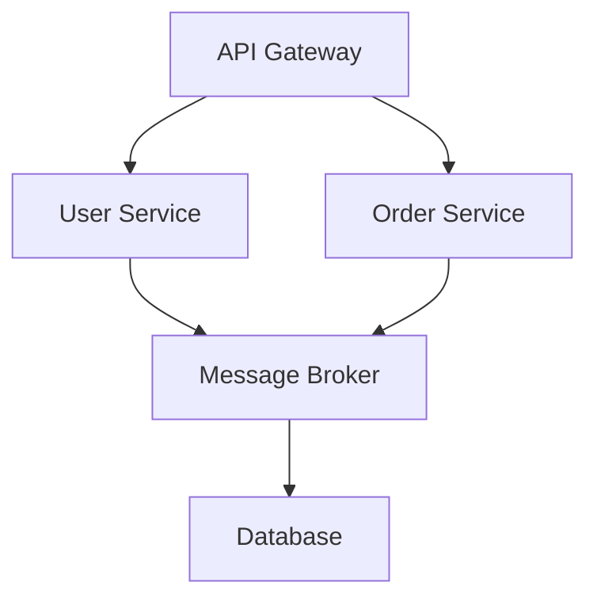

## 27.3 Designing a Microservices-Based Application

In today's fast-paced digital world, building scalable and maintainable applications is crucial. Microservices architecture offers a solution by breaking down complex applications into smaller, independent services. This section will guide you through designing a microservices-based application in PHP, focusing on key patterns and practices.

### Objective

The primary objective of this case study is to build a decoupled system that allows for independent service deployment. This approach enhances scalability, flexibility, and maintainability, making it easier to manage and evolve your application over time.

### Patterns Utilized

#### API Gateway

The API Gateway pattern acts as a single entry point for API clients. It simplifies client interactions by aggregating multiple service calls into a single request, reducing the complexity of client-side code.

#### Broker Pattern

The Broker Pattern manages message exchanges between services. It decouples service communication, allowing services to interact asynchronously and independently, improving system resilience and scalability.

### Implementation Highlights

#### Containerization with Docker

Docker containerization is a key component of microservices architecture. It allows you to package services with all their dependencies, ensuring consistency across different environments. Docker makes it easy to deploy, scale, and manage services.

#### Service Discovery Mechanisms

Service discovery is essential in a microservices architecture. It enables services to find each other dynamically, facilitating communication and load balancing. Tools like Consul, Eureka, or Kubernetes can be used for service discovery.

### Challenges Addressed

#### Orchestrating Communication Between Services

Orchestrating communication between services is a common challenge in microservices architecture. Using patterns like API Gateway and Broker, you can manage service interactions efficiently, ensuring reliable and scalable communication.

#### Monitoring and Logging Across Distributed Systems

Monitoring and logging are critical for maintaining system health and diagnosing issues. Implementing centralized logging and monitoring solutions, such as ELK Stack or Prometheus, helps track service performance and detect anomalies.

---

### Designing a Microservices-Based Application

#### Step 1: Define Service Boundaries

The first step in designing a microservices-based application is to define service boundaries. Each service should have a clear responsibility and encapsulate a specific business capability. This separation of concerns allows services to evolve independently.

#### Step 2: Choose Communication Protocols

Microservices can communicate using various protocols, such as HTTP/REST, gRPC, or messaging queues. Choose the protocol that best fits your use case. For instance, use HTTP/REST for synchronous communication and messaging queues for asynchronous interactions.

#### Step 3: Implement API Gateway

The API Gateway serves as the entry point for all client requests. It routes requests to the appropriate services, handles authentication, and performs request aggregation. Here's a simple example of an API Gateway implementation in PHP:

```php
<?php

class ApiGateway
{
    private $routes = [];

    public function registerRoute($path, $service)
    {
        $this->routes[$path] = $service;
    }

    public function handleRequest($request)
    {
        $path = $request->getPath();
        if (isset($this->routes[$path])) {
            $service = $this->routes[$path];
            return $service->handle($request);
        }
        return $this->notFoundResponse();
    }

    private function notFoundResponse()
    {
        return [
            'status' => 404,
            'body' => 'Not Found'
        ];
    }
}

// Example usage
$gateway = new ApiGateway();
$gateway->registerRoute('/user', new UserService());
$gateway->registerRoute('/order', new OrderService());

$response = $gateway->handleRequest($request);
echo json_encode($response);
```

#### Step 4: Implement Broker Pattern

The Broker Pattern facilitates asynchronous communication between services. It uses a message broker to manage message exchanges, allowing services to publish and subscribe to messages. Here's an example using RabbitMQ:

```php
<?php

use PhpAmqpLib\Connection\AMQPStreamConnection;
use PhpAmqpLib\Message\AMQPMessage;

class MessageBroker
{
    private $connection;
    private $channel;

    public function __construct($host, $port, $user, $password)
    {
        $this->connection = new AMQPStreamConnection($host, $port, $user, $password);
        $this->channel = $this->connection->channel();
    }

    public function publish($queue, $message)
    {
        $this->channel->queue_declare($queue, false, false, false, false);
        $msg = new AMQPMessage($message);
        $this->channel->basic_publish($msg, '', $queue);
    }

    public function consume($queue, $callback)
    {
        $this->channel->queue_declare($queue, false, false, false, false);
        $this->channel->basic_consume($queue, '', false, true, false, false, $callback);
    }

    public function close()
    {
        $this->channel->close();
        $this->connection->close();
    }
}

// Example usage
$broker = new MessageBroker('localhost', 5672, 'guest', 'guest');
$broker->publish('task_queue', 'Hello World!');
$broker->consume('task_queue', function ($msg) {
    echo 'Received ', $msg->body, "\n";
});
```

#### Step 5: Containerize Services with Docker

Docker allows you to package each service with its dependencies, ensuring consistency across environments. Here's a basic Dockerfile for a PHP service:

```dockerfile
# Use the official PHP image
FROM php:8.0-cli

# Set the working directory
WORKDIR /usr/src/app

# Copy the application files
COPY . .

# Install dependencies
RUN docker-php-ext-install pdo pdo_mysql

# Command to run the application
CMD [ "php", "./your-script.php" ]
```

Build and run the Docker container:

```bash
docker build -t my-php-service .
docker run -d -p 8080:80 my-php-service
```

#### Step 6: Implement Service Discovery

Service discovery enables services to find each other dynamically. Tools like Consul or Eureka can be used to register and discover services. Here's a simple example using Consul:

```bash
# Register a service with Consul
consul services register -name=my-service -address=127.0.0.1 -port=8080

# Discover services
consul catalog services
```

#### Step 7: Implement Monitoring and Logging

Centralized logging and monitoring are essential for maintaining system health. Use tools like ELK Stack or Prometheus to collect and analyze logs and metrics. Here's an example of setting up ELK Stack:

```bash
# Start Elasticsearch
docker run -d --name elasticsearch -p 9200:9200 -p 9300:9300 -e "discovery.type=single-node" elasticsearch:7.9.2

# Start Logstash
docker run -d --name logstash -p 5044:5044 -v /path/to/logstash.conf:/usr/share/logstash/pipeline/logstash.conf logstash:7.9.2

# Start Kibana
docker run -d --name kibana -p 5601:5601 kibana:7.9.2
```

### Challenges and Solutions

#### Challenge 1: Orchestrating Communication

Orchestrating communication between services can be complex. Use API Gateway and Broker Pattern to manage interactions efficiently. These patterns help decouple services and improve scalability.

#### Challenge 2: Monitoring and Logging

Monitoring and logging across distributed systems can be challenging. Implement centralized solutions like ELK Stack or Prometheus to track service performance and detect issues.

### Try It Yourself

Experiment with the code examples provided. Try modifying the API Gateway to add new routes or change the message broker to handle different message types. Explore Docker by creating containers for different services and see how they interact.

### Visualizing Microservices Architecture



**Diagram Description:** This diagram illustrates a simple microservices architecture with an API Gateway, User and Order services, a Message Broker, and a Database.

### Key Takeaways

- Microservices architecture enhances scalability and maintainability by decoupling services.
- Use API Gateway and Broker Pattern to manage service interactions efficiently.
- Docker containerization ensures consistency across environments.
- Service discovery and centralized logging are essential for dynamic communication and system health.

### References and Links

- [Docker Documentation](https://docs.docker.com/)
- [RabbitMQ Documentation](https://www.rabbitmq.com/documentation.html)
- [Consul by HashiCorp](https://www.consul.io/)
- [ELK Stack Documentation](https://www.elastic.co/what-is/elk-stack)

### Embrace the Journey

Remember, designing a microservices-based application is a journey. As you progress, you'll encounter new challenges and opportunities to learn. Keep experimenting, stay curious, and enjoy the process!

## Quiz: Designing a Microservices-Based Application



### What is the primary role of an API Gateway in a microservices architecture?

- [x] It acts as a single entry point for API clients.
- [ ] It manages database transactions.
- [ ] It handles service discovery.
- [ ] It performs data caching.

> **Explanation:** The API Gateway acts as a single entry point for API clients, simplifying client interactions and routing requests to appropriate services.

### Which pattern is used to manage message exchanges between services in a microservices architecture?

- [ ] API Gateway
- [x] Broker Pattern
- [ ] Singleton Pattern
- [ ] Factory Pattern

> **Explanation:** The Broker Pattern manages message exchanges between services, allowing for asynchronous and independent communication.

### What is the benefit of using Docker in a microservices architecture?

- [x] It allows for consistent deployment across environments.
- [ ] It provides a user interface for services.
- [ ] It handles service discovery.
- [ ] It manages API requests.

> **Explanation:** Docker allows for consistent deployment across different environments by packaging services with their dependencies.

### Which tool can be used for service discovery in a microservices architecture?

- [ ] RabbitMQ
- [ ] Docker
- [x] Consul
- [ ] ELK Stack

> **Explanation:** Consul is a tool used for service discovery, enabling services to find each other dynamically.

### What is a common challenge in microservices architecture?

- [x] Orchestrating communication between services
- [ ] Implementing a user interface
- [ ] Managing a single database
- [ ] Writing unit tests

> **Explanation:** Orchestrating communication between services is a common challenge due to the distributed nature of microservices.

### How can centralized logging be implemented in a microservices architecture?

- [ ] Using Docker
- [ ] Using RabbitMQ
- [x] Using ELK Stack
- [ ] Using Consul

> **Explanation:** Centralized logging can be implemented using the ELK Stack, which collects and analyzes logs from multiple services.

### What is the purpose of service discovery in microservices?

- [x] To enable services to find each other dynamically
- [ ] To manage database transactions
- [ ] To provide a user interface
- [ ] To handle API requests

> **Explanation:** Service discovery enables services to find each other dynamically, facilitating communication and load balancing.

### Which protocol is commonly used for synchronous communication between microservices?

- [x] HTTP/REST
- [ ] gRPC
- [ ] Messaging queues
- [ ] WebSockets

> **Explanation:** HTTP/REST is commonly used for synchronous communication between microservices.

### What is the role of the Broker Pattern in microservices?

- [x] It facilitates asynchronous communication between services.
- [ ] It manages database transactions.
- [ ] It handles API requests.
- [ ] It provides a user interface.

> **Explanation:** The Broker Pattern facilitates asynchronous communication between services, allowing them to interact independently.

### True or False: Microservices architecture allows for independent service deployment.

- [x] True
- [ ] False

> **Explanation:** True. Microservices architecture allows for independent service deployment, enhancing scalability and flexibility.


