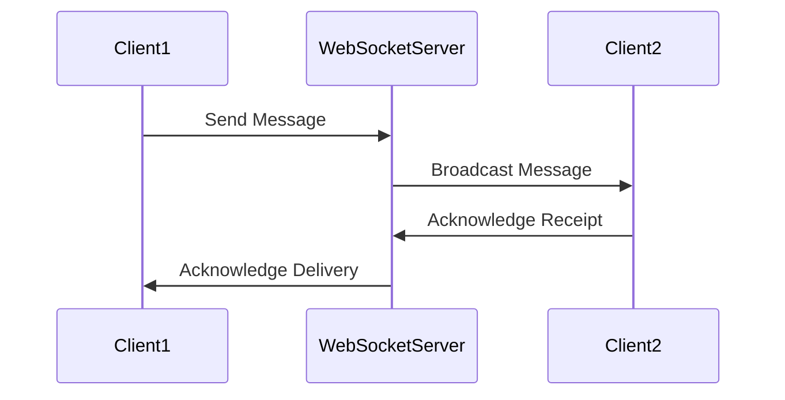

## 27.4 Implementing a Real-Time Chat Application

In this section, we will delve into the intricacies of building a real-time chat application using PHP. This case study will guide you through the process of implementing a seamless messaging system that allows users to communicate in real-time. We will explore the use of design patterns such as the Mediator and Observer patterns, and leverage WebSocket servers like Ratchet or Swoole to maintain persistent connections.

### Objective

The primary objective of this case study is to provide a comprehensive guide on implementing a real-time chat application that ensures seamless communication between users. The application will focus on:

- Providing real-time message delivery.
- Maintaining persistent connections.
- Ensuring message ordering and reliability.

### Patterns Utilized

To achieve the objectives, we will utilize the following design patterns:

- **Mediator Pattern:** This pattern will be used to handle message routing between users, acting as a central hub that manages communication.
- **Observer Pattern:** This pattern will be employed to update clients on new messages, ensuring that all connected clients receive updates in real-time.

### Implementation Highlights

The implementation will involve setting up a WebSocket server using either Ratchet or Swoole. These tools provide the necessary infrastructure to handle real-time communication efficiently.

- **Ratchet:** A PHP library for building real-time, bi-directional applications between clients and servers over WebSockets.
  - **Link:** [Ratchet](http://socketo.me/)
- **Swoole:** A coroutine-based asynchronous PHP extension that enhances the performance of PHP applications.
  - **Link:** [Swoole](https://www.swoole.co.uk/)

### Challenges Addressed

Building a real-time chat application comes with its own set of challenges. In this guide, we will address:

- **Maintaining Persistent Connections:** Ensuring that connections remain open and stable for real-time communication.
- **Ensuring Message Delivery and Ordering:** Guaranteeing that messages are delivered in the correct order and without loss.

### Setting Up the Environment

Before we dive into the implementation, let's set up the environment required for building our chat application.

#### Prerequisites

- PHP 7.4 or higher
- Composer
- A WebSocket server (Ratchet or Swoole)
- A database (MySQL or PostgreSQL) for storing chat history

#### Installing Ratchet

To install Ratchet, use Composer to add it to your project:

```bash
composer require cboden/ratchet
```

#### Installing Swoole

To install Swoole, you can use the following command:

```bash
pecl install swoole
```

Ensure that the Swoole extension is enabled in your `php.ini` file.

### Designing the Chat Application

Let's start by designing the architecture of our chat application. We'll use the Mediator and Observer patterns to manage communication and updates.

#### Mediator Pattern

The Mediator pattern will serve as the central hub for message routing. It will manage the communication between different clients, ensuring that messages are delivered to the correct recipients.

**Key Participants:**

- **Mediator Interface:** Defines the contract for communication.
- **Concrete Mediator:** Implements the communication logic.
- **Colleague Classes:** Represent the clients that communicate through the mediator.

#### Observer Pattern

The Observer pattern will be used to notify clients of new messages. When a message is sent, all connected clients will be updated in real-time.

**Key Participants:**

- **Subject Interface:** Defines the contract for managing observers.
- **Concrete Subject:** Maintains a list of observers and notifies them of changes.
- **Observer Interface:** Defines the contract for receiving updates.
- **Concrete Observer:** Implements the update logic.

### Implementing the Chat Application

Now that we have a clear understanding of the design, let's implement the chat application.

#### Step 1: Setting Up the WebSocket Server

We'll start by setting up a WebSocket server using Ratchet. The server will handle incoming connections and messages.

```php
<?php

use Ratchet\MessageComponentInterface;
use Ratchet\ConnectionInterface;

class ChatServer implements MessageComponentInterface {
    protected $clients;

    public function __construct() {
        $this->clients = new \SplObjectStorage;
    }

    public function onOpen(ConnectionInterface $conn) {
        // Store the new connection
        $this->clients->attach($conn);
        echo "New connection! ({$conn->resourceId})\n";
    }

    public function onMessage(ConnectionInterface $from, $msg) {
        // Broadcast the message to all clients
        foreach ($this->clients as $client) {
            if ($from !== $client) {
                $client->send($msg);
            }
        }
    }

    public function onClose(ConnectionInterface $conn) {
        // Remove the connection
        $this->clients->detach($conn);
        echo "Connection {$conn->resourceId} has disconnected\n";
    }

    public function onError(ConnectionInterface $conn, \Exception $e) {
        echo "An error has occurred: {$e->getMessage()}\n";
        $conn->close();
    }
}
```

#### Step 2: Running the WebSocket Server

To run the WebSocket server, create a script that initializes the server and listens for connections.

```php
<?php

use Ratchet\Server\IoServer;
use Ratchet\Http\HttpServer;
use Ratchet\WebSocket\WsServer;

require dirname(__DIR__) . '/vendor/autoload.php';

$server = IoServer::factory(
    new HttpServer(
        new WsServer(
            new ChatServer()
        )
    ),
    8080
);

$server->run();
```

#### Step 3: Implementing the Client-Side

On the client-side, we'll use JavaScript to establish a WebSocket connection and handle incoming messages.

```html
<!DOCTYPE html>
<html lang="en">
<head>
    <meta charset="UTF-8">
    <title>Real-Time Chat</title>
</head>
<body>
    <div id="chat">
        <div id="messages"></div>
        <input type="text" id="message" placeholder="Type a message...">
        <button id="send">Send</button>
    </div>

    <script>
        const conn = new WebSocket('ws://localhost:8080');

        conn.onopen = function() {
            console.log('Connection established!');
        };

        conn.onmessage = function(e) {
            const messages = document.getElementById('messages');
            messages.innerHTML += `<p>${e.data}</p>`;
        };

        document.getElementById('send').onclick = function() {
            const message = document.getElementById('message').value;
            conn.send(message);
            document.getElementById('message').value = '';
        };
    </script>
</body>
</html>
```

### Ensuring Message Delivery and Ordering

To ensure message delivery and ordering, we can implement a message queue or use a database to store messages temporarily. This ensures that messages are not lost and are delivered in the correct order.

### Handling Persistent Connections

Maintaining persistent connections is crucial for a real-time chat application. WebSockets provide a way to keep connections open, allowing for continuous communication between the client and server.

### Visualizing the Architecture

Below is a sequence diagram illustrating the flow of messages in our chat application.



### Try It Yourself

Experiment with the code by adding features such as:

- User authentication to identify users.
- Storing chat history in a database.
- Implementing private messaging between users.

### References and Links

- [Ratchet Documentation](http://socketo.me/docs/)
- [Swoole Documentation](https://www.swoole.co.uk/docs)
- [WebSockets - MDN Web Docs](https://developer.mozilla.org/en-US/docs/Web/API/WebSockets_API)

### Knowledge Check

- What are the key responsibilities of the Mediator pattern in a chat application?
- How does the Observer pattern help in updating clients with new messages?
- What are the benefits of using WebSockets for real-time communication?

### Embrace the Journey

Building a real-time chat application is an exciting journey that combines various design patterns and technologies. Remember, this is just the beginning. As you progress, you'll be able to build more complex and interactive applications. Keep experimenting, stay curious, and enjoy the journey!

## Quiz: Implementing a Real-Time Chat Application



### What is the primary role of the Mediator pattern in a chat application?

- [x] To handle message routing between users
- [ ] To store chat history
- [ ] To authenticate users
- [ ] To manage user sessions

> **Explanation:** The Mediator pattern acts as a central hub for managing communication between different clients.

### Which pattern is used to notify clients of new messages?

- [x] Observer Pattern
- [ ] Singleton Pattern
- [ ] Factory Pattern
- [ ] Strategy Pattern

> **Explanation:** The Observer pattern is used to update clients on new messages in real-time.

### What is the purpose of using WebSockets in a chat application?

- [x] To maintain persistent connections for real-time communication
- [ ] To store messages in a database
- [ ] To encrypt messages
- [ ] To compress data

> **Explanation:** WebSockets allow for continuous communication by maintaining open connections between the client and server.

### Which PHP library can be used to build a WebSocket server?

- [x] Ratchet
- [ ] Laravel
- [ ] Symfony
- [ ] CodeIgniter

> **Explanation:** Ratchet is a PHP library specifically designed for building WebSocket servers.

### What is a key challenge in building a real-time chat application?

- [x] Ensuring message delivery and ordering
- [ ] Designing a user interface
- [ ] Implementing a database
- [ ] Writing CSS styles

> **Explanation:** Ensuring that messages are delivered in the correct order and without loss is a significant challenge.

### How can message delivery be ensured in a chat application?

- [x] By implementing a message queue or using a database
- [ ] By using CSS animations
- [ ] By compressing data
- [ ] By encrypting messages

> **Explanation:** A message queue or database can temporarily store messages to ensure delivery and correct ordering.

### What is the role of the Observer pattern in a chat application?

- [x] To update clients with new messages
- [ ] To authenticate users
- [ ] To manage user sessions
- [ ] To store chat history

> **Explanation:** The Observer pattern notifies clients of new messages, ensuring real-time updates.

### Which of the following is a benefit of using Swoole for a WebSocket server?

- [x] Enhanced performance through asynchronous processing
- [ ] Built-in user authentication
- [ ] Automatic message encryption
- [ ] Integrated database management

> **Explanation:** Swoole enhances performance by providing coroutine-based asynchronous processing.

### True or False: WebSockets are used to maintain persistent connections in a chat application.

- [x] True
- [ ] False

> **Explanation:** WebSockets are designed to keep connections open, allowing for real-time communication.

### What is the first step in setting up a WebSocket server with Ratchet?

- [x] Installing Ratchet using Composer
- [ ] Designing the user interface
- [ ] Writing CSS styles
- [ ] Creating a database schema

> **Explanation:** The first step is to install Ratchet using Composer to set up the WebSocket server.


