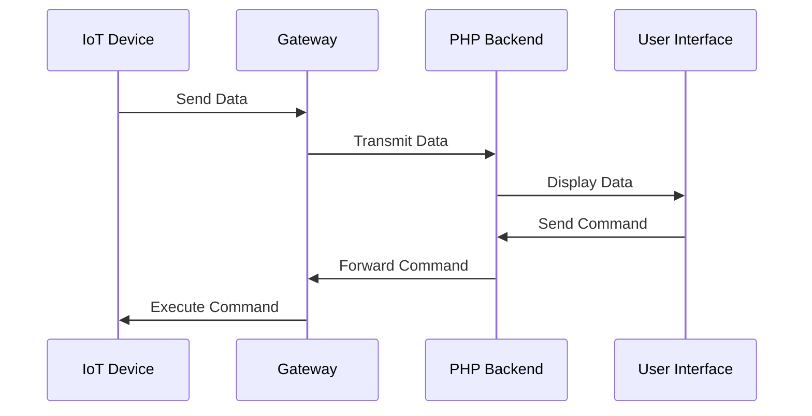

## 27.6 Integrating PHP with IoT Applications

The Internet of Things (IoT) is revolutionizing the way we interact with the world around us, enabling devices to communicate and share data seamlessly. Integrating PHP with IoT applications allows developers to leverage the power of PHP's backend capabilities to manage, control, and analyze data from IoT devices. In this section, we will explore how to effectively connect PHP with IoT devices using design patterns, protocols, and best practices.

### Objective

- **Connect PHP backend with IoT devices** for data collection and control.
- **Utilize design patterns** such as Adapter and Command to interface with various device protocols and send control instructions.

### Patterns Utilized

#### Adapter Pattern

The Adapter Pattern is crucial in IoT applications where devices may use different protocols or interfaces. By implementing an adapter, we can create a uniform interface for PHP to interact with these devices, regardless of their underlying communication protocols.

#### Command Pattern

The Command Pattern is used to encapsulate a request as an object, thereby allowing for parameterization of clients with queues, requests, and operations. This pattern is particularly useful in IoT applications for sending control instructions to devices.

### Implementation Highlights

#### MQTT Protocol for Messaging

MQTT (Message Queuing Telemetry Transport) is a lightweight messaging protocol designed for small sensors and mobile devices, making it ideal for IoT applications. It operates over TCP/IP and is designed to minimize network bandwidth and device resource requirements.

- **Link:** [PHP-MQTT Library](https://github.com/php-mqtt/client)

### Challenges Addressed

- **Ensuring Secure Communication:** Implementing encryption and secure authentication mechanisms to protect data integrity and privacy.
- **Managing Asynchronous Data Streams:** Handling real-time data streams efficiently to ensure timely processing and response.

---

### Integrating PHP with IoT: Step-by-Step Guide

#### 1. Understanding IoT Architecture

Before diving into the integration, it's essential to understand the basic architecture of IoT systems. An IoT system typically consists of:

- **Devices/Sensors:** Collect data from the environment.
- **Gateways:** Aggregate data from devices and transmit it to the cloud.
- **Cloud/Backend Systems:** Process, analyze, and store data.
- **User Interfaces:** Allow users to interact with the system.

#### 2. Setting Up the PHP Environment

To integrate PHP with IoT devices, ensure your PHP environment is set up with the necessary extensions and libraries. Use Composer for dependency management to include libraries like PHP-MQTT.

```bash
composer require php-mqtt/client
```

#### 3. Implementing the Adapter Pattern

The Adapter Pattern allows PHP to communicate with IoT devices using different protocols. Let's create an adapter for a hypothetical temperature sensor that communicates via HTTP.

```php
interface SensorInterface {
    public function getData();
}

class HttpTemperatureSensorAdapter implements SensorInterface {
    private $sensorUrl;

    public function __construct($url) {
        $this->sensorUrl = $url;
    }

    public function getData() {
        // Fetch data from the sensor using HTTP
        $response = file_get_contents($this->sensorUrl);
        return json_decode($response, true);
    }
}

// Usage
$sensor = new HttpTemperatureSensorAdapter('http://example.com/sensor');
$data = $sensor->getData();
echo "Temperature: " . $data['temperature'];
```

#### 4. Implementing the Command Pattern

The Command Pattern is useful for sending instructions to IoT devices. Let's implement a command to turn on a smart light.

```php
interface Command {
    public function execute();
}

class TurnOnLightCommand implements Command {
    private $light;

    public function __construct($light) {
        $this->light = $light;
    }

    public function execute() {
        // Send command to turn on the light
        $this->light->turnOn();
    }
}

class SmartLight {
    public function turnOn() {
        echo "Light is turned on.";
    }
}

// Usage
$light = new SmartLight();
$command = new TurnOnLightCommand($light);
$command->execute();
```

#### 5. Using MQTT for Messaging

MQTT is a popular protocol for IoT communication due to its lightweight nature. Here's how to use the PHP-MQTT library to subscribe to a topic and receive messages.

```php
use PhpMqtt\Client\MqttClient;
use PhpMqtt\Client\ConnectionSettings;

$server   = 'broker.hivemq.com';
$port     = 1883;
$clientId = 'php-mqtt-client';

$mqtt = new MqttClient($server, $port, $clientId);
$connectionSettings = (new ConnectionSettings)
    ->setUsername('your-username')
    ->setPassword('your-password');

$mqtt->connect($connectionSettings, true);

$mqtt->subscribe('iot/sensor/temperature', function ($topic, $message) {
    echo sprintf("Received message on topic [%s]: %s\n", $topic, $message);
}, 0);

$mqtt->loop(true);
```

#### 6. Ensuring Secure Communication

Security is paramount in IoT applications. Use TLS/SSL to encrypt MQTT connections and implement authentication mechanisms.

```php
$connectionSettings = (new ConnectionSettings)
    ->setUseTls(true)
    ->setTlsCertificateAuthorityFile('/path/to/ca.crt')
    ->setUsername('your-username')
    ->setPassword('your-password');
```

#### 7. Managing Asynchronous Data Streams

IoT devices often send data asynchronously. Use PHP's asynchronous capabilities or external tools like Redis or RabbitMQ to handle data streams efficiently.

### Visualizing IoT Integration



### References and Links

- [MQTT Protocol](https://mqtt.org/)
- [PHP-MQTT Library](https://github.com/php-mqtt/client)
- [IoT Security Best Practices](https://www.iotforall.com/iot-security-best-practices)

### Knowledge Check

- **What is the role of the Adapter Pattern in IoT applications?**
- **How does the Command Pattern facilitate device control in IoT?**
- **Why is MQTT preferred for IoT communication?**

### Embrace the Journey

Integrating PHP with IoT applications opens up a world of possibilities for creating smart, connected systems. Remember, this is just the beginning. As you progress, you'll build more complex and interactive IoT solutions. Keep experimenting, stay curious, and enjoy the journey!

---

## Quiz: Integrating PHP with IoT Applications



### What is the primary purpose of the Adapter Pattern in IoT applications?

- [x] To provide a uniform interface for different device protocols
- [ ] To encapsulate requests as objects
- [ ] To manage asynchronous data streams
- [ ] To ensure secure communication

> **Explanation:** The Adapter Pattern allows PHP to interact with various device protocols by providing a consistent interface.

### Which protocol is commonly used for lightweight messaging in IoT applications?

- [x] MQTT
- [ ] HTTP
- [ ] FTP
- [ ] SMTP

> **Explanation:** MQTT is a lightweight messaging protocol designed for IoT applications, minimizing network bandwidth and device resource requirements.

### How does the Command Pattern benefit IoT applications?

- [x] It encapsulates control instructions as objects
- [ ] It provides a uniform interface for device protocols
- [ ] It handles asynchronous data streams
- [ ] It encrypts data for secure communication

> **Explanation:** The Command Pattern encapsulates control instructions, allowing for flexible and parameterized device control.

### What is a key security measure for MQTT communication?

- [x] Using TLS/SSL encryption
- [ ] Using HTTP for messaging
- [ ] Using global variables
- [ ] Using anonymous functions

> **Explanation:** TLS/SSL encryption is essential for securing MQTT communication, ensuring data integrity and privacy.

### Which PHP library is used for MQTT communication?

- [x] PHP-MQTT
- [ ] Guzzle
- [ ] Symfony
- [ ] Laravel

> **Explanation:** The PHP-MQTT library is specifically designed for MQTT communication in PHP applications.

### What is the role of a gateway in an IoT system?

- [x] To aggregate data from devices and transmit it to the cloud
- [ ] To provide a user interface
- [ ] To store data locally
- [ ] To encrypt data

> **Explanation:** A gateway aggregates data from IoT devices and transmits it to the cloud for processing and analysis.

### How can PHP handle asynchronous data streams from IoT devices?

- [x] By using external tools like Redis or RabbitMQ
- [ ] By using global variables
- [ ] By using HTTP requests
- [ ] By using synchronous functions

> **Explanation:** External tools like Redis or RabbitMQ can efficiently manage asynchronous data streams in PHP applications.

### What is a common challenge in integrating PHP with IoT applications?

- [x] Ensuring secure communication
- [ ] Using global variables
- [ ] Using synchronous functions
- [ ] Using HTTP requests

> **Explanation:** Ensuring secure communication is a common challenge in IoT applications, requiring encryption and authentication mechanisms.

### Which design pattern is used to send control instructions to IoT devices?

- [x] Command Pattern
- [ ] Adapter Pattern
- [ ] Observer Pattern
- [ ] Singleton Pattern

> **Explanation:** The Command Pattern is used to encapsulate control instructions as objects, facilitating device control.

### True or False: The Adapter Pattern is used to manage asynchronous data streams in IoT applications.

- [ ] True
- [x] False

> **Explanation:** The Adapter Pattern is used to provide a uniform interface for different device protocols, not for managing asynchronous data streams.


