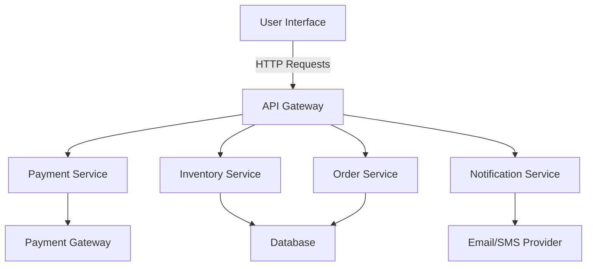

## 27.7 E-commerce Platform with High Scalability

In the digital age, e-commerce platforms are pivotal in connecting businesses with consumers globally. As these platforms grow, they must handle increasing user traffic and transactions without compromising performance. This section delves into building a scalable e-commerce platform using PHP, focusing on design patterns and strategies that ensure high scalability and performance.

### Objective

The primary objective is to build an online store capable of handling a large number of users and transactions efficiently. This involves ensuring that the platform remains responsive and reliable, even under heavy load.

### Patterns Utilized

To achieve high scalability, we will leverage several design patterns:

- **Facade Pattern:** This pattern simplifies complex API interactions, making it easier to integrate with external services like payment gateways and inventory systems.
- **Queue-based Load Leveling:** This pattern helps manage order processing by distributing tasks across multiple workers, preventing bottlenecks and ensuring smooth operation.

### Implementation Highlights

- **Integration with Payment Gateways:** Secure and efficient handling of transactions is crucial. We will use the Facade Pattern to abstract the complexities of interacting with various payment APIs.
- **Inventory Systems:** Real-time inventory management is essential to prevent overselling and ensure customer satisfaction.
- **Scalable Architecture:** Implementing a microservices architecture can help distribute the load and improve the platform's resilience.

### Challenges Addressed

- **Maintaining Performance Under Heavy Load:** By using asynchronous processing and load balancing, we can ensure that the platform remains responsive.
- **Ensuring Transactional Integrity:** Implementing robust error handling and data consistency mechanisms is vital to maintain trust and reliability.

---

### Building the E-commerce Platform

#### 1. Architectural Overview

To build a scalable e-commerce platform, we need a robust architecture that can handle high traffic and transactions. A microservices architecture is ideal for this purpose, as it allows us to break down the application into smaller, manageable services that can be developed, deployed, and scaled independently.

#### 2. Key Components

- **User Interface (UI):** The front-end of the platform, built using modern web technologies, provides a seamless shopping experience.
- **API Gateway:** Acts as a single entry point for all client requests, routing them to the appropriate services.
- **Payment Service:** Handles all payment-related operations, ensuring secure and efficient transactions.
- **Inventory Service:** Manages product availability and updates stock levels in real-time.
- **Order Service:** Processes customer orders, ensuring that all steps from cart to checkout are handled smoothly.
- **Notification Service:** Sends order confirmations, shipping updates, and other notifications to customers.

#### 3. Using the Facade Pattern

The Facade Pattern is instrumental in simplifying interactions with complex subsystems. In our e-commerce platform, we use it to abstract the complexities of payment gateway integrations. This pattern provides a unified interface to a set of interfaces in a subsystem, making it easier to use.

```php
<?php

class PaymentFacade
{
    private $paypal;
    private $stripe;

    public function __construct()
    {
        $this->paypal = new PayPalPayment();
        $this->stripe = new StripePayment();
    }

    public function payWithPayPal($amount)
    {
        return $this->paypal->pay($amount);
    }

    public function payWithStripe($amount)
    {
        return $this->stripe->pay($amount);
    }
}

class PayPalPayment
{
    public function pay($amount)
    {
        // PayPal payment processing logic
        return "Paid $amount using PayPal.";
    }
}

class StripePayment
{
    public function pay($amount)
    {
        // Stripe payment processing logic
        return "Paid $amount using Stripe.";
    }
}

// Usage
$paymentFacade = new PaymentFacade();
echo $paymentFacade->payWithPayPal(100);
echo $paymentFacade->payWithStripe(200);
```

**Explanation:** The `PaymentFacade` class provides a simple interface for processing payments through PayPal and Stripe, hiding the complexities of each payment gateway's API.

#### 4. Queue-based Load Leveling

To handle high volumes of orders, we use a queue-based load leveling pattern. This involves placing incoming orders into a queue and processing them asynchronously, which helps manage load and ensures that the system remains responsive.

```php
<?php

class OrderQueue
{
    private $queue;

    public function __construct()
    {
        $this->queue = new SplQueue();
    }

    public function addOrder($order)
    {
        $this->queue->enqueue($order);
    }

    public function processOrders()
    {
        while (!$this->queue->isEmpty()) {
            $order = $this->queue->dequeue();
            $this->processOrder($order);
        }
    }

    private function processOrder($order)
    {
        // Order processing logic
        echo "Processing order: " . $order . PHP_EOL;
    }
}

// Usage
$orderQueue = new OrderQueue();
$orderQueue->addOrder("Order1");
$orderQueue->addOrder("Order2");
$orderQueue->processOrders();
```

**Explanation:** The `OrderQueue` class manages a queue of orders, processing them one by one. This approach helps distribute the load and prevents bottlenecks.

#### 5. Integration with Payment Gateways

Integrating with payment gateways is a critical aspect of any e-commerce platform. Using the Facade Pattern, we can simplify these integrations and ensure that our platform can easily switch between different payment providers if needed.

#### 6. Real-time Inventory Management

Real-time inventory management is crucial to prevent overselling and ensure customer satisfaction. By using a dedicated Inventory Service, we can keep track of stock levels and update them as orders are placed.

```php
<?php

class InventoryService
{
    private $inventory;

    public function __construct()
    {
        $this->inventory = [];
    }

    public function addProduct($productId, $quantity)
    {
        $this->inventory[$productId] = $quantity;
    }

    public function updateStock($productId, $quantity)
    {
        if (isset($this->inventory[$productId])) {
            $this->inventory[$productId] -= $quantity;
        }
    }

    public function getStock($productId)
    {
        return $this->inventory[$productId] ?? 0;
    }
}

// Usage
$inventoryService = new InventoryService();
$inventoryService->addProduct("Product1", 100);
$inventoryService->updateStock("Product1", 2);
echo "Stock for Product1: " . $inventoryService->getStock("Product1");
```

**Explanation:** The `InventoryService` class manages product stock levels, allowing us to add products and update stock as orders are processed.

#### 7. Ensuring Transactional Integrity

Maintaining transactional integrity is vital to ensure that all operations are completed successfully and consistently. This involves implementing robust error handling and data consistency mechanisms.

```php
<?php

class TransactionManager
{
    public function beginTransaction()
    {
        // Begin transaction logic
        echo "Transaction started." . PHP_EOL;
    }

    public function commit()
    {
        // Commit transaction logic
        echo "Transaction committed." . PHP_EOL;
    }

    public function rollback()
    {
        // Rollback transaction logic
        echo "Transaction rolled back." . PHP_EOL;
    }
}

// Usage
$transactionManager = new TransactionManager();
$transactionManager->beginTransaction();

try {
    // Perform operations
    $transactionManager->commit();
} catch (Exception $e) {
    $transactionManager->rollback();
}
```

**Explanation:** The `TransactionManager` class provides methods to begin, commit, and rollback transactions, ensuring that operations are completed consistently.

### Visualizing the Architecture

To better understand the architecture of our e-commerce platform, let's visualize the components and their interactions using a Mermaid.js diagram.



**Description:** This diagram illustrates the flow of requests from the User Interface to the API Gateway, which routes them to the appropriate services. The Payment Service interacts with external payment gateways, while the Inventory and Order Services manage data in the database. The Notification Service sends updates to customers via email or SMS.

### Challenges and Solutions

#### 1. Maintaining Performance Under Heavy Load

To maintain performance under heavy load, we implement asynchronous processing and load balancing. This involves using message queues to handle tasks asynchronously and distributing requests across multiple servers to balance the load.

#### 2. Ensuring Transactional Integrity

Ensuring transactional integrity involves implementing robust error handling and data consistency mechanisms. This includes using transactions to group related operations and rolling back changes if any operation fails.

### Try It Yourself

Experiment with the code examples provided by modifying them to suit your needs. For instance, try adding a new payment gateway to the `PaymentFacade` class or implement additional features in the `InventoryService` class. This hands-on approach will help you better understand the concepts and patterns discussed.

### Knowledge Check

- What is the primary objective of building a scalable e-commerce platform?
- How does the Facade Pattern simplify API interactions?
- What is the purpose of queue-based load leveling?
- How can you ensure transactional integrity in an e-commerce platform?

### Conclusion

Building a scalable e-commerce platform requires careful consideration of architecture, design patterns, and implementation strategies. By leveraging the Facade Pattern and queue-based load leveling, we can simplify complex interactions and manage load effectively. Remember, this is just the beginning. As you progress, you'll build more complex and interactive platforms. Keep experimenting, stay curious, and enjoy the journey!

---

## Quiz: E-commerce Platform with High Scalability



### What is the primary objective of building a scalable e-commerce platform?

- [x] To handle a large number of users and transactions efficiently
- [ ] To reduce the cost of development
- [ ] To simplify the user interface
- [ ] To increase the number of payment gateways

> **Explanation:** The main goal is to ensure the platform can handle high traffic and transactions without compromising performance.

### How does the Facade Pattern help in building an e-commerce platform?

- [x] It simplifies complex API interactions
- [ ] It increases the number of payment gateways
- [ ] It reduces the cost of development
- [ ] It improves the user interface design

> **Explanation:** The Facade Pattern provides a unified interface to a set of interfaces in a subsystem, making it easier to use.

### What is the purpose of queue-based load leveling?

- [x] To manage order processing and prevent bottlenecks
- [ ] To increase the number of payment gateways
- [ ] To simplify the user interface
- [ ] To reduce the cost of development

> **Explanation:** Queue-based load leveling helps distribute tasks across multiple workers, ensuring smooth operation.

### How can you ensure transactional integrity in an e-commerce platform?

- [x] By implementing robust error handling and data consistency mechanisms
- [ ] By increasing the number of payment gateways
- [ ] By simplifying the user interface
- [ ] By reducing the cost of development

> **Explanation:** Transactional integrity involves ensuring that all operations are completed successfully and consistently.

### Which pattern is used to simplify interactions with payment gateways?

- [x] Facade Pattern
- [ ] Singleton Pattern
- [ ] Observer Pattern
- [ ] Strategy Pattern

> **Explanation:** The Facade Pattern is used to abstract the complexities of payment gateway integrations.

### What is the role of the API Gateway in the architecture?

- [x] Acts as a single entry point for all client requests
- [ ] Manages product availability
- [ ] Handles payment-related operations
- [ ] Sends notifications to customers

> **Explanation:** The API Gateway routes client requests to the appropriate services.

### Which service is responsible for managing product stock levels?

- [x] Inventory Service
- [ ] Payment Service
- [ ] Order Service
- [ ] Notification Service

> **Explanation:** The Inventory Service keeps track of stock levels and updates them as orders are placed.

### What is the benefit of using a microservices architecture?

- [x] It allows independent development, deployment, and scaling of services
- [ ] It simplifies the user interface
- [ ] It increases the number of payment gateways
- [ ] It reduces the cost of development

> **Explanation:** Microservices architecture helps distribute the load and improve the platform's resilience.

### How does asynchronous processing help maintain performance?

- [x] By handling tasks asynchronously and preventing bottlenecks
- [ ] By increasing the number of payment gateways
- [ ] By simplifying the user interface
- [ ] By reducing the cost of development

> **Explanation:** Asynchronous processing ensures that the system remains responsive under heavy load.

### True or False: The Notification Service is responsible for processing customer orders.

- [ ] True
- [x] False

> **Explanation:** The Order Service processes customer orders, while the Notification Service sends updates to customers.



---
