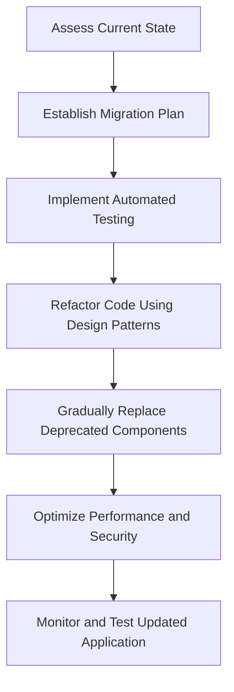

## 27.8 Migrating Legacy Applications to Modern PHP

Migrating legacy PHP applications to modern standards is a crucial task for maintaining the relevance, security, and performance of your software. This guide will walk you through the process of updating an old PHP application to align with contemporary practices, leveraging design patterns and best practices to ensure a smooth transition.

### Objective

The primary objective of this migration is to update an old PHP application to modern standards. This involves refactoring outdated code, replacing deprecated components, and introducing new features that enhance the application's functionality and maintainability.

### Approach

The approach to migrating a legacy application involves gradual refactoring and replacement of outdated components. This ensures that the application remains functional throughout the process and minimizes the risk of introducing new bugs.

### Patterns Utilized

Two key design patterns are particularly useful in this context:

- **Decorator Pattern:** This pattern allows you to extend the functionality of existing code without altering its structure. It is particularly useful for adding new features to legacy code without risking the introduction of errors.
  
- **Proxy Pattern:** This pattern enables you to intercept calls to legacy code, allowing you to introduce new functionality or modify existing behavior without changing the original codebase.

### Implementation Highlights

One of the most critical aspects of migrating a legacy application is the introduction of automated testing. Automated tests help prevent regressions and ensure that new changes do not break existing functionality. By implementing a robust testing framework, you can confidently refactor and update your application.

### Challenges Addressed

Migrating a legacy application presents several challenges:

- **Balancing Ongoing Maintenance with New Development:** It is essential to continue maintaining the existing application while gradually introducing new features and updates.
  
- **Minimizing Downtime During Migration:** The migration process should be designed to minimize downtime and ensure that the application remains available to users throughout the transition.

### Step-by-Step Migration Process

#### 1. Assess the Current State of the Application

Begin by thoroughly assessing the current state of your legacy application. Identify outdated components, deprecated functions, and areas that require refactoring. This assessment will serve as the foundation for your migration plan.

#### 2. Establish a Migration Plan

Develop a detailed migration plan that outlines the steps you will take to update your application. This plan should include timelines, resource allocation, and specific goals for each phase of the migration.

#### 3. Implement Automated Testing

Introduce automated testing to your application to ensure that changes do not introduce new bugs. Use tools like PHPUnit to create unit tests that cover critical functionality.

```php
// Example of a simple PHPUnit test case
use PHPUnit\Framework\TestCase;

class LegacyFeatureTest extends TestCase
{
    public function testLegacyFeature()
    {
        $legacyFeature = new LegacyFeature();
        $result = $legacyFeature->execute();
        
        $this->assertEquals('expected result', $result);
    }
}
```

#### 4. Refactor Code Using Design Patterns

Utilize design patterns such as the Decorator and Proxy patterns to refactor your code. These patterns allow you to extend functionality and intercept calls without altering the original codebase.

```php
// Example of the Decorator Pattern
interface LegacyComponent
{
    public function operation(): string;
}

class ConcreteComponent implements LegacyComponent
{
    public function operation(): string
    {
        return "Legacy Component";
    }
}

class Decorator implements LegacyComponent
{
    protected $component;

    public function __construct(LegacyComponent $component)
    {
        $this->component = $component;
    }

    public function operation(): string
    {
        return $this->component->operation();
    }
}

class ConcreteDecorator extends Decorator
{
    public function operation(): string
    {
        return "Enhanced " . parent::operation();
    }
}

// Usage
$component = new ConcreteComponent();
$decorator = new ConcreteDecorator($component);
echo $decorator->operation(); // Outputs: Enhanced Legacy Component
```

#### 5. Gradually Replace Deprecated Components

Identify deprecated components and gradually replace them with modern alternatives. This process should be done incrementally to ensure that the application remains functional throughout the migration.

#### 6. Optimize Performance and Security

As you update your application, take the opportunity to optimize performance and enhance security. Implement best practices for security, such as input validation and sanitization, and optimize code for better performance.

#### 7. Monitor and Test the Updated Application

Once the migration is complete, monitor the application to ensure that it performs as expected. Conduct thorough testing to verify that all features work correctly and that no new issues have been introduced.

### Visualizing the Migration Process

Below is a flowchart that illustrates the migration process from a high-level perspective:



### Key Considerations

- **Communication:** Keep all stakeholders informed throughout the migration process. Regular updates and clear communication are essential for a successful migration.
  
- **Documentation:** Maintain comprehensive documentation of the migration process, including changes made and reasons for those changes. This documentation will be invaluable for future maintenance and development.

- **Training:** Provide training for your development team to ensure they are familiar with modern PHP practices and the new features introduced during the migration.

### PHP Unique Features

PHP offers several unique features that can be leveraged during the migration process:

- **Namespaces and Autoloading:** Use namespaces and autoloading to organize your code and reduce dependency on manual includes.
  
- **Traits:** Utilize traits to share methods across classes without using inheritance, which can simplify code organization and reuse.

- **Anonymous Functions and Closures:** Take advantage of anonymous functions and closures to create concise and flexible code.

### Differences and Similarities with Other Patterns

While the Decorator and Proxy patterns are particularly useful for migrating legacy applications, other patterns like the Adapter and Facade patterns can also be beneficial. The Adapter pattern can help integrate new components with existing code, while the Facade pattern can simplify complex interactions by providing a unified interface.

### Try It Yourself

To get hands-on experience with the migration process, try modifying the code examples provided. Experiment with adding new features using the Decorator pattern or intercepting calls with the Proxy pattern. This practice will help reinforce the concepts discussed in this guide.

### Conclusion

Migrating legacy PHP applications to modern standards is a challenging but rewarding process. By following the steps outlined in this guide and leveraging design patterns, you can ensure a smooth transition that enhances the functionality, security, and maintainability of your application. Remember, this is just the beginning. As you progress, you'll build more robust and efficient applications. Keep experimenting, stay curious, and enjoy the journey!

## Quiz: Migrating Legacy Applications to Modern PHP



### What is the primary objective of migrating a legacy PHP application?

- [x] To update the application to modern standards
- [ ] To completely rewrite the application from scratch
- [ ] To add new features without changing the existing code
- [ ] To remove all legacy code

> **Explanation:** The primary objective is to update the application to modern standards, ensuring it remains relevant, secure, and performant.

### Which design pattern allows you to extend functionality without altering existing code?

- [x] Decorator Pattern
- [ ] Singleton Pattern
- [ ] Factory Pattern
- [ ] Observer Pattern

> **Explanation:** The Decorator Pattern allows you to extend functionality without altering the existing code structure.

### What is the role of the Proxy Pattern in migrating legacy applications?

- [x] To intercept calls to legacy code
- [ ] To create new instances of objects
- [ ] To manage object lifecycles
- [ ] To provide a simplified interface

> **Explanation:** The Proxy Pattern is used to intercept calls to legacy code, allowing for modifications or enhancements without changing the original codebase.

### Why is automated testing important during migration?

- [x] To prevent regressions and ensure changes do not introduce new bugs
- [ ] To speed up the migration process
- [ ] To eliminate the need for manual testing
- [ ] To reduce the cost of migration

> **Explanation:** Automated testing is crucial for preventing regressions and ensuring that changes do not introduce new bugs.

### What is a key challenge when migrating legacy applications?

- [x] Balancing ongoing maintenance with new development
- [ ] Completely rewriting the application
- [ ] Removing all legacy code
- [ ] Adding new features without testing

> **Explanation:** Balancing ongoing maintenance with new development is a key challenge, as the application must remain functional throughout the migration.

### Which PHP feature helps organize code and reduce dependency on manual includes?

- [x] Namespaces and Autoloading
- [ ] Global Variables
- [ ] Magic Methods
- [ ] Static Methods

> **Explanation:** Namespaces and Autoloading help organize code and reduce dependency on manual includes.

### What should be included in the migration plan?

- [x] Timelines, resource allocation, and specific goals
- [ ] Only the final deadline
- [ ] A list of deprecated functions
- [ ] A complete rewrite of the application

> **Explanation:** The migration plan should include timelines, resource allocation, and specific goals for each phase of the migration.

### How can the Decorator Pattern be used in migration?

- [x] To add new features to legacy code without altering its structure
- [ ] To intercept calls to legacy code
- [ ] To create new instances of objects
- [ ] To manage object lifecycles

> **Explanation:** The Decorator Pattern can be used to add new features to legacy code without altering its structure.

### What is the benefit of using traits in PHP?

- [x] To share methods across classes without using inheritance
- [ ] To create new instances of objects
- [ ] To manage object lifecycles
- [ ] To provide a simplified interface

> **Explanation:** Traits allow you to share methods across classes without using inheritance, simplifying code organization and reuse.

### True or False: The migration process should be designed to minimize downtime.

- [x] True
- [ ] False

> **Explanation:** The migration process should be designed to minimize downtime to ensure the application remains available to users throughout the transition.


