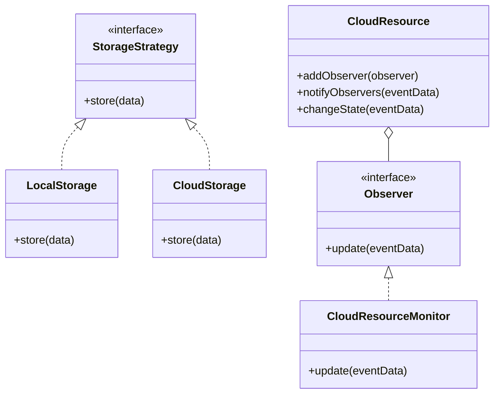

## 27.9 Utilizing Cloud Services with PHP

In today's rapidly evolving technological landscape, leveraging cloud services has become essential for building scalable, efficient, and cost-effective applications. PHP, a versatile and widely-used server-side scripting language, can be seamlessly integrated with cloud services to enhance its capabilities. This section will guide you through the process of utilizing cloud services with PHP, focusing on key design patterns, implementation strategies, and best practices.

### Introduction to Cloud Services

Cloud services provide on-demand computing resources, such as storage, databases, and computing power, over the internet. They offer numerous advantages, including scalability, flexibility, and cost-efficiency. By integrating cloud services into PHP applications, developers can offload resource-intensive tasks, manage data more effectively, and scale applications dynamically.

#### Key Concepts

- **Scalability:** The ability to increase or decrease resources as needed.
- **Elasticity:** The capability to automatically adjust resources based on demand.
- **Cost-Efficiency:** Pay-as-you-go pricing models that reduce upfront costs.
- **Reliability:** High availability and redundancy to ensure uptime.

### Leveraging Cloud Services in PHP

To effectively utilize cloud services in PHP applications, it's crucial to understand the available services and how they can be integrated. Popular cloud providers like Amazon Web Services (AWS) and Microsoft Azure offer comprehensive SDKs for PHP, enabling seamless integration.

#### AWS SDK for PHP

AWS provides a robust SDK for PHP that allows developers to interact with various AWS services, such as S3 for storage, EC2 for computing, and RDS for databases.

- **Installation:** Use Composer to install the AWS SDK for PHP.
  ```bash
  composer require aws/aws-sdk-php
  ```

- **Example Usage:**
  ```php
  require 'vendor/autoload.php';

  use Aws\S3\S3Client;

  // Instantiate an S3 client
  $s3 = new S3Client([
      'version' => 'latest',
      'region'  => 'us-west-2',
      'credentials' => [
          'key'    => 'your-access-key-id',
          'secret' => 'your-secret-access-key',
      ],
  ]);

  // Upload a file to S3
  $result = $s3->putObject([
      'Bucket' => 'your-bucket-name',
      'Key'    => 'your-file-name',
      'SourceFile' => '/path/to/your/file',
  ]);

  echo "File uploaded successfully. URL: " . $result['ObjectURL'];
  ```

#### Azure SDK for PHP

Azure also offers an SDK for PHP, providing access to services like Azure Blob Storage, Azure Functions, and Azure SQL Database.

- **Installation:** Use Composer to install the Azure SDK for PHP.
  ```bash
  composer require microsoft/azure-storage-blob
  ```

- **Example Usage:**
  ```php
  require 'vendor/autoload.php';

  use MicrosoftAzure\Storage\Blob\BlobRestProxy;

  // Create a blob client
  $blobClient = BlobRestProxy::createBlobService('DefaultEndpointsProtocol=https;AccountName=your-account-name;AccountKey=your-account-key');

  // Upload a file to Azure Blob Storage
  $content = fopen('/path/to/your/file', 'r');
  $blobClient->createBlockBlob('your-container-name', 'your-blob-name', $content);

  echo "File uploaded successfully to Azure Blob Storage.";
  ```

### Design Patterns for Cloud Integration

Design patterns play a crucial role in structuring cloud-integrated applications. They provide reusable solutions to common problems, ensuring that applications are scalable, maintainable, and efficient.

#### Strategy Pattern

The Strategy Pattern is useful for switching between different storage solutions, such as local and cloud storage. It allows you to define a family of algorithms, encapsulate each one, and make them interchangeable.

- **Implementation:**
  ```php
  interface StorageStrategy {
      public function store($data);
  }

  class LocalStorage implements StorageStrategy {
      public function store($data) {
          // Store data locally
          file_put_contents('/local/path/to/file', $data);
      }
  }

  class CloudStorage implements StorageStrategy {
      private $s3;

      public function __construct($s3) {
          $this->s3 = $s3;
      }

      public function store($data) {
          // Store data in S3
          $this->s3->putObject([
              'Bucket' => 'your-bucket-name',
              'Key'    => 'your-file-name',
              'Body'   => $data,
          ]);
      }
  }

  // Usage
  $storage = new CloudStorage($s3);
  $storage->store('Sample data');
  ```

#### Observer Pattern

The Observer Pattern is ideal for monitoring cloud resource events, such as changes in storage or computing resources. It defines a one-to-many dependency between objects, so when one object changes state, all its dependents are notified.

- **Implementation:**
  ```php
  interface Observer {
      public function update($eventData);
  }

  class CloudResourceMonitor implements Observer {
      public function update($eventData) {
          echo "Resource event: " . $eventData;
      }
  }

  class CloudResource {
      private $observers = [];

      public function addObserver(Observer $observer) {
          $this->observers[] = $observer;
      }

      public function notifyObservers($eventData) {
          foreach ($this->observers as $observer) {
              $observer->update($eventData);
          }
      }

      public function changeState($eventData) {
          // Change resource state
          $this->notifyObservers($eventData);
      }
  }

  // Usage
  $resource = new CloudResource();
  $monitor = new CloudResourceMonitor();
  $resource->addObserver($monitor);
  $resource->changeState('Resource updated');
  ```

### Implementation Highlights

Integrating cloud services into PHP applications involves several key steps and considerations. Here are some highlights to keep in mind:

1. **Authentication and Security:** Ensure secure access to cloud services by using environment variables or secure vaults to store credentials.

2. **Error Handling:** Implement robust error handling to manage network failures or service outages gracefully.

3. **Cost Management:** Monitor and optimize cloud service usage to manage costs effectively. Use tools like AWS Cost Explorer or Azure Cost Management.

4. **Portability:** Design applications to be portable across different cloud providers by abstracting cloud-specific implementations.

5. **Scalability:** Leverage cloud services' scalability features, such as auto-scaling groups in AWS or Azure's scale sets, to handle varying loads.

### Challenges and Solutions

#### Managing Cloud Service Costs

Cloud services offer a pay-as-you-go model, which can lead to unexpected costs if not managed properly. To address this:

- **Monitor Usage:** Use cloud provider tools to track and analyze usage patterns.
- **Set Budgets and Alerts:** Configure budgets and alerts to notify you of unexpected spending.
- **Optimize Resources:** Regularly review and optimize resource usage, such as terminating unused instances or resizing over-provisioned resources.

#### Ensuring Application Portability

Portability is crucial for avoiding vendor lock-in and ensuring flexibility. To achieve this:

- **Use Abstraction Layers:** Implement abstraction layers to separate cloud-specific code from application logic.
- **Adopt Open Standards:** Use open standards and APIs to facilitate interoperability between different cloud providers.
- **Containerization:** Use containers to package applications, making them portable across different environments.

### Try It Yourself

Experiment with the provided code examples by modifying them to suit your needs. For instance, try switching between AWS and Azure for storage, or implement additional observers to monitor different cloud events.

### Visualizing Cloud Integration

Below is a diagram illustrating the integration of PHP applications with cloud services using the Strategy and Observer patterns.



### References and Links

- [AWS SDK for PHP](https://aws.amazon.com/sdk-for-php/)
- [Azure SDK for PHP](https://github.com/Azure/azure-sdk-for-php)
- [PHP: The Right Way](https://phptherightway.com/)
- [Cloud Design Patterns](https://docs.microsoft.com/en-us/azure/architecture/patterns/)

### Knowledge Check

- What are the benefits of using cloud services in PHP applications?
- How does the Strategy Pattern facilitate switching between local and cloud storage?
- What role does the Observer Pattern play in monitoring cloud resources?

### Embrace the Journey

Remember, integrating cloud services into your PHP applications is just the beginning. As you continue to explore and experiment, you'll discover new ways to enhance your applications' capabilities and performance. Stay curious, keep learning, and enjoy the journey!

## Quiz: Utilizing Cloud Services with PHP



### What is a key benefit of using cloud services in PHP applications?

- [x] Scalability
- [ ] Complexity
- [ ] Increased latency
- [ ] Vendor lock-in

> **Explanation:** Cloud services offer scalability, allowing applications to handle varying loads efficiently.

### Which design pattern is used to switch between local and cloud storage?

- [x] Strategy Pattern
- [ ] Observer Pattern
- [ ] Singleton Pattern
- [ ] Factory Pattern

> **Explanation:** The Strategy Pattern allows for interchangeable storage solutions, such as local and cloud storage.

### What is the primary purpose of the Observer Pattern in cloud integration?

- [x] Monitoring cloud resource events
- [ ] Storing data in the cloud
- [ ] Authenticating users
- [ ] Encrypting data

> **Explanation:** The Observer Pattern is used to monitor and respond to changes in cloud resources.

### How can you manage cloud service costs effectively?

- [x] Monitor usage and set budgets
- [ ] Increase resource allocation
- [ ] Disable alerts
- [ ] Use only one cloud provider

> **Explanation:** Monitoring usage and setting budgets help manage and optimize cloud service costs.

### What is a recommended practice for ensuring application portability?

- [x] Use abstraction layers
- [ ] Hardcode cloud-specific implementations
- [ ] Avoid open standards
- [ ] Use proprietary APIs

> **Explanation:** Abstraction layers separate cloud-specific code, enhancing portability across providers.

### Which PHP SDK is used to interact with AWS services?

- [x] AWS SDK for PHP
- [ ] Azure SDK for PHP
- [ ] Google Cloud SDK for PHP
- [ ] IBM Cloud SDK for PHP

> **Explanation:** The AWS SDK for PHP provides tools to interact with AWS services.

### What is a common challenge when integrating cloud services?

- [x] Managing costs
- [ ] Reducing complexity
- [ ] Decreasing scalability
- [ ] Increasing latency

> **Explanation:** Managing costs is a common challenge due to the pay-as-you-go model of cloud services.

### How can you enhance the security of cloud service integration?

- [x] Use environment variables for credentials
- [ ] Store credentials in code
- [ ] Disable encryption
- [ ] Share credentials publicly

> **Explanation:** Using environment variables for credentials enhances security by keeping them out of code.

### What is a benefit of using containers for cloud applications?

- [x] Portability
- [ ] Increased complexity
- [ ] Reduced scalability
- [ ] Vendor lock-in

> **Explanation:** Containers package applications, making them portable across different environments.

### True or False: The Observer Pattern is used to store data in cloud services.

- [ ] True
- [x] False

> **Explanation:** The Observer Pattern is used for monitoring events, not for storing data.


