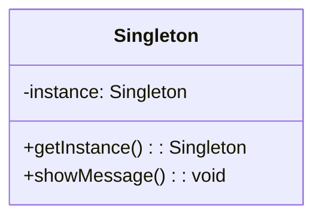
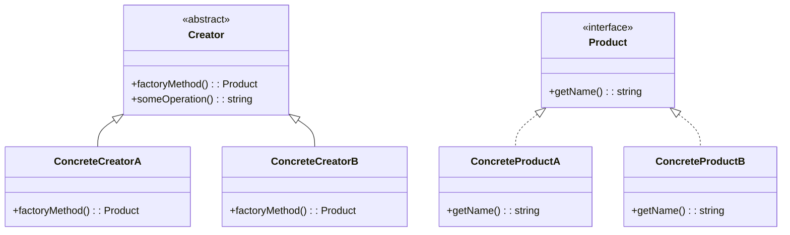

## 28.1 Recap of Key Concepts

As we reach the conclusion of our comprehensive guide on classic and modern design patterns in PHP, it's essential to revisit the key concepts and principles that have been covered. This recap will reinforce your understanding and encourage you to apply these patterns and principles in your PHP projects.

### Summary of Learned Patterns

Design patterns are reusable solutions to common problems in software design. They provide a template for how to solve a problem that can be used in many different situations. In this guide, we explored various categories of design patterns, each serving a unique purpose in software development.

#### Creational Patterns

Creational patterns deal with object creation mechanisms, trying to create objects in a manner suitable to the situation. They help make a system independent of how its objects are created, composed, and represented.

- **Singleton Pattern**: Ensures a class has only one instance and provides a global point of access to it. This pattern is useful in scenarios where a single instance of a class is required to coordinate actions across the system.

- **Factory Method Pattern**: Defines an interface for creating an object, but lets subclasses alter the type of objects that will be created. This pattern is beneficial when a class cannot anticipate the class of objects it must create.

- **Abstract Factory Pattern**: Provides an interface for creating families of related or dependent objects without specifying their concrete classes. This pattern is ideal for systems that need to be independent of how their products are created.

- **Builder Pattern**: Separates the construction of a complex object from its representation, allowing the same construction process to create different representations. This pattern is useful for creating complex objects with many optional parts.

- **Prototype Pattern**: Creates new objects by copying an existing object, known as the prototype. This pattern is useful when the cost of creating a new instance of an object is more expensive than copying an existing one.

- **Dependency Injection**: A technique where an object receives other objects it depends on, rather than creating them internally. This pattern promotes loose coupling and enhances testability.

#### Structural Patterns

Structural patterns are concerned with how classes and objects are composed to form larger structures. They help ensure that if one part of a system changes, the entire system doesn't need to change.

- **Adapter Pattern**: Allows incompatible interfaces to work together. It acts as a bridge between two incompatible interfaces.

- **Bridge Pattern**: Separates an object’s abstraction from its implementation so that the two can vary independently. This pattern is useful when both the abstractions and their implementations should be extensible by subclasses.

- **Composite Pattern**: Composes objects into tree structures to represent part-whole hierarchies. This pattern allows clients to treat individual objects and compositions of objects uniformly.

- **Decorator Pattern**: Adds new functionality to an object dynamically. This pattern is useful for adhering to the Single Responsibility Principle by allowing functionality to be divided between classes with unique areas of concern.

- **Facade Pattern**: Provides a simplified interface to a complex subsystem. This pattern is useful for hiding the complexities of a system and providing an interface to the client from where the client can access the system.

- **Proxy Pattern**: Provides a surrogate or placeholder for another object to control access to it. This pattern is useful for implementing lazy initialization, access control, logging, and more.

#### Behavioral Patterns

Behavioral patterns are concerned with algorithms and the assignment of responsibilities between objects. They help in defining how objects interact in a system.

- **Chain of Responsibility Pattern**: Passes a request along a chain of handlers. Upon receiving a request, each handler decides either to process the request or to pass it to the next handler in the chain.

- **Command Pattern**: Encapsulates a request as an object, thereby allowing for parameterization of clients with queues, requests, and operations.

- **Observer Pattern**: Defines a one-to-many dependency between objects so that when one object changes state, all its dependents are notified and updated automatically.

- **Strategy Pattern**: Defines a family of algorithms, encapsulates each one, and makes them interchangeable. This pattern lets the algorithm vary independently from clients that use it.

- **Template Method Pattern**: Defines the skeleton of an algorithm in an operation, deferring some steps to subclasses. This pattern lets subclasses redefine certain steps of an algorithm without changing the algorithm's structure.

### Integration of Patterns and Principles

Design patterns are most effective when combined with solid design principles. These principles guide the use of patterns and ensure that they are applied in a way that enhances the maintainability and scalability of the software.

#### SOLID Principles

The SOLID principles are a set of five design principles intended to make software designs more understandable, flexible, and maintainable.

- **Single Responsibility Principle (SRP)**: A class should have only one reason to change, meaning it should have only one job or responsibility.

- **Open/Closed Principle (OCP)**: Software entities should be open for extension but closed for modification.

- **Liskov Substitution Principle (LSP)**: Objects of a superclass should be replaceable with objects of a subclass without affecting the correctness of the program.

- **Interface Segregation Principle (ISP)**: Clients should not be forced to depend on interfaces they do not use.

- **Dependency Inversion Principle (DIP)**: High-level modules should not depend on low-level modules. Both should depend on abstractions.

#### Real-World Application

The true power of design patterns and principles is realized when applied to real-world projects. They provide a common language for developers, making it easier to communicate complex ideas and solutions.

- **Encouragement to Apply Patterns**: As you embark on new projects, consider the problems you face and how design patterns can provide solutions. Whether you're building a new application or refactoring an existing one, patterns can help you create more robust and maintainable code.

- **Practical Projects**: Try implementing patterns in small projects to see how they work in practice. This hands-on experience will deepen your understanding and prepare you for larger, more complex applications.

### Code Examples

Let's revisit some of the key patterns with code examples to solidify your understanding.

#### Singleton Pattern Example

```php
<?php

class Singleton {
    private static $instance = null;

    private function __construct() {
        // Private constructor to prevent instantiation
    }

    public static function getInstance() {
        if (self::$instance == null) {
            self::$instance = new Singleton();
        }
        return self::$instance;
    }

    public function showMessage() {
        echo "Hello, I am a Singleton!";
    }
}

// Usage
$singleton = Singleton::getInstance();
$singleton->showMessage();

?>
```

#### Factory Method Pattern Example

```php
<?php

interface Product {
    public function getName();
}

class ConcreteProductA implements Product {
    public function getName() {
        return "Product A";
    }
}

class ConcreteProductB implements Product {
    public function getName() {
        return "Product B";
    }
}

abstract class Creator {
    abstract public function factoryMethod(): Product;

    public function someOperation() {
        $product = $this->factoryMethod();
        return "Creator: The same creator's code has just worked with " . $product->getName();
    }
}

class ConcreteCreatorA extends Creator {
    public function factoryMethod(): Product {
        return new ConcreteProductA();
    }
}

class ConcreteCreatorB extends Creator {
    public function factoryMethod(): Product {
        return new ConcreteProductB();
    }
}

// Usage
$creatorA = new ConcreteCreatorA();
echo $creatorA->someOperation();

$creatorB = new ConcreteCreatorB();
echo $creatorB->someOperation();

?>
```

### Visualizing Design Patterns

To better understand the relationships and interactions within design patterns, let's use diagrams.

#### Singleton Pattern Diagram



#### Factory Method Pattern Diagram



### References and Links

For further reading and deeper dives into the topics covered, consider the following resources:

- [MDN Web Docs](https://developer.mozilla.org/)
- [W3Schools PHP Tutorial](https://www.w3schools.com/php/)
- [PHP: The Right Way](https://phptherightway.com/)
- [Design Patterns: Elements of Reusable Object-Oriented Software](https://en.wikipedia.org/wiki/Design_Patterns)

### Knowledge Check

To reinforce your learning, consider these questions:

1. What is the primary purpose of the Singleton pattern?
2. How does the Factory Method pattern differ from the Abstract Factory pattern?
3. What are the benefits of using the Decorator pattern?
4. How can the Observer pattern be applied in real-world applications?
5. Why is the Dependency Injection pattern important for testability?

### Embrace the Journey

Remember, this is just the beginning. As you progress, you'll build more complex and interactive applications. Keep experimenting, stay curious, and enjoy the journey!

### Quiz: Recap of Key Concepts



### What is the primary purpose of the Singleton pattern?

- [x] To ensure a class has only one instance and provide a global point of access to it.
- [ ] To create a family of related or dependent objects.
- [ ] To separate the construction of a complex object from its representation.
- [ ] To define a one-to-many dependency between objects.

> **Explanation:** The Singleton pattern ensures that a class has only one instance and provides a global point of access to it.

### How does the Factory Method pattern differ from the Abstract Factory pattern?

- [x] Factory Method defines an interface for creating an object, while Abstract Factory provides an interface for creating families of related objects.
- [ ] Factory Method is used for creating a single object, while Abstract Factory is used for creating multiple objects.
- [ ] Factory Method is a structural pattern, while Abstract Factory is a creational pattern.
- [ ] Factory Method is used to encapsulate a request as an object, while Abstract Factory is used to define a family of algorithms.

> **Explanation:** The Factory Method pattern defines an interface for creating an object, but lets subclasses alter the type of objects that will be created. The Abstract Factory pattern provides an interface for creating families of related or dependent objects without specifying their concrete classes.

### What are the benefits of using the Decorator pattern?

- [x] It adds new functionality to an object dynamically.
- [ ] It provides a simplified interface to a complex subsystem.
- [ ] It allows incompatible interfaces to work together.
- [ ] It separates an object’s abstraction from its implementation.

> **Explanation:** The Decorator pattern adds new functionality to an object dynamically, allowing functionality to be divided between classes with unique areas of concern.

### How can the Observer pattern be applied in real-world applications?

- [x] It can be used to implement event handling systems.
- [ ] It can be used to create a single instance of a class.
- [ ] It can be used to define a family of algorithms.
- [ ] It can be used to separate the construction of a complex object from its representation.

> **Explanation:** The Observer pattern defines a one-to-many dependency between objects so that when one object changes state, all its dependents are notified and updated automatically, making it ideal for event handling systems.

### Why is the Dependency Injection pattern important for testability?

- [x] It promotes loose coupling and enhances testability.
- [ ] It ensures a class has only one instance.
- [ ] It provides a simplified interface to a complex subsystem.
- [ ] It defines a family of algorithms.

> **Explanation:** Dependency Injection is a technique where an object receives other objects it depends on, rather than creating them internally. This promotes loose coupling and enhances testability by allowing dependencies to be easily swapped out during testing.

### What is the main advantage of using the Bridge pattern?

- [x] It separates an object’s abstraction from its implementation.
- [ ] It adds new functionality to an object dynamically.
- [ ] It provides a surrogate or placeholder for another object.
- [ ] It defines a one-to-many dependency between objects.

> **Explanation:** The Bridge pattern separates an object’s abstraction from its implementation so that the two can vary independently.

### Which pattern is useful for implementing lazy initialization?

- [x] Proxy Pattern
- [ ] Singleton Pattern
- [ ] Factory Method Pattern
- [ ] Observer Pattern

> **Explanation:** The Proxy pattern provides a surrogate or placeholder for another object to control access to it, making it useful for implementing lazy initialization.

### What is the purpose of the Composite pattern?

- [x] To compose objects into tree structures to represent part-whole hierarchies.
- [ ] To define a family of algorithms.
- [ ] To encapsulate a request as an object.
- [ ] To ensure a class has only one instance.

> **Explanation:** The Composite pattern composes objects into tree structures to represent part-whole hierarchies, allowing clients to treat individual objects and compositions of objects uniformly.

### How does the Chain of Responsibility pattern work?

- [x] It passes a request along a chain of handlers.
- [ ] It encapsulates a request as an object.
- [ ] It defines a one-to-many dependency between objects.
- [ ] It separates an object’s abstraction from its implementation.

> **Explanation:** The Chain of Responsibility pattern passes a request along a chain of handlers. Upon receiving a request, each handler decides either to process the request or to pass it to the next handler in the chain.

### True or False: The Strategy pattern lets the algorithm vary independently from clients that use it.

- [x] True
- [ ] False

> **Explanation:** The Strategy pattern defines a family of algorithms, encapsulates each one, and makes them interchangeable, allowing the algorithm to vary independently from clients that use it.


