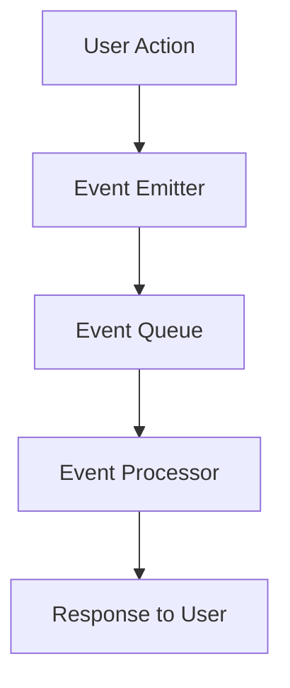

## 28.2 The Future of PHP and Design Patterns

As we delve into the future of PHP and design patterns, it is essential to consider the evolving landscape of software development. This section explores the anticipated evolution of PHP, the impact of new programming paradigms, and the adaptability required to leverage design patterns effectively in a rapidly changing environment.

### Language Evolution: Anticipating Upcoming PHP Features

PHP has undergone significant transformations since its inception, and its evolution continues to shape how developers approach design patterns. Understanding the trajectory of PHP's development is crucial for anticipating how future features will influence design patterns.

#### 1. Embracing PHP 8 and Beyond

PHP 8 introduced several groundbreaking features, such as Just-In-Time (JIT) compilation, union types, and attributes. These advancements have already begun to influence design patterns by enabling more efficient and expressive code. As PHP continues to evolve, we can expect further enhancements that will impact how patterns are implemented.

#### 2. The Role of JIT Compilation

JIT compilation in PHP 8 has improved performance by translating PHP code into machine code at runtime. This enhancement allows for more complex and resource-intensive patterns to be executed efficiently. As JIT technology matures, developers can expect even greater performance gains, enabling the use of sophisticated patterns without sacrificing speed.

#### 3. Union Types and Type Safety

Union types have introduced a new level of type safety in PHP, allowing developers to specify multiple types for a variable. This feature enhances the robustness of design patterns by reducing type-related errors and improving code readability. Future iterations of PHP may expand on this concept, further refining type safety and pattern implementation.

#### 4. Attributes and Metaprogramming

Attributes in PHP 8 have opened the door to metaprogramming, allowing developers to add metadata to classes, methods, and properties. This capability facilitates the creation of more dynamic and flexible design patterns. As PHP continues to evolve, we can anticipate more advanced metaprogramming features that will enable even greater customization and adaptability in pattern usage.

### New Paradigms: Exploring Asynchronous Programming and Other Trends

The software development landscape is constantly evolving, with new paradigms emerging that challenge traditional approaches. Asynchronous programming, in particular, is gaining traction and has significant implications for design patterns in PHP.

#### 1. Asynchronous Programming in PHP

Asynchronous programming allows for non-blocking operations, enabling applications to handle multiple tasks concurrently. This paradigm shift is particularly relevant for web applications that require high concurrency and responsiveness. PHP's support for asynchronous programming is still in its early stages, but it is expected to grow, influencing how design patterns are applied.

##### Code Example: Asynchronous HTTP Requests

```php
<?php

use GuzzleHttp\Client;
use GuzzleHttp\Promise;

$client = new Client();
$promises = [
    'request1' => $client->getAsync('https://api.example.com/data1'),
    'request2' => $client->getAsync('https://api.example.com/data2'),
];

$results = Promise\settle($promises)->wait();

foreach ($results as $key => $result) {
    if ($result['state'] === 'fulfilled') {
        echo "Response from {$key}: " . $result['value']->getBody() . PHP_EOL;
    } else {
        echo "Error in {$key}: " . $result['reason'] . PHP_EOL;
    }
}
```

> **Explanation:** This example demonstrates how to perform asynchronous HTTP requests using Guzzle, a popular PHP HTTP client. The `getAsync` method initiates non-blocking requests, and the `Promise\settle` function waits for all promises to be resolved.

#### 2. Reactive Programming and Event-Driven Architectures

Reactive programming and event-driven architectures are gaining popularity for their ability to handle real-time data streams and complex event processing. These paradigms require new design patterns that can efficiently manage asynchronous data flows and event handling.

##### Diagram: Event-Driven Architecture



> **Description:** This diagram illustrates a basic event-driven architecture, where user actions trigger events that are processed asynchronously, resulting in a response.

#### 3. Microservices and Distributed Systems

The shift towards microservices and distributed systems has introduced new challenges and opportunities for design patterns. Patterns such as Circuit Breaker, Bulkhead, and Saga are becoming increasingly relevant as developers seek to build resilient and scalable applications.

##### Code Example: Circuit Breaker Pattern

```php
<?php

class CircuitBreaker
{
    private $failureCount = 0;
    private $failureThreshold = 3;
    private $state = 'CLOSED';

    public function call($operation)
    {
        if ($this->state === 'OPEN') {
            throw new Exception('Circuit is open');
        }

        try {
            $result = $operation();
            $this->reset();
            return $result;
        } catch (Exception $e) {
            $this->failureCount++;
            if ($this->failureCount >= $this->failureThreshold) {
                $this->state = 'OPEN';
            }
            throw $e;
        }
    }

    private function reset()
    {
        $this->failureCount = 0;
        $this->state = 'CLOSED';
    }
}

$circuitBreaker = new CircuitBreaker();

try {
    $result = $circuitBreaker->call(function () {
        // Simulate an operation that may fail
        if (rand(0, 1) === 0) {
            throw new Exception('Operation failed');
        }
        return 'Operation succeeded';
    });
    echo $result;
} catch (Exception $e) {
    echo $e->getMessage();
}
```

> **Explanation:** This example demonstrates a simple implementation of the Circuit Breaker pattern, which prevents repeated execution of a failing operation by opening the circuit after a certain number of failures.

### Adaptability: Emphasizing the Need to Adapt Patterns to Changing Technologies

As technology continues to evolve, the adaptability of design patterns becomes increasingly important. Developers must be prepared to modify and extend patterns to meet the demands of new technologies and paradigms.

#### 1. Customizing Patterns for Specific Use Cases

Design patterns are not one-size-fits-all solutions. They must be tailored to fit the specific requirements of a project. This customization may involve combining multiple patterns or creating new variations to address unique challenges.

##### Code Example: Combining Patterns

```php
<?php

interface Logger
{
    public function log($message);
}

class FileLogger implements Logger
{
    public function log($message)
    {
        // Log message to a file
    }
}

class DatabaseLogger implements Logger
{
    public function log($message)
    {
        // Log message to a database
    }
}

class LoggerFactory
{
    public static function createLogger($type)
    {
        switch ($type) {
            case 'file':
                return new FileLogger();
            case 'database':
                return new DatabaseLogger();
            default:
                throw new Exception('Invalid logger type');
        }
    }
}

class LoggerDecorator implements Logger
{
    private $logger;

    public function __construct(Logger $logger)
    {
        $this->logger = $logger;
    }

    public function log($message)
    {
        // Add additional behavior before logging
        $this->logger->log($message);
    }
}

$logger = new LoggerDecorator(LoggerFactory::createLogger('file'));
$logger->log('This is a log message');
```

> **Explanation:** This example combines the Factory Method and Decorator patterns to create a flexible logging system that can be easily extended with new logging types and behaviors.

#### 2. Leveraging PHP's Unique Features

PHP's unique features, such as its dynamic typing and extensive library support, provide opportunities to enhance design patterns. Developers should leverage these features to create more efficient and expressive patterns.

#### 3. Continuous Learning and Adaptation

The future of PHP and design patterns requires a commitment to continuous learning and adaptation. Developers must stay informed about emerging trends and technologies, experimenting with new patterns and approaches to remain competitive in the ever-evolving software landscape.

### Conclusion: Embracing the Future of PHP and Design Patterns

The future of PHP and design patterns is bright, with exciting opportunities for innovation and growth. By understanding the evolution of PHP, exploring new paradigms, and embracing adaptability, developers can harness the full potential of design patterns to build robust, scalable, and efficient applications.

Remember, this is just the beginning. As you progress, you'll continue to encounter new challenges and opportunities. Keep experimenting, stay curious, and enjoy the journey!

## Quiz: The Future of PHP and Design Patterns



### What feature in PHP 8 significantly improves performance by translating PHP code into machine code at runtime?

- [x] JIT Compilation
- [ ] Union Types
- [ ] Attributes
- [ ] Anonymous Classes

> **Explanation:** JIT Compilation in PHP 8 translates PHP code into machine code at runtime, improving performance.

### Which PHP 8 feature allows developers to specify multiple types for a variable, enhancing type safety?

- [ ] JIT Compilation
- [x] Union Types
- [ ] Attributes
- [ ] Named Arguments

> **Explanation:** Union Types in PHP 8 allow developers to specify multiple types for a variable, enhancing type safety.

### What programming paradigm allows for non-blocking operations, enabling applications to handle multiple tasks concurrently?

- [x] Asynchronous Programming
- [ ] Object-Oriented Programming
- [ ] Procedural Programming
- [ ] Functional Programming

> **Explanation:** Asynchronous Programming allows for non-blocking operations, enabling applications to handle multiple tasks concurrently.

### Which pattern is becoming increasingly relevant for building resilient and scalable applications in microservices?

- [ ] Singleton Pattern
- [ ] Factory Method Pattern
- [x] Circuit Breaker Pattern
- [ ] Observer Pattern

> **Explanation:** The Circuit Breaker Pattern is becoming increasingly relevant for building resilient and scalable applications in microservices.

### What does the LoggerDecorator class in the provided code example demonstrate?

- [x] Combining the Factory Method and Decorator patterns
- [ ] Implementing the Singleton pattern
- [ ] Using the Observer pattern
- [ ] Applying the Strategy pattern

> **Explanation:** The LoggerDecorator class demonstrates combining the Factory Method and Decorator patterns to create a flexible logging system.

### What is the primary benefit of using attributes in PHP 8?

- [ ] Improved performance
- [ ] Enhanced type safety
- [x] Metaprogramming capabilities
- [ ] Simplified syntax

> **Explanation:** Attributes in PHP 8 provide metaprogramming capabilities, allowing developers to add metadata to classes, methods, and properties.

### Which of the following is a key aspect of adapting design patterns to changing technologies?

- [ ] Using only traditional patterns
- [x] Customizing patterns for specific use cases
- [ ] Avoiding new paradigms
- [ ] Sticking to one pattern for all projects

> **Explanation:** Customizing patterns for specific use cases is a key aspect of adapting design patterns to changing technologies.

### What is the significance of continuous learning and adaptation in the context of PHP and design patterns?

- [ ] It is unnecessary for experienced developers
- [x] It helps developers stay competitive in the evolving software landscape
- [ ] It only applies to beginners
- [ ] It is irrelevant to design patterns

> **Explanation:** Continuous learning and adaptation help developers stay competitive in the evolving software landscape.

### What does the event-driven architecture diagram illustrate?

- [ ] A synchronous process flow
- [x] An asynchronous event-driven process
- [ ] A linear execution model
- [ ] A procedural programming approach

> **Explanation:** The event-driven architecture diagram illustrates an asynchronous event-driven process.

### True or False: The future of PHP and design patterns requires a commitment to continuous learning and adaptation.

- [x] True
- [ ] False

> **Explanation:** The future of PHP and design patterns requires a commitment to continuous learning and adaptation to remain competitive and innovative.


