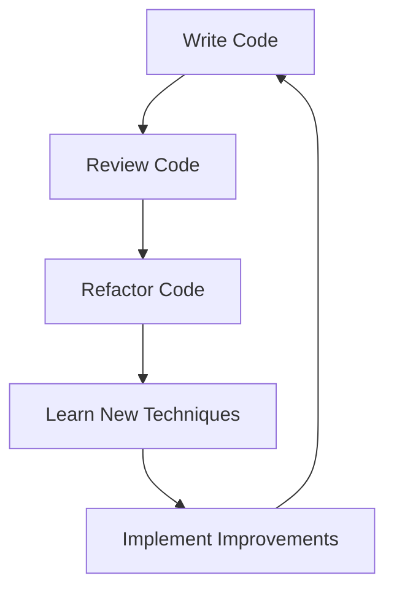
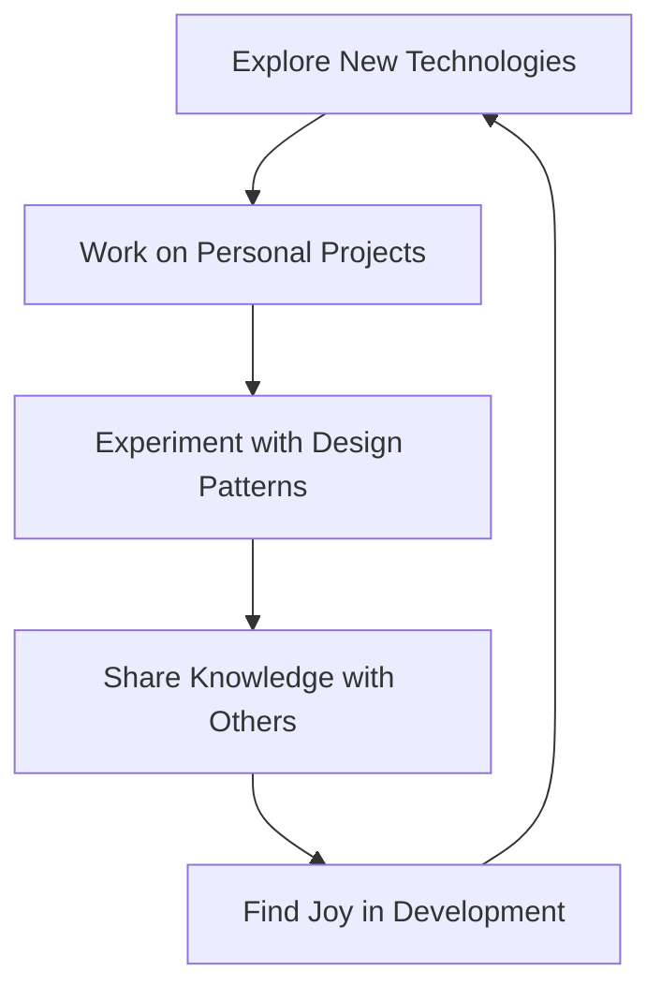

## 28.3 Final Thoughts on PHP Development

As we conclude our comprehensive guide on classic and modern design patterns in PHP, it's essential to reflect on the journey of PHP development and the principles that will guide us into the future. This section will delve into the importance of embracing best practices, engaging with the PHP community, and sustaining passion for crafting quality software. Let's explore these themes in detail.

### Embracing Best Practices

In the ever-evolving landscape of software development, adhering to best practices is crucial for creating robust, maintainable, and scalable applications. PHP, with its rich ecosystem and extensive community support, offers numerous opportunities to implement these practices effectively.

#### Coding Standards and Continuous Improvement

**Explain the Importance of Coding Standards:**

Coding standards are the backbone of any successful software project. They ensure consistency, readability, and maintainability across the codebase. In PHP, adhering to standards such as PSR-12 (PHP Standard Recommendation) is vital. These standards provide guidelines on code formatting, naming conventions, and file structure, which help teams collaborate more efficiently.

**Provide Code Example:**

```php
<?php

namespace App\Controller;

use App\Service\UserService;
use Psr\Log\LoggerInterface;

class UserController
{
    private $userService;
    private $logger;

    public function __construct(UserService $userService, LoggerInterface $logger)
    {
        $this->userService = $userService;
        $this->logger = $logger;
    }

    public function createUser(array $data): void
    {
        // Validate input data
        if (!$this->validateUserData($data)) {
            $this->logger->error('Invalid user data provided.');
            return;
        }

        // Create user
        $this->userService->create($data);
        $this->logger->info('User created successfully.');
    }

    private function validateUserData(array $data): bool
    {
        // Perform validation logic
        return isset($data['name']) && isset($data['email']);
    }
}
```

**Explain the Code Example:**

In this example, we demonstrate a simple `UserController` class that adheres to PSR-12 standards. The code is organized, with clear separation of concerns, and uses dependency injection for better testability and maintainability.

**Encourage Continuous Improvement:**

Continuous improvement is a mindset that every developer should adopt. It involves regularly reviewing and refactoring code, learning new techniques, and staying updated with the latest PHP advancements. Tools like PHPStan and Psalm can help identify potential issues and improve code quality.

**Visualizing Continuous Improvement:**



**Description:**

This diagram illustrates the cycle of continuous improvement in PHP development. It emphasizes the iterative nature of writing, reviewing, and refining code while incorporating new knowledge.

### Community Engagement

The PHP community is one of the most vibrant and supportive in the software development world. Engaging with this community can significantly enhance your skills and broaden your understanding of PHP development.

#### Value of Contributing to and Learning from the PHP Community

**Explain the Benefits of Community Engagement:**

Engaging with the PHP community offers numerous benefits, including access to a wealth of knowledge, networking opportunities, and the chance to contribute to open-source projects. Platforms like GitHub, Stack Overflow, and PHP-specific forums are excellent places to start.

**Encourage Contribution to Open Source:**

Contributing to open-source projects is a rewarding way to give back to the community. It allows you to collaborate with other developers, learn from their experiences, and improve your coding skills. Whether it's fixing bugs, adding features, or improving documentation, every contribution counts.

**Provide Example of Community Engagement:**

```php
// Example of contributing to an open-source project

// Fork the repository
// Clone the forked repository
// Create a new branch for your feature or bug fix
git checkout -b feature/new-feature

// Make your changes and commit them
git commit -m "Add new feature"

// Push the branch to your fork
git push origin feature/new-feature

// Open a pull request on the original repository
```

**Explain the Example:**

This example outlines the basic steps for contributing to an open-source project on GitHub. It highlights the process of forking a repository, creating a branch, making changes, and submitting a pull request.

**Visualizing Community Engagement:**


**Description:**

This diagram represents the cycle of community engagement, emphasizing the interconnected activities that contribute to personal and professional growth within the PHP community.

### Sustaining Passion

Sustaining passion for PHP development is essential for long-term success and fulfillment. Finding joy in crafting quality software can lead to a more rewarding career and a greater impact on the projects you work on.

#### Finding Joy and Fulfillment in Crafting Quality Software

**Explain the Importance of Passion in Development:**

Passion drives innovation and creativity. It motivates developers to push boundaries, explore new technologies, and continuously improve their skills. Passionate developers are more likely to produce high-quality software that meets user needs and exceeds expectations.

**Encourage Personal Projects and Experimentation:**

Working on personal projects is an excellent way to sustain passion for development. It allows you to experiment with new ideas, technologies, and design patterns without the constraints of a production environment. Personal projects can also serve as a portfolio to showcase your skills to potential employers or clients.

**Provide Code Example:**

```php
<?php

// Example of a simple personal project: a command-line to-do list application

class TodoList
{
    private $tasks = [];

    public function addTask(string $task): void
    {
        $this->tasks[] = $task;
        echo "Task added: $task\n";
    }

    public function showTasks(): void
    {
        echo "To-Do List:\n";
        foreach ($this->tasks as $index => $task) {
            echo ($index + 1) . ". $task\n";
        }
    }
}

$todoList = new TodoList();
$todoList->addTask('Learn PHP design patterns');
$todoList->addTask('Contribute to an open-source project');
$todoList->showTasks();
```

**Explain the Code Example:**

This simple command-line to-do list application demonstrates how personal projects can be both fun and educational. It encourages experimentation with PHP features and design patterns in a low-pressure environment.

**Visualizing Sustaining Passion:**



**Description:**

This diagram illustrates the cycle of sustaining passion in PHP development, highlighting the activities that contribute to a fulfilling and enjoyable career.

### Conclusion

As we wrap up this guide, remember that PHP development is a journey, not a destination. Embrace best practices, engage with the community, and sustain your passion for crafting quality software. By doing so, you'll not only enhance your skills but also contribute to the growth and success of the PHP ecosystem.

### Encouragement for Continued Learning

Remember, this is just the beginning. As you progress, you'll build more complex and interactive applications. Keep experimenting, stay curious, and enjoy the journey! The PHP community is here to support you every step of the way.

## Quiz: Final Thoughts on PHP Development



### What is the primary benefit of adhering to coding standards in PHP?

- [x] Ensures consistency and readability across the codebase
- [ ] Increases the execution speed of PHP scripts
- [ ] Reduces the need for documentation
- [ ] Guarantees bug-free code

> **Explanation:** Coding standards ensure consistency and readability, making it easier for teams to collaborate and maintain the codebase.

### How can engaging with the PHP community benefit a developer?

- [x] Access to a wealth of knowledge
- [x] Networking opportunities
- [ ] Guaranteed job placement
- [ ] Automatic code quality improvement

> **Explanation:** Engaging with the community provides access to knowledge and networking opportunities, but it does not guarantee job placement or automatic code quality improvement.

### What is a key advantage of contributing to open-source projects?

- [x] Collaborating with other developers
- [ ] Receiving financial compensation
- [ ] Avoiding the need for personal projects
- [ ] Eliminating the need for formal education

> **Explanation:** Contributing to open-source projects allows developers to collaborate with others and learn from their experiences.

### Why is sustaining passion important in PHP development?

- [x] It drives innovation and creativity
- [ ] It guarantees high salaries
- [ ] It eliminates the need for continuous learning
- [ ] It ensures immediate success

> **Explanation:** Passion drives innovation and creativity, motivating developers to push boundaries and improve their skills.

### What is a recommended way to sustain passion for development?

- [x] Work on personal projects
- [x] Experiment with new technologies
- [ ] Avoid community engagement
- [ ] Focus solely on professional work

> **Explanation:** Working on personal projects and experimenting with new technologies can sustain passion for development.

### How can personal projects benefit a developer?

- [x] Allow experimentation with new ideas
- [ ] Guarantee immediate job offers
- [ ] Replace the need for professional experience
- [ ] Ensure code quality without review

> **Explanation:** Personal projects allow developers to experiment with new ideas and technologies, enhancing their skills.

### What is the role of continuous improvement in PHP development?

- [x] Regularly reviewing and refining code
- [x] Staying updated with the latest advancements
- [ ] Eliminating the need for testing
- [ ] Guaranteeing bug-free software

> **Explanation:** Continuous improvement involves regularly reviewing and refining code and staying updated with the latest advancements.

### What is a key component of community engagement?

- [x] Participating in forums and discussions
- [ ] Avoiding open-source contributions
- [ ] Focusing solely on personal projects
- [ ] Ignoring feedback from peers

> **Explanation:** Participating in forums and discussions is a key component of community engagement.

### How does passion influence software quality?

- [x] Passionate developers are more likely to produce high-quality software
- [ ] Passion guarantees bug-free code
- [ ] Passion eliminates the need for testing
- [ ] Passion ensures immediate project success

> **Explanation:** Passionate developers are motivated to produce high-quality software, but it does not guarantee bug-free code or immediate success.

### True or False: Engaging with the PHP community can lead to personal and professional growth.

- [x] True
- [ ] False

> **Explanation:** Engaging with the PHP community provides opportunities for learning, networking, and collaboration, leading to personal and professional growth.


