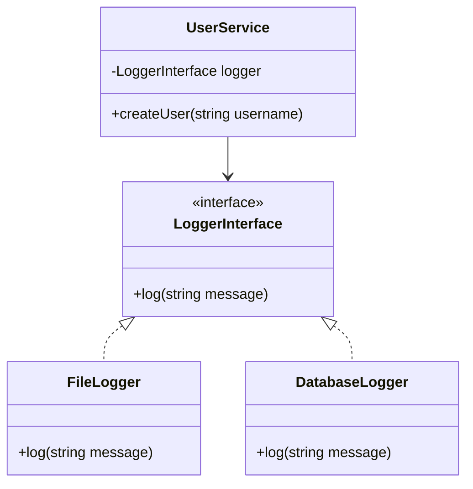

## 28.4 Encouragement for Continued Learning

As we reach the conclusion of our comprehensive guide on design patterns in PHP, it's important to recognize that learning is a continuous journey. The world of software development is ever-evolving, and staying updated with the latest trends, tools, and techniques is crucial for maintaining your edge as a developer. In this section, we will explore the importance of lifelong learning, delve into advanced topics, and provide you with a wealth of educational resources to further your knowledge and skills.

### Lifelong Learning: Embrace Curiosity and Openness

Lifelong learning is not just a buzzword; it's a mindset that every developer should adopt. The field of technology is dynamic, with new languages, frameworks, and methodologies emerging regularly. By staying curious and open to new ideas, you can ensure that your skills remain relevant and that you continue to grow both personally and professionally.

#### Stay Curious

Curiosity is the driving force behind innovation and discovery. As a developer, you should constantly seek out new challenges and opportunities to learn. Whether it's experimenting with a new PHP framework, exploring a different programming paradigm, or diving into a complex design pattern, maintaining a curious mindset will keep you engaged and motivated.

#### Openness to New Ideas

Being open to new ideas means being willing to adapt and change your approach when necessary. The software development landscape is filled with diverse perspectives and solutions. By embracing different viewpoints and methodologies, you can enhance your problem-solving skills and become a more versatile developer.

### Exploring Advanced Topics: Delve Deeper into Design Patterns

Once you've mastered the basics of design patterns, it's time to delve into more advanced topics. This will not only deepen your understanding but also equip you with the tools to tackle complex software design challenges.

#### Advanced Design Patterns

Advanced design patterns go beyond the classic patterns and introduce more sophisticated solutions to common problems. Some of these patterns include:

- **Dependency Injection**: A technique that allows for more flexible and testable code by decoupling the creation of objects from their usage.
- **Event Sourcing**: A pattern that captures all changes to an application's state as a sequence of events, providing a complete audit trail.
- **CQRS (Command Query Responsibility Segregation)**: A pattern that separates the read and write operations of a system, allowing for more scalable and maintainable architectures.

#### Architectural Concepts

In addition to design patterns, exploring architectural concepts can significantly enhance your ability to design robust and scalable systems. Some key architectural concepts to explore include:

- **Microservices Architecture**: A style that structures an application as a collection of loosely coupled services, each responsible for a specific business capability.
- **Hexagonal Architecture**: Also known as Ports and Adapters, this architecture promotes separation of concerns and allows for easier testing and maintenance.
- **Domain-Driven Design (DDD)**: An approach that emphasizes collaboration between technical and domain experts to create a shared understanding of the problem space.

### Educational Resources: Expand Your Knowledge

To support your journey of continued learning, we've compiled a list of educational resources that can help you expand your knowledge and skills in PHP design patterns and beyond.

#### Books

Books are a great way to gain in-depth knowledge and insights from experienced authors. Here are some recommended books on design patterns and software architecture:

- **"Design Patterns: Elements of Reusable Object-Oriented Software" by Erich Gamma, Richard Helm, Ralph Johnson, and John Vlissides**: This classic book introduces the concept of design patterns and provides a catalog of 23 patterns that can be applied to solve common design problems.
- **"Patterns of Enterprise Application Architecture" by Martin Fowler**: This book explores architectural patterns that are essential for building enterprise-level applications.
- **"Domain-Driven Design: Tackling Complexity in the Heart of Software" by Eric Evans**: A comprehensive guide to implementing DDD in complex software projects.

#### Online Courses

Online courses offer a flexible and interactive way to learn new skills. Here are some platforms that provide high-quality courses on PHP and design patterns:

- **Udemy**: Offers a wide range of courses on PHP development, design patterns, and software architecture.
- **Coursera**: Provides courses from top universities and institutions, covering various aspects of software engineering and design.
- **Pluralsight**: Offers expert-led courses on advanced PHP topics, design patterns, and architectural principles.

#### Community and Forums

Engaging with the developer community can provide valuable insights and support. Here are some online communities and forums where you can connect with other PHP developers:

- **Stack Overflow**: A popular platform for asking questions and sharing knowledge with other developers.
- **PHP.net**: The official PHP website, which includes documentation, tutorials, and a community forum.
- **Reddit's r/PHP**: A subreddit dedicated to PHP development, where you can find discussions, news, and resources.

#### Conferences and Meetups

Attending conferences and meetups is a great way to network with other developers and learn from industry experts. Keep an eye out for events such as:

- **PHP[World]**: An annual conference that brings together PHP developers from around the world to share knowledge and experiences.
- **Laracon**: A conference focused on the Laravel PHP framework, featuring talks and workshops from leading developers.
- **Local PHP Meetups**: Check platforms like Meetup.com for local PHP user groups and events in your area.

### Code Examples and Practice

To reinforce your learning, it's important to practice what you've learned through coding exercises and projects. Here are some ways to apply your knowledge:

#### Code Examples

Let's explore a code example that demonstrates the use of the Dependency Injection pattern in PHP:

```php
<?php

// Define an interface for a logger
interface LoggerInterface {
    public function log(string $message): void;
}

// Implement a FileLogger class that writes logs to a file
class FileLogger implements LoggerInterface {
    public function log(string $message): void {
        // Write the log message to a file
        file_put_contents('app.log', $message . PHP_EOL, FILE_APPEND);
    }
}

// Implement a DatabaseLogger class that writes logs to a database
class DatabaseLogger implements LoggerInterface {
    public function log(string $message): void {
        // Insert the log message into a database table
        // Assume $db is a database connection
        $db->query("INSERT INTO logs (message) VALUES ('$message')");
    }
}

// Define a UserService class that depends on a logger
class UserService {
    private $logger;

    public function __construct(LoggerInterface $logger) {
        $this->logger = $logger;
    }

    public function createUser(string $username): void {
        // Create a new user
        // ...

        // Log the user creation
        $this->logger->log("User '$username' created.");
    }
}

// Use Dependency Injection to provide a FileLogger to the UserService
$logger = new FileLogger();
$userService = new UserService($logger);
$userService->createUser('john_doe');

```

In this example, the `UserService` class depends on a `LoggerInterface`, allowing us to inject different logger implementations (e.g., `FileLogger`, `DatabaseLogger`) without modifying the `UserService` class. This promotes flexibility and testability.

#### Try It Yourself

Experiment with the code example by modifying the logger implementation or adding new features. For instance, try creating a `ConsoleLogger` that writes logs to the console, or implement a `LoggerFactory` to dynamically create logger instances based on configuration.

### Visualizing Concepts

To aid your understanding of complex concepts, let's visualize the Dependency Injection pattern using a class diagram:



This diagram illustrates the relationship between the `UserService`, `LoggerInterface`, and its implementations (`FileLogger` and `DatabaseLogger`). The `UserService` depends on the `LoggerInterface`, allowing for different logger implementations to be injected.

### References and Links

For further reading and exploration, here are some reputable external resources:

- [PHP: The Right Way](https://phptherightway.com/): A community-driven guide to best practices in PHP development.
- [Design Patterns PHP](https://designpatternsphp.readthedocs.io/): A collection of design pattern examples implemented in PHP.
- [Martin Fowler's Blog](https://martinfowler.com/): Insights and articles on software architecture and design patterns.

### Knowledge Check

To reinforce your understanding, consider the following questions and challenges:

- What are the benefits of adopting a lifelong learning mindset in software development?
- How can advanced design patterns and architectural concepts improve your software design skills?
- Explore the Dependency Injection pattern by implementing a new logger class and integrating it into the existing code example.

### Embrace the Journey

Remember, this is just the beginning of your journey in mastering PHP design patterns. As you progress, you'll encounter new challenges and opportunities to apply your knowledge. Keep experimenting, stay curious, and enjoy the journey!

### Quiz: Encouragement for Continued Learning



### What is the primary benefit of adopting a lifelong learning mindset in software development?

- [x] Staying updated with the latest trends and technologies
- [ ] Reducing the need for collaboration
- [ ] Avoiding the use of design patterns
- [ ] Limiting exposure to new ideas

> **Explanation:** Lifelong learning helps developers stay current with the latest trends and technologies, ensuring their skills remain relevant.

### Which of the following is an advanced design pattern?

- [x] Dependency Injection
- [ ] Singleton
- [ ] Factory Method
- [ ] Observer

> **Explanation:** Dependency Injection is considered an advanced design pattern that promotes flexibility and testability.

### What is the main purpose of the CQRS pattern?

- [x] Separating read and write operations
- [ ] Combining multiple services into one
- [ ] Simplifying database queries
- [ ] Enhancing user interface design

> **Explanation:** CQRS (Command Query Responsibility Segregation) separates read and write operations to improve scalability and maintainability.

### Which architectural concept emphasizes separation of concerns?

- [x] Hexagonal Architecture
- [ ] Monolithic Architecture
- [ ] Layered Architecture
- [ ] Event-Driven Architecture

> **Explanation:** Hexagonal Architecture, also known as Ports and Adapters, emphasizes separation of concerns for easier testing and maintenance.

### What is the role of a LoggerInterface in the Dependency Injection pattern?

- [x] To define a contract for logger implementations
- [ ] To store log messages
- [x] To allow different logger implementations to be injected
- [ ] To manage user authentication

> **Explanation:** LoggerInterface defines a contract for logger implementations, allowing different loggers to be injected into the UserService.

### Which resource is recommended for learning about design patterns?

- [x] "Design Patterns: Elements of Reusable Object-Oriented Software"
- [ ] "Clean Code: A Handbook of Agile Software Craftsmanship"
- [ ] "The Pragmatic Programmer"
- [ ] "You Don't Know JS"

> **Explanation:** "Design Patterns: Elements of Reusable Object-Oriented Software" is a classic book that introduces design patterns.

### What is the benefit of attending conferences and meetups?

- [x] Networking with other developers and learning from experts
- [ ] Avoiding new technologies
- [ ] Limiting exposure to different viewpoints
- [ ] Reducing collaboration opportunities

> **Explanation:** Conferences and meetups provide opportunities to network with developers and learn from industry experts.

### What is the purpose of the `createUser` method in the UserService class?

- [x] To create a new user and log the creation
- [ ] To delete an existing user
- [ ] To update user information
- [ ] To authenticate a user

> **Explanation:** The `createUser` method creates a new user and logs the creation using the injected logger.

### Which platform offers a wide range of courses on PHP development?

- [x] Udemy
- [ ] LinkedIn Learning
- [ ] Khan Academy
- [ ] Codecademy

> **Explanation:** Udemy offers a wide range of courses on PHP development, design patterns, and software architecture.

### True or False: The Dependency Injection pattern promotes flexibility and testability.

- [x] True
- [ ] False

> **Explanation:** Dependency Injection promotes flexibility and testability by decoupling object creation from usage.



By embracing lifelong learning, exploring advanced topics, and utilizing educational resources, you can continue to grow as a PHP developer and stay at the forefront of the industry. Keep pushing your boundaries, and remember that the journey of learning is as rewarding as the destination.
