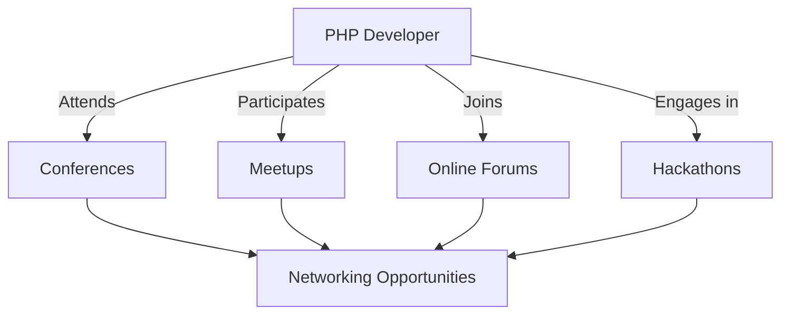

## 28.5 Embracing the PHP Community

The PHP community is a vibrant and diverse ecosystem that offers immense opportunities for learning, collaboration, and professional growth. Engaging with this community can significantly enhance your development skills and open doors to new possibilities. In this section, we will explore the benefits of community support, networking opportunities, and ways to contribute back to the community.

### Community Support

#### Benefit from Collective Knowledge and Experience

The PHP community is a treasure trove of collective knowledge and experience. By participating in forums, attending conferences, and joining online groups, you can tap into this wealth of information. Here's how you can benefit:

- **Forums and Discussion Boards:** Platforms like Stack Overflow, Reddit's r/PHP, and PHP-specific forums are excellent places to ask questions, share insights, and learn from others' experiences. These platforms allow you to engage with developers worldwide, providing diverse perspectives on solving problems.

- **Mailing Lists and Newsletters:** Subscribing to PHP mailing lists and newsletters keeps you updated with the latest trends, tools, and best practices. They often feature articles, tutorials, and news about PHP development, helping you stay informed.

- **Online Courses and Tutorials:** Websites like PHP.net, Laracasts, and PHP The Right Way offer comprehensive tutorials and courses. These resources are invaluable for both beginners and seasoned developers looking to expand their knowledge.

- **Social Media Groups:** Joining PHP groups on platforms like Facebook, LinkedIn, and Twitter can connect you with like-minded individuals. These groups often share tips, job opportunities, and event announcements.

#### Code Example: Engaging in a PHP Forum

```php
<?php
// Example of a simple PHP script to post a question on a forum

$forumUrl = "https://exampleforum.com/api/post";
$question = [
    'title' => 'How to implement the Singleton pattern in PHP?',
    'body' => 'I am trying to understand the Singleton pattern in PHP. Can someone provide a simple example?',
    'tags' => ['PHP', 'Design Patterns', 'Singleton']
];

// Use cURL to post the question
$ch = curl_init($forumUrl);
curl_setopt($ch, CURLOPT_POST, true);
curl_setopt($ch, CURLOPT_POSTFIELDS, http_build_query($question));
curl_setopt($ch, CURLOPT_RETURNTRANSFER, true);

$response = curl_exec($ch);
curl_close($ch);

echo "Response from forum: " . $response;
?>
```

**Try It Yourself:** Modify the `$question` array to post a different question or change the `$forumUrl` to another forum's API endpoint.

### Networking Opportunities

#### Build Professional Relationships Through Events and Forums

Networking is a crucial aspect of professional development. The PHP community offers numerous opportunities to connect with other developers, industry leaders, and potential employers:

- **Conferences and Meetups:** Events like PHP[tek], SymfonyCon, and local PHP meetups provide platforms to meet fellow developers, attend workshops, and learn from experts. These events are excellent for expanding your professional network.

- **Hackathons and Coding Competitions:** Participating in hackathons and coding competitions can help you hone your skills and collaborate with others. These events often lead to innovative solutions and can be a great way to showcase your talents.

- **Webinars and Online Workshops:** Many organizations and community groups host webinars and online workshops. These virtual events are accessible from anywhere and offer a convenient way to learn and network.

- **Mentorship Programs:** Engaging in mentorship programs, either as a mentor or mentee, can be incredibly rewarding. Mentors provide guidance and support, while mentees bring fresh perspectives and enthusiasm.

#### Diagram: Networking in the PHP Community



**Description:** This diagram illustrates the various networking opportunities available to PHP developers, including conferences, meetups, online forums, and hackathons, all leading to enhanced networking opportunities.

### Contributing Back

#### Share Knowledge, Contribute to Open-Source Projects

Contributing to the PHP community not only benefits others but also enhances your own skills and reputation. Here are some ways to give back:

- **Open-Source Contributions:** Contributing to open-source projects is a great way to improve your coding skills and collaborate with others. Platforms like GitHub and GitLab host numerous PHP projects that welcome contributions.

- **Writing and Blogging:** Sharing your knowledge through blog posts, articles, or tutorials helps others learn and establishes you as an authority in the field. Consider writing for platforms like Medium, Dev.to, or your own blog.

- **Speaking at Events:** Presenting at conferences, meetups, or webinars allows you to share your expertise and gain visibility in the community. It also helps you develop public speaking skills.

- **Creating Educational Content:** Developing courses, video tutorials, or podcasts can reach a wide audience and provide valuable learning resources for the community.

#### Code Example: Contributing to an Open-Source PHP Project

```php
<?php
// Example of a simple contribution to an open-source PHP project

// Clone the repository
shell_exec('git clone https://github.com/example/php-project.git');

// Navigate to the project directory
chdir('php-project');

// Create a new branch for your contribution
shell_exec('git checkout -b feature-improvement');

// Make changes to the code
file_put_contents('feature.php', "<?php\n// Improved feature code\n");

// Commit the changes
shell_exec('git add feature.php');
shell_exec('git commit -m "Improved feature implementation"');

// Push the changes to your fork
shell_exec('git push origin feature-improvement');
?>
```

**Try It Yourself:** Fork an open-source PHP project on GitHub, clone it to your local machine, and make a small improvement or fix. Follow the steps above to contribute your changes.

### Visualizing the Impact of Community Engagement

Engaging with the PHP community can have a profound impact on your career and personal growth. Let's visualize the journey of a PHP developer embracing the community:


**Description:** This flowchart illustrates the cyclical nature of community engagement, where joining the community leads to learning, skill improvement, contribution, recognition, career advancement, and personal growth, ultimately reinforcing community involvement.

### References and Links

- [PHP.net](https://www.php.net/): The official PHP documentation and resource site.
- [Stack Overflow](https://stackoverflow.com/): A popular Q&A platform for developers.
- [GitHub](https://github.com/): A platform for hosting and collaborating on open-source projects.
- [PHP The Right Way](https://phptherightway.com/): A comprehensive guide to PHP best practices.
- [Laracasts](https://laracasts.com/): A platform offering video tutorials on PHP and Laravel.

### Knowledge Check

- **Question:** What are some benefits of engaging with the PHP community?
- **Exercise:** Write a blog post about a PHP topic you're passionate about and share it on a developer platform.

### Embrace the Journey

Remember, engaging with the PHP community is just the beginning. As you participate, you'll build valuable relationships, enhance your skills, and contribute to a thriving ecosystem. Keep experimenting, stay curious, and enjoy the journey!

## Quiz: Embracing the PHP Community



### What is a key benefit of participating in PHP forums and discussion boards?

- [x] Access to diverse perspectives and solutions
- [ ] Guaranteed job offers
- [ ] Free PHP certifications
- [ ] Automatic code generation

> **Explanation:** Forums and discussion boards provide access to diverse perspectives and solutions, helping developers learn from others' experiences.

### Which of the following is a networking opportunity in the PHP community?

- [x] Conferences
- [ ] Watching PHP tutorials alone
- [x] Meetups
- [ ] Reading PHP books

> **Explanation:** Conferences and meetups are networking opportunities where developers can connect with others in the PHP community.

### How can you contribute to the PHP community?

- [x] Writing blog posts
- [x] Contributing to open-source projects
- [ ] Keeping your knowledge to yourself
- [ ] Avoiding community events

> **Explanation:** Writing blog posts and contributing to open-source projects are ways to share knowledge and give back to the community.

### What is a benefit of contributing to open-source projects?

- [x] Improving coding skills
- [ ] Receiving monetary compensation
- [ ] Guaranteed job offers
- [ ] Automatic promotion

> **Explanation:** Contributing to open-source projects helps improve coding skills through collaboration and learning from others.

### Which platform is commonly used for hosting open-source PHP projects?

- [x] GitHub
- [ ] LinkedIn
- [ ] Facebook
- [ ] Twitter

> **Explanation:** GitHub is a popular platform for hosting and collaborating on open-source projects.

### What is an advantage of attending PHP conferences?

- [x] Learning from experts
- [ ] Guaranteed job offers
- [ ] Free PHP certifications
- [ ] Automatic code generation

> **Explanation:** Attending PHP conferences allows developers to learn from experts and gain insights into the latest trends and technologies.

### How can writing and blogging benefit you in the PHP community?

- [x] Establishing authority
- [ ] Receiving monetary compensation
- [ ] Guaranteed job offers
- [ ] Automatic promotion

> **Explanation:** Writing and blogging help establish you as an authority in the field, sharing your knowledge with others.

### What is a key aspect of mentorship programs in the PHP community?

- [x] Providing guidance and support
- [ ] Guaranteed job offers
- [ ] Free PHP certifications
- [ ] Automatic code generation

> **Explanation:** Mentorship programs provide guidance and support, helping mentees learn and grow in their careers.

### Which of the following is a benefit of engaging with the PHP community?

- [x] Career advancement
- [ ] Guaranteed job offers
- [ ] Free PHP certifications
- [ ] Automatic code generation

> **Explanation:** Engaging with the PHP community can lead to career advancement through networking and skill development.

### Engaging with the PHP community can lead to personal growth.

- [x] True
- [ ] False

> **Explanation:** Engaging with the PHP community fosters personal growth by enhancing skills, building relationships, and contributing to a thriving ecosystem.


