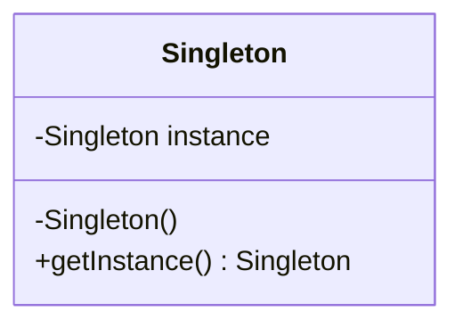
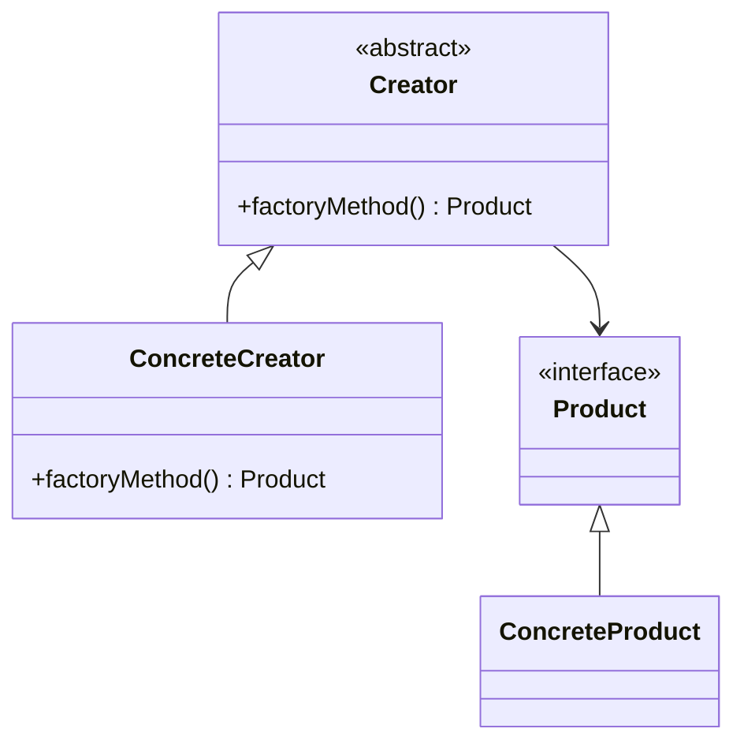
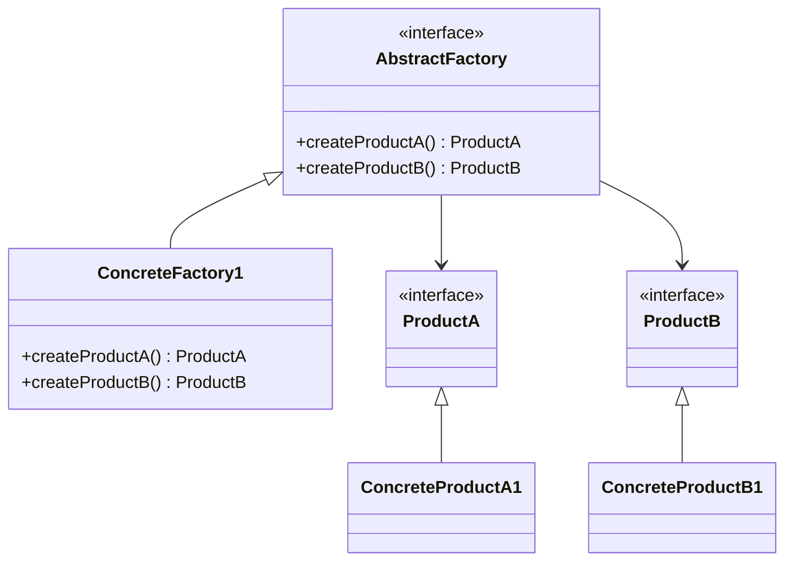
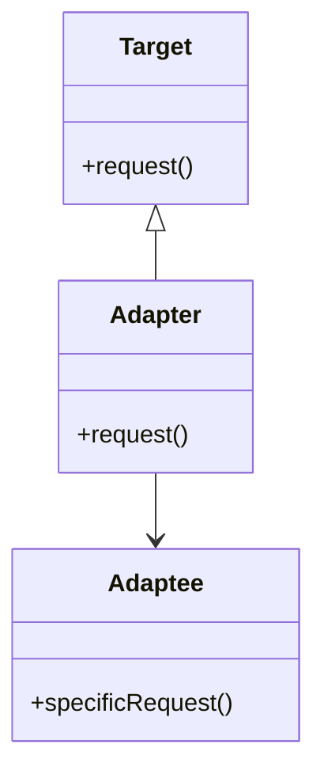
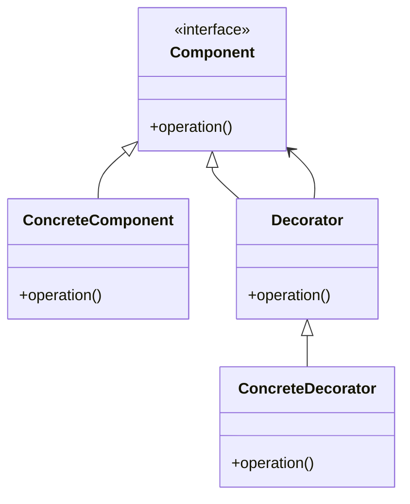
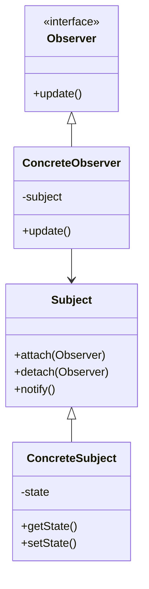
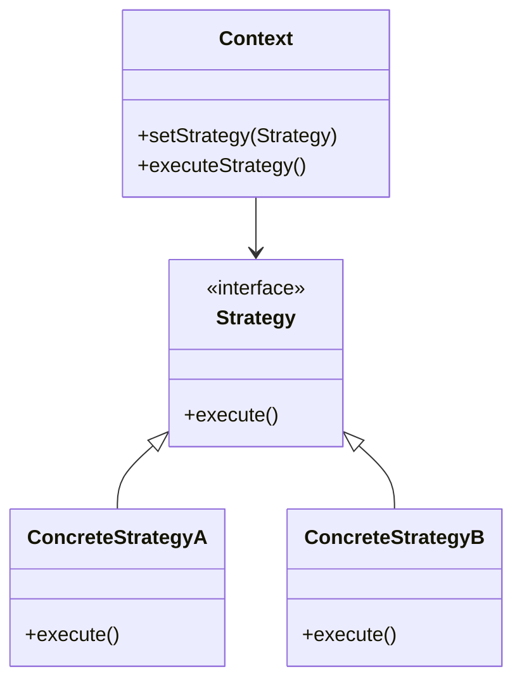
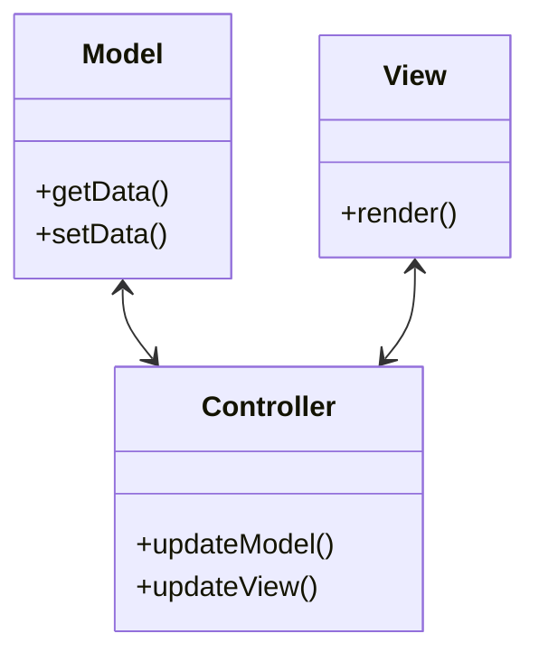

## 29.3 Pattern Reference Cheat Sheet

Welcome to the Pattern Reference Cheat Sheet, your quick guide to understanding and implementing design patterns in PHP. This section provides concise summaries, UML diagrams, and practical advice on when to use each pattern. Let's dive into the world of design patterns and enhance your PHP development skills.

### Creational Patterns

#### Singleton Pattern

- **Category:** Creational
- **Intent:** Ensure a class has only one instance and provide a global point of access to it.
- **UML Diagram:**



- **Key Participants:**
  - Singleton: The class that is responsible for creating and managing its own unique instance.
- **Applicability:** Use when you need exactly one instance of a class, and it must be accessible from a well-known access point.
- **Sample Code Snippet:**

```php
class Singleton {
    private static $instance;

    private function __construct() {
        // Private constructor to prevent instantiation
    }

    public static function getInstance() {
        if (self::$instance === null) {
            self::$instance = new Singleton();
        }
        return self::$instance;
    }
}
```

- **Design Considerations:** Be cautious of multithreading issues; consider using locks if necessary.
- **PHP Unique Features:** PHP's static properties and methods facilitate the implementation of the Singleton pattern.
- **Differences and Similarities:** Often confused with the Multiton pattern, which allows multiple instances identified by keys.

#### Factory Method Pattern

- **Category:** Creational
- **Intent:** Define an interface for creating an object, but let subclasses alter the type of objects that will be created.
- **UML Diagram:**



- **Key Participants:**
  - Creator: Declares the factory method.
  - ConcreteCreator: Implements the factory method to return an instance of a ConcreteProduct.
  - Product: Defines the interface of objects the factory method creates.
  - ConcreteProduct: Implements the Product interface.
- **Applicability:** Use when a class cannot anticipate the class of objects it must create.
- **Sample Code Snippet:**

```php
interface Product {
    public function operation();
}

class ConcreteProduct implements Product {
    public function operation() {
        return "ConcreteProduct operation";
    }
}

abstract class Creator {
    abstract public function factoryMethod(): Product;

    public function someOperation() {
        $product = $this->factoryMethod();
        return $product->operation();
    }
}

class ConcreteCreator extends Creator {
    public function factoryMethod(): Product {
        return new ConcreteProduct();
    }
}
```

- **Design Considerations:** Promotes loose coupling by eliminating the need to bind application-specific classes into the code.
- **PHP Unique Features:** PHP's dynamic typing allows for flexible implementations of the Factory Method pattern.
- **Differences and Similarities:** Similar to the Abstract Factory pattern but focuses on creating a single product.

#### Abstract Factory Pattern

- **Category:** Creational
- **Intent:** Provide an interface for creating families of related or dependent objects without specifying their concrete classes.
- **UML Diagram:**



- **Key Participants:**
  - AbstractFactory: Declares an interface for operations that create abstract products.
  - ConcreteFactory: Implements the operations to create concrete product objects.
  - Product: Defines the interface for a type of product object.
  - ConcreteProduct: Implements the Product interface.
- **Applicability:** Use when a system should be independent of how its products are created, composed, and represented.
- **Sample Code Snippet:**

```php
interface AbstractFactory {
    public function createProductA(): ProductA;
    public function createProductB(): ProductB;
}

class ConcreteFactory1 implements AbstractFactory {
    public function createProductA(): ProductA {
        return new ConcreteProductA1();
    }

    public function createProductB(): ProductB {
        return new ConcreteProductB1();
    }
}

interface ProductA {
    public function operationA();
}

interface ProductB {
    public function operationB();
}

class ConcreteProductA1 implements ProductA {
    public function operationA() {
        return "Operation A1";
    }
}

class ConcreteProductB1 implements ProductB {
    public function operationB() {
        return "Operation B1";
    }
}
```

- **Design Considerations:** Ensures that products are used together by enforcing constraints on which products can be used together.
- **PHP Unique Features:** PHP's interfaces and dynamic typing are well-suited for implementing the Abstract Factory pattern.
- **Differences and Similarities:** Often used in conjunction with the Factory Method pattern to create a family of related objects.

### Structural Patterns

#### Adapter Pattern

- **Category:** Structural
- **Intent:** Convert the interface of a class into another interface clients expect. Adapter lets classes work together that couldn't otherwise because of incompatible interfaces.
- **UML Diagram:**



- **Key Participants:**
  - Target: Defines the domain-specific interface that Client uses.
  - Adapter: Adapts the interface of Adaptee to the Target interface.
  - Adaptee: Defines an existing interface that needs adapting.
- **Applicability:** Use when you want to use an existing class, and its interface does not match the one you need.
- **Sample Code Snippet:**

```php
class Target {
    public function request() {
        return "Target request";
    }
}

class Adaptee {
    public function specificRequest() {
        return "Adaptee specific request";
    }
}

class Adapter extends Target {
    private $adaptee;

    public function __construct(Adaptee $adaptee) {
        $this->adaptee = $adaptee;
    }

    public function request() {
        return $this->adaptee->specificRequest();
    }
}
```

- **Design Considerations:** Can be implemented using inheritance or composition. Composition is generally preferred.
- **PHP Unique Features:** PHP's class inheritance and interfaces facilitate the implementation of the Adapter pattern.
- **Differences and Similarities:** Similar to the Decorator pattern, but Adapter changes the interface, while Decorator enhances it.

#### Decorator Pattern

- **Category:** Structural
- **Intent:** Attach additional responsibilities to an object dynamically. Decorators provide a flexible alternative to subclassing for extending functionality.
- **UML Diagram:**



- **Key Participants:**
  - Component: Defines the interface for objects that can have responsibilities added to them dynamically.
  - ConcreteComponent: Defines an object to which additional responsibilities can be attached.
  - Decorator: Maintains a reference to a Component object and defines an interface that conforms to Component's interface.
  - ConcreteDecorator: Adds responsibilities to the component.
- **Applicability:** Use to add responsibilities to individual objects dynamically and transparently, without affecting other objects.
- **Sample Code Snippet:**

```php
interface Component {
    public function operation();
}

class ConcreteComponent implements Component {
    public function operation() {
        return "ConcreteComponent operation";
    }
}

class Decorator implements Component {
    protected $component;

    public function __construct(Component $component) {
        $this->component = $component;
    }

    public function operation() {
        return $this->component->operation();
    }
}

class ConcreteDecorator extends Decorator {
    public function operation() {
        return "ConcreteDecorator(" . parent::operation() . ")";
    }
}
```

- **Design Considerations:** Decorators can be recursively composed, allowing for an unlimited number of added responsibilities.
- **PHP Unique Features:** PHP's interfaces and dynamic typing make it easy to implement the Decorator pattern.
- **Differences and Similarities:** Similar to the Adapter pattern, but Decorator enhances the interface, while Adapter changes it.

### Behavioral Patterns

#### Observer Pattern

- **Category:** Behavioral
- **Intent:** Define a one-to-many dependency between objects so that when one object changes state, all its dependents are notified and updated automatically.
- **UML Diagram:**



- **Key Participants:**
  - Subject: Knows its observers and provides an interface for attaching and detaching Observer objects.
  - ConcreteSubject: Stores state of interest to ConcreteObserver objects and sends a notification when its state changes.
  - Observer: Defines an updating interface for objects that should be notified of changes in a subject.
  - ConcreteObserver: Maintains a reference to a ConcreteSubject object and implements the Observer updating interface.
- **Applicability:** Use when a change to one object requires changing others, and you don't know how many objects need to be changed.
- **Sample Code Snippet:**

```php
interface Observer {
    public function update($state);
}

class ConcreteObserver implements Observer {
    private $state;

    public function update($state) {
        $this->state = $state;
        echo "Observer state updated to: $state\n";
    }
}

class Subject {
    private $observers = [];
    private $state;

    public function attach(Observer $observer) {
        $this->observers[] = $observer;
    }

    public function detach(Observer $observer) {
        $key = array_search($observer, $this->observers, true);
        if ($key !== false) {
            unset($this->observers[$key]);
        }
    }

    public function notify() {
        foreach ($this->observers as $observer) {
            $observer->update($this->state);
        }
    }

    public function setState($state) {
        $this->state = $state;
        $this->notify();
    }
}
```

- **Design Considerations:** Be cautious of memory leaks due to references held by observers.
- **PHP Unique Features:** PHP's array functions and dynamic typing make it easy to manage collections of observers.
- **Differences and Similarities:** Similar to the Mediator pattern, but Observer focuses on notifying changes, while Mediator centralizes communication.

#### Strategy Pattern

- **Category:** Behavioral
- **Intent:** Define a family of algorithms, encapsulate each one, and make them interchangeable. Strategy lets the algorithm vary independently from clients that use it.
- **UML Diagram:**



- **Key Participants:**
  - Context: Maintains a reference to a Strategy object and may define an interface to allow Strategy to access its data.
  - Strategy: Declares an interface common to all supported algorithms.
  - ConcreteStrategy: Implements the algorithm using the Strategy interface.
- **Applicability:** Use when you need to use different variants of an algorithm within an object and want to switch between them.
- **Sample Code Snippet:**

```php
interface Strategy {
    public function execute();
}

class ConcreteStrategyA implements Strategy {
    public function execute() {
        return "Strategy A executed";
    }
}

class ConcreteStrategyB implements Strategy {
    public function execute() {
        return "Strategy B executed";
    }
}

class Context {
    private $strategy;

    public function setStrategy(Strategy $strategy) {
        $this->strategy = $strategy;
    }

    public function executeStrategy() {
        return $this->strategy->execute();
    }
}
```

- **Design Considerations:** Strategies can be selected at runtime, providing flexibility in algorithm selection.
- **PHP Unique Features:** PHP's interfaces and dynamic typing allow for flexible implementation of the Strategy pattern.
- **Differences and Similarities:** Similar to the State pattern, but Strategy focuses on interchangeable algorithms, while State deals with object states.

### Architectural Patterns

#### Model-View-Controller (MVC) Pattern

- **Category:** Architectural
- **Intent:** Separate an application into three interconnected components: Model, View, and Controller, to separate internal representations of information from the ways that information is presented and accepted by the user.
- **UML Diagram:**



- **Key Participants:**
  - Model: Manages the data and business logic of the application.
  - View: Displays the data to the user and sends user commands to the controller.
  - Controller: Receives user input, interacts with the model, and updates the view.
- **Applicability:** Use when you want to separate the user interface from the business logic and data management.
- **Sample Code Snippet:**

```php
class Model {
    private $data;

    public function getData() {
        return $this->data;
    }

    public function setData($data) {
        $this->data = $data;
    }
}

class View {
    public function render($data) {
        echo "Rendering data: $data\n";
    }
}

class Controller {
    private $model;
    private $view;

    public function __construct(Model $model, View $view) {
        $this->model = $model;
        $this->view = $view;
    }

    public function updateModel($data) {
        $this->model->setData($data);
    }

    public function updateView() {
        $this->view->render($this->model->getData());
    }
}
```

- **Design Considerations:** Promotes separation of concerns, making the codebase easier to manage and scale.
- **PHP Unique Features:** PHP frameworks like Laravel and Symfony are built around the MVC pattern, providing built-in support for this architecture.
- **Differences and Similarities:** Similar to the MVVM pattern, but MVC focuses on separating the view from the model, while MVVM introduces a ViewModel to handle presentation logic.

### When to Use Patterns

Selecting the right design pattern depends on the problem you are trying to solve. Here are some guidelines:

- **Singleton:** Use when you need a single instance of a class.
- **Factory Method:** Use when you need to delegate the instantiation of objects to subclasses.
- **Abstract Factory:** Use when you need to create families of related objects.
- **Adapter:** Use when you need to integrate incompatible interfaces.
- **Decorator:** Use when you need to add responsibilities to objects dynamically.
- **Observer:** Use when you need to notify multiple objects about state changes.
- **Strategy:** Use when you need to switch between different algorithms.
- **MVC:** Use when you need to separate concerns in a web application.

### Try It Yourself

Experiment with the code examples provided. Try modifying the classes and methods to see how changes affect the behavior of the patterns. For instance, in the Strategy pattern, create additional strategies and see how they can be swapped in and out of the context.

### Visualizing Design Patterns

Understanding design patterns is easier with visual aids. Use UML diagrams to map out the relationships and interactions between classes and objects. This helps in grasping the structure and flow of each pattern.

### References and Links

For further reading on design patterns, consider these resources:

- [Design Patterns: Elements of Reusable Object-Oriented Software](https://www.amazon.com/Design-Patterns-Elements-Reusable-Object-Oriented/dp/0201633612) by Erich Gamma et al.
- [PHP: The Right Way](https://phptherightway.com/)
- [PHP Design Patterns](https://www.php.net/manual/en/language.oop5.patterns.php) on PHP.net

## Quiz: Pattern Reference Cheat Sheet



### What is the primary intent of the Singleton pattern?

- [x] Ensure a class has only one instance and provide a global point of access to it.
- [ ] Define an interface for creating an object.
- [ ] Convert the interface of a class into another interface clients expect.
- [ ] Attach additional responsibilities to an object dynamically.

> **Explanation:** The Singleton pattern ensures that a class has only one instance and provides a global point of access to it.

### Which pattern is used to create families of related or dependent objects?

- [ ] Singleton
- [x] Abstract Factory
- [ ] Adapter
- [ ] Observer

> **Explanation:** The Abstract Factory pattern provides an interface for creating families of related or dependent objects without specifying their concrete classes.

### What is the role of the Adapter pattern?

- [ ] Define a family of algorithms.
- [x] Convert the interface of a class into another interface clients expect.
- [ ] Attach additional responsibilities to an object dynamically.
- [ ] Define a one-to-many dependency between objects.

> **Explanation:** The Adapter pattern converts the interface of a class into another interface clients expect, allowing incompatible interfaces to work together.

### In the Decorator pattern, what is the main purpose?

- [ ] Ensure a class has only one instance.
- [ ] Define an interface for creating an object.
- [x] Attach additional responsibilities to an object dynamically.
- [ ] Define a one-to-many dependency between objects.

> **Explanation:** The Decorator pattern attaches additional responsibilities to an object dynamically, providing a flexible alternative to subclassing for extending functionality.

### Which pattern is best suited for separating concerns in a web application?

- [ ] Singleton
- [ ] Factory Method
- [ ] Adapter
- [x] MVC

> **Explanation:** The MVC (Model-View-Controller) pattern is best suited for separating concerns in a web application, promoting separation of concerns and making the codebase easier to manage and scale.

### What is a key benefit of using the Strategy pattern?

- [x] It allows for interchangeable algorithms.
- [ ] It ensures a class has only one instance.
- [ ] It converts the interface of a class into another interface.
- [ ] It defines a one-to-many dependency between objects.

> **Explanation:** The Strategy pattern allows for interchangeable algorithms, enabling the algorithm to vary independently from clients that use it.

### Which pattern is often used in conjunction with the Factory Method pattern?

- [x] Abstract Factory
- [ ] Singleton
- [ ] Adapter
- [ ] Observer

> **Explanation:** The Abstract Factory pattern is often used in conjunction with the Factory Method pattern to create a family of related objects.

### What is the main focus of the Observer pattern?

- [ ] Define a family of algorithms.
- [ ] Convert the interface of a class into another interface.
- [ ] Attach additional responsibilities to an object dynamically.
- [x] Define a one-to-many dependency between objects.

> **Explanation:** The Observer pattern defines a one-to-many dependency between objects so that when one object changes state, all its dependents are notified and updated automatically.

### Which pattern is similar to the Decorator pattern but focuses on notifying changes?

- [ ] Singleton
- [ ] Factory Method
- [ ] Adapter
- [x] Observer

> **Explanation:** The Observer pattern is similar to the Decorator pattern but focuses on notifying changes, while Decorator enhances the interface.

### True or False: The Adapter pattern changes the interface of an object.

- [x] True
- [ ] False

> **Explanation:** True. The Adapter pattern changes the interface of an object to make it compatible with another interface.



Remember, this is just the beginning. As you progress, you'll build more complex and interactive PHP applications. Keep experimenting, stay curious, and enjoy the journey!
