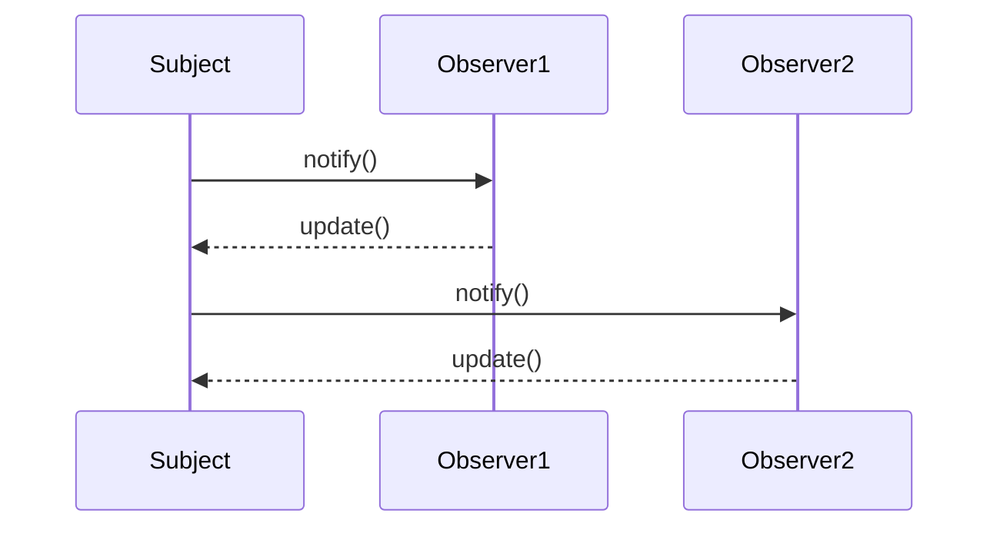

## 29.4 Common Interview Questions

In the world of software development, understanding design patterns is crucial for creating robust, maintainable, and scalable applications. This section is dedicated to helping you prepare for interviews focused on PHP design patterns. We'll cover common interview questions, provide detailed explanations, and offer practical examples to solidify your understanding.

### Introduction

Design patterns are reusable solutions to common problems in software design. They provide a template for how to solve a problem that can be used in many different situations. In PHP, design patterns are essential for writing clean, efficient, and maintainable code. Let's explore some of the most common interview questions related to design patterns in PHP.

### Common Interview Questions

#### 1. Explain the Singleton Pattern and Its Use Cases

The Singleton pattern ensures that a class has only one instance and provides a global point of access to it. This pattern is particularly useful when exactly one object is needed to coordinate actions across the system.

**Code Example:**

```php
<?php

class Singleton {
    private static $instance = null;

    // Private constructor to prevent multiple instances
    private function __construct() {}

    // Static method to get the single instance
    public static function getInstance() {
        if (self::$instance == null) {
            self::$instance = new Singleton();
        }
        return self::$instance;
    }

    public function showMessage() {
        echo "Hello, I am a Singleton!";
    }
}

// Usage
$singleton = Singleton::getInstance();
$singleton->showMessage();

?>
```

**Key Points:**
- The constructor is private to prevent direct instantiation.
- A static method is used to control access to the singleton instance.
- The instance is stored in a static variable.

**Use Cases:**
- Configuration settings management.
- Logging services.
- Database connections.

#### 2. How Does Dependency Injection Improve Code Maintainability?

Dependency Injection (DI) is a design pattern used to implement IoC (Inversion of Control), allowing for the decoupling of components. It improves code maintainability by making it easier to manage dependencies and promoting loose coupling.

**Code Example:**

```php
<?php

interface LoggerInterface {
    public function log($message);
}

class FileLogger implements LoggerInterface {
    public function log($message) {
        echo "Logging to a file: $message";
    }
}

class UserController {
    private $logger;

    // Dependency Injection via constructor
    public function __construct(LoggerInterface $logger) {
        $this->logger = $logger;
    }

    public function createUser($name) {
        // Logic to create a user
        $this->logger->log("User $name created.");
    }
}

// Usage
$logger = new FileLogger();
$userController = new UserController($logger);
$userController->createUser("John Doe");

?>
```

**Benefits:**
- **Testability:** Dependencies can be easily mocked or stubbed.
- **Flexibility:** Swap out implementations without changing the dependent class.
- **Maintainability:** Changes in dependencies do not affect the dependent class.

#### 3. Describe the Factory Method Pattern and Its Advantages

The Factory Method pattern defines an interface for creating an object but allows subclasses to alter the type of objects that will be created. This pattern is useful for creating objects without specifying the exact class of object that will be created.

**Code Example:**

```php
<?php

abstract class Product {
    abstract public function getType();
}

class ConcreteProductA extends Product {
    public function getType() {
        return "Type A";
    }
}

class ConcreteProductB extends Product {
    public function getType() {
        return "Type B";
    }
}

abstract class Creator {
    abstract public function factoryMethod(): Product;

    public function someOperation() {
        $product = $this->factoryMethod();
        return "Creator: The same creator's code has just worked with " . $product->getType();
    }
}

class ConcreteCreatorA extends Creator {
    public function factoryMethod(): Product {
        return new ConcreteProductA();
    }
}

class ConcreteCreatorB extends Creator {
    public function factoryMethod(): Product {
        return new ConcreteProductB();
    }
}

// Usage
$creatorA = new ConcreteCreatorA();
echo $creatorA->someOperation();

$creatorB = new ConcreteCreatorB();
echo $creatorB->someOperation();

?>
```

**Advantages:**
- **Flexibility:** Allows the client to choose which class to instantiate.
- **Scalability:** Easy to introduce new products without changing existing code.
- **Encapsulation:** The creation logic is encapsulated in the factory method.

#### 4. What is the Observer Pattern and When Would You Use It?

The Observer pattern defines a one-to-many dependency between objects so that when one object changes state, all its dependents are notified and updated automatically. This pattern is ideal for implementing distributed event-handling systems.

**Code Example:**

```php
<?php

interface Observer {
    public function update($state);
}

class ConcreteObserver implements Observer {
    private $name;

    public function __construct($name) {
        $this->name = $name;
    }

    public function update($state) {
        echo "Observer {$this->name} updated with state: $state\n";
    }
}

class Subject {
    private $observers = [];
    private $state;

    public function attach(Observer $observer) {
        $this->observers[] = $observer;
    }

    public function setState($state) {
        $this->state = $state;
        $this->notifyObservers();
    }

    private function notifyObservers() {
        foreach ($this->observers as $observer) {
            $observer->update($this->state);
        }
    }
}

// Usage
$subject = new Subject();
$observer1 = new ConcreteObserver("Observer1");
$observer2 = new ConcreteObserver("Observer2");

$subject->attach($observer1);
$subject->attach($observer2);

$subject->setState("New State");

?>
```

**Use Cases:**
- Implementing event systems.
- Real-time data updates (e.g., stock tickers, news feeds).
- Notification services.

#### 5. Can You Explain the Strategy Pattern with an Example?

The Strategy pattern defines a family of algorithms, encapsulates each one, and makes them interchangeable. This pattern lets the algorithm vary independently from clients that use it.

**Code Example:**

```php
<?php

interface Strategy {
    public function execute($a, $b);
}

class AddStrategy implements Strategy {
    public function execute($a, $b) {
        return $a + $b;
    }
}

class SubtractStrategy implements Strategy {
    public function execute($a, $b) {
        return $a - $b;
    }
}

class Context {
    private $strategy;

    public function __construct(Strategy $strategy) {
        $this->strategy = $strategy;
    }

    public function executeStrategy($a, $b) {
        return $this->strategy->execute($a, $b);
    }
}

// Usage
$context = new Context(new AddStrategy());
echo "Addition: " . $context->executeStrategy(5, 3) . "\n";

$context = new Context(new SubtractStrategy());
echo "Subtraction: " . $context->executeStrategy(5, 3) . "\n";

?>
```

**Benefits:**
- **Flexibility:** Easily switch between different algorithms.
- **Maintainability:** New strategies can be added without modifying existing code.
- **Reusability:** Strategies can be reused across different contexts.

### Preparation Tips

1. **Understand Core Concepts:** Make sure you have a solid understanding of the core concepts of each design pattern. This includes knowing the intent, structure, and applicability of the pattern.

2. **Practice Explaining Patterns:** Be able to explain patterns clearly and concisely. Use examples to illustrate your points and demonstrate your understanding.

3. **Apply Patterns in Different Scenarios:** Understand how to apply patterns in various scenarios. This will help you answer questions about when and why to use a particular pattern.

4. **Review Code Examples:** Familiarize yourself with code examples for each pattern. This will help you understand how the pattern is implemented in practice.

5. **Stay Updated:** Keep up with the latest trends and updates in PHP and design patterns. This will help you stay relevant and knowledgeable in your field.

### Try It Yourself

To deepen your understanding, try modifying the code examples provided. For instance, create a new strategy in the Strategy pattern example or add a new observer in the Observer pattern example. Experimenting with the code will help reinforce your learning and give you practical experience with design patterns.

### Visualizing Design Patterns

To better understand how design patterns work, let's visualize the Observer pattern using a sequence diagram. This will help you see the flow of interactions between objects.



**Diagram Explanation:**
- The `Subject` notifies each `Observer` when its state changes.
- Each `Observer` updates itself based on the new state.

### References and Links

- [PHP: The Right Way](https://phptherightway.com/)
- [Design Patterns in PHP](https://designpatternsphp.readthedocs.io/en/latest/)
- [PHP Manual](https://www.php.net/manual/en/)

### Knowledge Check

To test your understanding, try answering the following questions:

1. What is the main purpose of the Singleton pattern?
2. How does Dependency Injection promote loose coupling?
3. When would you use the Factory Method pattern?
4. Describe a scenario where the Observer pattern would be beneficial.
5. How does the Strategy pattern improve flexibility in code?

### Embrace the Journey

Remember, mastering design patterns is a journey. As you progress, you'll gain a deeper understanding of how to apply these patterns effectively in your projects. Keep experimenting, stay curious, and enjoy the learning process!

## Quiz: Common Interview Questions



### What is the primary purpose of the Singleton pattern?

- [x] To ensure a class has only one instance and provide a global point of access to it.
- [ ] To create multiple instances of a class.
- [ ] To encapsulate a group of algorithms.
- [ ] To define a one-to-many dependency between objects.

> **Explanation:** The Singleton pattern ensures that a class has only one instance and provides a global point of access to it.

### How does Dependency Injection improve code maintainability?

- [x] By promoting loose coupling and making it easier to manage dependencies.
- [ ] By tightly coupling components together.
- [ ] By increasing the number of dependencies in a class.
- [ ] By making code less flexible.

> **Explanation:** Dependency Injection promotes loose coupling by allowing dependencies to be injected into a class, making it easier to manage and swap out dependencies.

### What is the Factory Method pattern used for?

- [x] To define an interface for creating an object, but allow subclasses to alter the type of objects that will be created.
- [ ] To ensure a class has only one instance.
- [ ] To encapsulate a group of algorithms.
- [ ] To define a one-to-many dependency between objects.

> **Explanation:** The Factory Method pattern defines an interface for creating an object but allows subclasses to alter the type of objects that will be created.

### When would you use the Observer pattern?

- [x] When you need to define a one-to-many dependency between objects so that when one object changes state, all its dependents are notified and updated automatically.
- [ ] When you need to ensure a class has only one instance.
- [ ] When you need to encapsulate a group of algorithms.
- [ ] When you need to create multiple instances of a class.

> **Explanation:** The Observer pattern is used to define a one-to-many dependency between objects, allowing dependents to be notified and updated automatically when the state changes.

### How does the Strategy pattern improve flexibility in code?

- [x] By allowing the algorithm to vary independently from clients that use it.
- [ ] By tightly coupling the algorithm to the client.
- [ ] By making the algorithm static and unchangeable.
- [ ] By reducing the number of algorithms available.

> **Explanation:** The Strategy pattern allows the algorithm to vary independently from clients that use it, improving flexibility.

### What is a key benefit of using design patterns?

- [x] They provide reusable solutions to common problems in software design.
- [ ] They increase the complexity of code.
- [ ] They make code less maintainable.
- [ ] They are only applicable to large projects.

> **Explanation:** Design patterns provide reusable solutions to common problems in software design, making code more maintainable and scalable.

### Which pattern is ideal for implementing distributed event-handling systems?

- [x] Observer pattern
- [ ] Singleton pattern
- [ ] Factory Method pattern
- [ ] Strategy pattern

> **Explanation:** The Observer pattern is ideal for implementing distributed event-handling systems due to its one-to-many dependency feature.

### What is the main advantage of the Factory Method pattern?

- [x] It allows the client to choose which class to instantiate.
- [ ] It ensures a class has only one instance.
- [ ] It encapsulates a group of algorithms.
- [ ] It defines a one-to-many dependency between objects.

> **Explanation:** The Factory Method pattern allows the client to choose which class to instantiate, providing flexibility in object creation.

### True or False: The Strategy pattern encapsulates a group of algorithms and makes them interchangeable.

- [x] True
- [ ] False

> **Explanation:** True. The Strategy pattern encapsulates a group of algorithms and makes them interchangeable, allowing the algorithm to vary independently from clients that use it.

### Which pattern is used to ensure a class has only one instance?

- [x] Singleton pattern
- [ ] Observer pattern
- [ ] Factory Method pattern
- [ ] Strategy pattern

> **Explanation:** The Singleton pattern is used to ensure a class has only one instance and provides a global point of access to it.



By mastering these concepts and practicing with the provided examples, you'll be well-prepared for any interview focused on PHP design patterns. Good luck, and remember to keep learning and growing in your software development journey!
